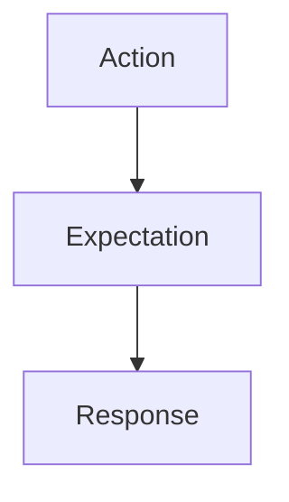
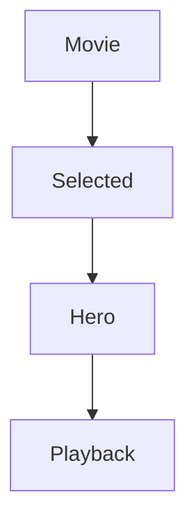
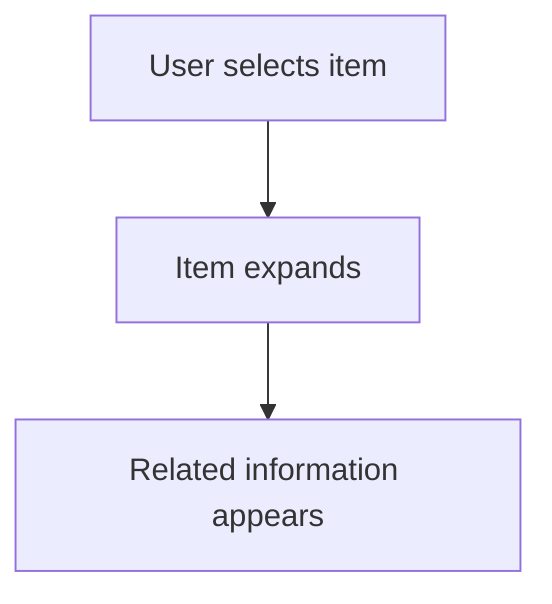
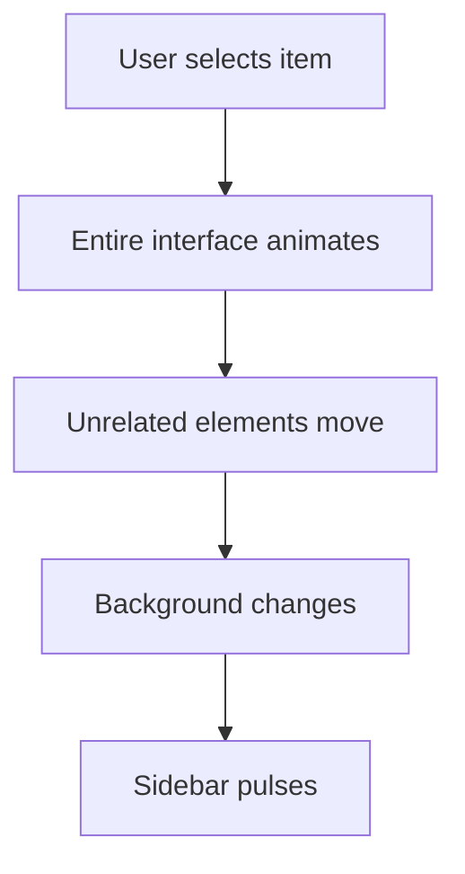
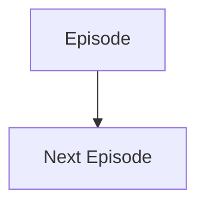
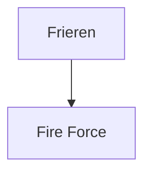
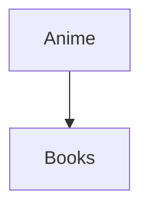

<!--
File: docs/design/language/mdl-002-principles/06-principle-04-movement-preserves-understanding.md
Document: MDL-002
Status: Draft
-->

# Principle 04 — Movement Preserves Understanding

---

# Principle Statement

> **Movement exists to explain change. It never exists simply because animation is possible.**

Within Mosaic, motion is considered a communication system.

Every animation should answer one question:

> **"What just changed?"**

If movement cannot answer that question, it should not exist.

---

# Why This Principle Exists

Motion is one of the most powerful tools available to interface designers.

It is also one of the easiest to misuse.

Many interfaces treat animation as decoration.

Buttons bounce.

Cards fade.

Pages slide.

These interactions may appear polished, but they rarely improve understanding.

Mosaic rejects decorative animation.

Motion should always strengthen the user's mental model of the interface.

Meaningful interface animation consistently emphasises continuity, orientation and explanation rather than visual spectacle.  [UIE All You Can Learn Library](https://aycl.uie.com/virtual_seminars/ux_in_motion_principles_for_creating_meaningful_animation_in_interfaces)

---

# Definition

Within MDL, movement is defined as:

> **A visual explanation of changing state.**

Movement should communicate:

- cause
- effect
- relationship
- hierarchy
- continuity

Movement should never exist simply to:

- impress
- decorate
- entertain
- delay

---

# Design Rationale

Every user action creates an expectation.

Motion is responsible for connecting the action to the response.

Without movement the interface appears to teleport between unrelated states.

With meaningful movement the user understands:

- where something came from
- where it went
- why it moved
- how the interface changed

Understanding increases.

Cognitive effort decreases.

---

# The Physical World

Humans instinctively understand physical movement.

Objects possess:

- position
- weight
- direction
- continuity

Interfaces should respect those expectations wherever practical.

Objects should appear to move through space rather than disappear and reappear elsewhere.

The goal is not realism.

The goal is comprehension.

---

# Continuity

The most important property of motion is continuity.

Users should be capable of mentally following interface elements as they change.

For example:

The movie should appear to evolve into playback.

Not vanish.

This preserves the relationship between the user's action and the resulting state.

---

# Cause And Effect

Every visible movement should have an identifiable cause.

Examples.

Good:

Poor:

Only the first sequence strengthens understanding.

---

# Good Examples

## Example 01

Selecting a television series.

The selected artwork gently expands.

Related information reorganises around it.

Previously visible information politely moves aside.

The user understands that focus has changed.

---

## Example 02

Closing playback.

Playback contracts.

Progress returns to the composition.

Continue Watching regains emphasis.

Nothing teleports.

The interface explains itself.

---

## Example 03

Changing domains.

Anime

↓

Movies

The composition changes more substantially because the conceptual distance is greater.

Movement communicates this transition.

---

# Anti-patterns

The following behaviours conflict with this principle.

## Decorative Motion

Animation exists purely because it looks interesting.

No information is communicated.

---

## Teleportation

Elements disappear from one location and instantly appear elsewhere.

The user loses spatial understanding.

---

## Simultaneous Motion

Large numbers of unrelated elements animate together.

Hierarchy disappears.

Attention fragments.

---

## Delayed Interaction

Animations become long enough that users wait for the interface.

Motion has become friction.

---

# The Composition Model

Movement belongs to the composition.

Not to individual components.

Components should never animate independently without contributing to the overall understanding of the composition.

The composition owns movement.

Components participate.

This distinction will be formalised further within **[MDL-004 — Interaction Model](../mdl-004-interaction-model/index.md)** and **[MDL-005 — Composition Model](../mdl-005-composition-model/index.md)**.

---

# Adaptive Motion

Movement should adapt according to conceptual distance.

Small conceptual change:

Small movement.

---

Medium conceptual change:

Moderate recomposition.

---

Large conceptual change:

Larger recomposition.

The amount of movement should reflect the amount of conceptual change.

Not the amount of visual change.

---

# Accessibility

Motion must never become a dependency.

Users preferring reduced motion should receive the same understanding through:

- hierarchy
- layout
- emphasis
- timing

Animation enhances understanding.

It must never become the only mechanism through which understanding is communicated.

---

# Module Guidance

Modules should never define custom animation behaviour.

Instead, modules contribute information.

The Mosaic composition engine determines:

- entry
- exit
- emphasis
- transition

This ensures that all movement remains consistent regardless of which module introduced the information.

---

# Review Questions

Before approving any motion design ask:

- Does this explain change?
- Can users understand where things moved?
- Does movement preserve continuity?
- Would removing this animation reduce understanding?
- Is this animation shorter than the user's patience?

If removing an animation improves the experience, that animation should not exist.

---

# Litmus Test

The interface should never feel like it is performing.

It should feel like it is explaining itself.

Users should finish an interaction thinking:

> "That made sense."

Not:

> "That animation looked nice."

---

# Summary

Movement is communication.

Movement is continuity.

Movement is understanding.

Everything else is decoration.

---

# Related Specifications

- [MDL-001 — Mosaic Design Language Vision](../mdl-001-vision/index.md)
- [MDL-004 — Interaction Model](../mdl-004-interaction-model/index.md)
- [MDL-005 — Composition Model](../mdl-005-composition-model/index.md)
- [MDS-005 — Motion System](../../system/mds-005-motion-system/index.md)

---

# Architectural Decisions

| ADR | Decision |
|------|----------|
| ADR-014 | Motion exists to communicate state change rather than decorate the interface. |
| ADR-015 | Conceptual distance determines movement intensity. |
| ADR-016 | Components participate in composition movement rather than owning independent animation. |
