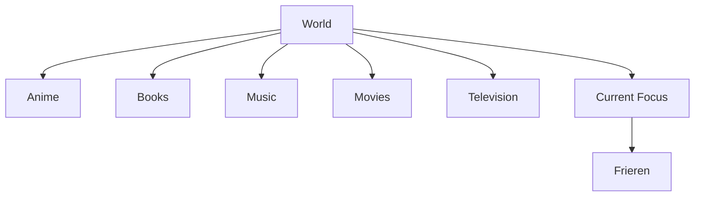
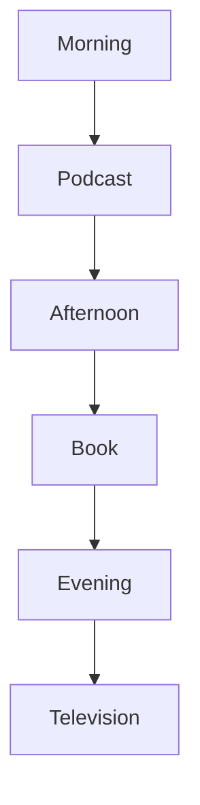
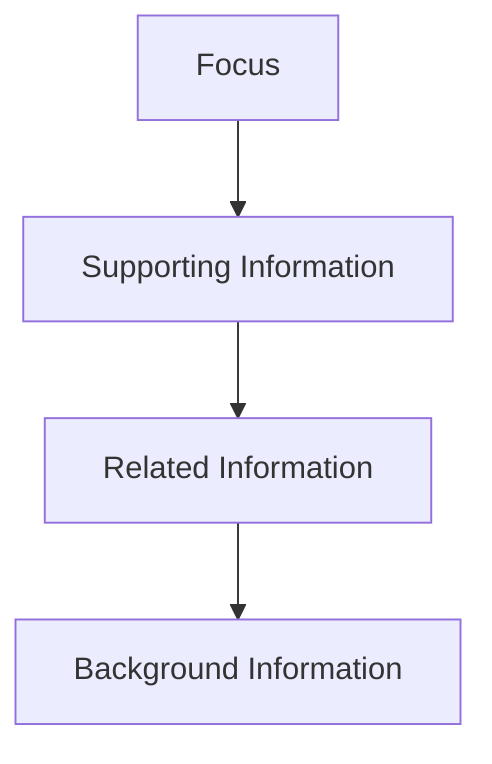
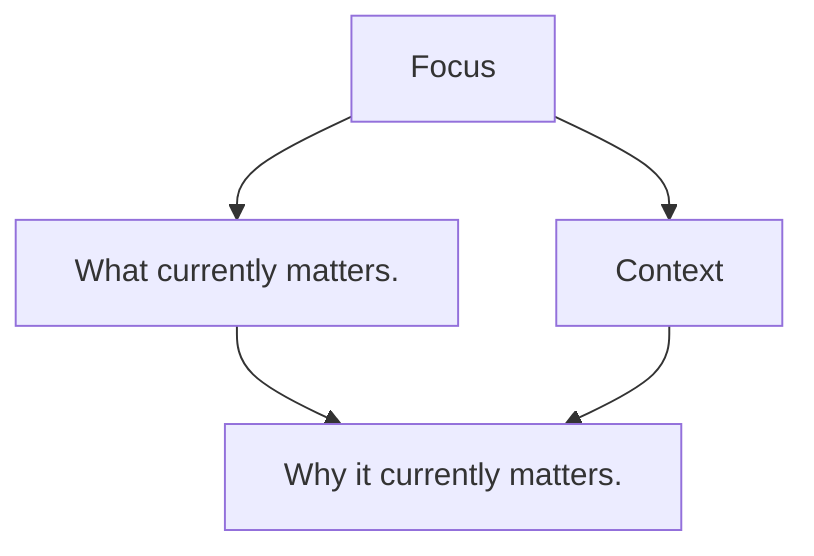
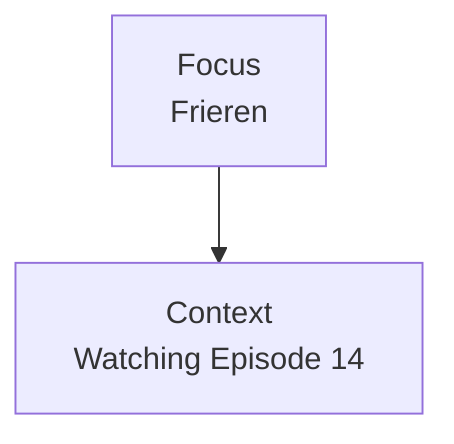
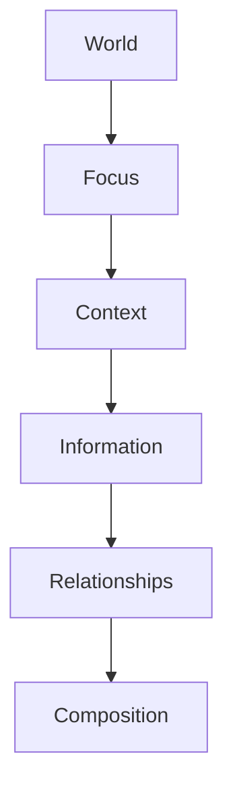

<!--
File: docs/design/language/mdl-003-mental-model/03-focus.md
Document: MDL-003
Status: Draft
-->

# Focus

---

# Purpose

If the **World** defines *where* the user currently exists, **Focus** defines *what currently matters*.

Focus is the central organising concept of the Mosaic experience.

Every composition.

Every recommendation.

Every interaction.

Every transition.

Every adaptive behaviour ultimately exists to support the user's current Focus.

Without Focus, a World becomes an undifferentiated collection of information.

With Focus, Mosaic understands what deserves the user's attention.

---

# Definition

Within MDL, **Focus** is defined as:

> **The entertainment experience currently occupying the user's attention.**

Focus is intentionally singular.

Although users may have many interests, they generally concentrate on one primary activity at any given moment.

Examples include:

- Watching *Frieren*
- Reading *The Hobbit*
- Listening to *Hans Zimmer Live*
- Browsing Studio Ghibli films

Focus is not:

- favourite media
- highest-rated media
- recently added media

Focus always describes **the present**.

---

# Why Focus Exists

Traditional media software asks:

> "What media should we display?"

Mosaic instead asks:

> **"What currently deserves the user's attention?"**

This is a subtle but fundamental distinction.

Media is static.

Attention is dynamic.

The interface should therefore organise itself around attention rather than inventory.

---

# One World, One Focus

Every World contains many possibilities.

Only one should normally be considered the primary Focus.



The interface should communicate this clearly.

Everything else becomes supporting context.

---

# Focus Is Dynamic

Focus changes naturally.

Examples include:



The World remains stable.

Only Focus changes.

Future specifications define how compositions adapt to these changes.

---

# Focus Is Not Selection

Selecting an item does not automatically make it the user's Focus.

Example.

A user briefly opens:

```

Breaking Bad
```

to check the cast.

Their current entertainment journey may still be:

```

Frieren
```

Focus should represent genuine intent.

Not transient interaction.

This distinction allows Mosaic to remain contextually stable rather than reacting to every click.

---

# Determining Focus

Future implementation may derive Focus from many signals.

Examples include:

- active playback
- active reading
- current listening session
- recent interaction
- explicit user intent

MDL intentionally avoids prescribing the implementation.

Regardless of implementation, Focus should remain predictable from the user's perspective.

Users should rarely be surprised by what Mosaic considers important.

---

# Focus Creates Hierarchy

Once Focus is established, hierarchy naturally follows.



This ordering allows every composition to answer the user's most immediate questions first.

The interface no longer needs arbitrary "featured" sections.

Importance emerges from Focus.

---

# Examples

## Example 01

Current Focus

```

Frieren
```

Supporting information:

- Watch progress
- Next episode
- Manga continuation
- Characters
- Soundtrack

The composition naturally organises around the current Focus.

---

## Example 02

Current Focus

```

Project Hail Mary
```

Supporting information:

- Reading progress
- Chapter
- Audiobook
- Andy Weir
- Related novels

The same systems apply.

Only the Focus changes.

---

# Losing Focus

Sometimes users intentionally leave their current Focus.

Examples include:

- searching for new media
- browsing collections
- changing domains

During these moments Mosaic should gracefully reduce emphasis on the previous Focus.

It should not immediately discard it.

Focus transitions should preserve continuity.

Future specifications describe these transitions in detail.

---

# Anti-patterns

The following behaviours violate the Focus model.

## Multiple Equal Priorities

Displaying several competing hero experiences simultaneously.

Users lose understanding of what currently matters.

---

## Algorithmic Focus

Allowing popularity metrics to determine Focus.

Focus belongs to the user.

Not the platform.

---

## Interface Focus

Making navigation or software controls more visually important than the user's entertainment.

The interface has become the Focus.

This is explicitly rejected by MDL.

---

# Relationship To Context

Focus and Context are closely related.

They are not identical.



Example.



Without Focus there is no subject.

Without Context there is no explanation.

Together they allow Mosaic to understand the user's current experience.

---

# Conceptual Model



Focus acts as the bridge between the user's World and the information Mosaic chooses to emphasise.

---

# Design Consequences

Treating Focus as a first-class concept produces several important behaviours.

The interface naturally develops:

- one visual centre
- one current journey
- one dominant hierarchy

The user no longer needs to ask:

> "What should I look at first?"

The composition already answers that question.

---

# Summary

Focus represents the entertainment experience currently deserving the user's attention.

It is the organising centre of every Mosaic composition.

The World remains constant.

Focus changes.

Everything else adapts naturally around it.
