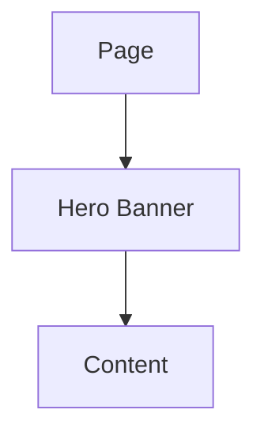
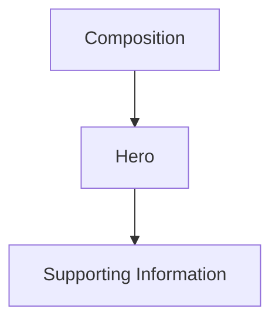
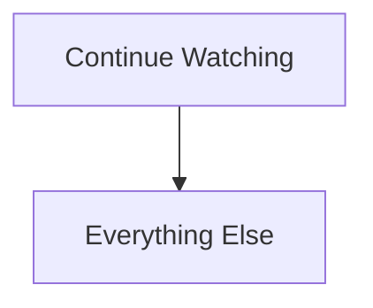
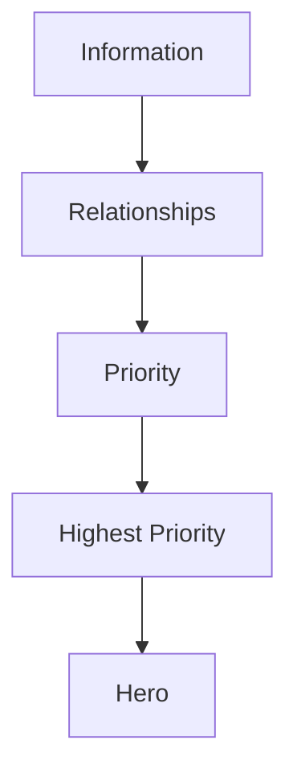
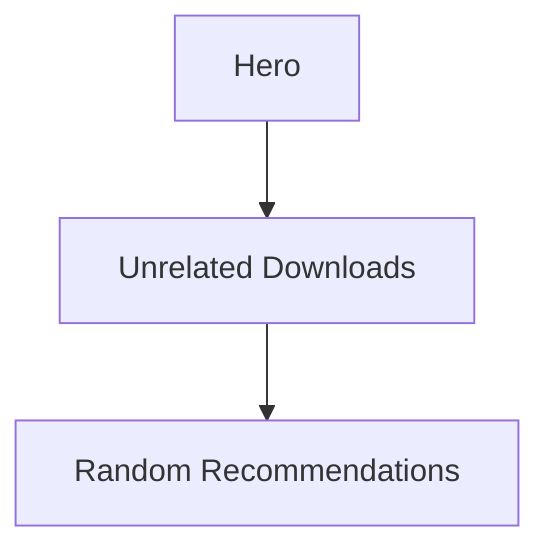
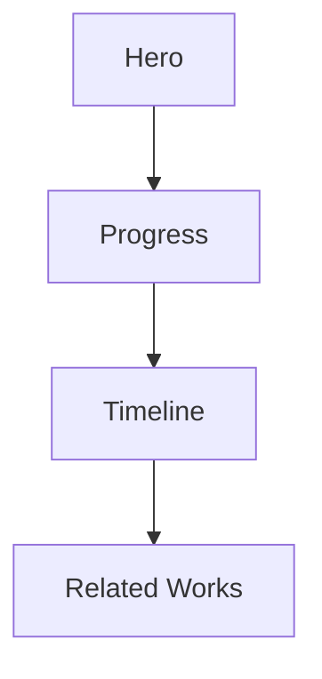
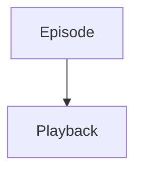
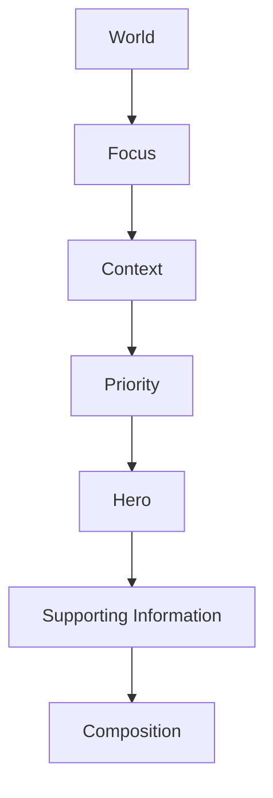

<!--
File: docs/design/language/mdl-005-composition-model/04-hero.md
Document: MDL-005
Status: Draft
-->

# Hero

---

# Purpose

Every Composition should possess a single, unmistakable centre of gravity.

Within the Mosaic Design Language this concept is known as the **Hero**.

Unlike traditional web design, the Hero is **not** a banner.

It is **not** the first section on a page.

It is **not** a marketing device.

Within Mosaic, the Hero is the visual manifestation of the most important concept within the current Composition.

The Hero exists to answer one question.

> **"What currently deserves the user's attention?"**

---

# Definition

Within MDL, a **Hero** is defined as:

> **The highest-priority Expression within the current Composition.**

The Hero is not manually positioned.

It naturally emerges from:

- Focus
- Context
- Priority
- Relationships

The Hero is therefore an outcome.

Not a component.

---

# Why A Hero Exists

Human attention naturally seeks a starting point.

Without a clear starting point users must first determine:

- where to look
- what matters
- what is secondary

This unnecessary interpretation increases cognitive effort.

A Hero removes that uncertainty.

It immediately establishes:

- the current Focus
- the current journey
- the current story

Well-established design systems use hero sections to establish the primary message and create an immediate visual hierarchy, but Mosaic extends the concept beyond page introductions into a dynamic behavioural role.  [Sky UI](https://sky-ui.cf.sky.com/sections/hero)

---

# The Hero Is Not A Banner

Traditional Hero sections introduce websites.

Mosaic Heroes introduce understanding.

Traditional:



Mosaic:



The Hero belongs to the Composition.

Not the page.

---

# The Hero Is Dynamic

The Hero should evolve naturally.

Example.

Current Context.

```

Browsing Series
```

Hero.

```

Frieren
```

Beginning playback.

The Hero evolves into:

```

Current Episode
```

Finishing playback.

The Hero evolves into:

```

Next Episode
```

The Hero should follow the user's journey rather than remaining static.

---

# One Hero

Every Composition should contain one primary Hero.

Poor.

```

Trending

Continue Watching

Featured Movie

Latest Release

Downloads
```

Several competing heroes.

Preferred.



The user's attention naturally begins in the correct place.

---

# Hero Emerges From Priority

The Hero is never manually selected.

Instead:



Changing Priority naturally changes the Hero.

No additional behavioural rules are required.

---

# Hero Does Not Mean Largest

The Hero communicates importance.

Not physical size.

Examples.

Desktop.

```

Large Artwork
```

Television.

```

Immersive Poster
```

Mobile.

```

Compact Hero
```

Voice.

```

Continue watching Frieren?
```

Every implementation communicates the same Hero.

Presentation adapts.

Meaning remains constant.

---

# Hero Owns Attention

The Hero establishes the initial attention path.

Everything else should reinforce it.

Supporting information should answer questions generated by the Hero.

Poor.



Preferred.



The Composition tells one coherent story.

---

# Hero And Artwork

Artwork naturally belongs within the Hero.

Artwork already communicates:

- identity
- emotion
- atmosphere

The interface should avoid competing with this.

Future Material specifications should therefore derive atmosphere from Hero artwork rather than imposing unrelated visual identity.

The Hero should feel like entertainment.

Not software.

---

# Hero And Movement

Movement should preserve Hero identity.

Example.



The Hero evolves.

It should not disappear and be replaced.

Users should always understand:

> "This is still the same experience."

Movement preserves Hero continuity.

---

# Hero Across Domains

Every Domain should possess an equivalent Hero.

Television.

```

Current Episode
```

Books.

```

Current Chapter
```

Music.

```

Currently Playing
```

Movies.

```

Current Film
```

Different media.

Identical behavioural role.

This consistency strengthens the Mental Model.

---

# Hero Lifetime

Heroes are intentionally temporary.

They exist only while they represent the highest-priority concept.

As Priority changes...

The Hero changes.

As Context changes...

The Hero evolves.

As Focus changes...

A new Hero naturally emerges.

This continual evolution reflects the user's World rather than arbitrary interface state.

---

# Good Examples

## Continue Watching

Hero.

```

Current Episode
```

Supporting.

- Progress
- Timeline
- Next Episode

Everything strengthens continuation.

---

## Reading

Hero.

```

Current Chapter
```

Supporting.

- Bookmarks
- Reading Progress
- Remaining Chapters

Again...

One clear centre.

---

## Discovering

Hero.

```

Current Focus
```

Supporting.

- Relationships
- Adaptations
- Similar Works

Discovery grows naturally from the Hero.

---

# Anti-patterns

## Multiple Heroes

Several competing concepts all demand primary attention.

Hierarchy collapses.

---

## Promotional Hero

Trending content replaces the user's current Focus.

The platform has begun persuading rather than accompanying.

---

## Static Hero

The Hero never changes despite changing Context.

The Composition becomes increasingly disconnected from the user's World.

---

## Decorative Hero

The Hero exists only because it looks visually impressive.

Importance should determine the Hero.

Not aesthetics.

---

# Hero Model



The Hero emerges naturally from understanding.

It is never manually inserted into the interface.

---

# Summary

The Hero is the visual centre of the current Composition.

It communicates:

- what matters
- why it matters
- where the user's attention should begin

A Hero should never exist because every application has one.

It exists because every human naturally looks for one place to begin.

Within Mosaic, the Hero provides that beginning.
