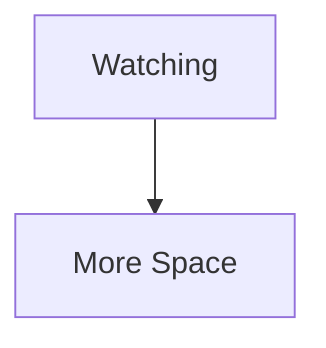
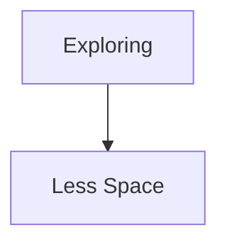
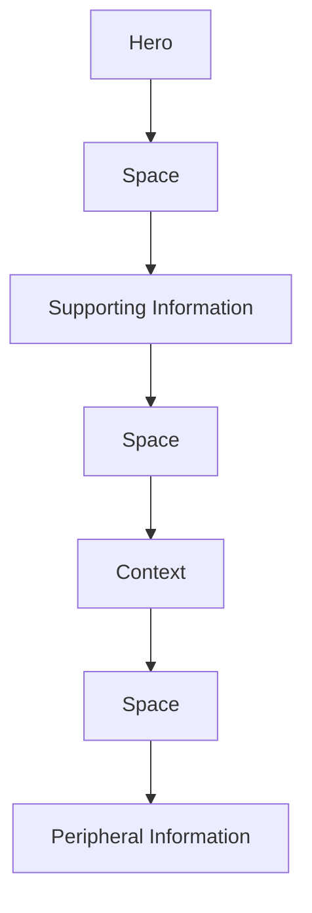
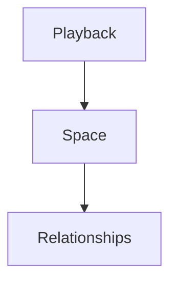
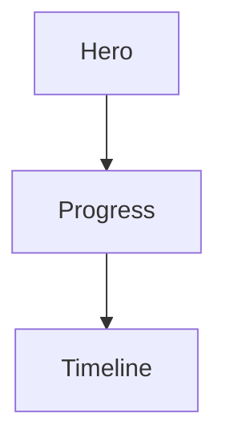
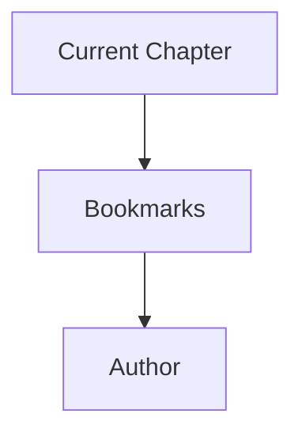
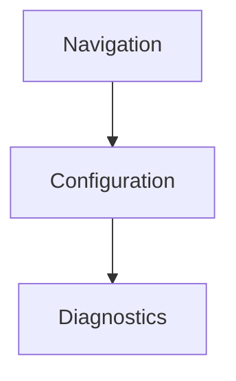
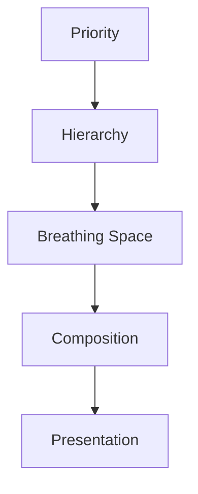

<!--
File: docs/design/language/mdl-005-composition-model/08-breathing-space.md
Document: MDL-005
Status: Draft
-->

# Breathing Space

---

# Purpose

Breathing Space is one of the defining characteristics of the Mosaic Composition Model.

Unlike empty space, which is simply unused interface, Breathing Space is intentional.

It communicates:

- confidence
- hierarchy
- rhythm
- clarity

Breathing Space is therefore considered a compositional concept rather than a visual style.

Its responsibility is to improve understanding.

Not aesthetics.

---

# Definition

Within MDL, **Breathing Space** is defined as:

> **The intentional preservation of conceptual and visual space that allows understanding to emerge naturally.**

Breathing Space exists between concepts.

Not merely between pixels.

It allows the user's attention to move comfortably through a Composition.

---

# Why Breathing Space Exists

Human attention benefits from separation.

Without separation:

- concepts merge
- hierarchy weakens
- rhythm disappears
- understanding slows

Traditional interfaces often attempt to maximise information density.

Mosaic intentionally optimises for comprehension.

Sometimes the fastest way to communicate something is to communicate **less**.

---

# Breathing Space Is Not Empty

One of the most common misconceptions is:

```

Whitespace

=

Unused Space
```

Within Mosaic this is incorrect.

Instead:

```

Breathing Space

=

Reserved Understanding
```

Breathing Space creates room for:

- hierarchy
- adaptation
- movement
- future evolution

It should therefore be viewed as an active participant within the Composition.

---

# Breathing Space Is Behavioural

Breathing Space should respond to behaviour.

Examples.





The platform should never apply identical spacing simply because identical layouts exist.

Behaviour determines Breathing Space.

Presentation communicates it.

---

# Breathing Space Creates Rhythm

Good compositions possess rhythm.

Example.



The user naturally understands where one conceptual group ends and another begins.

Rhythm reduces cognitive effort.

---

# Separation Of Meaning

Breathing Space should separate ideas.

Not merely objects.

Good.



Poor.

```

Playback

Character

Runtime

Reviews

Timeline

Progress
```

Without conceptual separation...

Everything competes.

Nothing communicates.

---

# Space Around The Hero

The Hero should normally possess the greatest amount of Breathing Space.

This reinforces:

- hierarchy
- confidence
- attention

The Hero should feel intentionally placed.

Not squeezed into remaining interface.

Space surrounding the Hero is therefore part of the Hero.

Not independent from it.

---

# Space And Density

Breathing Space naturally changes with Density.

Sparse Composition.

```

Large conceptual separation.
```

Rich Composition.

```

Reduced conceptual separation.
```

Importantly...

Reduced does not mean removed.

Every Composition should continue communicating rhythm regardless of density.

---

# Space Supports Adaptation

Adaptive Compositions require room to evolve.

When Information gains Priority:

The Composition should already possess sufficient Breathing Space to accommodate change naturally.

Interfaces filled to capacity have no room to evolve.

They must rebuild.

Mosaic intentionally avoids this behaviour.

---

# Space Supports Movement

Movement requires somewhere to move.

The Composition should therefore preserve enough conceptual space that:

- information may arrive
- information may depart
- hierarchy may evolve

without appearing crowded.

Breathing Space and Movement are therefore closely related.

Future Motion specifications should reinforce this relationship.

---

# Breathing Space Across Devices

Breathing Space should preserve conceptual rhythm rather than physical measurements.

Desktop.

```

Large physical spacing.
```

Phone.

```

Smaller physical spacing.

Equivalent conceptual rhythm.
```

Television.

```

Large physical spacing.

Greater viewing distance.
```

The measurements change.

The understanding remains consistent.

---

# Good Examples

## Playback



Each concept clearly separated.

Nothing competes unnecessarily.

---

## Reading



The Composition breathes.

Users naturally understand where attention should move next.

---

## Administration



Rich information.

Clear conceptual separation.

The interface remains calm despite increased density.

---

# Anti-patterns

## Filling Every Pixel

Every available area contains information.

The interface feels anxious.

---

## Decorative Space

Large gaps without conceptual purpose.

Space should always strengthen understanding.

---

## Uniform Space

Every concept separated equally.

Hierarchy disappears.

---

## No Evolution Space

The Composition cannot adapt because every region is already occupied.

Adaptive behaviour becomes impossible.

---

# Behavioural Model



Breathing Space reinforces hierarchy.

It never creates hierarchy.

---

# Relationship To Future Specifications

Future specifications should treat Breathing Space as:

- conceptual
- adaptive
- behavioural

Examples include:

- Material System
- Composition Engine
- Tile Framework
- Responsive Behaviour
- Motion System

Every future implementation should preserve conceptual rhythm before optimising physical layout.

---

# Summary

Breathing Space is not unused interface.

It is intentional understanding.

It creates:

- rhythm
- clarity
- confidence
- adaptability

The absence of unnecessary information is considered an active design decision.

Not a missed opportunity.

Good Compositions communicate just enough.

Breathing Space ensures users have room to understand what matters.
