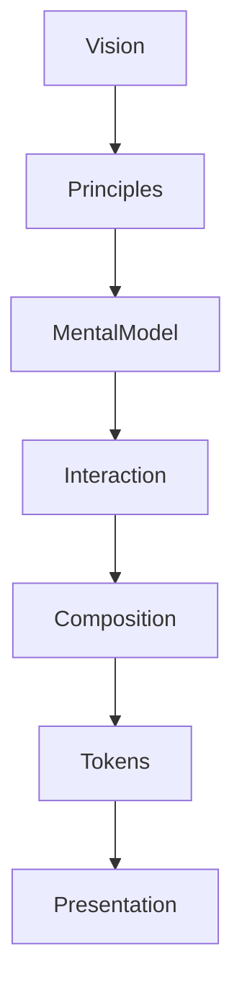
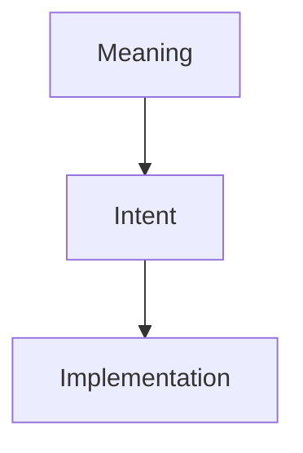

<!--
File: docs/design/system/mds-001-design-token-architecture/00-document-control.md
Document: MDS-001
Title: Design Token Architecture
Status: Draft
Version: 0.1
-->

# Document Control

---

# Document Information

| Property | Value |
|----------|-------|
| Document ID | MDS-001 |
| Title | Mosaic Design System — Design Token Architecture |
| Classification | Internal |
| Status | Draft |
| Version | 0.1 |
| Owner | AdamNi-7080 |
| Parent Specifications | [MDL-001](../../language/mdl-001-vision/index.md) → [MDL-005](../../language/mdl-005-composition-model/index.md) |
| Repository | `/design/mds/MDS-001 Design Token Architecture/` |

---

# Purpose

MDS-001 defines the implementation architecture of the Mosaic Design System.

It establishes how abstract concepts defined within the MDL become machine-readable design decisions.

Unlike traditional token systems that primarily describe colours and spacing, Mosaic tokens represent **design intent**.

The Design Token Architecture therefore becomes the implementation bridge between:

- philosophy
- behaviour
- composition
- presentation

---

# Authority

MDS-001 governs:

- Token hierarchy
- Token taxonomy
- Semantic naming
- Resolved Token generation
- Token inheritance
- Token lifecycle
- Module intent integration
- Cross-platform consistency

This specification intentionally does **not** define:

- colour palettes
- typography scales
- motion values
- materials
- components

Those specifications consume the architecture established here.

---

# Relationship To MDL

The Design Token Architecture intentionally begins after every conceptual decision has already been made.



Tokens should never redefine concepts established by MDL.

Their responsibility is implementation.

Not philosophy.

---

# Design Intent

Most design systems expose implementation directly.

Examples include:

```

Blue500

8px

24px

Shadow3
```

These values communicate implementation.

They communicate almost nothing about meaning.

Mosaic intentionally separates:



Tokens therefore communicate:

> **Why a value exists**

rather than merely:

> **What its value is.**

---

# Reader Expectations

Before reading this specification contributors should understand:

- [MDL-001 — Mosaic Design Language Vision](../../language/mdl-001-vision/index.md)
- [MDL-002 — Principles](../../language/mdl-002-principles/index.md)
- [MDL-003 — Mental Model](../../language/mdl-003-mental-model/index.md)
- [MDL-004 — Interaction Model](../../language/mdl-004-interaction-model/index.md)
- [MDL-005 — Composition Model](../../language/mdl-005-composition-model/index.md)

MDS intentionally assumes that all conceptual work has already been completed.

Its responsibility is implementation.

---

# Architectural Scope

The Design Token Architecture governs:

- token structure
- semantic intent
- runtime adaptation
- inheritance
- resolution
- stability
- portability

It intentionally avoids:

- framework APIs
- CSS variables
- Flutter themes
- SwiftUI implementations
- Compose implementations

Those become client-specific implementation details.

---

# Stability

Version 0.1 begins a new draft cycle after replacing the former six-layer model with Platform-owned Primitive and Semantic Tokens plus client-generated Resolved Tokens.

The earlier 0.4 draft remains represented in repository history and requires renewed editorial, structural, cross-reference and technical review.

Expected lifetime.

| Artefact | Expected Lifetime |
|----------|-------------------|
| CSS Variables | Months |
| Flutter Theme | Months |
| SwiftUI Theme | Months |
| Token Values | Years |
| Token Hierarchy | Years |
| Token Philosophy | Decades |

The hierarchy should evolve significantly more slowly than the values it contains.

---

# Success Criteria

MDS-001 succeeds when:

- every Mosaic client expresses the same design language
- token names communicate meaning rather than implementation
- runtime adaptation becomes implementation-independent
- contributors rarely consume primitive values directly
- Modules extend domain intent and Composition without creating Design Tokens
- capability and budget influence resolution without device classification
- future specifications naturally build upon this architecture

A successful Design Token Architecture should become almost invisible.

Contributors should think in semantic intent rather than implementation values.
