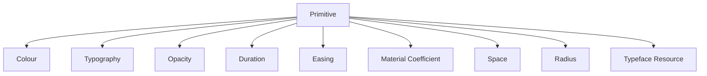
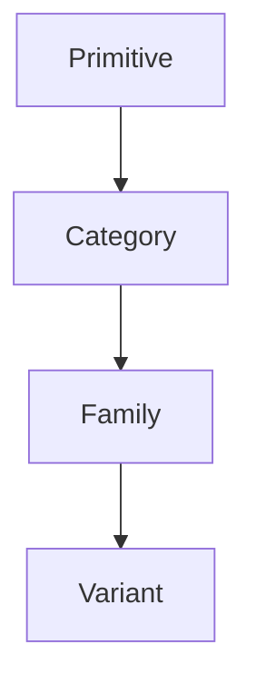
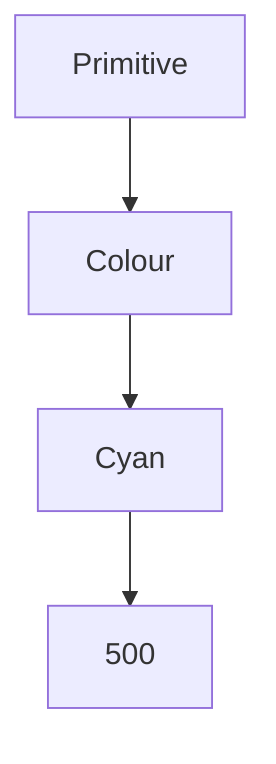
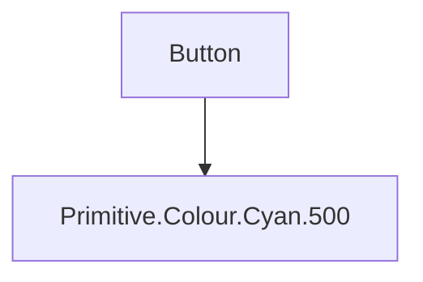
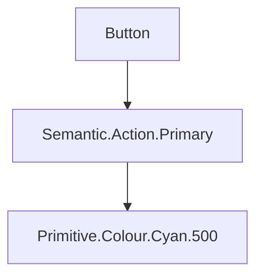
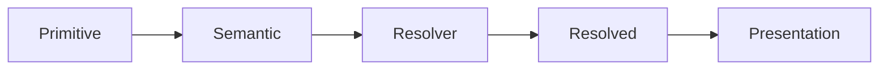

<!--
File: docs/design/system/mds-001-design-token-architecture/03-primitive-tokens.md
Document: MDS-001
Status: Draft
-->

# Primitive Tokens

---

# Purpose

Primitive Tokens form the physical foundation of the Mosaic Design System.

They represent measurable values rather than design intent.

Primitive Tokens intentionally possess **no semantic meaning**.

This distinction is fundamental.

Primitive Tokens describe **what exists physically**.

They never describe **why it exists**.

---

# Definition

Within MDS, a **Primitive Token** is defined as:

> **A platform-independent physical design value that contains no contextual or semantic meaning.**

Primitive Tokens are the lowest stable layer within the Design Token Architecture.

Every authored Semantic Token ultimately resolves through permitted Primitive Tokens or compatible Semantic aliases.

Applications should almost never consume them directly.

---

# Why Primitive Tokens Exist

Every design system ultimately resolves to physical values.

Examples include:

- colours
- typography sizes
- opacity
- motion durations and curves
- Material coefficients

Without Primitive Tokens, these values become duplicated throughout implementations.

Primitive Tokens establish one canonical source of physical truth.

---

# Primitive Tokens Are Value Objects

Primitive Tokens intentionally communicate only measurable values.

Examples.

Good.

```

Primitive.Colour.Indigo.500

Primitive.Duration.200

Primitive.Opacity.80
```

Poor.

```

PrimaryButtonBlue

HeroSpacing

SidebarRadius
```

These contain implementation meaning.

Primitive Tokens must remain implementation agnostic.

---

# Primitive Tokens Are Not Semantic

One of the most important architectural rules within Mosaic is:

> **Primitive Tokens never communicate intent.**

Example.

```

Primitive.Colour.Blue.500
```

This token does **not** mean:

- primary
- action
- hero
- navigation

It simply describes one physical colour.

Semantic meaning belongs to the next layer.

---

# Primitive Categories

The Primitive layer is intentionally small.

Current candidate categories include:



Future categories should be introduced sparingly.

Primitive growth should remain slow.

---

# Colour

Purpose.

Represent raw colour values.

Examples.

```

Primitive.Colour.Cyan.500

Primitive.Colour.Slate.900

Primitive.Colour.White

Primitive.Colour.Black
```

Primitive Colours should never be consumed directly by components.

---

# Private Geometry Primitives

Mosaic requires internal spacing, radius and geometric coefficients to produce professional and coherent Presentation.

Examples may include:

```text
Primitive.Space.2
Primitive.Space.4
Primitive.Space.8
Primitive.Space.12
Primitive.Space.16
Primitive.Space.24
Primitive.Space.32
Primitive.Space.48
Primitive.Space.64
Primitive.Space.96
Primitive.Radius.8
Primitive.Radius.16
```

These are Platform-owned implementation inputs.

They are not public semantic choices such as `Spacing.Large`, and Modules, components, users and SDUI do not select them.

The provisional private spatial scale is:

```text
2, 4, 8, 12, 16, 24, 32, 48, 64, 96
```

`4` establishes the foundational rhythm.

`2` is reserved for optical correction and very small internal separation.

The client-side Adaptive Layout implementation chooses and interpolates private values while calculating location, size, padding, spacing and density from content relationships, available space and governed constraints.

The scale remains an alpha baseline until reference compositions validate its rhythm across viewing contexts, accessibility settings and renderer implementations.

The Material System similarly consumes private radius and Material coefficients when deriving clipping and edge treatment from resolved geometry.

Radius, Material and remaining geometric profiles are defined only after their owning contracts establish types, units and behaviour.

---

# Typography

Purpose.

Represent measurable typography values.

Examples.

```

Primitive.Font.Size.14

Primitive.Font.Weight.600

Primitive.LineHeight.24
```

Typography hierarchy belongs to later specifications.

Primitive Tokens only communicate measurable values.

---

# Elevation

Purpose.

Represent physical depth.

Examples.

```

Primitive.Elevation.0

Primitive.Elevation.1

Primitive.Elevation.2
```

Whether elevation communicates:

- Hero
- Overlay
- Surface

is determined later.

---

# Blur

Purpose.

Represent physical blur intensity.

Examples.

```

Primitive.Blur.8

Primitive.Blur.16

Primitive.Blur.24
```

Blur meaning belongs to Material Tokens.

Primitive Blur simply defines available values.

---

# Opacity

Purpose.

Represent transparency.

Examples.

```

Primitive.Opacity.100

Primitive.Opacity.80

Primitive.Opacity.60

Primitive.Opacity.40
```

These values intentionally possess no semantic meaning.

---

# Motion

Primitive Motion consists of measurable values only.

Examples.

```

Primitive.Duration.100

Primitive.Duration.200

Primitive.Duration.300
```

```

Primitive.Easing.Standard

Primitive.Easing.Decelerate
```

Motion intent belongs to later specifications.

---

# Primitive Naming

Primitive Tokens should follow the same naming convention.



Example.



Naming should communicate structure.

Not usage.

---

# Primitive Stability

Primitive Tokens should change infrequently.

Changing Primitive values potentially affects every consuming Semantic Token.

Consequently:

Primitive additions are preferred over frequent modification.

Existing Primitive Tokens should remain stable whenever practical.

---

# Primitive Consumption

Applications should avoid consuming Primitive Tokens directly.

Poor.



Preferred.



Meaning remains preserved.

---

# Primitive Independence

Primitive Tokens should remain:

- platform independent
- framework independent
- component independent

Primitive Tokens should never reference:

- CSS
- Flutter
- SwiftUI
- HTML
- Components

Implementation belongs to later layers.

---

# Anti-patterns

## Semantic Primitive

```

Primitive.Primary
```

Meaning has leaked into the Primitive layer.

---

## Component Primitive

```

Primitive.Button.Blue
```

Component responsibility has leaked downwards.

---

## Runtime Primitive

```

Primitive.CurrentArtwork
```

Runtime behaviour belongs elsewhere.

---

## Platform Primitive

```

Primitive.CSS.Blue
```

Platform concerns should never appear within Primitive Tokens.

---

# Primitive Model



Primitive Tokens provide the physical foundation.

Semantic Tokens add meaning and runtime resolution produces a concrete Presentation value.

---

# Litmus Test

A contributor should be able to ask:

> **Could this value exist without Mosaic?**

If the answer is yes...

It probably belongs within Primitive Tokens.

If the answer depends upon:

- context
- behaviour
- hierarchy
- interface

it belongs elsewhere.

---

# Summary

Primitive Tokens intentionally know nothing about the product.

They simply provide stable physical values.

Everything meaningful within Mosaic emerges by progressively layering:

- semantics
- composition
- components
- runtime behaviour

on top of these primitive foundations.

That separation is what allows the Design System to evolve without losing conceptual integrity.
