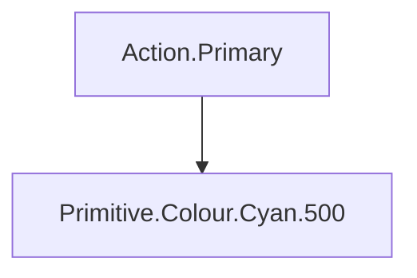
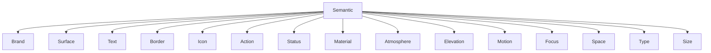
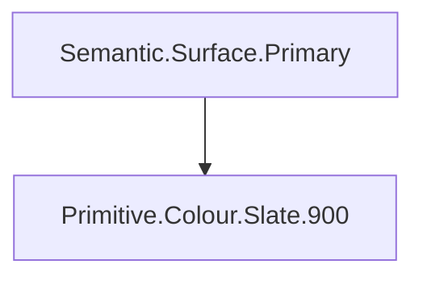
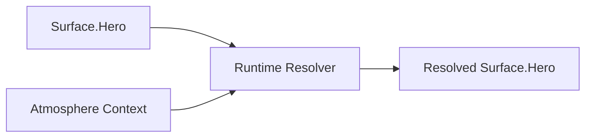
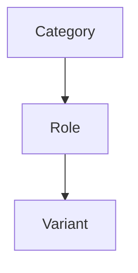
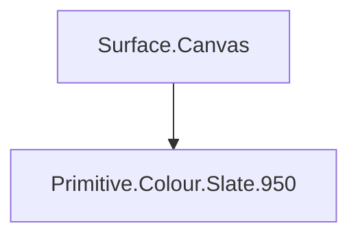
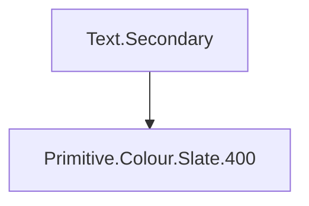
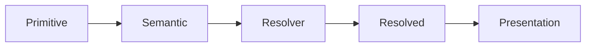

<!--
File: docs/design/system/mds-001-design-token-architecture/04-semantic-tokens.md
Document: MDS-001
Chapter: 04
Title: Semantic Tokens
Status: Draft
Version: 0.1
-->

# Semantic Tokens

---

# Purpose

Primitive Tokens describe physical values.

Semantic Tokens describe **meaning**.

This distinction is the single most important architectural separation within the Mosaic Design System.

If Primitive Tokens answer:

> **"What value exists?"**

Semantic Tokens answer:

> **"Why does this value exist?"**

Applications should think almost exclusively in Semantic Tokens.

Primitive Tokens should rarely appear outside the Design System itself.

---

# Definition

Within MDS, a **Semantic Token** is defined as:

> **A platform-independent design decision expressed in terms of meaning rather than physical implementation.**

Semantic Tokens deliberately avoid describing:

- physical colour values
- pixel geometry
- type measurements
- blur radii or Material coefficients

Instead they describe:

- purpose
- responsibility
- role

---

# Why Semantic Tokens Exist

Imagine the following implementation.

```css
.button {
    background: #06b6d4;
}
```

This immediately creates several problems.

- Why cyan?
- Can it change?
- Should every button use it?
- Does another component depend on it?

Now compare.

```text
Action.Primary
```

The implementation becomes:



The reason survives.

The value may evolve.

---

# Semantic Tokens Are Design Decisions

A Semantic Token represents a deliberate design decision.

Examples include:

```

Text.Primary

Surface.Canvas

Action.Primary

Border.Subtle

Status.Success

Space.Group

Type.Body
```

Each communicates:

- purpose
- intention
- responsibility

rather than implementation.

---

# Semantic Categories

The Mosaic Design System currently defines the following semantic categories.



Future categories should remain intentionally limited.

Semantic Tokens describe concepts.

Not features.

---

# Brand

Purpose.

Communicate Mosaic identity.

Examples.

```

Brand.Primary

Brand.Secondary

Brand.Accent
```

Brand Tokens should remain stable regardless of:

- artwork
- runtime
- themes

Brand communicates Mosaic.

Not media.

---

# Surface

Purpose.

Describe compositional surfaces.

Examples.

```

Surface.Canvas

Surface.Primary

Surface.Secondary

Surface.Overlay

Surface.Hero
```

Notice that these describe **roles**.

Not colours.

---

# Text

Purpose.

Communicate reading hierarchy.

Examples.

```

Text.Primary

Text.Secondary

Text.Tertiary

Text.Disabled

Text.Inverse
```

Text Tokens describe information hierarchy.

Not typography values.

---

# Border

Purpose.

Communicate separation.

Examples.

```

Border.Subtle

Border.Strong

Border.Focus
```

The implementation may change.

The conceptual role remains stable.

---

# Action

Purpose.

Communicate user intent.

Examples.

```

Action.Primary

Action.Secondary

Action.Destructive

Action.Passive
```

Buttons consume Action Tokens.

The tokens do not belong to buttons.

This significantly improves reuse.

---

# Status

Purpose.

Communicate state.

Examples.

```

Status.Success

Status.Warning

Status.Error

Status.Information
```

Status Tokens intentionally avoid implementation colours.

Accessibility and presentation are resolved later.

---

# Material

Purpose.

Describe the conceptual role of physical materials.

Examples.

```

Material.Canvas

Material.Acrylic

Material.Hero

Material.Overlay
```

Material Tokens intentionally avoid:

- blur values
- opacity
- colours

Those belong to Primitive Tokens.

---

# Atmosphere

Purpose.

Communicate artwork-derived environmental intent.

Examples.

```

Atmosphere.Primary

Atmosphere.Secondary

Atmosphere.Supporting
```

Unlike Brand Tokens...

Atmosphere Tokens are expected to resolve differently at runtime.

---

# Space

Purpose.

Communicate spatial relationships for conventional authored layouts.

Examples.

```text
Space.Inline
Space.Related
Space.Group
Space.Section
Space.Region
```

These are public Semantic Tokens.

Documentation sites, administration interfaces, dashboards, Platform components and governed Module layouts may consume them through renderer-native values.

They do not expose the underlying private spatial scale or permit authors to invent arbitrary spacing steps.

---

# Type

Purpose.

Communicate semantic typography roles defined by [MDS-004 — Typography System](../mds-004-typography-system/index.md).

Examples.

```text
Type.Hero
Type.Title
Type.Heading
Type.Body
Type.Label
Type.Metadata
```

Each token resolves the complete role profile, including size, weight, line height and supported font behaviour.

Consumers select the role rather than an arbitrary font size.

---

# Size

Purpose.

Communicate governed dimensional responsibilities needed by authored layouts and components.

Examples.

```text
Size.ControlMinimum
Size.ReadingMeasure
Size.NavigationRail
```

Size Tokens describe responsibility rather than generic small, medium or large values.

They do not expose final coordinates or allow a consumer to replace Adaptive Layout.

---

# Focus

Purpose.

Communicate emphasis.

Examples.

```

Focus.Primary

Focus.Secondary

Focus.Background
```

These Tokens should influence:

- hierarchy
- composition
- emphasis

rather than presentation directly.

---

# Semantic Tokens Never Reference Components

Incorrect.

```

Button.Primary

Card.Background

Sidebar.Border
```

Correct.

```

Action.Primary

Surface.Primary

Border.Subtle
```

Component contracts may request Semantic Tokens, while client renderers consume their completed Resolved Token values.

Semantic Tokens should never know components exist.

---

# Semantic Tokens Consume Primitive Tokens

Example.



Future themes may resolve the same Semantic Token differently.

Consumers remain unchanged.

---

# Runtime Independence

Semantic Tokens intentionally remain independent from runtime.

Incorrect.

```

Surface.CurrentArtwork
```

Correct.



Runtime context adapts implementation through resolution.

Semantic meaning remains stable.

---

# Naming Convention

Semantic Tokens should follow the same hierarchy.



Examples.

```

Text.Primary

Surface.Canvas

Action.Destructive

Status.Warning
```

Naming should always communicate meaning.

Never implementation.

---

# Semantic Stability

Semantic Tokens should change significantly less frequently than Primitive Tokens.

Expected lifetime.

| Layer | Lifetime |
|--------|----------|
| Primitive Values | Years |
| Semantic Meaning | Many Years |

Changing Semantic Tokens potentially affects the conceptual language of the Design System.

Such changes should therefore be rare.

---

# Good Examples






Meaning remains completely independent from implementation.

---

# Anti-patterns

## Component Semantics

```

Button.Blue
```

Meaning depends upon implementation.

---

## Colour Semantics

```

Blue.Primary
```

Meaning depends upon colour.

---

## Platform Semantics

```

CSS.Primary
```

Architecture becomes implementation dependent.

---

## Runtime Semantics

```

Artwork.Background
```

Runtime concepts belong elsewhere.

---

# Semantic Model



Semantic Tokens introduce meaning.

Composition and Module intent provide context to the resolver without becoming token layers.

Resolved Tokens and renderer artefacts implement the meaning.

---

# Litmus Test

Contributors should ask:

> **If every Primitive value changed tomorrow, would this token still make sense?**

If the answer is yes...

It probably belongs within the Semantic layer.

If the answer is no...

It probably belongs within Primitive Tokens instead.

---

# Summary

Semantic Tokens represent the language of the Design System.

They intentionally separate:

meaning

from

implementation.

This separation allows Mosaic to:

- evolve themes
- support runtime adaptation
- preserve accessibility
- maintain consistency
- remain implementation independent

Every future MDS specification should consume Semantic Tokens rather than physical values whenever practical.
