<!--
File: docs/design/system/mds-001-design-token-architecture/06-runtime-tokens.md
Document: MDS-001
Chapter: 06
Title: Runtime Tokens
Status: Draft
Version: 0.4
-->

# Runtime Tokens

---

# Purpose

Runtime Tokens are the most distinctive layer of the Mosaic Design System.

Unlike Primitive, Semantic and Composition Tokens, Runtime Tokens are **not authored**.

They are **resolved**.

Their purpose is to allow the Design System to respond intelligently to the user's current World while preserving the architectural guarantees established by the MDL.

Runtime Tokens enable Mosaic to feel alive without sacrificing consistency.

---

# Definition

Within MDS, a **Runtime Token** is defined as:

> **A dynamically resolved design token whose value is derived from the user's current World at render time.**

Runtime Tokens are generated.

They are never hardcoded.

They represent the intersection between:

- the user's World
- the current Composition
- device capabilities
- accessibility
- runtime environment

---

# Why Runtime Tokens Exist

Traditional Design Systems assume:

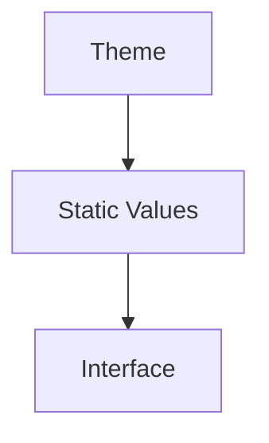

This approach works well for productivity software.

Mosaic is different.

The interface should subtly reflect:

- current artwork
- current Focus
- current Domain
- current atmosphere
- accessibility
- platform capabilities

without changing the underlying Design Language.

Runtime Tokens provide this capability.

---

# Runtime Does Not Replace Design

One misconception must be avoided.

Runtime Tokens **never redefine the Design System**.

Instead they resolve existing design intent.

Incorrect.

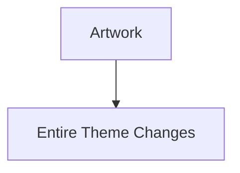

Correct.

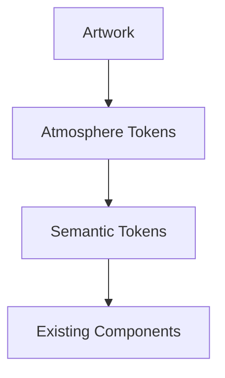

The architecture remains stable.

Only values evolve.

---

# Runtime Inputs

Runtime Tokens may consume information from many sources.

Examples include:

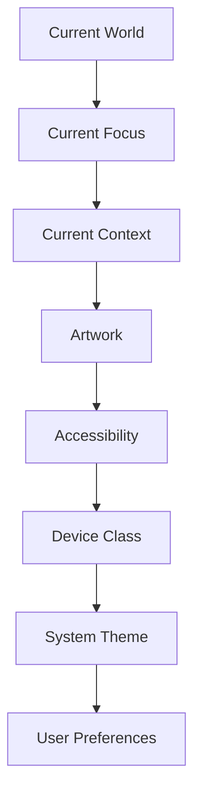

Importantly...

No single input possesses authority.

The Runtime Resolver evaluates them collectively.

---

# Runtime Categories

Current Runtime Token categories include:

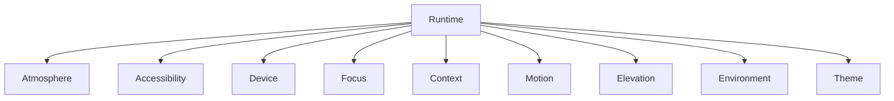

Future Runtime categories should remain intentionally small.

Runtime complexity should remain hidden from component authors.

---

# Atmosphere

Atmosphere Tokens communicate the emotional characteristics of the current World.

Examples.

```

Runtime.Atmosphere.Primary

Runtime.Atmosphere.Secondary

Runtime.Atmosphere.Highlight
```

These tokens are typically influenced by:

- artwork
- colour extraction
- luminance
- composition

Atmosphere enhances.

It never dominates.

---

# Focus

Focus Tokens communicate the current conceptual emphasis.

Examples.

```

Runtime.Focus.Primary

Runtime.Focus.Supporting

Runtime.Focus.Background
```

These values influence:

- hierarchy
- emphasis
- movement
- composition

They should not redefine behaviour.

---

# Context

Context Tokens adapt the presentation to the user's current activity.

Examples.

```

Runtime.Context.Playback

Runtime.Context.Reading

Runtime.Context.Exploring
```

The same Semantic Token may resolve differently depending upon Context.

The meaning remains identical.

---

# Accessibility

Accessibility Tokens adapt the Design System while preserving understanding.

Examples.

```

Runtime.Accessibility.Contrast

Runtime.Accessibility.Motion

Runtime.Accessibility.TextScale
```

Accessibility Tokens should always strengthen understanding.

Never weaken hierarchy.

---

# Device

Device Tokens describe runtime capabilities.

Examples.

```

Runtime.Device.Mobile

Runtime.Device.TV

Runtime.Device.Desktop

Runtime.Device.Tablet
```

These tokens should influence:

- presentation
- density
- expression

They should **never** redefine Composition.

---

# Motion

Runtime Motion Tokens adapt behaviour according to environment.

Examples.

```

Runtime.Motion.Standard

Runtime.Motion.Reduced

Runtime.Motion.Disabled
```

Movement philosophy remains unchanged.

Only implementation adapts.

---

# Runtime Resolution

Every Runtime Token should be resolved through the same conceptual pipeline.

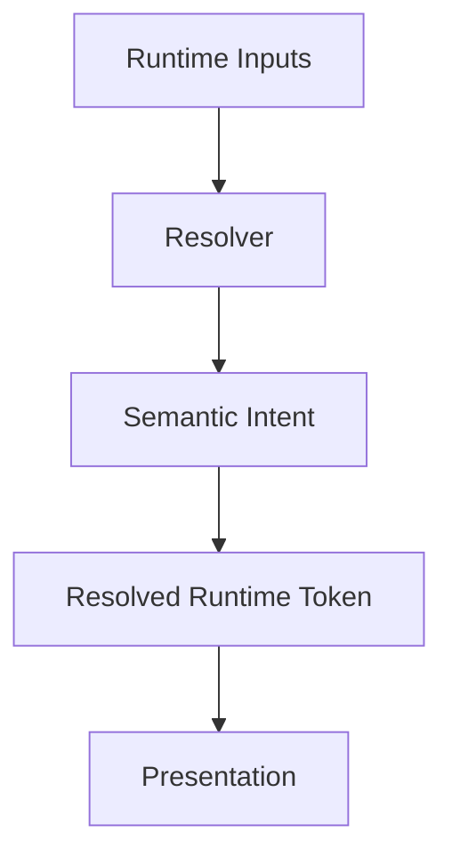

Components should never participate in runtime resolution.

---

# Runtime Resolution Is Deterministic

Given identical inputs...

Runtime resolution should always produce identical outputs.

Example.

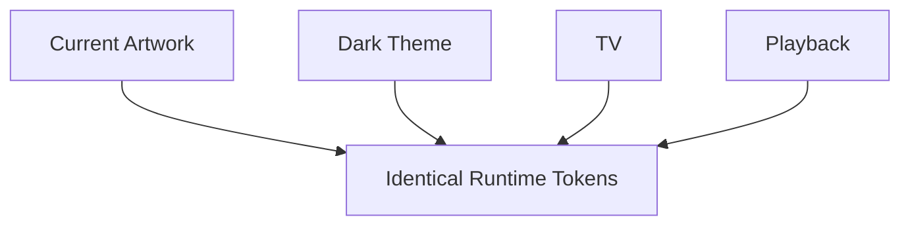

This determinism is critical for preserving consistency across devices.

---

# Runtime Never Changes Meaning

Runtime Tokens may change:

- colour
- blur
- elevation
- opacity
- spacing

They must never change:

- hierarchy
- priority
- composition
- interaction

Those concepts belong to MDL.

Runtime exists only to improve expression.

---

# Runtime Cache

Future implementations should assume Runtime Tokens are cacheable.

Stable runtime inputs should produce stable runtime outputs.

Example.

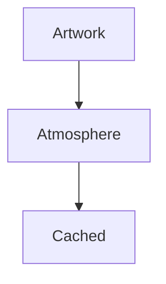

This significantly reduces unnecessary recomputation while preserving conceptual correctness.

Caching strategies belong to future runtime specifications.

---

# Runtime And Components

Components consume Runtime Tokens exactly as they consume Semantic Tokens.

Example.

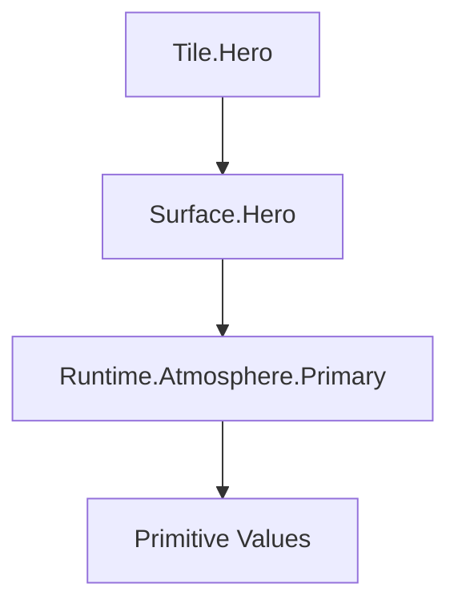

The component remains unaware of:

- artwork analysis
- accessibility
- theme generation

This separation dramatically simplifies implementation.

---

# Modules

Modules never generate Runtime Tokens.

Modules contribute:

- Information
- Relationships

The Runtime Resolver evaluates:

- current Composition
- current Focus
- artwork
- accessibility
- device

Runtime therefore remains entirely platform owned.

---

# Good Examples

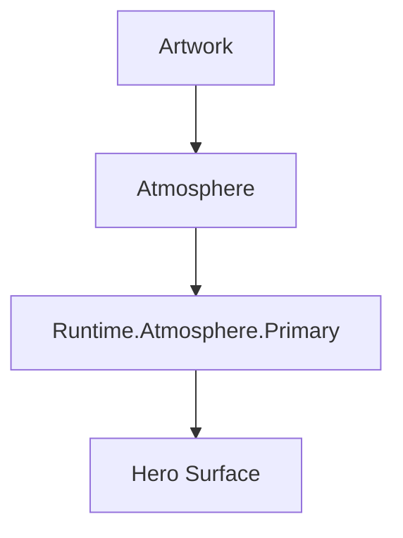

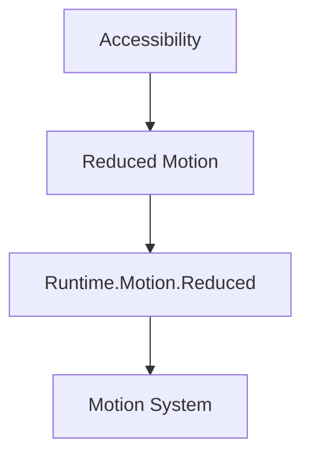

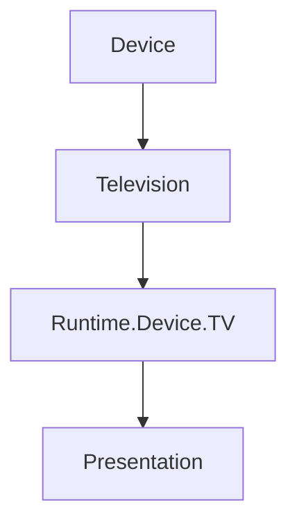

Every example preserves semantic meaning.

Only implementation changes.

---

# Anti-patterns

## Runtime Components

```

Runtime.Button.Primary
```

Runtime should never know components.

---

## Runtime Behaviour

```

Runtime.CurrentPage
```

Behaviour belongs to MDL.

Not Runtime.

---

## Runtime Layout

```

Runtime.LeftSidebar
```

Layout should emerge from Composition.

---

## Module Runtime

Modules generating:

- colours
- hierarchy
- themes
- motion

Runtime ownership has been violated.

---

# Runtime Model

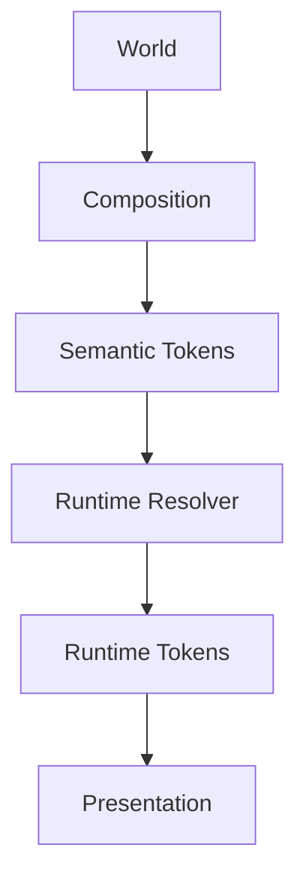

Notice that Runtime exists after meaning has already been established.

Runtime refines expression.

It never defines understanding.

---

# Relationship To Future Specifications

Future MDS specifications are expected to expand Runtime behaviour significantly.

Examples include:

- [MDS-002 — Colour System](../mds-002-colour-system/index.md)
- [MDS-003 — Material System](../mds-003-material-system/index.md)
- [MDS-005 — Motion System](../mds-005-motion-system/index.md)
- [MDS-006 — Composition Engine](../mds-006-composition-engine/index.md)

Those specifications define how Runtime Tokens are generated.

MDS-001 defines only where they belong within the architecture.

---

# Summary

Runtime Tokens represent one of the most powerful capabilities of the Mosaic Design System.

They allow the platform to adapt continuously to:

- the user's World
- current artwork
- accessibility
- device
- environment

while preserving one stable conceptual architecture.

Understanding remains constant.

Presentation evolves naturally around it.
