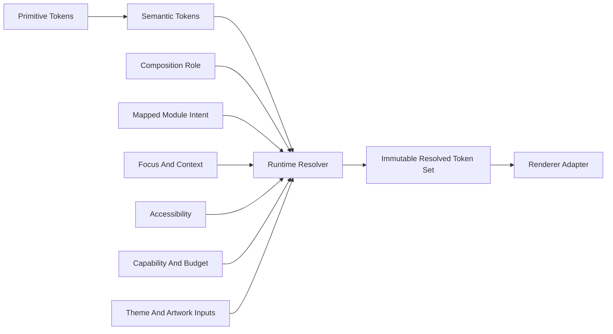

<!--
File: docs/design/system/mds-001-design-token-architecture/07-token-resolution.md
Document: MDS-001
Chapter: 07
Title: Token Resolution
Status: Draft
Version: 0.1
-->

# Token Resolution

---

# Purpose

Token Resolution transforms stable Platform meaning into concrete client values without exposing contextual or renderer complexity to Modules and components.

---

# Resolution Contract

Token Resolution is:

> **The deterministic client-owned process that evaluates Semantic Tokens against a governed resolution context and publishes an immutable Resolved Token Set.**

The same token catalogue revision and equivalent context must produce an equivalent semantic result within the declared renderer precision.

---

# Inputs And Outputs



The resolver must not accept raw Module styling or renderer code as input.

---

# SDUI Boundary

Runtime SDUI describes content, semantic roles, relationships, actions, state and permitted domain layout modes.

It does not normally provide:

- Presentation-space `x`, `y` or `z` coordinates
- width or height
- padding, spacing or radius
- font family, font size or line height
- Material coefficients
- Refraction parameters

The client design runtime combines SDUI intent with Platform tokens, typography metrics, accessibility, capability and available space.

It then produces resolved geometry, typography, Material and Refraction state for the renderer.

Coordinates may appear only when they are intrinsic domain content, such as an authored diagram or spatial canvas.

The client still projects those domain coordinates into Presentation space.

This SDUI boundary does not prohibit direct Design System consumers from building Authored Layout with public Semantic Tokens.

For example, a documentation site may use generated CSS values for `Space.Group`, `Type.Body` and `Size.ReadingMeasure` while the underlying Primitive values remain Platform-owned.

---

# Resolution Order

Resolution should apply authority in this order:

1. validate the requested Semantic Token
2. resolve permitted Primitive and Semantic aliases
3. map Module domain intent to Platform semantics
4. apply Composition role and current Context
5. apply Light, Dark or system appearance
6. select artwork, approved static brand or Mosaic-default atmosphere input
7. enforce accessibility requirements
8. apply the synced or local user fidelity maximum
9. constrain by renderer capability
10. constrain by current runtime budget and Presentation deadlines
11. publish one immutable Resolved Token Set
12. adapt the set into renderer artefacts

Later steps may constrain implementation but must not reverse earlier semantic decisions.

Accessibility may override aesthetic preferences.

Budget may reduce fidelity but must not remove semantic presence or readability.

---

# Module Intent Mapping

A Module-specific intent must resolve through an explicit mapping such as:

```text
Calendar.Today
    → Semantic.Emphasis.Current
```

The mapping may add domain context but cannot create a Primitive or Semantic Token.

Unknown intent uses its declared Platform fallback.

Intent without a valid fallback must not become active.

---

# Capability-Driven Resolution

The resolver evaluates techniques and fidelity from measured client behaviour.

It must not assign permanent values using labels such as:

- mobile
- television
- desktop
- tablet
- low-end device

Platform APIs may contribute capability evidence, but their product category is not a design decision.

---

# Determinism

Determinism requires:

- a versioned token catalogue
- explicit input precedence
- bounded numeric operations
- stable fallback rules
- no dependence upon unordered maps or renderer timing
- no component-local semantic overrides

Budget measurements may change between cycles.

Each completed cycle must still be deterministic for the captured budget input.

---

# Fallback Resolution

Fallback proceeds through declared semantic relationships rather than guessed physical values.

```text
Module domain intent fallback
    → Platform Semantic Token fallback
    → safe Primitive value
    → neutral accessible Presentation
```

Examples include:

- unknown Module intent mapping to a declared emphasis role
- unavailable artwork field retaining cached artwork-derived colour
- unsupported Material refinement reducing to Essential fidelity
- missing optional theme value using the Platform default

Fallback must preserve accessibility and semantic hierarchy.

---

# Atomic Publication

Resolution may occur asynchronously.

Publication must be atomic.

A renderer receives either the previous complete set or the next complete set, never a partially updated combination.

Obsolete work should be cancelled when a newer context supersedes it.

---

# Cache And Invalidation

The resolver should invalidate only values affected by a changed input.

Examples:

- Focus change invalidates Focus-dependent values
- accessibility change invalidates constrained output
- renderer budget change may alter fidelity without changing semantic identity
- Tile movement does not invalidate unrelated artwork source tokens

Cache reuse must never bypass updated accessibility requirements.

---

# Renderer Adaptation

Adapters translate Resolved Tokens into CSS, Flutter, SwiftUI, Compose, shader or other client-native values.

Adapters may use different implementation techniques while preserving equivalent semantics.

They must not:

- invent token meaning
- inspect Module domain concepts directly
- weaken accessibility constraints
- expose Primitive Tokens to ordinary component code

---

# Failure Behaviour

Invalid requests, mappings or calculations should preserve the previous stable set or use a declared neutral fallback.

Token Resolution must not block Presentation, cause semantic content to disappear or threaten a video Presentation deadline.

---

# Summary

Token Resolution is the single client-owned bridge between Platform design meaning and adaptable Presentation.

It evaluates intent and context without turning either into new token layers.
