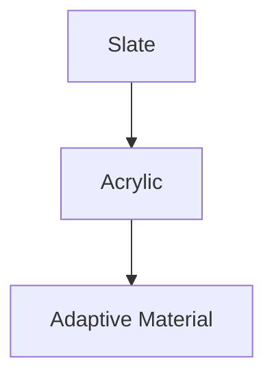
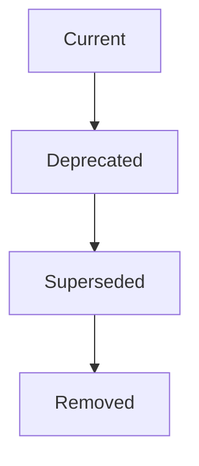
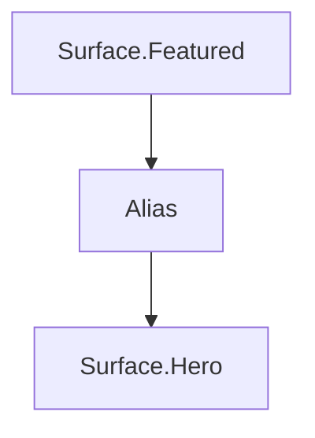
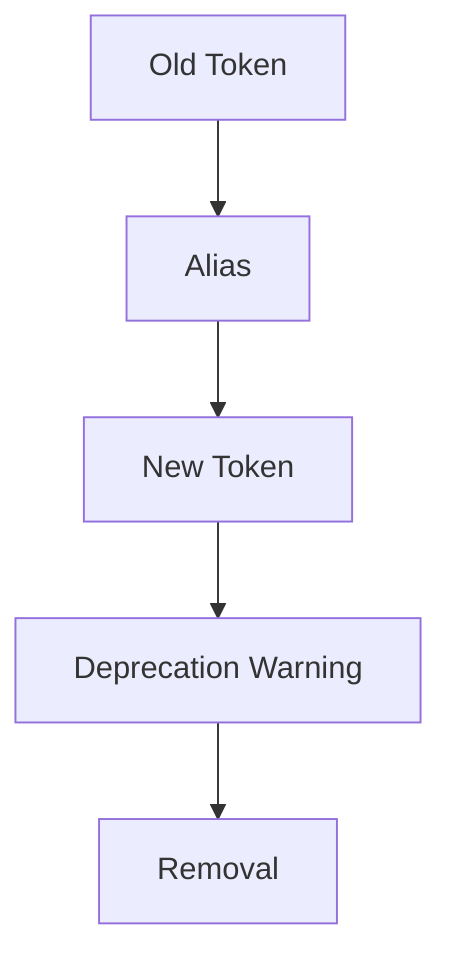
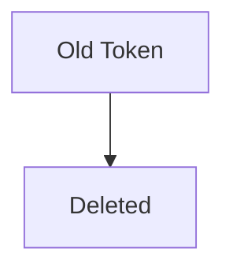
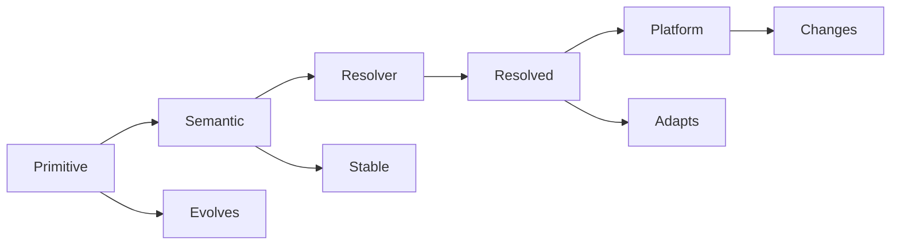

<!--
File: docs/design/system/mds-001-design-token-architecture/09-token-versioning.md
Document: MDS-001
Chapter: 09
Title: Token Versioning
Status: Draft
Version: 0.1
-->

# Token Versioning

---

# Purpose

The Design Token Architecture is expected to evolve throughout the lifetime of Mosaic.

Primitive values will change.

Themes will evolve.

Materials will mature.

Accessibility requirements will improve.

Runtime capabilities will expand.

Token Versioning exists to ensure these changes can occur without unnecessarily breaking:

- applications
- modules
- components
- tooling
- design assets

The goal is evolutionary change rather than disruptive replacement.

---

# Definition

Within MDS, **Token Versioning** is defined as:

> **The controlled evolution of design tokens while preserving semantic stability and backwards compatibility wherever practical.**

Versioning exists to protect intent.

Not implementation.

---

# What Should Change?

Different layers possess different expected rates of change.

| Layer | Change Frequency |
|---------|-----------------|
| Primitive Values | Occasionally |
| Semantic Tokens | Rarely |
| Runtime Resolution | Frequently |
| Platform Implementation | Continuously |

The higher the abstraction...

The more stable it should become.

---

# Versioning Philosophy

The Mosaic Design System follows one fundamental rule.

> **Values may evolve.**

> **Meaning should remain stable.**

For example.

```

Surface.Hero
```

should continue representing the Hero surface for many years.

Its implementation may change from:



Applications consuming the token remain unchanged.

---

# Semantic Stability

Semantic Tokens are considered part of the public design API.

Changing:

```

Surface.Primary
```

is significantly more expensive than changing:

```

Primitive.Colour.Slate.950
```

Consequently.

Semantic Token names should almost never change.

Instead:

- implementation evolves
- runtime evolves
- themes evolve

Meaning remains stable.

---

# Version Numbers

The Design Token Architecture follows semantic versioning.

```

Major.Minor.Patch
```

Example.

```

1.0.0
```

Major.

Breaking semantic change.

Minor.

New compatible capability.

Patch.

Editorial or implementation correction.

---

# Major Versions

Major versions are intentionally rare.

Examples include:

- semantic hierarchy redesign
- removal of token categories
- incompatible runtime model
- composition architecture changes

Major versions should normally require updates to downstream MDS specifications.

---

# Minor Versions

Minor versions introduce:

- additional tokens
- additional categories
- optional runtime capabilities
- accessibility improvements
- theme expansion

Existing consumers should continue functioning without modification.

---

# Patch Versions

Patch versions include:

- documentation improvements
- corrected mappings
- implementation fixes
- naming clarification

Patch versions should never change semantic behaviour.

---

# Token Deprecation

Tokens should rarely be removed.

Instead they should enter a deprecation lifecycle.



Deprecation should provide sufficient migration time for:

- applications
- modules
- tooling
- documentation

---

# Deprecation Metadata

Deprecated Tokens should include:

```yaml
deprecated: true

replacement: Surface.Hero

removed_after: 2.0.0

reason: Consolidated Hero hierarchy
```

Consumers should receive clear migration guidance.

Never silent failure.

---

# Aliasing

Temporary aliases may exist during migration.

Example.



Aliases should remain temporary.

Long-term duplication weakens the architecture.

---

# Resolver Compatibility

Runtime evolution should remain backwards compatible whenever practical.

Example.

```

Atmosphere.Primary
```

may internally evolve from:

```

Static Colour
```

to

```

Artwork-derived Acrylic
```

Consumers should remain unaware of the implementation change.

---

# Module Compatibility

Community modules should consume:

- Semantic Tokens
- governed recipes and mapped Platform semantics

They should avoid consuming:

- Primitive Tokens
- Runtime implementation details

Doing so significantly reduces the likelihood of breaking changes.

---

# Versioning Responsibilities

| Artefact | Responsibility |
|----------|----------------|
| Primitive Token | Physical and type compatibility. |
| Semantic Token | Public design API stability. |
| Domain-intent mapping | Module contract compatibility. |
| Runtime Resolver | Deterministic adaptive compatibility. |
| Renderer adapter | Client implementation compatibility. |

Each authority owns a different aspect of stability without becoming another token layer.

---

# Migration Strategy

Preferred migration.



Avoid.



Breaking changes should always be intentional.

Never surprising.

---

# Changelog Requirements

Every token release should include:

- Added
- Changed
- Deprecated
- Removed
- Fixed

Each change should identify:

- affected token
- affected layer
- migration impact
- replacement

Token history is considered architectural documentation.

---

# Anti-patterns

## Renaming Semantic Tokens

Changing names without architectural justification.

---

## Resolver Breaking Changes

Changing resolver behaviour in a way that breaks the established semantic meaning.

Resolution may evolve implementation.

Not intent.

---

## Primitive API

Encouraging applications to consume Primitive Tokens directly.

Future migration becomes difficult.

---

## Silent Removal

Deleting tokens without migration guidance.

Modules become unnecessarily fragile.

---

# Version Model



Versioning should preserve architectural stability while allowing implementation to improve.

---

# Relationship To Future Specifications

Future specifications should define:

- automated migration
- token validation
- compatibility tooling
- runtime schema versioning
- module compatibility guarantees

These systems build upon the versioning philosophy established here.

---

# Summary

Token Versioning protects one of the most valuable assets within the Mosaic Design System.

Its language.

Values will evolve.

Technology will evolve.

Presentation will evolve.

The meaning communicated by tokens should remain recognisable for many years.

That long-term semantic stability is what enables Mosaic to evolve confidently without fragmenting its design language.
