<!--
File: docs/design/system/mds-001-design-token-architecture/10-module-tokens.md
Document: MDS-001
Chapter: 10
Title: Module Tokens
Status: Draft
Version: 0.4
-->

# Module Tokens

---

# Purpose

Mosaic is fundamentally a platform.

Modules are expected to become one of the primary ways the platform evolves over time.

The Design Token Architecture must therefore provide a mechanism through which modules can participate in the Design System without fragmenting it.

This chapter defines that mechanism.

The objective is simple.

> **Every module should feel native.**

Not merely compatible.

---

# Definition

Within MDS, **Module Tokens** are defined as:

> **Tokens contributed by modules that integrate into the Mosaic Design Token Architecture without redefining the platform's visual language.**

Module Tokens extend.

They never replace.

---

# Why Module Tokens Exist

Without a token architecture, modules typically choose their own:

- colours
- spacing
- typography
- interaction
- hierarchy

Over time this produces several independent design languages inside one application.

Users no longer experience:

> Mosaic

They experience:

> Mosaic plus several unrelated interfaces.

Module Tokens prevent this.

---

# Platform Ownership

The Platform foundation always owns:

- Primitive Tokens
- Semantic Tokens
- Composition Tokens
- Runtime Tokens

Modules never redefine these layers.

Instead they consume them.

The platform remains the source of truth.

---

# Module Responsibilities

Modules may contribute:

- new semantic concepts
- additional domain-specific meanings
- specialised capabilities

Examples include:

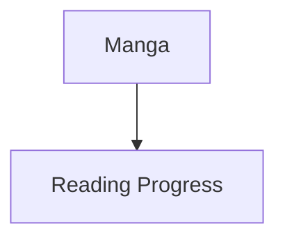

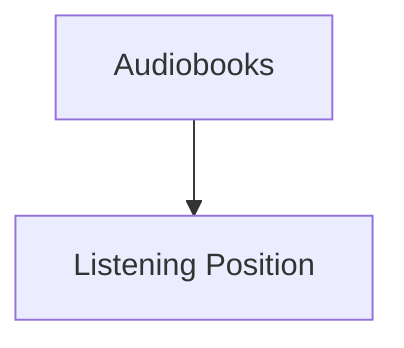

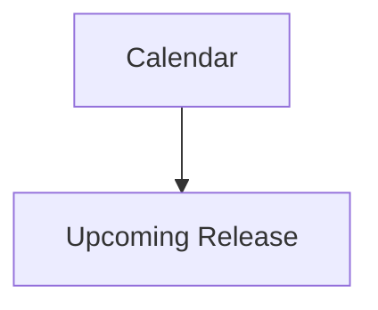

These concepts become part of the existing Composition rather than creating independent visual systems.

---

# Information Before Presentation

Module authors should think in information.

Not interface.

Poor.

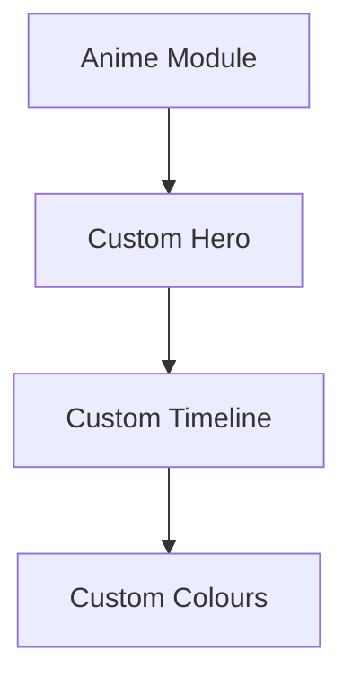

Preferred.

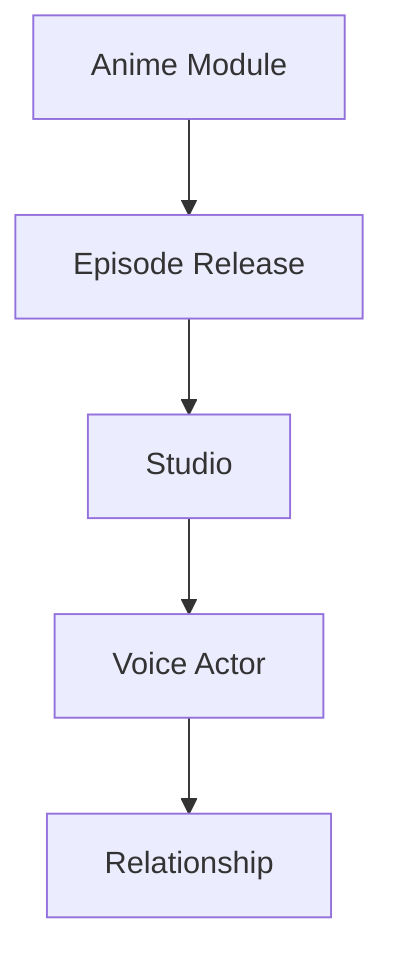

The platform determines how these concepts become interface.

---

# Module Token Namespace

Every module should define its own namespace.

Example.

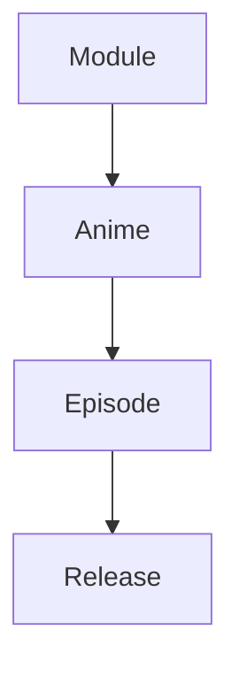

or

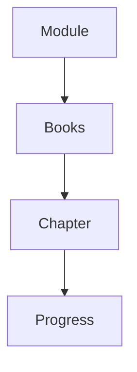

Namespaces prevent collisions while remaining readable.

---

# Module Categories

Modules should contribute tokens only within clearly defined categories.

Examples include:

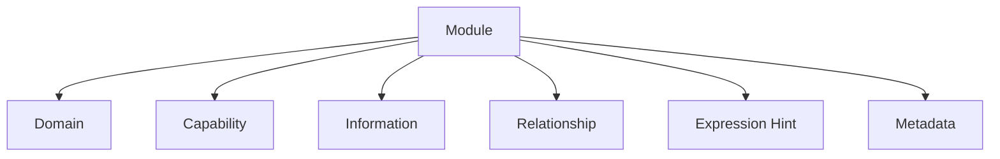

These categories intentionally avoid:

- colour
- spacing
- materials
- typography

Those remain platform concerns.

---

# Expression Hints

A module may suggest how information is naturally expressed.

Example.

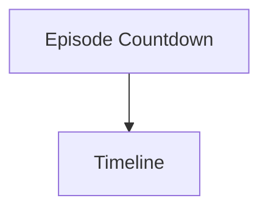

This is an **Expression Hint**.

It is not an instruction.

The Composition Engine remains responsible for determining the final Expression.

If the current Context requires another Expression, the platform should ignore the hint.

---

# Runtime Participation

Modules participate in Runtime resolution indirectly.

Example.

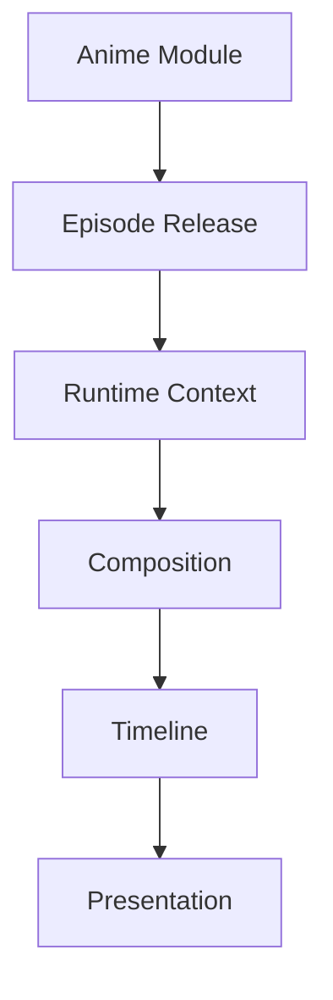

The module never resolves Runtime Tokens.

It merely enriches the information available to the Runtime Resolver.

---

# Token Consumption

Modules should consume the same Semantic Tokens as the Platform foundation.

Examples.

```

Text.Primary

Surface.Secondary

Action.Primary

Border.Subtle
```

Using platform tokens ensures that modules inherit:

- accessibility
- themes
- runtime atmosphere
- future redesigns

automatically.

---

# Forbidden Responsibilities

Modules should **not** define:

- Primitive Tokens
- Brand Tokens
- Runtime Tokens
- Material Tokens
- Motion Tokens
- Component Tokens

These remain exclusively owned by the platform.

Allowing modules to redefine these layers would inevitably fragment the Design System.

---

# Theme Compatibility

Because modules consume Semantic Tokens rather than physical values:

Dark Mode.

↓

Works.

Light Mode.

↓

Works.

Artwork Atmosphere.

↓

Works.

Accessibility.

↓

Works.

The module receives future improvements automatically.

No additional implementation is required.

---

# Future Marketplace

The long-term goal of the Mosaic module ecosystem is that users cannot visually distinguish:

Official functionality

from

Community functionality.

The Design Token Architecture is one of the primary mechanisms through which this consistency is achieved.

Users should recognise:

> Mosaic

Not:

> Several modules sharing the same window.

---

# Good Examples

## Anime Module

Contributes:

```

Episode Release

Studio

Opening Theme

Relationship
```

Consumes:

```

Surface.Primary

Text.Primary

Composition.Supporting
```

---

## Books Module

Contributes:

```

Reading Progress

Series Order

Bookmarks
```

Consumes:

```

Composition.Hero

Text.Secondary

Action.Primary
```

---

## Music Module

Contributes:

```

Current Track

Album

Concert
```

Consumes:

```

Surface.Hero

Composition.Primary

Runtime.Atmosphere
```

The visual language remains unified.

---

# Anti-patterns

## Brand Tokens

```

Anime.Primary.Purple
```

Modules should not create competing brands.

---

## Custom Themes

Modules providing independent colour systems.

The platform loses visual coherence.

---

## Runtime Generation

Modules generating their own Runtime Tokens.

Runtime belongs exclusively to the platform.

---

## Component Libraries

Modules introducing:

- custom cards
- custom buttons
- custom layouts

The platform loses ownership of interface.

---

# Module Registration

Future runtime implementations should allow modules to register token contributions declaratively.

Conceptually.

```yaml
module:
  id: anime

contributes:

  information:
    - episode.release
    - episode.runtime

  relationships:
    - adaptation
    - sequel

  expressions:
    - timeline
```

Notice that the module contributes meaning.

Not presentation.

---

# Token Resolution

Module Tokens should participate in the standard resolution pipeline.

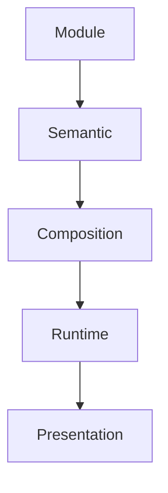

Modules never bypass the platform.

They enrich it.

---

# Litmus Test

Module authors should ask:

> **If Mosaic completely redesigned its interface tomorrow, would my module still work?**

If the answer is:

**Yes.**

The module probably depends upon semantic architecture.

If the answer is:

**No.**

The module probably depends upon implementation.

---

# Summary

Module Tokens allow Mosaic to scale into a large ecosystem without sacrificing a coherent design language.

Modules contribute:

- knowledge
- capability
- relationships

The platform contributes:

- hierarchy
- composition
- runtime
- presentation

This separation ensures that every module naturally becomes part of one unified Mosaic experience.
