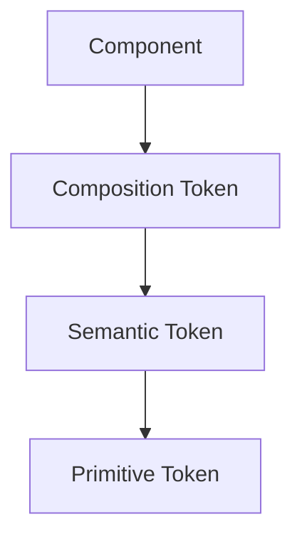
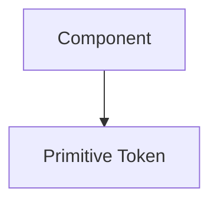
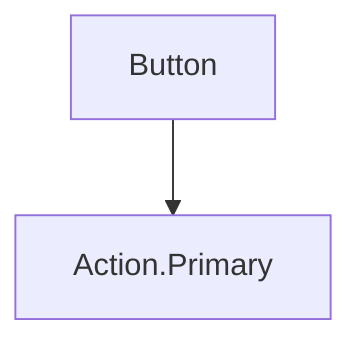
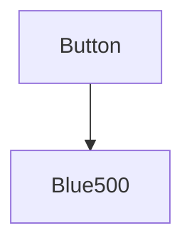
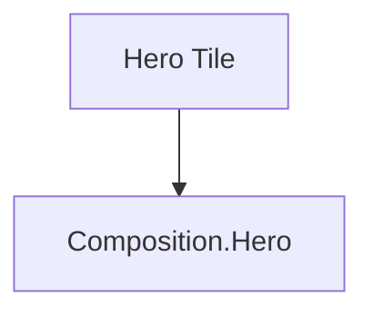
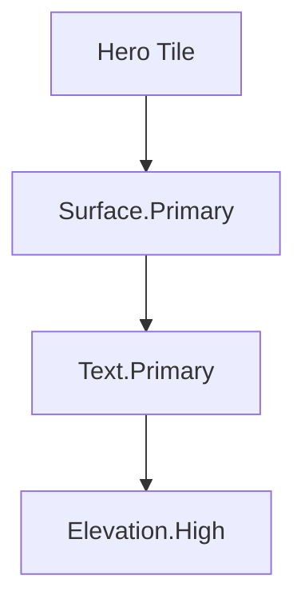
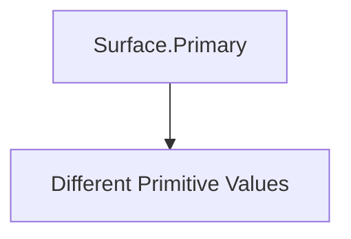

<!--
File: docs/design/system/mds-001-design-token-architecture/13-contributor-guidance.md
Document: MDS-001
Chapter: 13
Title: Contributor Guidance
Status: Draft
Version: 0.4
-->

# Contributor Guidance

---

# Purpose

The Design Token Architecture is one of the few systems every Mosaic contributor will interact with.

Designers define tokens.

Engineers consume tokens.

Tooling generates tokens.

Modules inherit tokens.

For this reason, MDS-001 establishes a common set of practices intended to preserve the long-term integrity of the Design System.

The objective is simple.

> **Every implementation should express the same design language without every contributor making the same design decisions repeatedly.**

---

# Think In Meaning

Before creating a token, contributors should ask:

> **What design decision am I trying to represent?**

Not:

> What value do I need?

Good.

```

Surface.Hero
```

Poor.

```

#112233
```

Values change.

Meaning survives.

---

# Consume The Highest Layer

Always consume the highest architectural layer available.

Preferred.



Avoid.



Skipping layers weakens maintainability.

---

# Never Duplicate Meaning

Before introducing a new token ask:

- Does this meaning already exist?
- Could an existing Semantic Token express this?
- Could Composition communicate this instead?

One concept should normally correspond to one semantic token.

Multiple names for the same meaning create architectural drift.

---

# Components Consume

Components should consume.

They should not decide.

Good.



Poor.



The Design System owns appearance.

Components own behaviour.

---

# Runtime Is Invisible

Components should never ask:

- Which artwork is active?
- Which theme is loaded?
- Which device is this?

Instead they consume:

```

Resolved Tokens
```

Runtime adaptation is entirely the responsibility of the Runtime Resolver.

---

# Prefer Composition Tokens

When implementing UI, contributors should normally begin with Composition Tokens.

Example.



rather than:



The Composition Token already communicates those responsibilities.

Higher layers reduce implementation complexity.

---

# Modules

Module authors should think in capabilities rather than appearance.

Contribute:

- Information
- Relationships
- Expressions

Consume:

- Semantic Tokens
- Composition Tokens

Avoid introducing:

- colours
- spacing systems
- typography scales
- material definitions

The module ecosystem should inherit the Mosaic visual language automatically.

---

# Themes

Themes should never introduce new semantic meaning.

Good.



Poor.

```

DarkSurfacePrimary

LightSurfacePrimary
```

Themes change implementation.

Not architecture.

---

# Runtime

Runtime Tokens should remain implementation details.

Contributors should almost never reference them directly unless working on:

- runtime systems
- theme generation
- composition engine
- platform adapters

Application code should normally consume Semantic or Composition Tokens instead.

---

# Naming

Every token should answer one question.

> **Would another contributor immediately understand why this token exists?**

If explanation is required...

The name should be reconsidered.

Names should communicate:

- purpose
- responsibility
- meaning

Never:

- colour
- framework
- implementation

---

# Review Questions

Before introducing any token ask:

- Does this represent intent or implementation?
- Is this the correct architectural layer?
- Could an existing token solve the same problem?
- Will this still make sense after a redesign?
- Would another platform consume this token unchanged?

If any answer is uncertain, revisit the hierarchy before implementation.

---

# Common Mistakes

Avoid:

### Primitive Consumption

Components using raw colours and spacing.

---

### Semantic Leakage

Embedding implementation into Semantic Tokens.

---

### Runtime Leakage

Allowing Runtime concerns to appear in application code.

---

### Component Tokens

Creating tokens that exist solely because a component exists.

---

### Platform Thinking

Naming tokens after CSS, Flutter or SwiftUI concepts.

The Design System should outlive implementation technology.

---

# Design Token Checklist

Every new token should satisfy the following.

- [ ] Represents one responsibility.
- [ ] Exists at the correct architectural layer.
- [ ] Communicates semantic intent.
- [ ] Does not duplicate existing meaning.
- [ ] Is implementation independent.
- [ ] Supports runtime adaptation.
- [ ] Preserves accessibility.
- [ ] Can be consumed across every Mosaic client.

---

# Final Guidance

The Design Token Architecture exists to remove design decisions from application code.

Application developers should spend their time building:

- experiences
- capabilities
- interactions

not repeatedly choosing:

- colours
- spacing
- typography
- materials

If contributors find themselves repeatedly making visual decisions inside application code, they should stop and ask:

> **Should this decision become a Design Token instead?**

When that instinct becomes natural, the Design System has succeeded.
