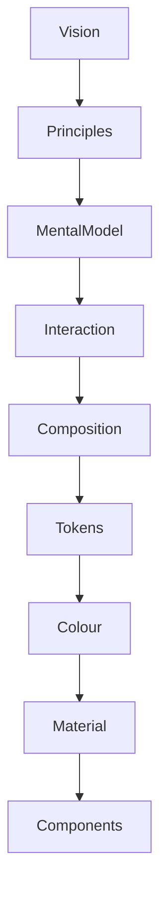
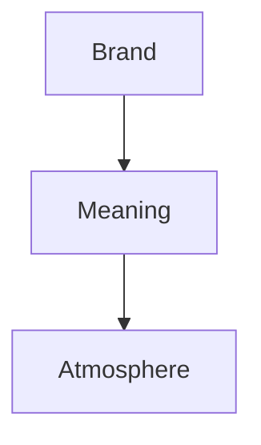

<!--
File: docs/design/system/mds-002-colour-system/00-document-control.md
Document: MDS-002
Title: Colour System
Status: Draft
Version: 0.4
-->

# Document Control

---

# Document Information

| Property | Value |
|----------|-------|
| Document ID | MDS-002 |
| Title | Mosaic Design System — Colour System |
| Classification | Internal |
| Status | Draft |
| Version | 0.4 |
| Owner | AdamNi-7080 |
| Parent Specifications | [MDL-001](../../language/mdl-001-vision/index.md) → [MDL-005](../../language/mdl-005-composition-model/index.md), [MDS-001](../mds-001-design-token-architecture/index.md) |
| Repository | `/design/mds/MDS-002 Colour System/` |

---

# Purpose

MDS-002 defines the Colour System used throughout the Mosaic Design System.

Unlike conventional colour systems, which primarily establish visual identity, the Mosaic Colour System has three independent responsibilities.

1. Preserve the Mosaic brand.
2. Communicate semantic meaning.
3. Reflect the user's current entertainment atmosphere.

These responsibilities intentionally remain independent.

The Colour System exists to support understanding.

It should never compete with the entertainment it presents.

---

# Authority

MDS-002 governs:

- Brand Palette
- Brand Illumination And Co-Brand Resolution
- Semantic Colour Mapping
- Neutral Acrylic Tint Intent
- Runtime Atmosphere
- Artwork Colour Extraction
- Theme Architecture
- Colour Resolution
- Colour Accessibility
- Colour Adaptation

This specification intentionally does **not** govern:

- Materials
- Typography
- Components
- Motion
- Layout

Those systems consume colour.

They do not define it.

---

# Relationship To MDS

The Colour System extends the Design Token Architecture.

The Colour System consumes Semantic Tokens.

It never introduces new semantic meaning.

---

# Design Intent

The Colour System intentionally separates three independent ideas.

This separation is fundamental.

Brand should never determine semantic meaning.

Artwork should never redefine the Mosaic brand.

Atmosphere should never weaken accessibility.

Each layer performs exactly one responsibility.

---

# Reader Expectations

Before reading this specification contributors should already understand:

- [MDL-001 — Mosaic Design Language Vision](../../language/mdl-001-vision/index.md)
- [MDL-002 — Principles](../../language/mdl-002-principles/index.md)
- [MDL-003 — Mental Model](../../language/mdl-003-mental-model/index.md)
- [MDL-004 — Interaction Model](../../language/mdl-004-interaction-model/index.md)
- [MDL-005 — Composition Model](../../language/mdl-005-composition-model/index.md)
- [MDS-001 — Design Token Architecture](../mds-001-design-token-architecture/index.md)

This document assumes the conceptual architecture has already been established.

Its responsibility is implementation.

---

# Architectural Scope

The Colour System defines:

- Brand Colour Architecture
- Semantic Colour Roles
- Adaptive Atmosphere
- Runtime Colour Behaviour
- Accessibility Rules
- Colour Resolution

It intentionally avoids discussing implementation frameworks such as:

- CSS
- Flutter
- SwiftUI
- Compose

Those are generated from the Colour System rather than defining it.

---

# Stability

Expected lifetime.

| Artefact | Expected Lifetime |
|----------|-------------------|
| Primitive Colour Values | Years |
| Brand Palette | Many Years |
| Semantic Colour Roles | Many Years |
| Runtime Colour Algorithms | Occasionally |
| Presentation Themes | Frequently |

Colour values may evolve.

Semantic meaning should remain significantly more stable.

---

# Success Criteria

MDS-002 succeeds when:

- screenshots are immediately recognisable as Mosaic
- artwork enhances rather than overwhelms the interface
- semantic meaning remains consistent across themes
- accessibility remains uncompromised
- runtime adaptation feels natural rather than decorative
- colour communicates understanding before aesthetics
- Acrylic tint remains neutral while artwork or Brand Illumination supplies environmental hue
- co-brand illumination remains recognisably Mosaic without requiring pre-authored partner pairs
- foreground and functional colours remain readable and stable while environmental light changes

Users should remember:

- their entertainment

and

- the feeling of Mosaic.

They should rarely notice the Colour System consciously.
