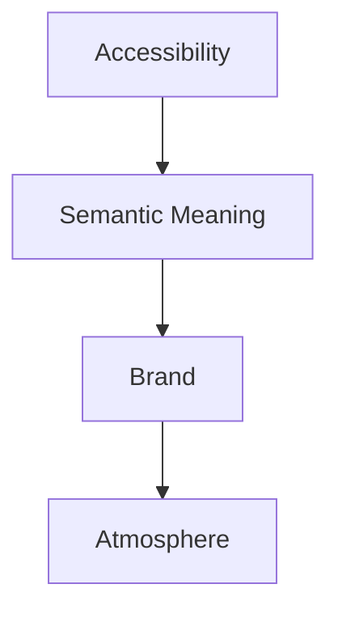
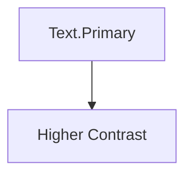
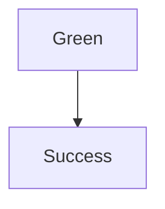
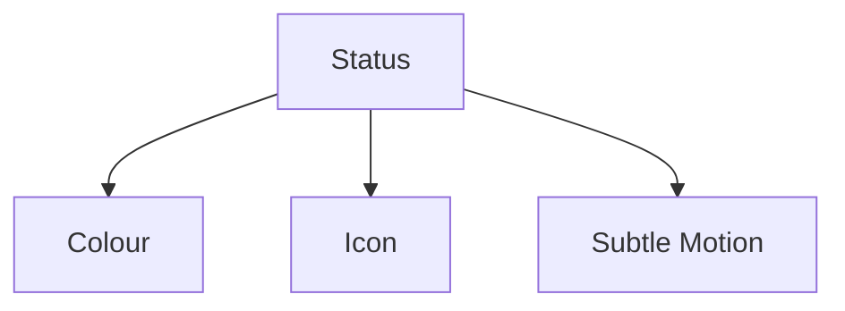
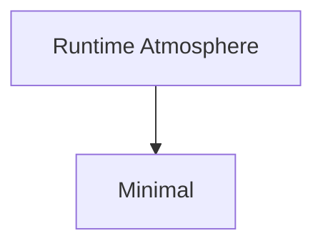
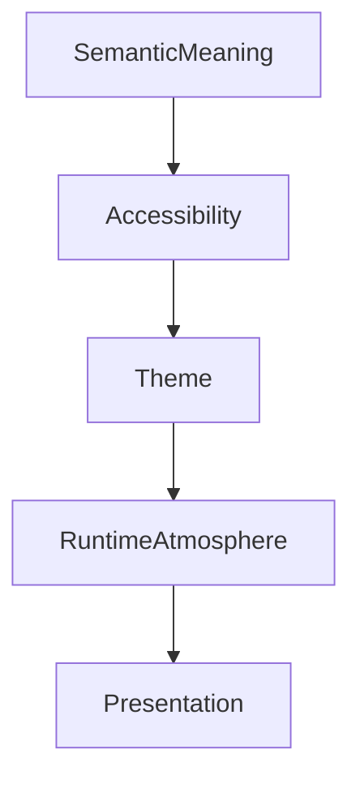

<!--
File: docs/design/system/mds-002-colour-system/08-accessibility.md
Document: MDS-002
Status: Draft
-->

# Accessibility

---

# Purpose

Accessibility is not an optional enhancement to the Mosaic Colour System.

It is a primary design constraint.

Every colour decision within Mosaic should remain understandable regardless of a user's:

- visual ability
- environmental conditions
- display technology
- colour perception
- accessibility preferences

Accessibility should therefore be considered an architectural property rather than a post-processing step.

---

# Philosophy

The Colour System follows one fundamental rule.

> **Understanding must never depend upon colour alone.**

Colour may reinforce understanding.

It must never become the only mechanism communicating:

- hierarchy
- interaction
- status
- progress
- warnings
- selection

Removing colour should reduce visual richness.

It should not destroy comprehension.

---

# Accessibility Before Atmosphere

One of the defining priorities of the Mosaic Colour System is:



If Runtime Atmosphere reduces accessibility...

Atmosphere should adapt.

Not the other way around.

Accessibility is considered a higher-order architectural constraint.

---

# Semantic Stability

Accessibility should never introduce new semantic concepts.

Example.

Correct.



Incorrect.

```text
Accessibility.Text.Primary
```

Semantic meaning remains identical.

Only implementation changes.

---

# Contrast

Contrast exists to communicate hierarchy.

Not visual drama.

Every semantic colour role should satisfy minimum readability requirements under:

- Light Mode
- Dark Mode
- Runtime Atmosphere
- High Contrast

Future implementations should validate contrast automatically during build and runtime where appropriate.

---

# Colour Independence

Every important interaction should remain understandable without relying upon colour.

Examples include:

## Status

Instead of:



Use:

- icon
- label
- hierarchy
- colour

Together.

---

## Selection

Instead of:

```

Blue Border
```

Use:

- position
- emphasis
- typography
- colour

Together.

---

## Focus

Instead of:

```

Highlighted Colour
```

Use:

- composition
- spacing
- movement
- colour

Together.

---

# Runtime Adaptation

Runtime Atmosphere should participate in accessibility.

Example.

Current artwork.

↓

Low contrast.

↓

Runtime reduces atmosphere intensity.

↓

Semantic hierarchy remains readable.

Users should never need to choose between immersion and readability.

---

# Colour Vision

The Colour System should avoid depending upon problematic colour combinations.

Examples include:

- red vs green
- blue vs purple
- yellow vs white

Semantic differentiation should always be reinforced through additional visual mechanisms.

Future validation tooling should automatically identify problematic combinations.

---

# High Contrast

High Contrast Mode should be treated as another Theme.

It should inherit:

- semantic meaning
- hierarchy
- composition

while increasing:

- contrast
- edge definition
- readability

High Contrast should never become a separate Design System.

---

# Motion And Colour

Motion should reinforce colour rather than compensate for it.

Example.



No single mechanism should communicate understanding independently.

Together they produce a significantly more accessible experience.

---

# Typography

Colour should never compensate for weak typography.

Good typography should remain understandable before colour is applied.

Colour strengthens typography.

It does not rescue it.

---

# Artwork

Artwork frequently contains poor accessibility characteristics.

Examples include:

- extremely low contrast
- excessive saturation
- colour imbalance

Runtime Atmosphere should automatically constrain artwork influence.

Artwork should enrich.

Never compromise.

---

# OLED Displays

Future OLED-specific themes should preserve accessibility.

Pure black backgrounds should be introduced only where they improve readability or power efficiency.

Pure black should never become the default aesthetic if it weakens depth perception or visual hierarchy.

---

# Reduced Colour

Future accessibility modes may intentionally reduce colour.

Example.



The Composition should remain immediately understandable.

This serves as a useful validation technique for ensuring hierarchy does not depend upon colour.

---

# Module Behaviour

Modules inherit accessibility automatically.

Modules should never implement independent:

- colour systems
- contrast systems
- themes

Instead they consume Semantic Tokens.

The platform guarantees accessible presentation.

---

# Validation

Future tooling should validate:

- contrast ratios
- semantic consistency
- runtime adaptation
- theme compatibility
- colour vision deficiencies
- token usage

Accessibility should become part of continuous integration rather than manual review.

---

# Good Examples

## Hero

Artwork influences atmosphere.

Runtime reduces saturation.

Typography remains readable.

Brand remains recognisable.

---

## Status

Success communicated through:

- icon
- label
- hierarchy
- colour

Removing colour does not remove understanding.

---

## Playback

Progress communicated through:

- position
- motion
- composition
- semantic colour

Understanding remains intact across all themes.

---

# Anti-patterns

## Colour Only

Status communicated exclusively through colour.

---

## Atmosphere First

Artwork reduces readability.

---

## Decorative Contrast

Very high contrast used purely for dramatic effect.

---

## Independent Accessibility

Modules inventing their own accessibility behaviour.

The platform loses consistency.

---

# Accessibility Model



Accessibility always evaluates before atmospheric adaptation.

Understanding remains the highest priority.

---

# Relationship To Future Specifications

Future specifications are expected to formalise:

- WCAG compliance strategy
- HDR adaptation
- colour vision simulation
- automated validation
- accessibility testing
- adaptive typography
- material accessibility

These systems should all build upon the principles established in this chapter.

---

# Summary

Accessibility is not a constraint placed upon the Colour System.

It is one of its primary design objectives.

Every user should experience:

- the same hierarchy
- the same understanding
- the same companion
- the same World

regardless of:

- colour perception
- display technology
- accessibility preferences

The Colour System succeeds when colour becomes a powerful enhancement to understanding rather than a requirement for it.
