<!--
File: docs/design/system/mds-002-colour-system/09-colour-resolution.md
Document: MDS-002
Status: Draft
-->

# Colour Resolution

---

# Purpose

Previous chapters established:

- Brand Colours
- Semantic Colours
- Runtime Atmosphere
- Theme Architecture
- Accessibility

This chapter defines how those independent systems become a single resolved colour presented to the user.

Colour Resolution is responsible for translating design intent into implementation while preserving every architectural guarantee established by the Mosaic Design Language.

Components should never determine colours themselves.

They should consume resolved semantic intent.

---

# Definition

Within MDS, **Colour Resolution** is defined as:

> **The deterministic process through which semantic colour intent becomes an accessible, context-aware, platform-specific colour value.**

Colour Resolution never creates meaning.

It only implements meaning.

---

# Why Resolution Exists

Without Colour Resolution every component becomes responsible for answering questions such as:

- Which theme is active?
- Which artwork is visible?
- Is accessibility enabled?
- Which device is being used?
- Which atmosphere should apply?

This creates duplication.

Instead:

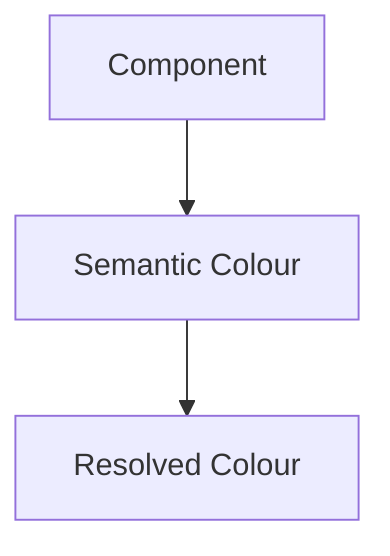

All complexity remains inside the Colour System.

---

# Resolution Pipeline

Every colour should follow the same conceptual resolution pipeline.

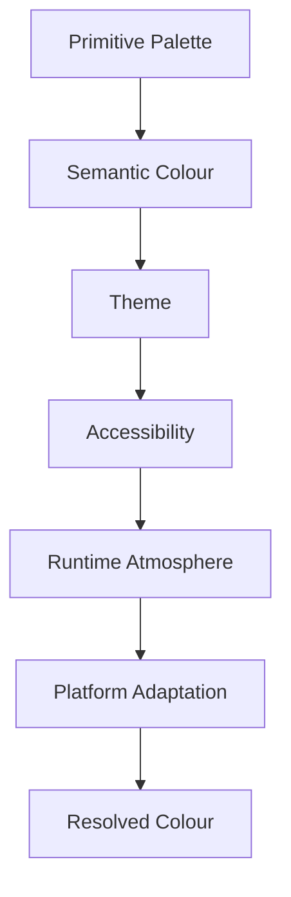

Each layer contributes one responsibility.

No layer duplicates another.

---

# Resolution Order

Colour Resolution should always occur in the same order.

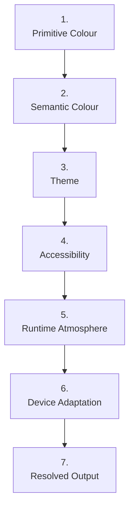

Changing this order weakens architectural consistency.

---

# Accessibility First

Accessibility should always possess higher authority than atmosphere.

Incorrect.

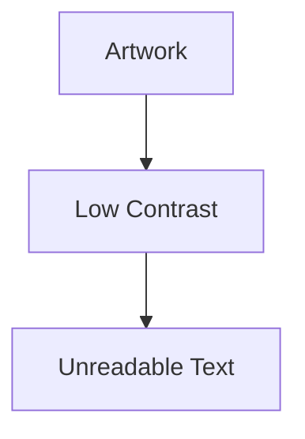

Correct.

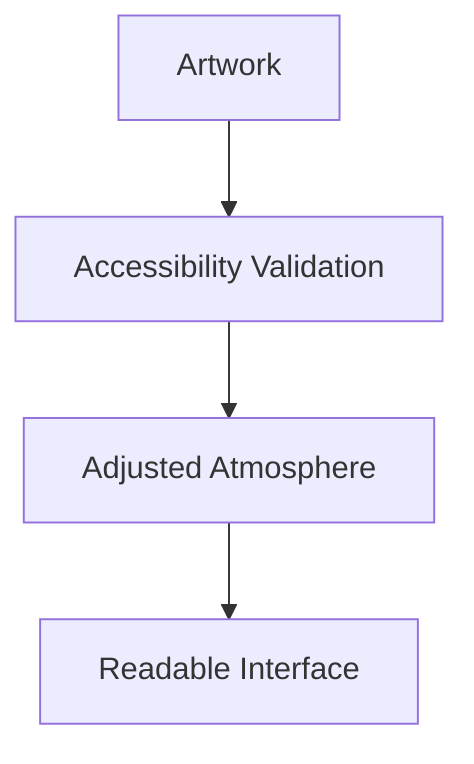

Immersion should never reduce comprehension.

---

# Semantic Stability

One of the most important guarantees of the Colour System is:

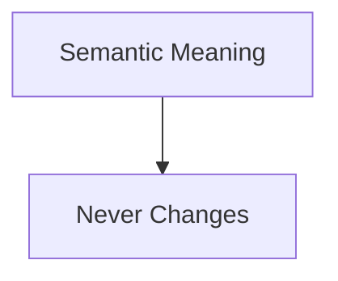

Example.

```

Surface.Hero
```

may resolve differently depending upon:

- theme
- artwork
- accessibility
- device

The semantic identity remains identical.

Applications should therefore consume only Semantic Colours.

---

# Runtime Refinement

Runtime Atmosphere refines implementation.

It never replaces semantic meaning.

Example.

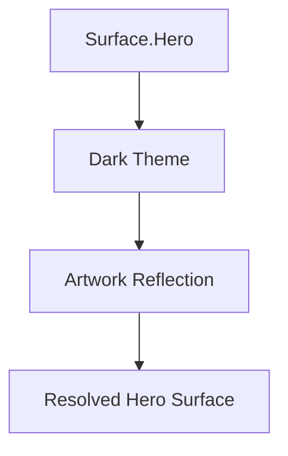

---

# Neutral Acrylic Tint Resolution

Acrylic consumes semantic Tint Intent rather than arbitrary colour, opacity or optical coefficients.

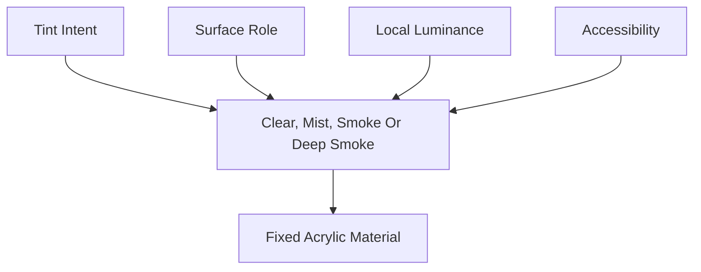

The selected recipe controls neutral pigmentation and transmission.

It does not supply environmental hue and must not change the fixed Acrylic profile defined by [MDS-003 — Material System](../mds-003-material-system/04-acrylic.md#tint-authority).

Recipe values, luminance thresholds and permitted role mappings remain calibration outputs rather than authored application values.

---

# Adaptive Neutral Foregrounds

Text and icons should resolve from calibrated neutral foreground roles rather than absorbing artwork or Brand Illumination colour.

The resolver should evaluate the local resolved luminance behind each foreground region and select a readable light or dark neutral implementation for the requested semantic role.

Foreground switching must include hysteresis.

After selecting a light or dark implementation, the resolver should retain it until local luminance crosses the opposite threshold plus a governed stability margin.

This prevents scrolling, Composition movement and Focus transitions from causing visible foreground flicker near a single contrast boundary.

Contrast validation retains higher authority than the stability margin.

---

# Functional Colour Isolation

Action, focus and status colours resolve independently from Runtime Atmosphere, Acrylic tint and co-brand illumination.

Mosaic Cyan remains the functional action and focus identity.

Success, warning, error and information remain fixed semantic roles with calibrated implementations.

Each status must also communicate through an icon, label, hierarchy or another non-colour signal.

Atmosphere subtly influences the final result.

It never determines it completely.

---

# Device Adaptation

Different displays possess different characteristics.

Examples include:

- OLED
- LCD
- HDR
- SDR
- eInk
- Projection

Device adaptation should compensate for hardware differences while preserving perceived meaning.

Users should experience one Colour System.

Not device-specific colour languages.

---

# Resolution Is Deterministic

Given identical inputs...

Colour Resolution should always produce identical outputs.

Example.

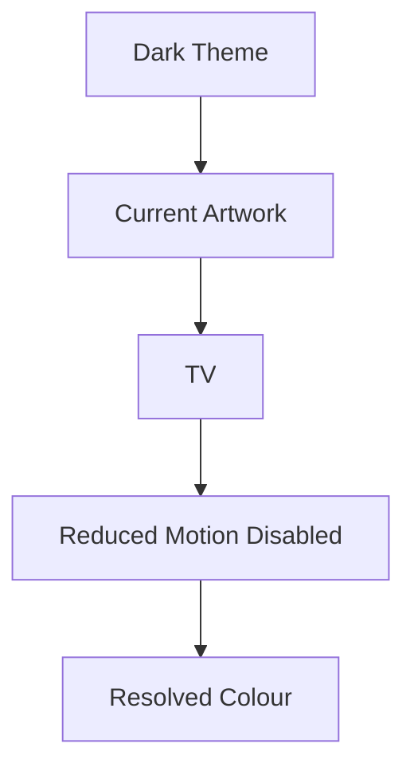

Every Mosaic client should produce visually equivalent results.

Determinism improves:

- testing
- caching
- accessibility
- predictability

---

# Resolution Inputs

Conceptually, Colour Resolution evaluates:

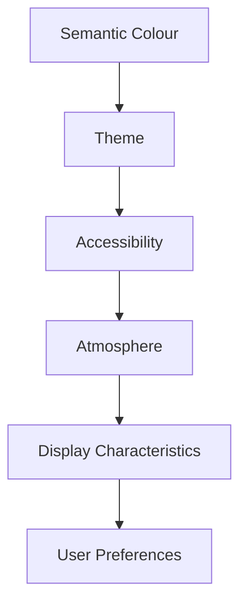

These inputs refine implementation.

They do not alter semantic intent.

---

# Fallback Behaviour

Every Semantic Colour should possess a valid fallback.

Example.

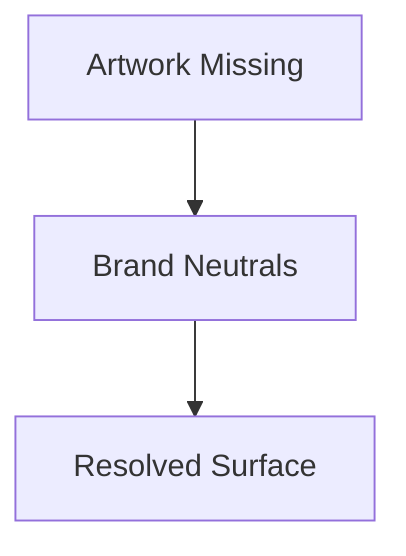

Components should never receive unresolved colours.

The system should always produce a meaningful visual result.

---

# Caching

Resolved colours should remain cacheable.

Example.

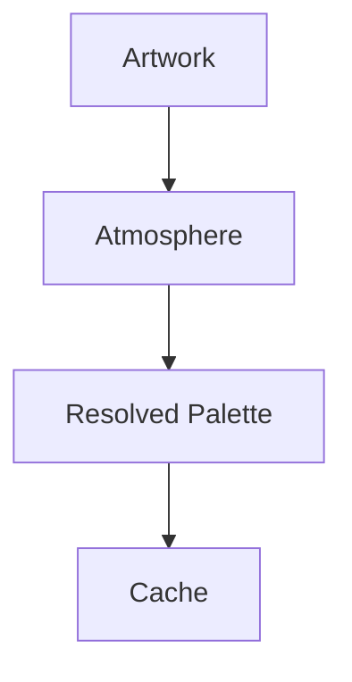

The cache should invalidate only when:

- Focus changes
- artwork changes
- theme changes
- accessibility changes

Ordinary interaction should rarely require recolour resolution.

---

# Lazy Resolution

Colour Resolution should occur only when colours are required.

Unused semantic colours should remain unresolved.

This improves runtime performance while preserving identical architectural behaviour.

---

# Components

Components should consume only resolved Semantic Colours.

Correct.

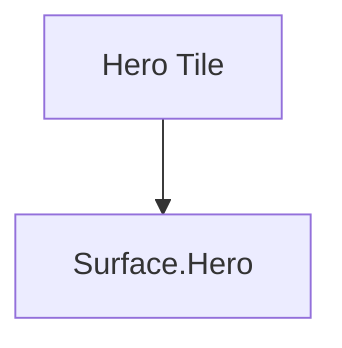

Incorrect.

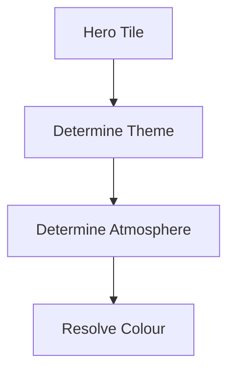

Resolution belongs exclusively to the Colour System.

---

# Modules

Modules should never resolve colours.

Modules consume:

- Semantic Colours
- mapped Platform semantic roles

The platform determines final colour values.

This guarantees future compatibility across:

- themes
- accessibility
- runtime atmosphere

without module modification.

---

# Good Examples

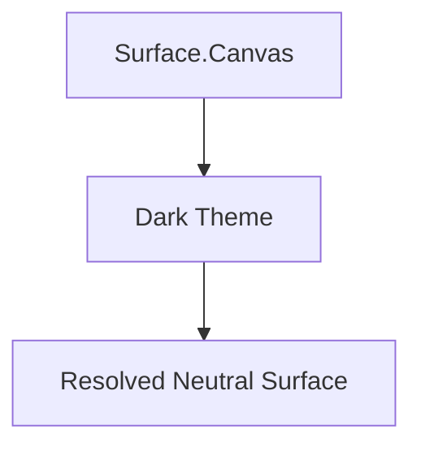

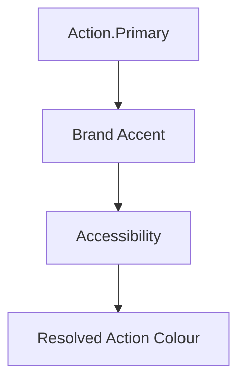

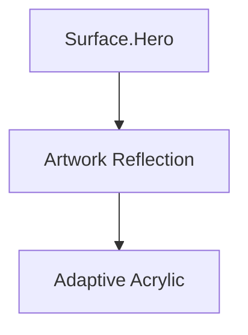

Each example preserves semantic intent.

Only implementation changes.

---

# Anti-patterns

## Component Colour Logic

Every component resolving colours independently.

---

## Artwork Overrides

Artwork replacing Semantic Colours entirely.

---

## Platform Resolution

Flutter, CSS or SwiftUI redefining semantic meaning.

---

## Runtime Mutation

Runtime changing the identity of Semantic Colours.

Runtime refines implementation.

It never changes meaning.

---

# Colour Resolution Model

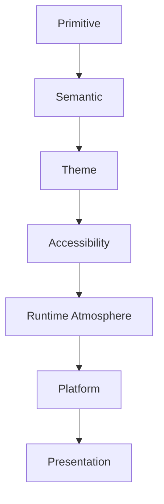

Meaning flows downward.

Implementation never flows upward.

---

# Relationship To Future Specifications

Future specifications are expected to define:

- palette blending
- atmosphere interpolation
- HDR colour mapping
- GPU colour pipelines
- platform renderers
- colour cache invalidation

This chapter defines the architectural process.

Future specifications define implementation.

---

# Summary

Colour Resolution is the mechanism through which the Mosaic Colour System becomes visible.

Its responsibility is to preserve:

- semantic meaning
- accessibility
- runtime atmosphere
- brand identity

while producing one coherent visual language across every supported platform.

Components should simply ask:

> **"What does this colour mean?"**

The Colour System answers everything else.
