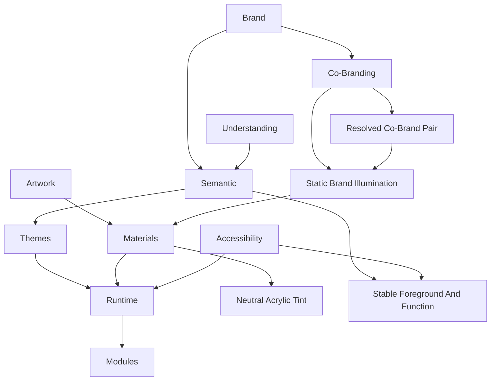

<!--
File: docs/design/system/mds-002-colour-system/12-adrs.md
Document: MDS-002
Chapter: 12
Title: Architectural Decision Records
Status: Draft
Version: 0.4
-->

# Architectural Decision Records

---

# Purpose

The Architectural Decision Records (ADRs) contained within MDS-002 preserve the reasoning behind the Mosaic Colour System.

Where previous specifications established:

- Vision
- Principles
- Mental Model
- Interaction
- Composition
- Token Architecture

MDS-002 establishes the visual language through which those concepts become emotionally expressive.

These ADRs explain why the Colour System deliberately separates:

- Brand
- Semantic Colour
- Runtime Atmosphere
- Themes
- Accessibility

Future contributors should understand these decisions before proposing changes to the visual identity of Mosaic.

---

# Decision Format

Decision format, lifecycle and review expectations are governed by **[MDG-001 — Documentation Authority Guide](../../../engineering/documentation/mdg-001-documentation-authority-guide/index.md)**.

This chapter records decisions specific to this specification and avoids redefining the shared ADR process.

# ADR-097

## Title

Separate Brand From Atmosphere

### Status

Accepted

### Context

Many media applications allow artwork to dominate their visual identity.

Founder workshops consistently identified the need for a recognisable Mosaic identity that remained independent from currently playing media.

### Decision

Brand Colours remain stable.

Runtime Atmosphere adapts.

The two systems remain architecturally independent.

### Consequences

Users continue recognising Mosaic regardless of current entertainment.

---

# ADR-098

## Title

Artwork Influences Environment Rather Than Interface

### Status

Accepted

### Context

Direct artwork recolouring creates visually unstable interfaces.

### Decision

Artwork contributes Runtime Atmosphere rather than direct component colours.

Atmosphere influences Materials.

Materials influence Presentation.

### Consequences

Entertainment emotionally influences the interface without replacing the Design System.

---

# ADR-099

## Title

Semantic Colours Are Stable

### Status

Accepted

### Context

Colour values are expected to evolve significantly over time.

Semantic meaning should not.

### Decision

Applications consume Semantic Colours rather than Primitive Colours.

Primitive values remain implementation details.

### Consequences

Future redesigns become dramatically less disruptive.

---

# ADR-100

## Title

Accessibility Has Higher Authority Than Atmosphere

### Status

Accepted

### Context

Artwork frequently produces colour combinations unsuitable for accessible interfaces.

### Decision

Accessibility validation occurs before Runtime Atmosphere reaches Presentation.

### Consequences

Immersion never compromises readability.

---

# ADR-101

## Title

Themes Interpret Rather Than Redefine

### Status

Accepted

### Context

Maintaining separate Light and Dark design systems fragments conceptual consistency.

### Decision

Themes become visual interpretations of identical semantic architecture.

### Consequences

Users experience one Design Language regardless of active theme.

---

# ADR-102

## Title

Runtime Colour Is Deterministic

### Status

Accepted

### Context

Adaptive colour systems frequently become visually unpredictable.

### Decision

Given identical runtime inputs, the Runtime Resolver must always produce identical colour outputs.

### Consequences

Caching, testing and cross-platform consistency become significantly easier.

---

# ADR-103

## Title

Atmosphere Is Material-Led

### Status

Accepted

### Context

Early exploration applied artwork colours directly to interface surfaces.

This weakened hierarchy and obscured brand identity.

### Decision

Atmosphere should primarily influence Materials rather than component colours.

### Consequences

Future acrylic and refraction systems become the primary visual expression of atmosphere.

---

# ADR-104

## Title

Modules Consume Rather Than Define Colour

### Status

Accepted

### Context

Allowing modules to introduce independent colour systems fragments visual identity.

### Decision

Modules consume:

- Semantic Colours
- Runtime Atmosphere

The platform remains solely responsible for colour generation.

### Consequences

Community modules inherit future visual improvements automatically.

---

# ADR-105

## Title

Colour Exists To Support Understanding

### Status

Accepted

### Context

Many modern interfaces use colour primarily as decoration.

Founder workshops consistently reinforced that hierarchy and understanding should exist independently from colour.

### Decision

Colour reinforces meaning.

It never becomes the only mechanism communicating meaning.

### Consequences

Accessibility improves.

The interface remains understandable even with greatly reduced colour information.

---

# ADR-106

## Title

Permit Governed Co-Branding Without White-Labelling

### Status

Amended by ADR-109

### Context

Partners may require visible identity while Mosaic must remain one coherent product and Design Language.

### Decision

Mosaic remains the primary product identity and does not permit white-labelled themes.

Approved partners may provide a mark in designated locations and a validated static illumination colour pair.

Partner input cannot replace Mosaic typography, Materials, interaction behaviour, accessibility or shell identity.

### Consequences

Partners gain recognisable presence without owning tokens or fragmenting the Platform theme architecture.

---

# ADR-107

## Title

Use Static Brand Illumination When Artwork Is Absent

### Status

Accepted

### Context

Settings, administration and dashboard experiences may have no meaningful artwork but must still feel like Mosaic Acrylic.

### Decision

Colour-source priority is focused artwork, Hero artwork, a resolved co-brand illumination pair, then the default Mosaic pair.

The pair acts as a static environmental source through the Material System rather than recolouring components.

### Consequences

No-artwork experiences retain Acrylic and Refraction identity with minimal continuous processing.

---

# ADR-108

## Title

Resolve Semantic Tint Intent To Neutral Acrylic Recipes

### Status

Accepted

### Context

Acrylic requires governed colour transmission without exposing Material physics or allowing brand and artwork colour to become arbitrary surface tint.

### Decision

The Colour System defines four internal neutral Acrylic recipes: Clear, Mist, Smoke and Deep Smoke.

Content requests semantic Tint Intent.

The renderer selects a recipe using intent, local luminance, accessibility and surface role.

The recipes may change only neutral pigmentation and transmission; [MDS-003 — Material System](../mds-003-material-system/04-acrylic.md#tint-authority) retains authority over the fixed Acrylic profile.

### Consequences

Artwork and Brand Illumination remain the source of environmental hue while every Acrylic surface retains one coherent Material identity.

---

# ADR-109

## Title

Derive Co-Brand Illumination From Mosaic Indigo And Registered Partner Colours

### Status

Accepted

### Context

Mosaic cannot pre-author every future partner pair, while unrestricted partner colours would fragment the brand and produce unsafe Material illumination.

### Decision

A Partner Brand Registration provides one required signature colour and may provide approved alternatives, preference order and usage restrictions.

The Platform preserves Mosaic Indigo and deterministically selects and normalises one registered partner accent using perceptual separation, luminance, brand fidelity, gamut and energy constraints.

The resolver does not invent an unregistered hue.

Colour collisions require brand review and fall back to the default Indigo and Cyan pair until approved.

This decision supersedes the partner-provided complete-pair portion of ADR-106.

### Consequences

Normal co-brand onboarding becomes automatable while Mosaic remains visibly primary and exceptional colour collisions remain explicitly governed.

---

# ADR-110

## Title

Keep Foreground And Functional Colour Independent From Environmental Light

### Status

Accepted

### Context

Directly tinting text, icons, actions or status from artwork and co-brand illumination would weaken meaning and create flicker as the Composition moves through a light field.

### Decision

Text and icons resolve from calibrated neutral roles using local luminance and hysteresis.

Action, focus and status colours remain fixed functional semantics independent from Runtime Atmosphere, Acrylic tint and co-brand illumination.

Mosaic Cyan remains the action and focus identity in co-branded experiences.

Status must also use a non-colour signal.

### Consequences

Foreground readability remains stable during movement, and environmental branding cannot change interaction or status meaning.

---

# ADR Relationships

Together these decisions establish the architectural separation between:

- identity
- meaning
- emotion
- implementation

which defines the Mosaic Colour System.

---

# Future ADRs

Future Colour System ADRs are expected to formalise:

- HDR Colour Pipeline
- Wide Gamut Displays
- Dynamic Contrast Balancing
- Multi-Monitor Colour Synchronisation
- Refraction Colour Transport
- Ambient Lighting Integration
- AI-assisted Artwork Analysis
- Material Spectral Rendering

These intentionally remain outside the scope of MDS-002 Version 0.1.

---

# ADR Governance

Colour ADRs should change only when:

- accessibility research identifies deficiencies,
- semantic ambiguity exists,
- runtime architecture evolves,
- the Design Language itself changes.

Presentation trends should never justify architectural colour changes.

---

# Summary

The ADRs contained within MDS-002 define the architectural identity of the Mosaic Colour System.

Rather than treating colour as decoration, Mosaic treats colour as:

- identity,
- meaning,
- atmosphere.

Each responsibility remains independent.

Together they create a colour system capable of evolving for many years while remaining recognisably Mosaic.
