<!--
File: docs/design/system/mds-003-material-system/07-refraction.md
Document: MDS-003
Chapter: 07
Title: Refraction
Status: Draft
Version: 0.4
-->

# Refraction

---

# Purpose

Refraction is the defining physical behaviour of the Mosaic Material System.

It is the mechanism through which entertainment subtly influences the interface.

Without Refraction, Acrylic becomes translucent decoration.

With Refraction, Acrylic becomes a believable physical material.

Refraction transforms a hidden artwork-derived light source into the feeling that light is travelling through Acrylic itself.

It is one of the primary visual signatures of Mosaic.

---

# Definition

Within MDS, **Refraction** is defined as:

> **The controlled bending and transport of artwork-derived light through Mosaic Acrylic in order to reinforce immersion, hierarchy and physical presence.**

Refraction is not:

- blur
- bloom
- colour overlays
- gradients
- transparency

Those are rendering techniques.

Refraction is a physical behaviour.

Diffusion, absorption, reflection and edge emission are related Acrylic behaviours, but they remain mechanically distinct from refraction.

---

# Philosophy

Imagine a polished sheet of premium acrylic placed beside a colourful book cover.

The acrylic does not become the same colour as the artwork.

Instead...

Light enters the acrylic.

Travels through it.

Softly bends.

Diffuses internally.

Then exits again.

This behaviour creates the impression of physical depth.

That is the behaviour Mosaic seeks to reproduce.

---

# Why Refraction Exists

Entertainment already contains:

- colour
- light
- atmosphere
- emotional tone

Traditional interfaces isolate themselves from these qualities.

Mosaic instead allows those qualities to gently influence surrounding materials.

Refraction creates the feeling that:

> **The interface exists inside the same environment as the entertainment.**

---

# Light Transport

Refraction should always be thought of as material-scoped light transport.

Not colour replacement.

Poor.

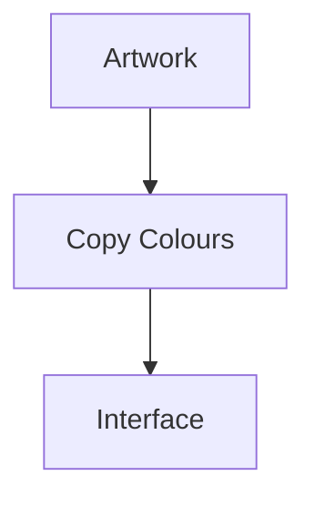

Preferred.

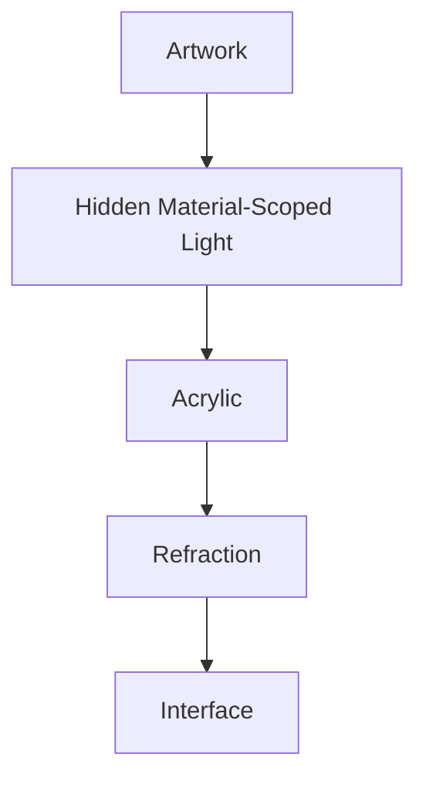

The distinction is critical.

Materials remain physically believable.

Brand identity remains intact.

---

# Refraction Inputs

Refraction receives several conceptual inputs.

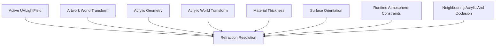

Refraction should never depend directly upon component implementation.

It is a material behaviour.

---

# Material-Scoped Artwork Emitter

The current artwork acts as a spatially distributed light source for Acrylic.

This role remains invisible to the user.

The ordinary Presentation path displays the artwork without:

- glow,
- bloom,
- visible emission,
- direct illumination of surrounding components.

An independent material path derives a directional light field from the same artwork.

That field is the global primary source for the Acrylic transport environment.

Only Acrylic may consume it directly or receive energy redistributed by other Acrylic.

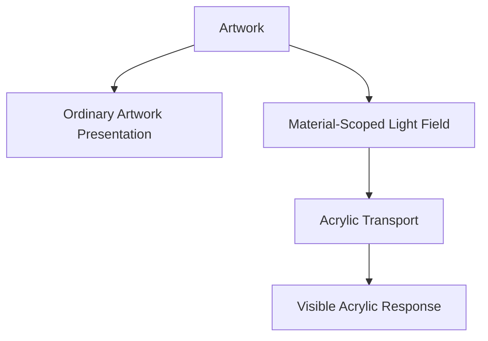

Any visible illumination must appear to originate from the Acrylic response rather than from the artwork itself.

---

# Three-Dimensional Composition Space

Refraction resolves within the three-dimensional Composition rather than screen space.

Artwork and Acrylic remain two-dimensional surfaces with spatial position, orientation, bounds and masks within that Composition.

Composition depth does not require three-dimensional meshes or extruded Acrylic geometry.

The direction of incident light follows their three-dimensional relationship.

Screen coordinates become relevant only when the resolved material is projected into Presentation.

---

# Global Primary Source

The current artwork is the single global primary source for its Acrylic transport environment.

Global means that every spatially related Acrylic object may participate in one shared transport solution.

It does not mean that the artwork visibly illuminates Canvas, components or the wider Presentation.

Acrylic receivers must not create independent interpretations of the artwork source.

---

# Primary Source Selection

The artwork associated with current Focus should act as the global primary source for the active Acrylic transport environment.

When Focus is not associated with artwork, the Hero artwork should act as the source.

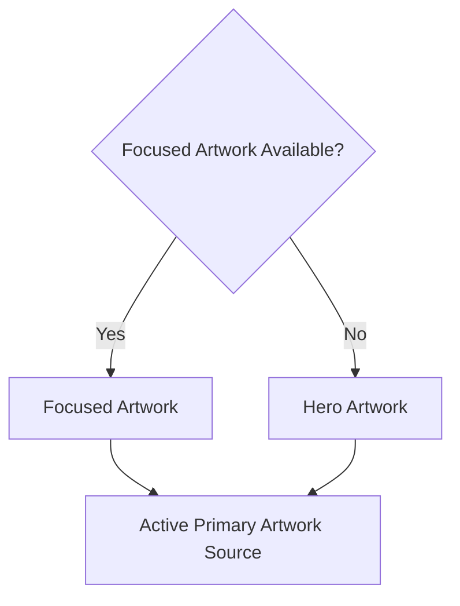

Focus changes should transition between source fields without an abrupt Material reset.

The source-selection rule remains Platform-owned and must not be reinterpreted independently by components.

---

# Backdrop Participation

Acrylic should distort and diffuse the actual Presentation rendered behind its two-dimensional bounds and mask.

This local backdrop sample is distinct from the hidden artwork-derived `UVLightField`.

| Input | Responsibility |
|-------|----------------|
| Backdrop sample | Communicates local translucency, placement and continuity with visible content behind the Acrylic. |
| Artwork light field | Supplies primary pigmentation, intensity, edge emission and shared environmental coherence. |

The renderer combines both inputs inside Acrylic without making backdrop content or visible artwork an additional global light source.

Semantic foreground content must remain outside destructive distortion when readability requires it.

---

# Secondary Acrylic Transport

Acrylic may pass transformed artwork light to other Acrylic.

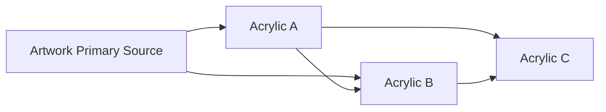

This knock-on behaviour depends upon:

- relative position,
- distance,
- orientation,
- intervening opaque surface bounds and masks,
- entry and exit boundaries,
- energy remaining after previous transport.

Projected overlap is not required.

Nearby non-overlapping Acrylic may influence one another within a bounded projected-distance radius when their z relationship and masks permit a visible transport path.

Acrylic is a secondary transport contributor rather than an independent light source.

It redirects existing energy.

It does not create energy.

---

# Occlusion

Opaque Composition surfaces should block material-scoped artwork light according to their bounds, masks and z-order.

Acrylic may transmit and transform that light according to its material behaviour.

Occlusion ensures that depth, ordering and spatial relationships remain meaningful within the three-dimensional Composition.

---

# Bounded Propagation

Secondary transport must remain bounded.

Each interaction should reduce or redistribute the available energy through refraction, absorption, diffusion and reflection.

Transport should stop when the remaining contribution becomes negligible.

Future implementations may approximate this using a transport-depth limit, an energy threshold or both, provided the perceived result remains coherent.

---

# Refraction Outputs

Refraction influences:

- the path travelled through Acrylic,
- the location at which light exits Acrylic,
- subtle colour transport through the material,
- edge emission,
- perceived depth.

It should never directly influence:

- typography
- icons
- interaction affordances

Understanding remains independent from refraction.

---

# Refraction Participation

Only Acrylic materials participate in artwork-derived refraction.

| Material | Participation |
|----------|--------------:|
| Canvas | None |
| Surface | None |
| Acrylic | Standard |
| Hero Acrylic | Strongest |
| Overlay Acrylic | Reduced |

Runtime Atmosphere may influence other materials through their own behaviour, but the artwork-derived light field remains exclusive to Acrylic.

Refraction reinforces physical importance.

It does not define it.

---

# Directionality

Refraction should possess three-dimensional direction.

Light originates from positions across the artwork surface and travels toward Acrylic within the Composition.

Conceptually.

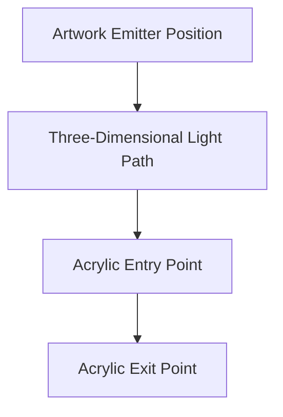

The same artwork field may therefore produce different responses as Acrylic moves, rotates or changes depth.

---

# Optical Parallax Resolution

Refraction should derive a bounded internal optical offset from:

- the artwork-to-Acrylic relationship,
- the Acrylic surface transform,
- projected viewpoint or Focus change,
- the Acrylic apparent-thickness profile.

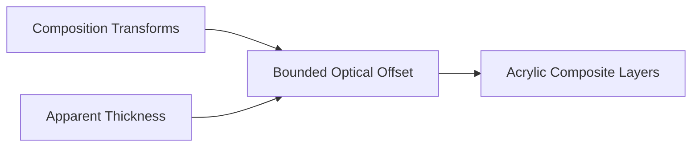

The Acrylic renderer applies that offset to sampled artwork, backdrop, diffusion and glare layers inside a stable two-dimensional mask.

The offset belongs to resolved Acrylic state rather than `UVLightFrame` because it depends upon a particular receiver and Composition.

No mesh, ray-to-triangle intersection or volumetric scene representation is required.

Parallax responds only to Composition movement, scrolling and Focus transitions.

Pointer position, device tilt, gyroscope data and unrelated ambient motion must not drive Acrylic parallax.

---

# Diffusion

Light should soften as it travels through Acrylic.

Strong artwork colours should gradually become:

- calmer
- broader
- less saturated

Diffusion prevents the interface from becoming visually noisy.

Users should perceive atmosphere rather than individual colours.

---

# Edge Emission

Artwork-derived light may exit through an Acrylic edge after travelling through its perceived internal depth.

This creates a moving edge-emission response that remains spatially related to:

- the bright regions of the artwork,
- the position and orientation of the artwork,
- the position and orientation of the Acrylic,
- the Acrylic boundary through which light exits.

Edge emission should remain subtle.

Users should feel depth.

Not notice glowing borders.

Edge emission belongs to Acrylic.

It is never a glow applied around the artwork.

---

# Hero Refraction

Hero Material receives the highest quality refraction.

Examples include:

- richer colour transport
- deeper diffusion
- stronger perceived volume
- smoother temporal blending

Hero Refraction should remain emotionally expressive without becoming visually dominant.

The artwork always remains sharper and more detailed than the surrounding material.

---

# Supporting Refraction

Supporting Acrylic receives restrained refraction.

Examples include:

- shelves
- timelines
- continuation panels

These materials should visually relate to the Hero without competing for attention.

---

# Overlay Refraction

Overlay Material intentionally reduces refraction.

Interaction possesses higher priority than environmental realism.

Menus.

Playback controls.

Dialogs.

Search.

All should preserve clarity before atmosphere.

---

# Temporal Behaviour

Refraction should evolve continuously.

Preferred.

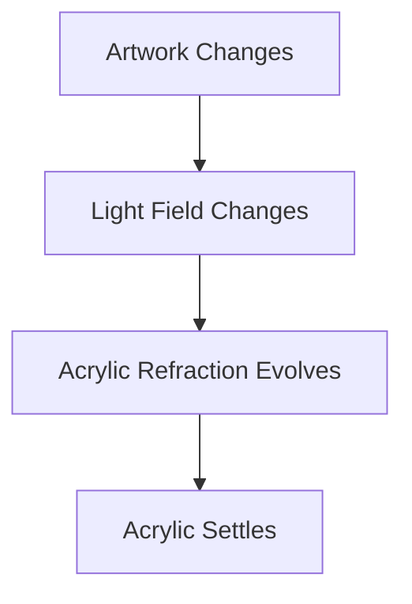

Avoid.

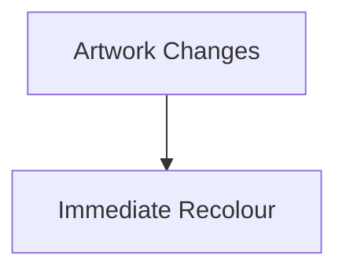

The interface should appear physically illuminated rather than digitally updated.

---

# Composition Awareness

Refraction should respect Composition.

Primary materials.

↓

Stronger environmental response.

Peripheral materials.

↓

Minimal environmental response.

Composition therefore influences physical behaviour without components becoming aware of it.

---

# Accessibility

Refraction should never reduce:

- readability
- contrast
- orientation

If environmental light conflicts with semantic clarity:

Refraction should reduce automatically.

Accessibility always overrides visual richness.

---

# Performance

Refraction quality must adapt to the measured capability and available frame budget of the active client renderer.

The runtime must not infer quality from device categories such as browser, television, desktop or mobile.

Feature availability determines which techniques are possible.

Measured runtime behaviour determines which techniques remain affordable.

When the available budget decreases, the Refraction Engine should simplify in the following conceptual order:

1. reduce secondary transport work,
2. remove negligible transport relationships,
3. simplify edge response,
4. reduce additional transport depth,
5. reduce direct artwork response only when necessary.

All simplification must preserve:

- artwork-relative direction,
- three-dimensional spatial causality,
- Acrylic-only visibility,
- weaker secondary response,
- temporal continuity.

Users should experience premium materials without perceiving rendering cost or quality transitions.

---

# Video Playback Protection

The Refraction Engine **must not** cause a video presentation deadline to be missed.

Video decode and presentation possess higher runtime priority than every Refraction operation.

If Refraction work cannot complete safely within the available budget, the engine must:

- skip or defer the material update,
- reuse the last stable material state,
- reduce transport quality,
- continue Presentation without blocking video.

Dropped or delayed material updates are acceptable.

Video frame drops attributable to Refraction are not.

---

# Modules

Modules never implement refraction.

Modules contribute:

- artwork
- information

The Material System determines:

- light transport
- diffusion
- edge behaviour

Every module therefore supplies artwork through the same material-scoped emitter model and inherits identical Acrylic quality automatically.

---

# Good Examples

## Science Fiction

Cool artwork softly illuminates Hero Acrylic.

Nearby Acrylic receives subtle blue transmission and edge response.

Typography remains perfectly readable.

---

## Fantasy Novel

Warm golden artwork creates soft amber edge lighting.

Canvas remains neutral.

Atmosphere feels warm rather than colourful.

---

## Music

Album artwork introduces subtle magenta highlights into nearby Acrylic.

Playback controls remain restrained.

Attention stays with the album cover.

---

# Anti-patterns

## Colour Overlay

Artwork colours directly tint components.

Materials lose physical credibility.

---

## Neon Refraction

Highly saturated glowing edges.

Atmosphere becomes visual spectacle.

---

## Global Artwork Lighting

Artwork-derived light illuminates Canvas, typography, components or the wider Composition directly.

The artwork appears visibly emissive and the Acrylic boundary disappears.

---

## Animated Refraction

Refraction continually shifts without behavioural cause.

Users become distracted.

---

# Refraction Model

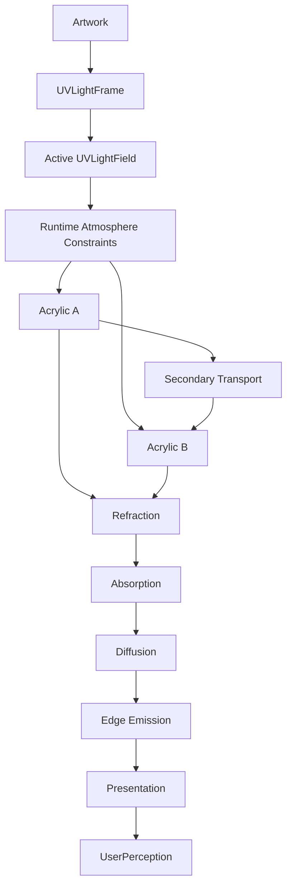

Refraction transforms hidden artwork-derived light into believable Acrylic.

---

# Relationship To Future Chapters

The following chapter expands this concept through the **UV-Indexed Refraction System**.

Rather than treating Acrylic as uniformly illuminated, Mosaic introduces a reusable artwork-space light field based upon UV coordinates.

This allows artwork-derived light to:

- move naturally,
- preserve hierarchy,
- remain computationally efficient,
- closely follow the user's current Hero.

It is expected to become one of the defining technical innovations of the Mosaic Material System.

---

# Summary

Refraction is the mechanism through which the user's entertainment quietly reaches into the interface.

It should feel:

- physical,
- restrained,
- believable,
- continuous.

Users should never think:

> "That shader looks impressive."

Instead they should simply feel that the interface belongs beside the entertainment.

That subtle shift in perception is the ultimate purpose of Refraction.
