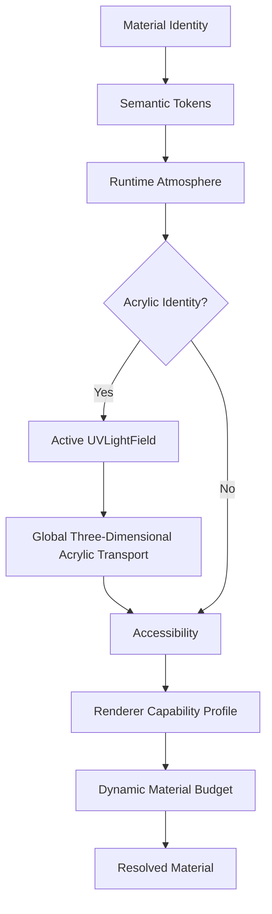
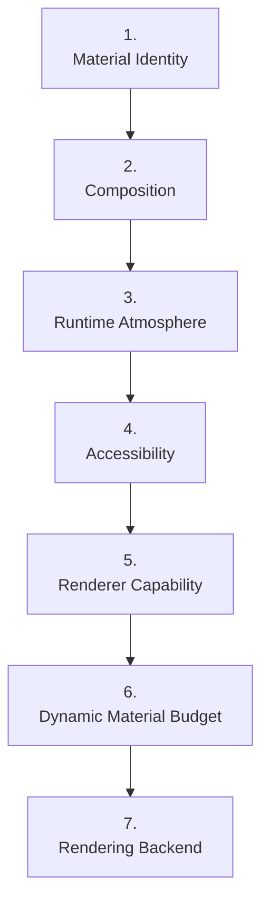
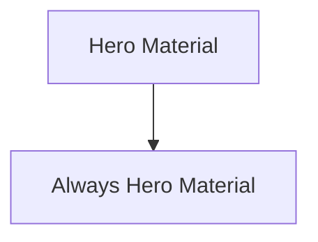
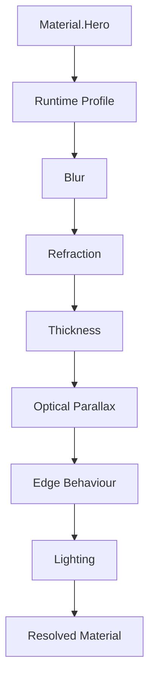
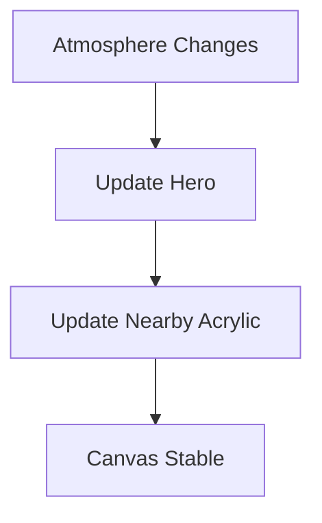
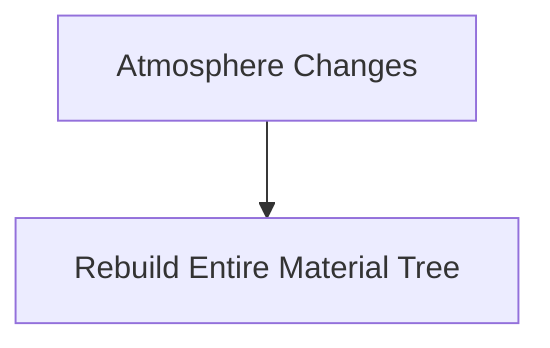
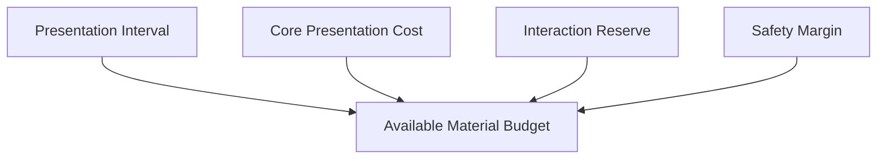
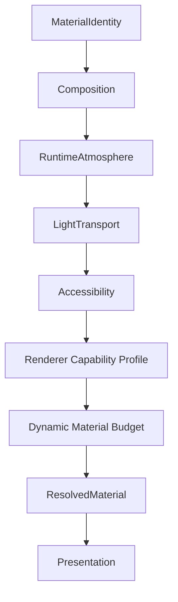

<!--
File: docs/design/system/mds-003-material-system/10-runtime-material-resolution.md
Document: MDS-003
Status: Draft
-->

# Runtime Material Resolution

---

# Purpose

The previous chapters established the conceptual behaviour of the Material System.

They defined:

- Material Hierarchy
- Acrylic
- Hero Material
- Overlay Material
- Refraction
- UV-Indexed Refraction
- Light Transport

This chapter defines how those independent systems become a resolved material at runtime.

Runtime Material Resolution is the bridge between architectural intent and rendered surfaces.

It ensures that every Mosaic client presents identical material behaviour regardless of rendering technology.

---

# Definition

Within MDS, **Runtime Material Resolution** is defined as:

> **The deterministic process through which conceptual material behaviour is transformed into concrete runtime material properties suitable for rendering.**

Runtime Material Resolution never changes material identity.

It only determines how that identity is expressed in the current environment.

---

# Why Resolution Exists

A Hero Tile should never decide:

- blur strength
- acrylic depth
- edge lighting
- atmosphere intensity
- translucency
- refraction strength

Instead it simply requests:

```text
Material.Hero
```

The Runtime Material Resolver determines everything else.

This dramatically reduces component complexity.

---

# Resolution Pipeline

Every material follows the same conceptual pipeline, with artwork-derived transport enabled only for Acrylic identities.



Each stage contributes exactly one responsibility.

---

# Resolution Inputs

The Runtime Material Resolver evaluates:

```mermaid
flowchart TD

N1["Current World"]
N2["Current Focus"]
N3["Current Context"]
N4["Composition"]
N5["Material Identity"]
N6["Runtime Atmosphere"]
N7["Accessibility"]
N8["Theme"]
N9["Renderer Context"]
N10["Active UVLightField"]
N11["Three-Dimensional Transforms"]
N12["Acrylic Transport Environment"]
N13["Occluding Geometry"]
N14["Brand Illumination Pair"]
N15["User Fidelity Maximum"]
N16["Resolved Material"]

N1 --> N16
N2 --> N16
N3 --> N16
N4 --> N16
N5 --> N16
N6 --> N16
N7 --> N16
N8 --> N16
N9 --> N16
N10 --> N16
N11 --> N16
N12 --> N16
N13 --> N16
N14 --> N16
N15 --> N16
```



Active `UVLightField`, three-dimensional transform, Acrylic transport environment and occlusion inputs apply only when resolving Acrylic.

No single input should dominate.

The resolver balances all inputs according to architectural priority.

---

# Resolution Priority

Material Resolution follows a strict evaluation order.



Meaning always precedes implementation.

Accessibility always precedes aesthetics.

---

# Material Identity Never Changes

One of the strongest guarantees within Mosaic is:



Regardless of:

- device
- theme
- accessibility
- artwork

Only its physical implementation changes.

The conceptual identity remains constant.

---

# Runtime Adaptation

Runtime Material Resolution adapts implementation.

Examples include:

Hero.

↓

Greater perceived thickness.

Playback.

↓

Reduced atmosphere.

Reading.

↓

Softer diffusion.

Administration.

↓

Calmer materials.

The same Material Identity behaves differently because the user's World changed.

Not because components changed.

---

# Accessibility Resolution

Accessibility possesses higher authority than physical realism.

Examples.

High Contrast.

↓

Reduced translucency.

Reduced Motion.

↓

Simplified atmosphere interpolation.

Low Vision.

↓

Reduced refraction.

Every adaptation should preserve:

- hierarchy
- readability
- interaction

before preserving material richness.

---

# Renderer Resolution

Different client renderers expose and execute rendering capabilities differently.

The resolver should choose techniques using the measured Renderer Capability Profile and current Dynamic Material Budget.

A renderer type, host platform or device label must not imply a fixed quality level.

Despite implementation differences...

Users should continue perceiving the same Material System.

---

# Material Profiles

Future implementations may internally generate Material Profiles.

Conceptually.



Components consume only the completed profile.

---

# Runtime Caching

Resolved Materials should be aggressively cached.

Typical cache invalidation events include:

- Hero changes
- Focus changes
- artwork changes
- theme changes
- accessibility changes

Static `UVLightFrame` data should remain reusable across material resolution and should not be invalidated by ordinary Acrylic movement.

A new `UVLightFrame` from a moving source should update the active `UVLightField` and only the dependent transport state.

Skipped or delayed streamed frames should leave the last stable `UVLightField` valid.

Surface-transform, bounds or mask changes may invalidate derived Composition transport, parallax or edge-response caches without invalidating the artwork-space source field.

The Runtime Material Resolver should resolve spatially related Acrylic as one coupled transport environment rather than as independent source samples.

Ordinary scrolling should not invalidate material resolution.

The environment should remain visually stable.

---

# Incremental Updates

Material Resolution should favour incremental refinement.

Preferred.



Avoid.



Incremental updates preserve continuity while reducing computational cost.

---

# Composition Awareness

Material Resolution should remain Composition-aware.

Example.

Primary Composition.

↓

High-quality Acrylic.

Peripheral Composition.

↓

Simplified Acrylic.

Material fidelity should follow compositional importance.

Rendering effort should therefore support user understanding.

---

# Client Rendering Boundary

The Platform communicates semantic presentation intent through Runtime SDUI.

Client rendering ownership is defined by [MDS-008 — Component Library](../mds-008-component-library/09-runtime-rendering.md).

For Material Resolution, Runtime SDUI may communicate:

- Material Identity,
- Composition hierarchy,
- current artwork,
- semantic importance,
- accessibility intent.

Runtime SDUI must not prescribe:

- sampling quality,
- transport depth,
- field resolution,
- update frequency,
- renderer-specific techniques.

The client renderer resolves the richest stable Material behaviour supported by its current measured budget.

This boundary allows browsers and native applications with different capabilities to consume the same semantic UI without requiring device-specific SDUI.

---

# Capability-Driven Resolution

Material quality should be capability driven rather than device classified.

The runtime should determine:

- which rendering capabilities are available,
- how those capabilities perform in the active renderer,
- how much frame headroom remains during real use.

Feature availability alone is insufficient.

Two renderers exposing the same capability may possess materially different performance.

The Runtime Material Resolver should therefore combine capability discovery with measured calibration and continuous observation.

It must not assume quality from labels such as:

- browser,
- television,
- desktop,
- mobile,
- native.

---

# Dynamic Material Budget

The Material System should receive an explicit budget derived from the active presentation interval and observed runtime headroom.

Conceptually.



The resolver should use the richest Material behaviour that remains consistently inside that budget.

Unused capability does not require maximum Refraction quality.

Stable frame pacing possesses higher authority than visual fidelity.

---

# Adaptive Material Quality

Material quality should adapt across independent dimensions rather than switch between coarse device tiers.

Adaptable dimensions may include:

- source-field precision,
- direct transport sampling,
- secondary transport depth,
- active transport relationships,
- secondary update frequency,
- edge-response quality,
- optical-parallax range and update frequency,
- temporal reconstruction quality.

When pressure increases, the resolver should simplify secondary and negligible work before weakening the direct artwork-to-Acrylic relationship.

Quality reduction should occur quickly enough to protect frame pacing.

Quality restoration should require sustained headroom and occur gradually enough to avoid visible oscillation or popping.

Every quality state must preserve the Material System's perceptual invariants.

Users may set Automatic, Balanced or Essential as their maximum Refraction fidelity.

The preference may be synced across their account or overridden for one client.

The resolver may reduce below that maximum for accessibility, capability, current budget or Presentation deadlines and must never exceed it.

---

# Video Playback Protection

The Refraction Engine must never cause a video presentation deadline to be missed.

Runtime priority is:

1. video decode and presentation,
2. input and playback interaction,
3. core UI Composition,
4. direct Acrylic response,
5. edge response,
6. optical-parallax refinement,
7. secondary Acrylic transport,
8. additional transport depth.

Before scheduling Refraction work, the renderer should determine whether that work fits safely within the remaining presentation budget.

If it does not fit, the renderer must:

- avoid scheduling or defer the work,
- reuse the last stable Material state,
- preserve temporal continuity where possible,
- continue video presentation.

Video presentation must not block on:

- `UVLightFrame` generation,
- cache retrieval,
- transport-graph updates,
- secondary transport,
- edge-response generation,
- optical-parallax refinement,
- material-quality recovery.

The invariant applies specifically to video frame drops attributable to Refraction Engine work.

Playback may still encounter independent failures in decoding, delivery or the operating environment.

---

# Module Behaviour

Modules never resolve materials.

Modules contribute:

- artwork
- information
- relationships

The platform resolves:

- Material Identity
- Atmosphere
- Refraction
- Lighting

This guarantees every module inherits identical physical behaviour.

---

# Good Examples

## Hero

Current artwork.

↓

Atmosphere.

↓

Hero Profile.

↓

Premium Acrylic.

↓

Rendered Surface.

---

## Timeline

Supporting Composition.

↓

Supporting Acrylic.

↓

Reduced refraction.

↓

Consistent hierarchy.

---

## Playback Overlay

Overlay Material.

↓

Reduced atmosphere.

↓

Maximum readability.

↓

Interaction remains effortless.

---

# Anti-patterns

## Component Materials

Components constructing materials independently.

The Material System fragments.

---

## Client-Specific Material Hierarchy

Every client inventing its own material hierarchy.

Consistency disappears.

---

## Runtime Identity

Runtime changing Hero into Surface.

Meaning has leaked into implementation.

---

## Complete Rebuild

Every runtime update regenerates every material.

Continuity weakens.

Performance decreases.

---

## Device-Class Quality

Material fidelity is selected from labels such as browser, television, desktop or mobile rather than measured renderer behaviour.

Capable renderers are unnecessarily restricted while weaker renderers become unstable.

---

## Playback Blocking

Video presentation waits for artwork-field generation, transport updates, cache access or Material refinement.

Refraction becomes a source of video frame drops.

---

# Runtime Material Model



Coupled Acrylic behaviour is resolved as one coordinated transport result.

Components simply consume the result.

---

# Relationship To Future Specifications

[MEG-014 — Refraction Engine](../../../engineering/guides/meg-014-refraction-engine/index.md) provides implementation guidance for:

- Material Resolver
- renderer profiles
- Material Cache
- Acrylic Renderer
- Refraction Engine
- Cross-platform Material Backends

Future protocols may formalise a cross-process resolved-Material contract if independently developed components need to exchange that state.

---

# Summary

Runtime Material Resolution transforms conceptual materials into physical experience.

It preserves:

- hierarchy
- atmosphere
- accessibility
- continuity
- performance

while hiding implementation complexity from the rest of the platform.

Components should never know:

- how Acrylic is rendered,
- how light was transported,
- how atmosphere was generated.

They should simply receive:

> **Material.Hero**

The Material System does everything else.
