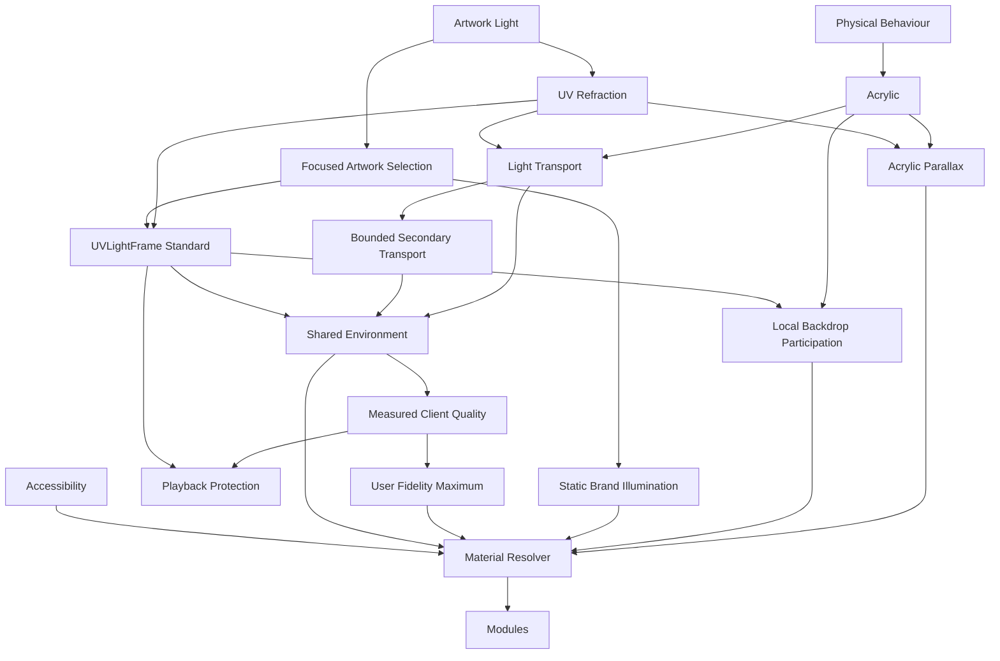

<!--
File: docs/design/system/mds-003-material-system/12-adrs.md
Document: MDS-003
Chapter: 12
Title: Architectural Decision Records
Status: Draft
Version: 0.4
-->

# Architectural Decision Records

---

# Purpose

The Architectural Decision Records (ADRs) contained within MDS-003 preserve the reasoning behind the Mosaic Material System.

Where previous specifications established:

- Design Tokens
- Colour
- Runtime Atmosphere

this specification establishes the physical language through which those systems become a believable environment.

These ADRs explain why Mosaic deliberately models materials as physical behaviours rather than decorative effects.

Future contributors should consult these records before proposing changes to the Material System.

---

# Decision Format

Decision format, lifecycle and review expectations are governed by **[MDG-001 — Documentation Authority Guide](../../../engineering/documentation/mdg-001-documentation-authority-guide/index.md)**.

This chapter records decisions specific to this specification and avoids redefining the shared ADR process.

# ADR-111

## Title

Treat Materials As Physical Behaviours

### Status

Accepted

### Context

Most UI frameworks model materials as visual styles.

Founder workshops consistently described the desired experience as physical rather than decorative.

### Decision

Materials become behavioural objects.

Rendering becomes their implementation.

### Consequences

Future rendering technologies may evolve without changing the perceived physical language of Mosaic.

---

# ADR-112

## Title

Adopt Acrylic As The Primary Interactive Material

### Status

Accepted

### Context

Glass interfaces frequently disappear into the background while opaque panels isolate themselves from surrounding content.

Neither behaviour aligned with the desired Mosaic experience.

### Decision

Premium Acrylic becomes the primary interactive material.

### Consequences

The interface gains:

- presence
- depth
- environmental lighting
- restrained translucency

without competing with entertainment.

---

# ADR-113

## Title

Treat Artwork As Environmental Light

### Status

Accepted

### Context

Direct artwork recolouring weakens hierarchy and brand identity.

Visible artwork glow would turn a material relationship into a scene-wide lighting effect.

### Decision

Artwork becomes a spatially distributed, material-scoped light source rather than a colour palette.

The source is available only to Acrylic transport and remains independent from the ordinary visible presentation of the artwork.

### Consequences

Runtime Atmosphere constrains the artwork-derived field rather than directly colouring components.

Visible illumination appears within Acrylic without making the artwork glow or illuminate the wider Composition.

---

# ADR-114

## Title

Introduce UV-Indexed Refraction

### Status

Accepted

### Context

Screen-space atmospheric effects become inconsistent across devices and layouts.

The Composition itself is three-dimensional even though artwork is naturally parameterised using two-dimensional UV coordinates.

### Decision

Artwork-derived relative radiance is represented in normalised artwork UV space.

The artwork world transform projects that emitter surface into the three-dimensional Composition, where Acrylic samples it according to spatial relationship.

### Consequences

The source field becomes:

- device independent
- reusable across Compositions
- runtime efficient

while preserving one coherent Acrylic lighting model.

---

# ADR-115

## Title

Separate Refraction From Colour

### Status

Accepted

### Context

Many rendering systems treat refraction as colour overlays or decorative bloom.

### Decision

Refraction becomes light transport rather than colour replacement.

### Consequences

Materials appear physically illuminated rather than digitally tinted.

---

# ADR-116

## Title

Material Resolution Owns Rendering Decisions

### Status

Accepted

### Context

Allowing components to construct their own material behaviour fragments the Material System.

### Decision

Components request Material Identity.

The Runtime Material Resolver determines implementation.

### Consequences

Applications remain simple while rendering technology evolves independently.

---

# ADR-117

## Title

Accessibility Overrides Material Fidelity

### Status

Accepted

### Context

Highly expressive material systems frequently reduce readability.

### Decision

Accessibility possesses higher authority than physical realism.

### Consequences

Material richness automatically adapts whenever readability would otherwise decrease.

---

# ADR-118

## Title

Maintain One Global Acrylic Transport Environment

### Status

Amended by ADR-127

### Context

Per-component lighting and independently resolved Acrylic create inconsistent physical behaviour.

### Decision

One active Material-light source governs one shared Acrylic transport environment.

Artwork remains preferred; ADR-127 defines the governed static source used when artwork is absent.

Spatially related Acrylic resolves direct source transport and secondary Acrylic-to-Acrylic transport as one coupled system.

Canvas, Surface, typography, icons and components do not sample that field.

### Consequences

Acrylic behaves as one coherent physical family rather than a collection of unrelated effects or independent source samples.

Other materials remain free to respond to Runtime Atmosphere through their own governed behaviours.

---

# ADR-119

## Title

Modules Inherit The Material System

### Status

Accepted

### Context

Allowing modules to implement independent materials fragments product identity.

### Decision

Modules contribute:

- artwork
- information
- relationships

The platform owns every material behaviour.

### Consequences

Community modules automatically inherit future material improvements.

---

# ADR-120

## Title

Bound Acrylic-To-Acrylic Light Transport

### Status

Accepted

### Context

Acrylic objects occupying the same three-dimensional Composition should influence one another when light can travel between them.

Unbounded transport would amplify or recirculate energy and could become computationally or visually unstable.

### Decision

Acrylic may redirect artwork-derived light toward other Acrylic according to relative position, distance, orientation, surface bounds, masks and visibility.

Projected overlap is not required when two Acrylic surfaces remain within a bounded projected-distance radius and possess a visible transport path.

Opaque Composition surfaces occlude the hidden transport field according to bounds, masks and z-order.

Every interaction preserves or reduces the remaining energy, and further transport terminates when its contribution becomes negligible.

### Consequences

Neighbouring Acrylic gains a coherent knock-on response without becoming an independent light source.

Implementations may approximate termination through transport-depth limits, energy thresholds or equivalent bounded strategies.

---

# ADR-121

## Title

Resolve Material Quality From Measured Client Capability

### Status

Accepted

### Context

Mosaic clients include browsers and native renderers with widely varying capabilities and performance characteristics.

Device categories do not predict rendering performance reliably, and feature availability does not prove that a technique is affordable.

Runtime SDUI communicates semantic intent rather than native rendering instructions.

### Decision

Each client renderer discovers available capabilities, calibrates their measured cost and continuously adapts Material quality to the current presentation budget.

Quality varies across independent dimensions rather than fixed device tiers.

The client renderer owns this resolution without requiring device-specific Runtime SDUI.

### Consequences

Different renderers may use different techniques while preserving the same Material invariants.

Secondary transport and negligible detail reduce before direct artwork-to-Acrylic coherence.

Quality reduces quickly under pressure and recovers gradually after sustained headroom.

---

# ADR-122

## Title

Protect Video Presentation From Refraction Work

### Status

Accepted

### Context

Video decode, composition and Refraction may compete for shared CPU, GPU and memory resources.

Asynchronous execution alone cannot guarantee that Refraction will not delay video presentation.

### Decision

The Refraction Engine must never cause a video presentation deadline to be missed.

Video decode and presentation possess higher priority than every Refraction operation.

When insufficient safe budget remains, the renderer skips or defers Material work and reuses the last stable Material state.

### Consequences

Material updates, secondary transport and edge refinement are disposable under playback pressure.

Video presentation never waits for light-field generation, cache access, transport updates or quality recovery.

The guarantee applies to frame drops attributable to Refraction rather than independent decoding, delivery or operating-environment failures.

---

# ADR-123

## Title

Standardise UVLightFrame As The Artwork-Light Exchange Unit

### Status

Accepted

### Context

Static artwork and video require one compatible representation of their primary material light.

Static sources need a reusable cached result, while video needs periodic analysis that remains independent from presentation cadence.

Without a standard logical unit, producers and client renderers may derive incompatible light-field meanings.

### Decision

`UVLightFrame` becomes the immutable, normalised and downscaled snapshot exchanged between artwork analysis, caching and Refraction.

Its source payload preserves spatially varying mean linear colour and relative brightness.

An optional local peak-luminance measure may preserve concentrated highlights that would otherwise disappear during downscaling.

The frame does not imply that source artwork is HDR and must not invent absolute luminance for an SDR source.

Successive moving-source frames preserve a stable intensity relationship rather than applying independent per-frame exposure normalisation.

Emission direction is artwork-local and defaults to the artwork surface normal when no more specific information is available.

The direction from artwork to an Acrylic receiver is derived from their transforms in the three-dimensional Composition and is not stored as receiver-relative frame data.

Static artwork normally produces one `UVLightFrame`.

Moving artwork and video produce an ordered, timestamped `UVLightStream` through periodic sampling.

The renderer reconstructs the active `UVLightField` consumed by Acrylic transport.

MDS-003 owns visual meaning and lifecycle, while [MIP-003 — UVLightFrame Protocol](../../../engineering/protocols/mip-003-uv-light-frame-protocol/index.md) owns the exact schema and compatibility rules.

### Consequences

Static and moving sources share one conceptual pipeline.

Video analysis does not need to run for every presented frame and may skip polls under playback pressure.

The exact channel encodings, serialisation, compression and compatibility rules are defined by [MIP-003 — UVLightFrame Protocol](../../../engineering/protocols/mip-003-uv-light-frame-protocol/index.md).

Polling intervals and platform-specific GPU layouts remain implementation choices subject to technical validation.

---

# ADR-124

## Title

Resolve Acrylic Parallax Outside UVLightFrame

### Status

Accepted

### Context

Acrylic must feel physically substantial while remaining a two-dimensional surface or layered composite.

Composition depth provides spatial relationships but does not imply mesh geometry or an extruded Acrylic object.

Parallax depends upon a particular Acrylic receiver, its apparent thickness and the current projected viewpoint or Focus relationship.

### Decision

Acrylic uses both whole-surface Composition parallax and bounded internal optical parallax.

The complete two-dimensional Acrylic surface may move according to Composition depth.

Sampled artwork, backdrop, diffusion and glare layers may move by smaller relative offsets inside the stable Acrylic mask.

The Refraction Engine derives receiver-specific optical offsets from Composition transforms and the apparent-thickness profile.

`UVLightFrame` remains receiver-independent and does not carry parallax offsets.

No mesh, extrusion or volumetric scene representation is required.

Composition movement, scrolling and Focus transitions may drive parallax.

Pointer position, gyroscope data, device tilt and unrelated ambient motion do not drive it.

### Consequences

CSS, Flutter composites and two-dimensional fragment renderers may implement the same Material behaviour.

Parallax can reduce or become static under accessibility or playback pressure without invalidating the source field.

The one-centimetre Acrylic reference governs optical character rather than physical geometry.

---

# ADR-125

## Title

Select Focused Artwork Before Hero Artwork

### Status

Accepted

### Context

Several artworks may be visible while Acrylic requires one coherent global primary source.

Using every visible artwork simultaneously would weaken Focus and produce competing Material environments.

### Decision

Artwork associated with current Focus becomes the active global primary source.

When Focus is not associated with artwork, Hero artwork becomes the source.

Source changes transition between fields without an abrupt Material reset.

### Consequences

Acrylic lighting follows user attention while retaining a deterministic fallback.

Components do not select or reinterpret the primary source independently.

---

# ADR-126

## Title

Separate Local Backdrop Participation From Artwork Light

### Status

Accepted

### Context

Acrylic must feel locally translucent while artwork remains the hidden global source of its pigmentation and illumination.

Treating visible backdrop pixels as the global field would couple the source contract to a particular Composition and renderer.

### Decision

Acrylic distorts and diffuses actual Presentation behind its two-dimensional bounds and mask.

This backdrop sample remains local to the receiver.

The hidden artwork-derived `UVLightField` independently supplies primary pigmentation, intensity, edge emission and shared environmental coherence.

Backdrop data does not enter `UVLightFrame` and does not become another global primary source.

### Consequences

CSS, Flutter and two-dimensional shader renderers may use native backdrop mechanisms while consuming the same artwork-light source contract.

Backdrop distortion may simplify under performance or accessibility pressure without changing source identity.

---

# ADR-127

## Title

Use Governed Brand Illumination When Artwork Is Absent

### Status

Accepted

### Context

Settings, administration and dashboard experiences may have no focused or Hero artwork but must retain Mosaic Acrylic identity.

### Decision

Primary source priority is focused artwork, Hero artwork, approved Mosaic or partner Brand Illumination Pair, then the default Mosaic pair.

The pair resolves into one stable synthetic Material-light field using Platform-owned placement, intensity and transition rules.

It does not recolour components directly, create new Material physics or require a partner-owned `UVLightFrame` format.

### Consequences

No-artwork experiences preserve Acrylic and Refraction with low continuous rendering cost.

Governed co-branding may influence illumination without replacing Mosaic identity.

---

# ADR-128

## Title

Treat User Refraction Preference As A Fidelity Maximum

### Status

Accepted

### Context

Users may prefer a calmer or less expensive Acrylic experience even when the client can render Enhanced fidelity.

### Decision

Automatic, Balanced and Essential define the maximum fidelity permitted by the user.

The preference may be synced or locally overridden for one client.

Accessibility, capability, current budget and Presentation deadlines may reduce further and must never be overridden by the preference.

### Consequences

Users can select a stable lower-refinement experience without controlling individual Refraction mechanics.

---

# ADR Relationships

Together these decisions establish one coherent physical model for the entire Mosaic interface.

---

# Future ADRs

Future Material ADRs are expected to formalise:

- Spectral Refraction
- HDR Material Response
- Dynamic Edge Illumination

These intentionally remain outside the scope of MDS-003 Version 0.4.

---

# ADR Governance

Material ADRs should change only when:

- architectural inconsistencies emerge,
- runtime evolution requires refinement,
- accessibility research identifies deficiencies,
- the Design Language itself evolves.

Implementation techniques should never drive architectural changes.

Rendering engines evolve.

Material behaviour should remain recognisably Mosaic.

---

# Summary

The ADRs contained within MDS-003 define the physical identity of Mosaic.

Rather than treating materials as visual styling, Mosaic treats them as environmental behaviours.

Light moves.

Materials respond.

Entertainment quietly illuminates the interface.

Together these decisions create a material language that feels:

- premium,
- restrained,
- believable,
- unmistakably Mosaic.
