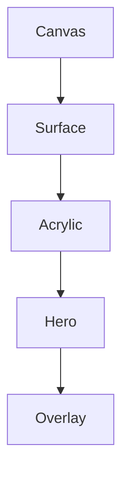

<!--
File: docs/design/system/mds-003-material-system/glossary.md
Document: MDS-003
Title: Glossary
Status: Draft
Version: 0.4
-->

# Glossary

---

# Purpose

This glossary defines the architectural terminology introduced by **MDS-003 — Material System**.

Unlike previous glossaries, this document focuses on the physical behaviour of the Mosaic interface rather than conceptual behaviour or colour.

These definitions should remain stable regardless of rendering technology.

Future specifications should reuse these terms consistently.

---

# A

## Acrylic

The primary interactive material within the Mosaic Material System.

Acrylic is a semi-translucent material that receives:

- Runtime Atmosphere
- Refraction
- Environmental Light

while preserving:

- hierarchy
- readability
- physical presence

Acrylic is intentionally distinct from glass.

It possesses substance.

---

## Atmosphere

The environmental lighting generated from the user's current entertainment.

Atmosphere is received by Materials.

It is not applied directly to components.

---

# C

## Canvas

The foundational environmental material beneath every Mosaic Composition.

Canvas communicates:

- calmness
- stability
- continuity

It receives minimal atmospheric influence.

---

# D

## Diffusion

The soft internal spreading of environmental light through a material.

Diffusion reduces:

- saturation
- contrast
- visual noise

while increasing perceived physical realism.

---

# E

## Edge Lighting

The subtle illumination visible along the edges of Acrylic materials.

Edge Lighting communicates:

- thickness
- craftsmanship
- physical presence

It should remain understated.

---

# H

## Hero Material

The material representing the highest-priority concept within the current Composition.

Hero Material receives the strongest Runtime Atmosphere and Refraction while preserving the dominance of entertainment artwork.

---

# L

## Light Transport

The conceptual movement of environmental light through the Material System.

Light Transport describes behaviour rather than implementation.

It should feel physically believable rather than visually dramatic.

---

# M

## Material

A physical behavioural object within the Mosaic Design System.

Materials communicate:

- hierarchy
- environmental response
- physical presence

They are not equivalent to rendering effects.

---

## Material Hierarchy

The ordered relationship between all Mosaic materials.

Each level communicates increasing physical presence.

---

## Material Resolution

The runtime process that transforms Material Identity into concrete rendering behaviour.

Material Resolution evaluates:

- Runtime Atmosphere
- Accessibility
- Device Capability
- Theme

before producing renderable material properties.

---

# O

## Overlay Material

A temporary material prioritising interaction and readability.

Overlay Material participates in the Material System while reducing atmospheric influence.

It exists only while interaction requires it.

---

# P

## Physical Presence

The perceived solidity of a material.

Physical Presence is communicated through:

- diffusion
- edge lighting
- depth
- refraction

rather than shadows or opacity alone.

---

# R

## Refraction

The controlled transport and bending of environmental light through Mosaic materials.

Refraction communicates:

- depth
- atmosphere
- environmental continuity

It should never become decorative.

---

## Runtime Material Resolver

The platform subsystem responsible for producing resolved Material Profiles.

Applications consume resolved materials rather than constructing them.

---

# S

## Surface

A grouping material sitting between Canvas and Acrylic.

Surfaces organise information while remaining visually restrained.

They receive limited atmospheric influence.

---

# T

## Thickness

The perceived depth of a material.

Thickness is communicated through:

- edge behaviour
- diffusion
- refraction
- lighting

rather than explicit dimensional rendering.

---

# U

## UV Field

The normalised environmental lighting space generated from the current Hero.

Materials sample this shared field to produce coherent atmospheric behaviour.

The UV Field is independent of:

- screen resolution
- layout
- rendering technology

---

## UV-Indexed Refraction

The conceptual lighting model through which Runtime Atmosphere is projected into normalised UV space before being sampled by Materials.

This system provides one coherent environmental lighting model across every client.

---

# Cross References

| Specification | Primary Concepts |
|---------------|------------------|
| [MDL-001 — Mosaic Design Language Vision](../../language/mdl-001-vision/index.md) | Companion, Immersion |
| [MDL-002 — Principles](../../language/mdl-002-principles/index.md) | Calmness, Restraint |
| [MDL-003 — Mental Model](../../language/mdl-003-mental-model/index.md) | World, Focus |
| [MDL-004 — Interaction Model](../../language/mdl-004-interaction-model/index.md) | Continuity |
| [MDL-005 — Composition Model](../../language/mdl-005-composition-model/index.md) | Hero, Hierarchy |
| [MDS-001 — Design Token Architecture](../mds-001-design-token-architecture/index.md) | Runtime Tokens |
| [MDS-002 — Colour System](../mds-002-colour-system/index.md) | Runtime Atmosphere |

---

# Terminology Rules

Future contributors should:

- describe materials as behaviours rather than effects
- describe light before colour
- distinguish Acrylic from glass
- distinguish Atmosphere from Brand
- distinguish Refraction from blur

Material terminology should remain independent from rendering implementation.
