<!--
File: docs/design/system/mds-005-motion-system/06-temporal-continuity.md
Document: MDS-005
Status: Draft
-->

# Temporal Continuity

---

# Purpose

Movement is only meaningful when users perceive it as part of one continuous experience.

This chapter defines how Mosaic preserves that perception across time.

Unlike traditional interfaces, which often present interaction as a sequence of unrelated transitions, Mosaic models interaction as the continuous evolution of one persistent World.

Temporal Continuity ensures that users never feel as though they are repeatedly entering new interfaces.

Instead...

Their World simply continues.

---

# Definition

Within MDS, **Temporal Continuity** is defined as:

> **The preservation of behavioural, material and perceptual continuity throughout every change in the user's World.**

Temporal Continuity is not:

- transition timing,
- animation duration,
- easing.

It is the user's perception that:

> **Nothing was interrupted.**

---

# Philosophy

Imagine turning a page in a book.

The story does not restart.

The paper changes.

The reader continues.

Temporal Continuity should create the same feeling throughout Mosaic.

Every interaction should feel like:

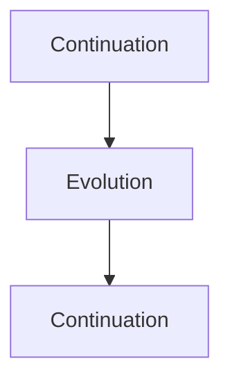

Never:

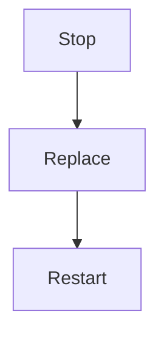

---

# Why Continuity Exists

Entertainment is inherently continuous.

Examples.

- watching a series,
- reading a novel,
- listening to an album.

Traditional interfaces frequently interrupt that continuity with:

- page changes,
- loading states,
- unrelated transitions,
- promotional interruptions.

Mosaic intentionally avoids these behaviours.

---

# Behaviour Before Time

Time should always follow behaviour.

Conceptually.

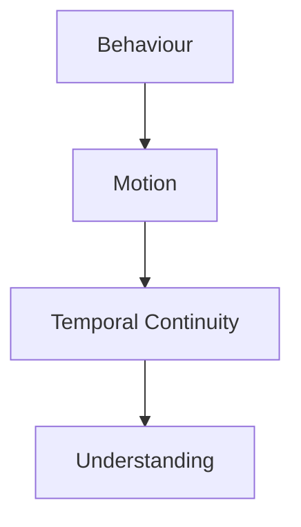

Animation timing should never become the primary design decision.

Behaviour determines the transition.

Time simply communicates it.

---

# Continuity Chain

Every meaningful interaction should preserve:

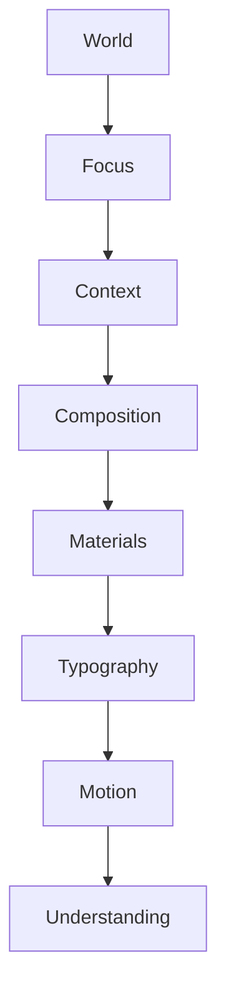

Breaking any link weakens the user's perception of continuity.

---

# Progressive Evolution

Changes should unfold progressively.

Preferred.

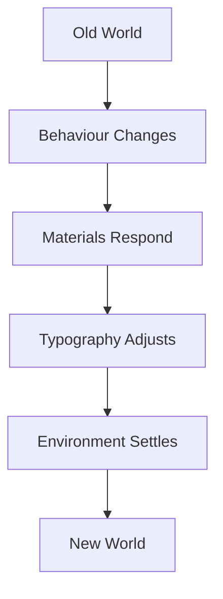

Avoid.

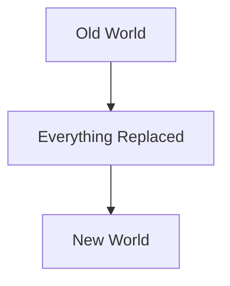

Users should perceive evolution.

Not reconstruction.

---

# Object Permanence

Objects should remain recognisable while changing.

Examples.

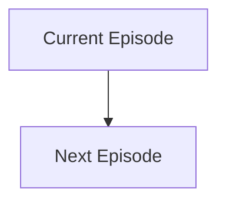

The object evolves.

It should not disappear and be replaced by another unrelated interface.

Maintaining object permanence significantly reduces cognitive effort.

---

# Spatial Continuity

Users should maintain an intuitive sense of place.

Motion should preserve:

- direction,
- origin,
- destination,
- relationships.

Objects should never appear to teleport without behavioural justification.

Spatial understanding reinforces temporal understanding.

---

# Environmental Continuity

The environment should remain remarkably stable.

Examples.

Canvas.

↓

Stable.

Atmosphere.

↓

Gradual evolution.

Hero.

↓

Behavioural response.

Users should feel that:

The world remained.

Only their current experience changed.

---

# Reading Continuity

Typography should remain readable throughout transitions.

Readers should never lose:

- paragraph rhythm,
- hierarchy,
- orientation,

because movement occurred.

Editorial continuity remains just as important as spatial continuity.

---

# Material Continuity

Materials should preserve their identity.

Hero Material.

↓

Hero Material.

Overlay.

↓

Overlay.

Canvas.

↓

Canvas.

Materials may evolve.

They should never unexpectedly become different materials.

The physical world should remain internally consistent.

---

# Context Preservation

Many behavioural changes alter Context without changing Focus.

Examples.

Playback.

↓

Pause.

↓

Subtitles.

↓

Playback.

Temporal Continuity should preserve the user's understanding that:

The same experience continues.

---

# Multi-Step Behaviour

Complex interactions should feel like one transition.

Example.

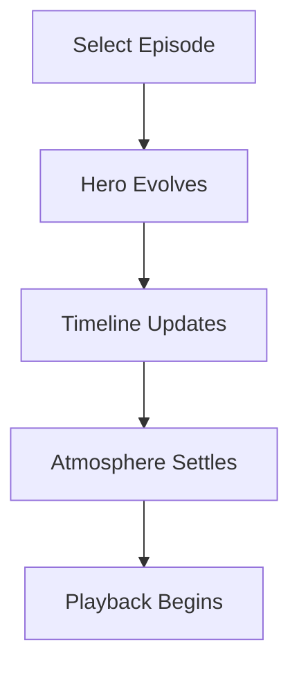

Users should perceive:

One evolving experience.

Not four independent animations.

---

# Time And Refraction

Environmental light should continue evolving after physical movement has largely completed.

Conceptually.

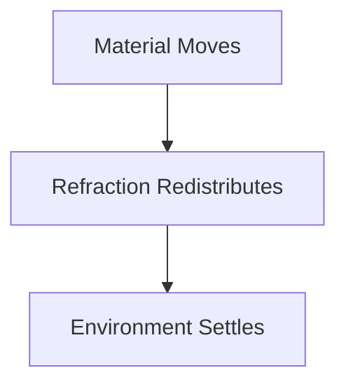

This slight temporal offset strengthens perceived physicality.

---

# Time And Atmosphere

Runtime Atmosphere should blend.

Never switch.

Preferred.

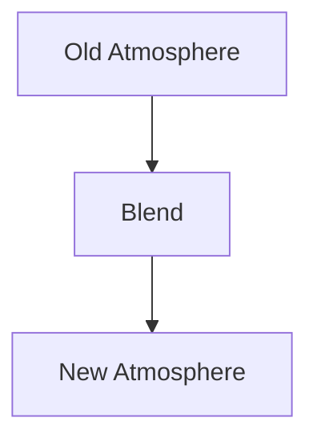

Avoid.

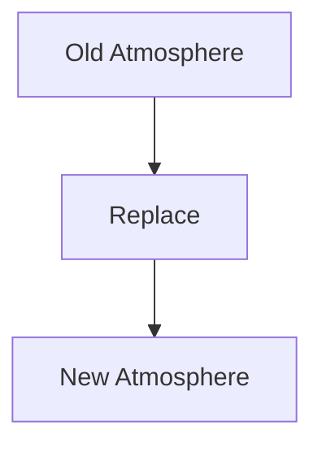

Atmosphere should feel environmental.

Not procedural.

---

# Interruptions

Temporary interruptions should preserve continuity.

Examples.

Phone notification.

↓

Return.

Search.

↓

Return.

Settings.

↓

Return.

Users should always feel they returned to the same World.

---

# Accessibility

Reduced Motion should preserve Temporal Continuity.

Movement may reduce.

Continuity must remain.

Examples include:

- opacity transitions,
- hierarchy updates,
- material changes,
- typography stability.

Understanding should survive even when movement does not.

---

# Runtime Behaviour

The Runtime Motion Resolver should evaluate continuity globally.

Rather than asking:

> Which animation plays?

It should ask:

> **What must remain understandable throughout this behavioural change?**

This shift in perspective defines the Motion System.

---

# Modules

Modules should never introduce independent temporal models.

Modules contribute:

- behaviour,
- information,
- artwork.

The Motion System determines:

- sequencing,
- continuity,
- environmental evolution.

Every module therefore feels like part of one continuous platform.

---

# Good Examples

## Hero Change

Old Hero.

↓

New Hero emerges naturally.

↓

Atmosphere follows.

↓

Reader immediately understands the relationship.

---

## Playback

Overlay appears.

↓

Interaction.

↓

Overlay disappears.

↓

Playback continues.

The experience never feels interrupted.

---

## Reading

Current Chapter.

↓

Next Chapter.

↓

Progress updates.

↓

Environment remains calm.

Reading continues effortlessly.

---

# Anti-patterns

## Flash Transition

Entire interface abruptly replaced.

---

## Sequential Animations

Users wait for unrelated movements to complete before continuing.

---

## Reset Behaviour

Small interactions restart the experience.

---

## Independent Systems

Materials, typography and composition evolve independently.

The world fragments.

---

# Temporal Continuity Model

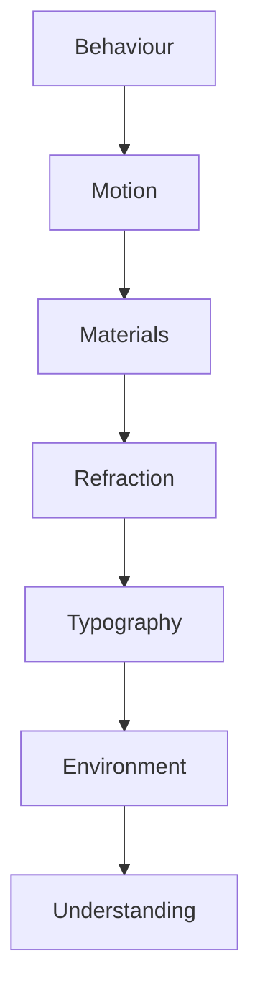

Every system contributes toward one continuous behavioural experience.

---

# Relationship To Future Chapters

The next chapter defines **Motion Curves**.

Temporal Continuity explains:

> **What should feel continuous.**

Motion Curves explain:

> **How physical movement should behave while preserving that continuity.**

Together they establish the temporal language of the Mosaic Motion System.

---

# Summary

Temporal Continuity is one of the defining architectural principles of Mosaic.

Users should never feel that they are travelling between disconnected interfaces.

Instead...

Their World should quietly continue evolving around them.

That uninterrupted perception of continuity is ultimately more important than any individual animation.
