<!--
File: docs/design/system/mds-005-motion-system/13-contributor-guidance.md
Document: MDS-005
Chapter: 13
Title: Contributor Guidance
Status: Draft
Version: 0.4
-->

# Contributor Guidance

---

# Purpose

The Motion System is one of the easiest parts of a Design System to misuse.

Adding movement is simple.

Designing meaningful movement is significantly harder.

This guidance exists to ensure every contributor strengthens the behavioural language of Mosaic rather than adding isolated animations.

The objective is not smoother interfaces.

The objective is clearer understanding.

---

# Think In Behaviour

Never begin with:

> "What animation should play?"

Instead ask:

> **"What behavioural change occurred?"**

Good.

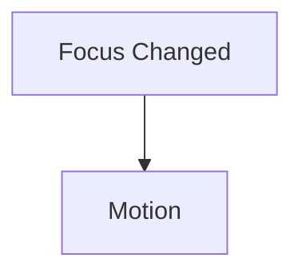

Poor.

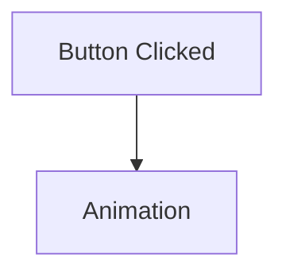

Motion should always originate from behaviour.

---

# Preserve Continuity

Before introducing movement ask:

> Does this preserve the user's World...

or restart it?

Preferred.

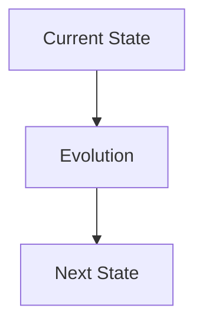

Avoid.

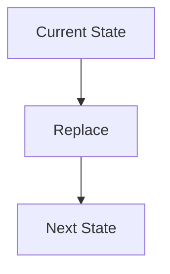

Users should feel continuity.

Not replacement.

---

# Respect Motion Hierarchy

Movement should follow the established hierarchy.

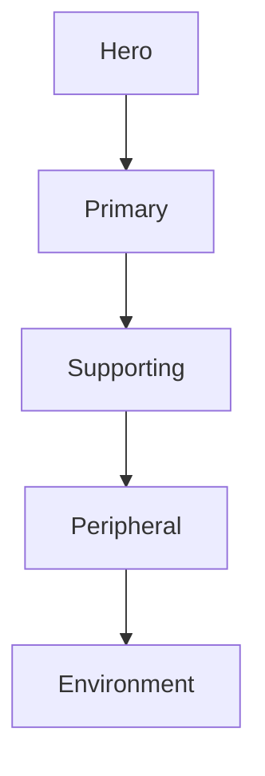

If every object moves equally...

Nothing communicates importance.

---

# Let Materials Move

Components should never animate independently from Materials.

Preferred.

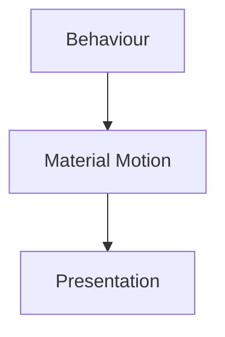

Avoid.

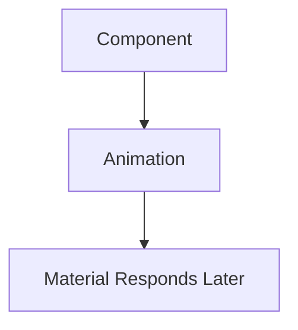

The Material System owns physical behaviour.

---

# Let Light Follow

Remember the distinction.

Objects move.

Light follows.

Hero changes.

↓

Hero moves.

↓

Atmosphere redistributes.

↓

Environment settles.

Do not animate environmental lighting independently from behavioural change.

---

# Protect Typography

Typography should remain readable throughout movement.

Avoid:

- animated text effects,
- excessive scaling,
- decorative rotation,
- unnecessary opacity flicker.

Readers should never lose editorial continuity because something moved.

---

# Accessibility First

Whenever movement conflicts with comfort:

Comfort wins.

Examples.

Poor.

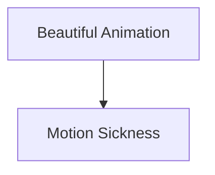

Preferred.

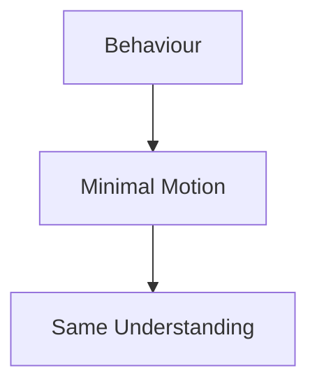

Movement is optional.

Understanding is not.

---

# Components Describe Behaviour

Components should communicate:

```text
Hero Changed
```

Not:

```text
Play Hero Animation
```

The Runtime Motion Resolver determines:

- timing,
- sequencing,
- curves,
- material response,
- accessibility.

Applications remain behaviourally simple.

---

# Avoid Decorative Motion

Before implementing movement ask:

> Would removing this reduce understanding?

If the answer is:

No.

The movement probably does not belong.

Mosaic values meaningful movement over impressive movement.

---

# Respect The Environment

Canvas should rarely move.

Atmosphere should evolve slowly.

Materials should respond naturally.

The environment should always feel calmer than the objects moving within it.

---

# Runtime Owns Motion

Applications should never manually determine:

- easing,
- duration,
- sequencing,
- environmental response.

Applications communicate behaviour.

Runtime resolves motion.

This separation keeps the behavioural language consistent across the platform.

---

# Modules

Modules should contribute:

- behaviour,
- information,
- artwork.

They should never contribute:

- transitions,
- easing,
- animation systems,
- Material Motion.

Every module should inherit the Motion System automatically.

---

# Platform Independence

Before implementing movement ask:

> Would this still communicate the same behaviour on:

- Web?
- Flutter?
- Television?
- Mobile?
- Future platforms?

Implementation may differ.

Behaviour should remain identical.

---

# Performance

Performance optimisation should preserve behavioural meaning.

Preferred.

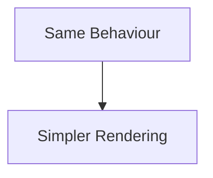

Avoid.

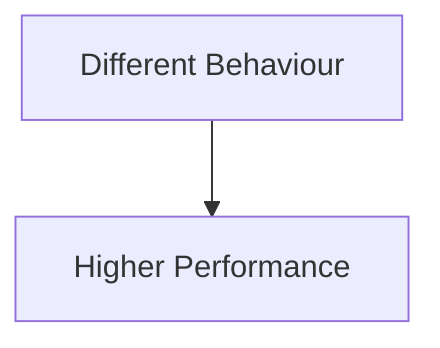

Optimise implementation.

Never behavioural communication.

---

# Common Mistakes

Avoid the following.

### Animation Thinking

Choosing animations before understanding behaviour.

---

### Simultaneous Motion

Everything moving together.

---

### Decorative Movement

Motion existing purely because it looks impressive.

---

### Component Animation

Components independently defining transitions.

---

### Platform Motion

Each client inventing different behavioural movement.

---

### Atmosphere Animation

Environmental lighting changing without behavioural justification.

---

# Motion Review Questions

Before implementing any movement ask:

- What behaviour changed?
- Does this preserve continuity?
- Does hierarchy remain clear?
- Do Materials respond naturally?
- Does Typography remain readable?
- Would this still feel like Mosaic?

If uncertainty remains...

Return to the behavioural model before writing animation code.

---

# Motion Checklist

Every motion implementation should satisfy the following.

- [ ] Behaviour clearly initiated movement.
- [ ] Motion Hierarchy is respected.
- [ ] Material Motion remains coherent.
- [ ] Refraction follows Materials.
- [ ] Typography remains readable.
- [ ] Accessibility is preserved.
- [ ] Platform independence is maintained.
- [ ] Entertainment remains the centre of attention.

---

# Final Guidance

The Motion System should eventually disappear from conscious thought.

Contributors should stop asking:

> "How should this animate?"

and instinctively begin asking:

> **"How should the user's World evolve?"**

When every contributor naturally thinks in behavioural evolution rather than animation, the Motion System has achieved its purpose.

Users will simply feel that Mosaic responds exactly as they expected.

That effortless continuity is the defining characteristic of the Mosaic Motion System.
