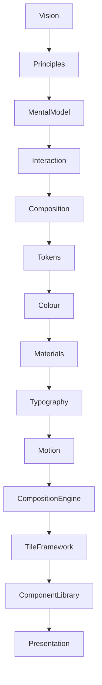
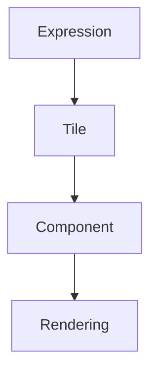

<!--
File: docs/design/system/mds-007-tile-framework/00-document-control.md
Document: MDS-007
Title: Tile Framework
Status: Draft
Version: 0.4
-->

# Document Control

---

# Document Information

| Property | Value |
|----------|-------|
| Document ID | MDS-007 |
| Title | Mosaic Design System — Tile Framework |
| Classification | Internal |
| Status | Draft |
| Version | 0.4 |
| Owner | AdamNi-7080 |
| Parent Specifications | [MDL-001](../../language/mdl-001-vision/index.md) → [MDL-005](../../language/mdl-005-composition-model/index.md), [MDS-001](../mds-001-design-token-architecture/index.md) → [MDS-006](../mds-006-composition-engine/index.md) |
| Repository | `/design/mds/MDS-007 Tile Framework/` |

---

# Purpose

MDS-007 defines the Tile Framework used throughout Mosaic.

The Tile Framework is the architectural bridge between runtime understanding and visual implementation.

Where the Composition Engine determines:

> **What the user should understand.**

The Tile Framework determines:

> **How that understanding becomes reusable presentation.**

Tiles are not components.

They are presentation primitives that carry behavioural meaning independently from rendering technology.

Every visual interface within Mosaic should ultimately be composed from Tiles.

---

# Authority

MDS-007 governs:

- Tile philosophy
- Tile taxonomy
- Expression-to-Tile mapping
- Tile lifecycle
- Adaptive Tile behaviour
- Tile interaction
- Runtime Tile resolution
- Tile orchestration
- Module Tile integration

This specification intentionally does **not** govern:

- platform widgets
- rendering frameworks
- UI toolkits
- animation APIs
- layout engines

Those systems implement Tiles.

They do not define them.

---

# Relationship To MDS

The Tile Framework extends the Composition Engine.

The Tile Framework consumes:

- Expressions
- Runtime Hierarchy
- Material Intent
- Typography Intent
- Motion Intent

It produces:

- reusable presentation primitives.

---

# Design Intent

Traditional interface frameworks frequently begin with reusable components.

Examples include:

- cards
- buttons
- lists
- grids

Mosaic intentionally introduces an additional abstraction.

This separation ensures that behavioural meaning remains independent from implementation.

---

# Reader Expectations

Before reading this specification contributors should already understand:

- [MDL-001 — Mosaic Design Language Vision](../../language/mdl-001-vision/index.md)
- [MDL-002 — Principles](../../language/mdl-002-principles/index.md)
- [MDL-003 — Mental Model](../../language/mdl-003-mental-model/index.md)
- [MDL-004 — Interaction Model](../../language/mdl-004-interaction-model/index.md)
- [MDL-005 — Composition Model](../../language/mdl-005-composition-model/index.md)
- [MDS-001 — Design Token Architecture](../mds-001-design-token-architecture/index.md)
- [MDS-002 — Colour System](../mds-002-colour-system/index.md)
- [MDS-003 — Material System](../mds-003-material-system/index.md)
- [MDS-004 — Typography System](../mds-004-typography-system/index.md)
- [MDS-005 — Motion System](../mds-005-motion-system/index.md)
- [MDS-006 — Composition Engine](../mds-006-composition-engine/index.md)

The Tile Framework assumes runtime understanding has already been solved.

Its responsibility is reusable presentation.

---

# Architectural Scope

The Tile Framework defines:

- tile identities
- tile behaviour
- tile adaptation
- tile interaction
- tile orchestration
- runtime tile resolution

It intentionally avoids implementation technologies such as:

- Flutter widgets
- React components
- SwiftUI views
- Compose composables

Those become consumers of Tiles rather than architectural concepts.

---

# Stability

Expected lifetime.

| Artefact | Expected Lifetime |
|----------|-------------------|
| Components | Months |
| Rendering Frameworks | Months |
| Platform Widgets | Months |
| Tile Taxonomy | Years |
| Tile Philosophy | Decades |

Rendering technologies are expected to evolve rapidly.

Tile identities should remain remarkably stable.

---

# Success Criteria

MDS-007 succeeds when:

- Expressions consistently resolve into appropriate Tiles
- Tiles remain reusable across every Mosaic client
- components become simple rendering implementations
- modules naturally inherit platform presentation
- adaptive behaviour remains predictable
- contributors think in Tiles rather than widgets

Users should never perceive Tiles directly.

They should simply experience a coherent interface whose behaviour naturally reflects the Runtime World.
