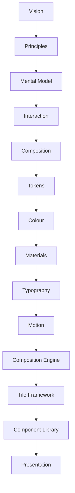
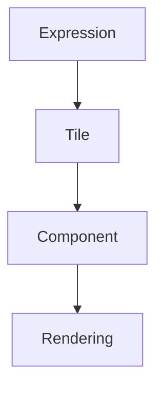

<!--
File: docs/design/system/mds-007-tile-framework/index.md
Document: MDS-007
Status: Draft
Version: 0.4
-->

# MDS-007 — Tile Framework

> *A Tile is not a component. It is the physical expression of an Expression.*

---

# Purpose

Every previous specification has progressively transformed the user's World into runtime understanding.

The MDL established:

- Vision
- Principles
- Mental Model
- Interaction
- Composition

The MDS established:

- Design Tokens
- Colour
- Materials
- Typography
- Motion
- Composition Engine

MDS-007 defines the final abstraction before components.

It explains how solved runtime Expressions become reusable presentation primitives called **Tiles**.

Unlike traditional UI frameworks, which begin with reusable widgets, Mosaic begins with behavioural Expressions.

Tiles are the bridge between runtime understanding and visible interface.

---

# Relationship to Previous Specifications



The Tile Framework consumes:

- Expressions
- Runtime Hierarchy
- Material Intent
- Typography Intent
- Motion Intent

It produces reusable presentation primitives.

---

# Scope

This specification defines:

- Tile Philosophy
- Tile Taxonomy
- Expression-to-Tile Mapping
- Tile Lifecycle
- Adaptive Tile Behaviour
- Tile Composition
- Tile Interaction
- Runtime Tile Resolution
- Module Tile Integration
- Tile Orchestration

This specification intentionally does **not** define:

- concrete UI components
- platform widgets
- rendering engines
- layout systems

Those belong to [MDS-008](../mds-008-component-library/index.md) and platform implementations.

---

# Guiding Question

MDS-007 exists to answer one question.

> **How should solved runtime Expressions become reusable interface primitives?**

Not:

> Which widgets should we render?

---

# Tile Statement

Within Mosaic:

> **Tiles communicate understanding. Components merely render Tiles.**

This distinction allows behaviour to remain independent from implementation.

---

# Tile Responsibilities

The Tile Framework separates runtime presentation into several conceptual layers.



Each layer contributes one responsibility.

No layer duplicates another.

---

# Expected Outcome

After reading MDS-007 contributors should understand:

- what a Tile is
- why Tiles exist
- how Expressions become Tiles
- how Tiles adapt across devices
- how Tiles participate in runtime behaviour
- how modules naturally inherit presentation

without discussing specific UI frameworks.

---

# Repository Structure

```text
design/

└── mds/

    └── MDS-007 Tile Framework/

        README.md

        00-document-control.md

        01-tile-philosophy.md

        02-tile-taxonomy.md

        03-expression-mapping.md

        04-tile-lifecycle.md

        05-adaptive-tiles.md

        06-tile-composition.md

        07-tile-interaction.md

        08-runtime-tile-resolution.md

        09-module-tiles.md

        10-tile-orchestration.md

        11-governance.md

        12-adrs.md

        13-contributor-guidance.md

        references.md

        glossary.md
```

---

# Dependencies

Required reading:

- [MDL-001](../../language/mdl-001-vision/index.md) → [MDL-005](../../language/mdl-005-composition-model/index.md)
- [MDS-001](../mds-001-design-token-architecture/index.md) → [MDS-006](../mds-006-composition-engine/index.md)

Downstream specifications:

- [MDS-008 — Component Library](../mds-008-component-library/index.md)
