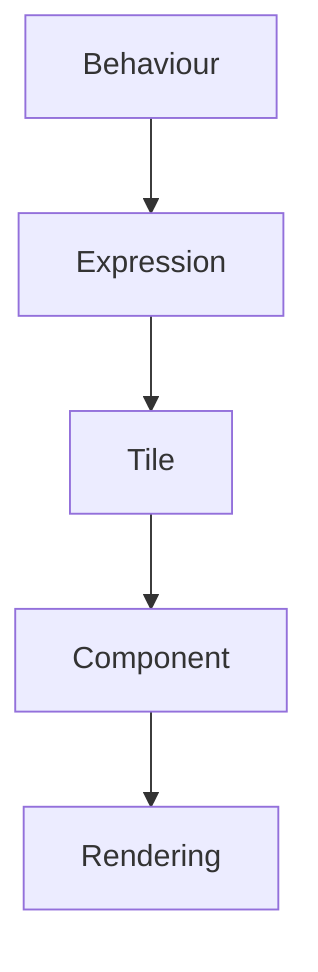
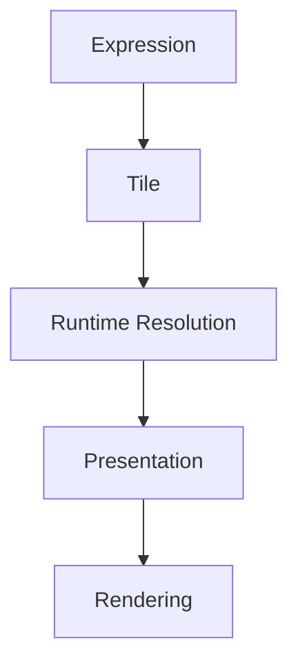
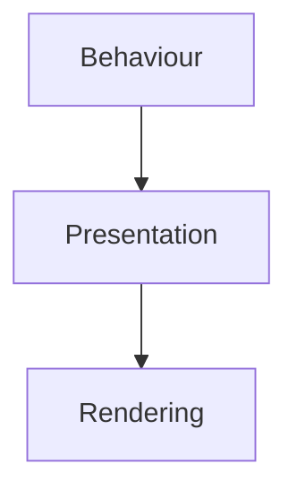
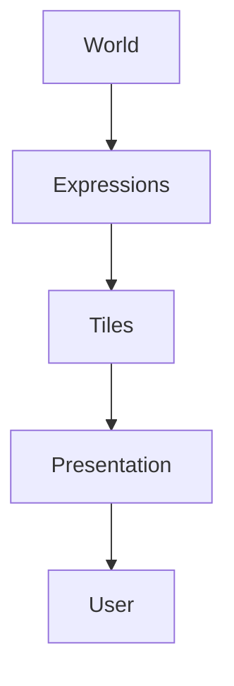

<!--
File: docs/design/system/mds-007-tile-framework/references.md
Document: MDS-007
Title: References
Status: Draft
Version: 0.4
-->

# References

---

# Purpose

This document records the architectural influences and conceptual foundations that informed **MDS-007 — Tile Framework**.

Unlike implementation documentation, these references explain *why* the Tile Framework exists rather than prescribing UI frameworks or component libraries.

The Tile Framework intentionally combines ideas from:

- behavioural presentation,
- information architecture,
- runtime composition,
- adaptive interfaces,
- design systems,
- reusable presentation primitives,

into one architectural layer that separates understanding from implementation.

---

# Reading Order

Contributors should approach references in the following order.

1. MDL Specifications
2. Design Token Architecture
3. Colour System
4. Material System
5. Typography System
6. Motion System
7. Composition Engine
8. Tile Framework
9. Component Library

The Mosaic Design Language remains the architectural authority.

Rendering technologies merely implement its decisions.

---

# Internal References

## [MDL-001 — Mosaic Design Language Vision](../../language/mdl-001-vision/index.md)

Provides:

- Companion philosophy
- Entertainment-first thinking
- Calm interaction

Tiles should communicate the Companion's understanding rather than expose implementation details.

---

## [MDL-002 — Principles](../../language/mdl-002-principles/index.md)

Provides:

- Behaviour Before Interface
- Content Leads
- Calm Interfaces
- Every Feature Earns Its Place

Tiles exist because behaviour already exists.

Presentation should never lead behaviour.

---

## [MDL-003 — Mental Model](../../language/mdl-003-mental-model/index.md)

Provides:

- World
- Focus
- Context
- Relationships

Tiles communicate the current World.

They never define it.

---

## [MDL-004 — Interaction Model](../../language/mdl-004-interaction-model/index.md)

Provides:

- Behaviour
- Continuity
- Runtime evolution

Tile interaction is a behavioural consequence rather than a component capability.

---

## [MDL-005 — Composition Model](../../language/mdl-005-composition-model/index.md)

Provides:

- Hero
- Expressions
- Hierarchy
- Priority

The Tile Framework is the presentation implementation of the Composition Model.

---

## [MDS-001 — Design Token Architecture](../mds-001-design-token-architecture/index.md)

Provides:

- Runtime Resolution
- Semantic Tokens

Runtime Tile Resolution extends the deterministic resolution architecture introduced by [MDS-001](../mds-001-design-token-architecture/index.md).

---

## [MDS-002 — Colour System](../mds-002-colour-system/index.md)

Provides:

- Material intent
- Runtime Atmosphere
- Semantic Colour

Tiles inherit Colour behaviour through runtime resolution.

They never define colours independently.

---

## [MDS-003 — Material System](../mds-003-material-system/index.md)

Provides:

- Hero Material
- Acrylic
- Overlay Material
- Runtime Material Resolution

Tiles inherit Material behaviour.

They do not create Material behaviour.

---

## [MDS-004 — Typography System](../mds-004-typography-system/index.md)

Provides:

- Editorial Hierarchy
- Runtime Typography
- Reading Rhythm

Tiles communicate editorial intent.

Typography renders it.

---

## [MDS-005 — Motion System](../mds-005-motion-system/index.md)

Provides:

- Behavioural Motion
- Material Motion
- Runtime Motion Resolution

Tiles inherit Motion behaviour.

They never define animation independently.

---

## [MDS-006 — Composition Engine](../mds-006-composition-engine/index.md)

Provides:

- Runtime World
- Composition Solver
- Expressions
- Runtime Hierarchy
- Presentation Model

The Tile Framework exists entirely because the Composition Engine produces Expressions rather than components.

---

# Future Specifications

The following specification directly depends upon MDS-007.

- [MDS-008 — Component Library](../mds-008-component-library/index.md)

The Component Library renders Tiles.

It never replaces the Tile Framework.

---

# Behavioural Presentation

The Tile Framework intentionally treats presentation as behavioural communication rather than widget composition.

Conceptually.

Behaviour remains the architectural authority.

Presentation communicates it.

---

# Information Architecture

Tiles are strongly influenced by information architecture.

The framework intentionally represents:

- concepts,
- relationships,
- actions,
- hierarchy,

rather than visual controls.

Understanding therefore survives implementation changes.

---

# Adaptive Interfaces

The Tile Framework assumes presentation changes continuously.

Examples include:

- screen size
- orientation
- viewing distance
- accessibility
- future devices

Adaptive behaviour therefore belongs to Tiles rather than components.

---

# Runtime Resolution

The Tile Framework intentionally continues the runtime resolution model established throughout MDS.

Conceptually.

Every layer performs one architectural responsibility.

---

# Platform Independence

The Tile Framework intentionally separates:

Every client therefore shares identical behavioural presentation while remaining free to implement:

- Flutter
- React
- SwiftUI
- Compose
- future rendering technologies

without changing architectural behaviour.

---

# Mosaic-Specific Influences

The Tile Framework emerged directly from founder exploration.

Major architectural discoveries included:

- Components are implementation, not architecture.
- Expressions should never render directly.
- Tiles provide the missing behavioural presentation layer.
- Adaptive behaviour should preserve Tile identity.
- Modules should inherit presentation rather than define it.

Together these discoveries define the presentation architecture unique to Mosaic.

---

# Relationship To The Companion

Tiles represent the visible body language of the Companion.

Conceptually.

The Companion understands first.

Tiles communicate that understanding.

Components merely make it visible.

---

# Normative References

Required reading before contributing to MDS-007.

- [MDL-001 — Mosaic Design Language Vision](../../language/mdl-001-vision/index.md)
- [MDL-002 — Principles](../../language/mdl-002-principles/index.md)
- [MDL-003 — Mental Model](../../language/mdl-003-mental-model/index.md)
- [MDL-004 — Interaction Model](../../language/mdl-004-interaction-model/index.md)
- [MDL-005 — Composition Model](../../language/mdl-005-composition-model/index.md)
- [MDS-001 — Design Token Architecture](../mds-001-design-token-architecture/index.md)
- [MDS-002 — Colour System](../mds-002-colour-system/index.md)
- [MDS-003 — Material System](../mds-003-material-system/index.md)
- [MDS-004 — Typography System](../mds-004-typography-system/index.md)
- [MDS-005 — Motion System](../mds-005-motion-system/index.md)
- [MDS-006 — Composition Engine](../mds-006-composition-engine/index.md)

Together these specifications define the conceptual foundation of the Tile Framework.

---

# Informative References

Future contributors may also wish to review:

- [MDS-008 — Component Library](../mds-008-component-library/index.md)

The Component Library explains how Tiles become concrete UI implementations while preserving every behavioural contract established by the Tile Framework.

---

# Living Document

This reference list should remain intentionally concise.

References should only be introduced when they materially influence:

- behavioural presentation,
- runtime resolution,
- adaptive Tiles,
- implementation boundaries.

The objective is to preserve architectural reasoning rather than catalogue UI frameworks.

---

# Completion

This concludes **MDS-007 — Tile Framework**.

The next specification in the Mosaic Design System is:

> **[MDS-008 — Component Library](../mds-008-component-library/index.md)**

Where MDS-007 defines **how behavioural presentation is represented**, [MDS-008](../mds-008-component-library/index.md) defines **how that presentation is physically implemented**.

It formalises:

- Component philosophy
- Component taxonomy
- Component contracts
- Component lifecycle
- Rendering architecture
- Platform implementations
- Accessibility contracts
- Component composition
- Runtime rendering

[MDS-008](../mds-008-component-library/index.md) intentionally becomes the thinnest layer in the entire architecture.

By the time Components are created, every important decision has already been made.

Components simply render the user's World.
