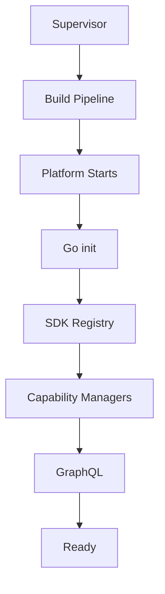

<!--
File: docs/engineering/architecture/mac-001-platform-architecture/02-runtime-boundary.md
Document: MAC-001
Status: Draft
-->

# 02 — Runtime Boundary

---

# Purpose

The Runtime is the execution environment of the Platform.

It coordinates work, lifecycle and resources without becoming responsible for business decisions.

---

# Runtime Responsibilities

The Runtime owns:

- startup
- shutdown
- Runtime Service lifecycle
- Capability Manager lifecycle
- worker coordination
- scheduling admission
- dependency graph management
- execution orchestration
- Runtime State
- Service Registry
- diagnostic visibility

These responsibilities describe how the Platform operates.

---

# Runtime Non-Responsibilities

The Runtime does not own:

- media semantics
- user decisions
- recommendation logic
- metadata interpretation
- presentation decisions
- CSS
- Flutter widgets
- HTML
- visual effects
- colours
- business state

Those responsibilities belong to capabilities.

The Runtime may produce Runtime SDUI as a semantic interface contract.

It does not own how that contract becomes pixels.

---

# Runtime State

Runtime State describes the execution environment.

Examples include:

- registered capabilities
- service lifecycle
- queue depth
- worker allocation
- dependency status
- health state

Runtime State must not become business state.

---

# Platform Lifecycle

The Platform starts after the Supervisor has activated a Generation.

Conceptually.

The Platform is unaware of compilation.

The Supervisor orchestrates Build Pipeline invocation and activation.

The Build Pipeline owns build mechanics.

---

# Boundary Rule

> **The Runtime knows how Mosaic is operating. Capabilities know what Mosaic is doing.**

This separation keeps the Platform observable and replaceable without diluting business ownership.
