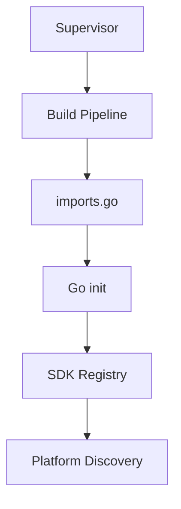
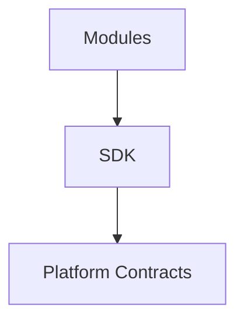

<!--
File: docs/engineering/architecture/mac-001-platform-architecture/04-module-model.md
Document: MAC-001
Status: Draft
Version: 0.4
-->

# 04 — Module Model

---

# Purpose

Modules are the delivery mechanism through which Mosaic can add or replace capabilities without modifying the Runtime.

Modules are not a separate execution model.

They participate in the same Platform architecture as every other capability.

---

# Definition

A module is a package of capability contribution or infrastructure adaptation.

It may provide:

- one capability
- multiple related capabilities
- adapters
- providers
- configuration
- contracts
- operational metadata

The Platform admits modules through manifest-driven discovery and validation before activation.

The initial runtime model statically links selected Go Modules into the Platform binary through a Supervisor-orchestrated Build Pipeline.

The Platform does not scan arbitrary directories at runtime.

## Built-in infrastructure Modules

Infrastructure adapters use the same port-and-adapter boundary as product Modules. A built-in Module is compiled into the Platform binary and may be mandatory for a valid generation; it is not therefore an optional user-selected provider.

The PostgreSQL storage adapter is the first example. Platform services depend on storage interfaces, while the PostgreSQL Module implements those interfaces and owns database-specific behaviour. Replacing it requires another adapter that satisfies the same contract, migration and consistency guarantees.

---

# Module Responsibilities

Modules own the implementation they contribute.

They must declare:

- identity
- version
- dependencies
- permissions
- provided contracts
- consumed contracts
- lifecycle expectations

These declarations belong to [MIP-002](../../protocols/mip-002-module-manifest-protocol/index.md).

---

# Platform Responsibilities

The Platform owns module admission.

It decides whether a module can participate by validating:

- manifest structure
- dependency availability
- permission requests
- compatibility
- lifecycle requirements

A module is not trusted merely because it exists on disk.

---

# Discovery Model

Module discovery follows the activated Platform package.

Conceptually.



At runtime, the Platform asks the SDK Registry for registered Modules.

Conceptually.

```go
sdk.Modules()
```

The Platform is unaware of compilation mechanics.

Build mechanics belong to the Build Pipeline.

---

# Dependency Direction

Dependencies always point toward Platform contracts.

Conceptually.



Modules must not reference each other directly.

Module cooperation occurs through:

- capabilities,
- Capability Managers,
- Event Bus messages,
- published Platform contracts.

The SDK is the supported authoring surface for all Modules, including built-in infrastructure adapters. An adapter author implements SDK interfaces and declares its manifest, capabilities and permissions; it must not import private Platform packages or depend on another Module's implementation details.

---

# Module Rule

> **Modules extend Mosaic by declaring capability, not by modifying the Platform.**

This rule protects Platform stability while allowing the ecosystem to grow.
