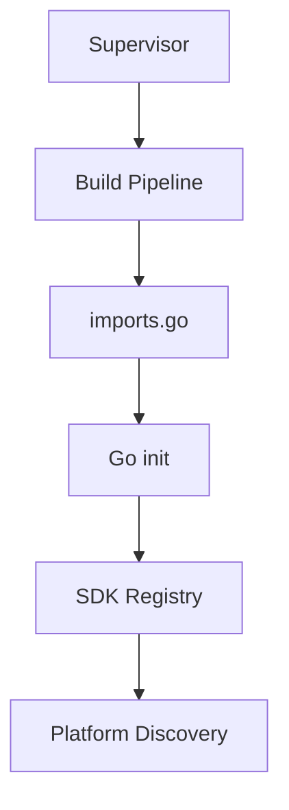
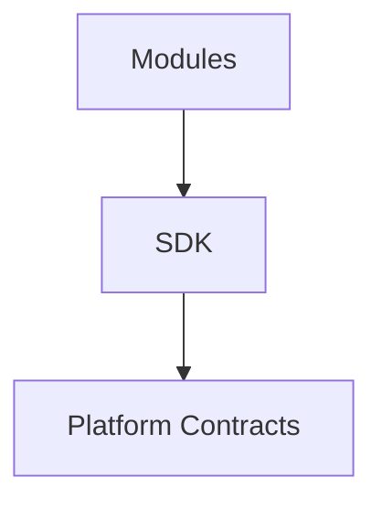

<!--
File: docs/engineering/architecture/mac-001-platform-architecture/04-module-model.md
Document: MAC-001
Status: Draft
-->

# 04 — Module Model

---

# Purpose

Modules are the delivery mechanism through which Mosaic can add or replace capabilities without modifying the Runtime.

Modules are not a separate execution model.

They participate in the same Platform architecture as every other capability.

---

# Definition

A module is a package of capability contribution or infrastructure adaptation.

It may provide:

- one capability
- multiple related capabilities
- adapters
- providers
- configuration
- contracts
- operational metadata

The Platform admits modules through manifest-driven discovery and validation before activation.

The initial runtime model statically links selected Go Modules into the Platform binary through a Supervisor-orchestrated Build Pipeline.

The Platform does not scan arbitrary directories at runtime.

## Built-in infrastructure Modules

Infrastructure adapters use the same port-and-adapter boundary as product Modules. A built-in Module is compiled into the Platform binary and may be mandatory for a valid generation; it is not therefore an optional user-selected provider.

The PostgreSQL storage adapter is the first example. Platform services depend on storage interfaces, while the PostgreSQL Module implements those interfaces and owns database-specific behaviour. Replacing it requires another adapter that satisfies the same contract, migration and consistency guarantees.

---

# Module Delivery Models

Community Modules and essential Modules are architecturally identical. Both are Go libraries that use the SDK and Platform contracts, both are compiled into the Platform binary by the Supervisor, and both are admitted the same way. They differ only in delivery and selectability.

| | Essential Module | Community Module |
|---|------------------|------------------|
| Repository | Ships in the Platform repository | Its own independent repository |
| Acquisition | Pulled with the Platform when a new Platform version is pulled | Selected by the user; fetched by the Supervisor |
| Selectability | Required; cannot be deselected | Optional; included in a generation only if selected |
| Composition | Compiled into the binary by the Supervisor | Compiled into the binary by the Supervisor |
| Architecture | Identical | Identical |

The PostgreSQL storage adapter is the first essential Module. A product capability such as anime support is a representative community Module. Nothing in registration, contract resolution or execution distinguishes them. "Essential" governs distribution and admission, not architecture — it does not create a private path, per [MIP-005](../../protocols/mip-005-module-adapter-contract-protocol/index.md).

[MAD-002 — Module Storage and Delivery Model](../mad-002-module-storage-and-delivery-model/index.md) records this decision.

---

# Modules And Storage

Modules do not own storage or schema. The Platform owns the storage authority — schema, migrations, transactions, access policy and backup — and exposes persistence only through Platform-owned storage contracts. Modules persist what they need through those contracts.

The Platform's schema is deliberately content-agnostic, so Modules map their data onto existing structure rather than defining their own tables. Adding a new content capability is new data, not new schema. A genuinely new data-owning domain is Platform and SDK evolution, decided deliberately through the [Capability Model](03-capability-model.md), not something a Module introduces on its own.

[MEG-007 — Storage Architecture](../../guides/meg-007-storage-architecture/index.md) defines the storage model this rule depends on.

---

# Module Responsibilities

Modules own the implementation they contribute.

They must declare:

- identity
- version
- dependencies
- permissions
- provided contracts
- consumed contracts
- lifecycle expectations

These declarations belong to [MIP-002](../../protocols/mip-002-module-manifest-protocol/index.md).

---

# Platform Responsibilities

The Platform owns module admission.

It decides whether a module can participate by validating:

- manifest structure
- dependency availability
- permission requests
- compatibility
- lifecycle requirements

A module is not trusted merely because it exists on disk.

---

# Discovery Model

Module discovery follows the activated Platform package.

Conceptually.



At runtime, the Platform asks the SDK Registry for registered Modules.

Conceptually.

```go
sdk.Modules()
```

The Platform is unaware of compilation mechanics.

Build mechanics belong to the Build Pipeline.

---

# Dependency Direction

Dependencies always point toward Platform contracts.

Conceptually.



Modules must not reference each other directly.

Module cooperation occurs through:

- capabilities,
- Capability Managers,
- Event Bus messages,
- published Platform contracts.

The SDK is the supported authoring surface for all Modules, including built-in infrastructure adapters. An adapter author implements SDK interfaces and declares its manifest, capabilities and permissions; it must not import private Platform packages or depend on another Module's implementation details.

---

# Module Rule

> **Modules extend Mosaic by declaring capability, not by modifying the Platform.**

This rule protects Platform stability while allowing the ecosystem to grow.
