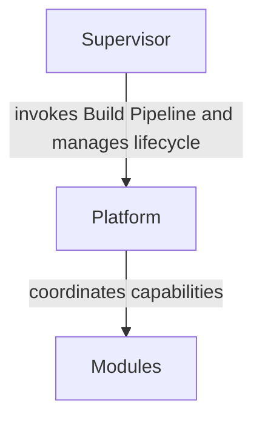

<!--
File: docs/engineering/architecture/mac-001-platform-architecture/index.md
Document: MAC-001
Status: Draft
Version: 0.4
-->

# MAC-001 — Platform Architecture

> *The Platform is the execution kernel of Mosaic. It provides the stable runtime in which capabilities execute while the Supervisor owns lifecycle and composition, and Modules provide business functionality.*

---

# Purpose

This canon defines the accepted architecture of the Mosaic Platform.

It establishes the architectural home for concepts that appear throughout the engineering guides:

- the Platform
- the Runtime
- capabilities
- modules
- contracts
- operational boundaries
- communication models
- SDUI production boundaries

Engineering guides explain how to realise this architecture. MAC-001 defines what the architecture is.

---

# Platform Statement

Within Mosaic:

> **The Platform is a runtime, not an application.**

The Platform exists to answer one question:

> **How do independently developed capabilities execute together as a single Mosaic system?**

It does not answer:

- how movies work,
- how anime works,
- how playback works,
- how metadata should be interpreted.

Those are Module and capability responsibilities.

The Platform exists to keep Mosaic stable while allowing the product surface to grow.

It should not accumulate business behaviour simply because the behaviour is important. Important behaviour still belongs in capabilities or modules unless it is required for the Platform itself to operate.

Conceptually.

The Platform owns orchestration.

Modules own implementation.

---

# Scope

This canon defines durable architectural responsibilities.

It covers:

- Platform responsibility
- Runtime responsibility
- capability responsibility
- module participation
- architectural boundaries
- cross-document ownership
- contract ownership
- capability communication models

It does not define:

- implementation patterns
- Go package structure
- event schemas
- manifest schemas
- operational runbooks
- deployment procedures

Those concerns belong to MEG, MIP and MOP specifications.

---

# Relationship To Other Documents

MAC-001 is the authoritative home for Mosaic's platform architecture.

Related implementation and protocol documents include:

- [MEG-002 — Event-Driven Runtime](../../guides/meg-002-event-driven-runtime/index.md)
- [MEG-005 — Runtime Architecture](../../guides/meg-005-runtime-architecture/index.md)
- [MEG-006 — Module Platform](../../guides/meg-006-module-platform/index.md)
- [MIP-001 — Event Protocol](../../protocols/mip-001-event-protocol/index.md)
- [MIP-002 — Module Manifest Protocol](../../protocols/mip-002-module-manifest-protocol/index.md)
- [MOP-001 — Observability Operations](../../operations/mop-001-observability-operations/index.md)
- [MDS-008 — Component Library](../../../design/system/mds-008-component-library/index.md)

When these documents need to explain platform ownership, they should reference MAC-001 rather than redefining it.
