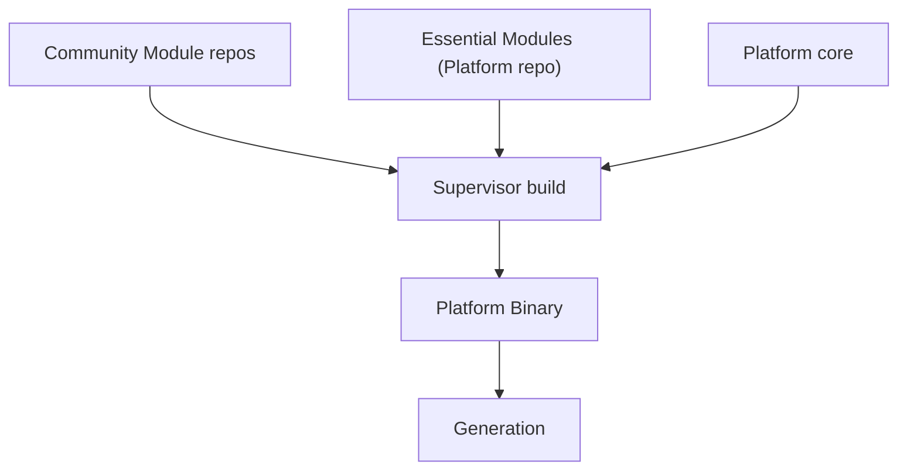

<!--
File: docs/engineering/architecture/mad-002-module-storage-and-delivery-model/02-decision.md
Document: MAD-002
Status: Draft
Version: 0.1
-->

# 02 — Decision

---

# 1. A Module Is A Go Library Compiled Into The Binary

A Module is an ordinary Go library. The Supervisor compiles the selected Modules into a single Platform Binary at build time; that binary is a Generation. There are no runtime plugins, dynamic libraries, or RPC sidecars between local Modules.

Because a Module is compiled in, the finished binary draws no boundary between Platform code and Module code. A Module participates through the SDK and Platform contracts, not through a runtime bridge — there is no boundary at which a Module must ask permission to take part.

---

# 2. Modules Do Not Own Storage Or Schema

The Platform owns the storage authority: the database, connection lifecycle, migrations, transactions, access policy, backup boundary and the schema itself. Modules persist what they need **through Platform-owned storage contracts**, never through tables or schema they define.

The schema is designed to make this practical. The Platform owns a deliberately **content-agnostic object model** — a recursive node tree, a separate relation graph, engine-neutral identity and flexible per-type attributes — so a new content Module maps its data onto existing structure rather than extending the schema. Adding anime, manga or music is new rows, not new tables.

A genuinely new *data-owning domain*, as opposed to new data within the existing model, is Platform and SDK evolution ([MAC-001 §03](../mac-001-platform-architecture/03-capability-model.md)), decided deliberately — not something a Module introduces on its own.

---

# 3. Community And Essential Modules Differ Only In Delivery

The two are architecturally identical. Both are Go libraries, both use the SDK and Platform contracts, both are compiled into the binary, both are admitted the same way. The difference is delivery and selectability alone:

| | Essential Module | Community Module |
|---|------------------|------------------|
| Repository | Ships in the Platform repository | Its own independent repository |
| Acquisition | Pulled with the Platform when a new Platform version is pulled | Selected by the user; the Supervisor downloads it |
| Selectability | Cannot be deselected — required for a valid Generation | Optional; included in a Generation only if selected |
| Composition | Compiled into the binary by the Supervisor | Compiled into the binary by the Supervisor |
| Architecture | Identical | Identical |

The PostgreSQL storage adapter is the first essential Module. An anime capability is a representative community Module. Nothing in how they register, resolve contracts, or execute distinguishes them.

---

# 4. Analytical Processing Is A Port

The analytical tasks the earlier storage design assigned to a dedicated engine — recommendations, correlation, reporting, popularity, search candidates — are defined behind a **Platform-owned analytical processing port**, not bound to a specific database.

- PostgreSQL satisfies the port today, through materialised views, relation edges and background jobs. One database is sufficient for the Platform Foundation.
- If PostgreSQL cannot carry the analytical load alone, an additional engine — for example DuckDB — is added as an **essential Module implementing the same port**, exactly as any other adapter.

The Platform mandates the analytical *capability*. It does not dictate whether one, two or more databases provide it. This is the storage-as-a-port principle of [MAD-001](../mad-001-transactional-store-extensibility/index.md) applied to analytics.

---

# Status

Accepted. Made Canon in [MAC-001 §04](../mac-001-platform-architecture/04-module-model.md) (module model and storage ownership) and realised in [MEG-007](../../guides/meg-007-storage-architecture/15-v2-storage-architecture.md) (content-agnostic schema and analytical processing port).
