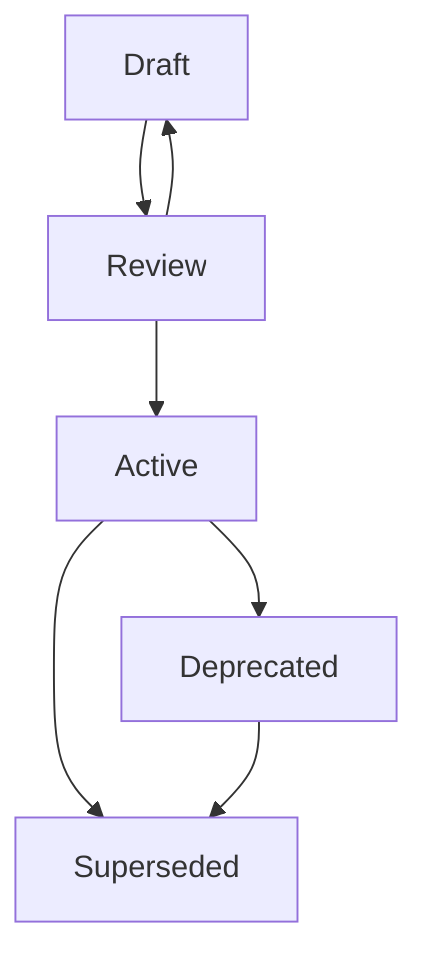
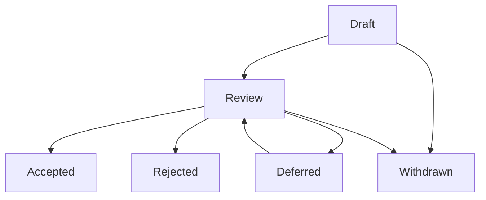

<!--
File: docs/engineering/documentation/mdg-001-documentation-authority-guide/03-versioning.md
Document: MDG-001
Status: Active
-->

# 03 — Status And Versioning

---

# Purpose

A reader arriving at any Mosaic document needs to answer one question immediately:

> **Can I rely upon this?**

This chapter defines how that question is answered.

Mosaic documents declare a **Status**. Status communicates authority rather than effort.

Mosaic documents do not carry a document version number. Prose does not have releases, and a number attached to prose invites a precision the prose cannot honour.

Only a **contract** carries a version. Contracts are defined by Integration Protocols, and their versions describe compatibility between independently developed components rather than the maturity of the Markdown that describes them.

---

# Guiding Principles

Document lifecycle metadata should:

- communicate authority rather than effort
- remain auditable by a reader and by tooling
- avoid encoding review history within a number
- distinguish the document from the contract the document defines
- preserve change history without duplicating it into metadata

A reader should never need to interpret a decimal to discover whether a document is binding.

---

# Prose Documents Carry Status

The following document types are prose. They describe architecture, practice, procedure, design intent, decisions and documentation standards.

- Mosaic Architecture Canon (MAC)
- Mosaic Engineering Guide (MEG)
- Mosaic Operations & Playbook (MOP)
- Mosaic Design Language (MDL)
- Mosaic Design System (MDS)
- Mosaic Documentation Guide (MDG)
- Mosaic Architecture Decision (MAD)
- Mosaic Design Proposal (MDP)
- Mosaic Roadmap (MRM)

Prose documents declare a Status and no version.

Maturity is established by two sources that cannot drift from the document:

- **Git history**, which records every change, its author and its reasoning.
- **A revision history**, maintained where a document benefits from a human-readable summary of meaningful change.

Neither source requires a number within the metadata block, and neither can silently disagree with the document it describes.

---

# Status Lifecycle

Every Mosaic document declares exactly one Status.

| Status | Meaning |
|--------|---------|
| Draft | The document is being written. It is not authoritative and may change substantially. |
| Review | The document is complete enough to be assessed and is awaiting review outcomes. It is not yet authoritative. |
| Active | The document is authoritative. Readers should rely upon it and implementations should conform to it. |
| Deprecated | The document remains published for reference, but its guidance should no longer be adopted for new work. |
| Superseded | The document has been replaced. It must identify its replacement. |

Two further statuses apply only to Mosaic Design Proposals.

| Status | Meaning |
|--------|---------|
| Rejected | The proposal will not proceed under its recorded assumptions. It is retained for historical reasoning. |
| Withdrawn | The proposal was retired by its author before a decision was reached. |

The normal progression is illustrated below.

Proposals follow a different path.

---

# Status Transitions

Status changes deliberately rather than incidentally.

| Transition | Condition |
|------------|-----------|
| Draft → Review | The document expresses its subject completely enough to be assessed. |
| Review → Draft | Review identified changes substantial enough to require rewriting. |
| Review → Active | Editorial, structural, cross-reference and technical review have all completed. |
| Active → Deprecated | The guidance remains historically accurate but should not be adopted for new work. |
| Active → Superseded | A replacement document has become Active. |
| Deprecated → Superseded | A replacement document has become Active for previously deprecated guidance. |

A Superseded or Deprecated document must link to its replacement, or state plainly that no replacement exists.

Editorial corrections never change Status.

---

# Contracts Carry Versions

An Integration Protocol defines a contract between independently developed components. Those components must be able to state which contract they implement.

The contract therefore carries a **major compatibility version**, declared within the MIP document.

For example:

> This document defines **Event Protocol v1**.

The following rules govern contract versions.

- The version belongs to the contract rather than to the Markdown document describing it.
- Only a major integer version is used. There is no minor or patch component.
- A new major version is issued when a change would break an existing conforming implementation.
- Backward-compatible additions do not produce a new version. They are recorded within the document revision history.
- A MIP document may describe more than one contract version while both remain supported.
- The MIP document itself declares a Status exactly as every other document does.

The distinction is deliberate.

| Concept | Carries | Answers |
|---------|---------|---------|
| Document | Status | Can I rely upon this text? |
| Contract | Major version | Will my component interoperate? |

A MIP document may therefore be `Status: Draft` while defining `Event Protocol v1`, and may be `Status: Active` while defining both `v1` and `v2`.

---

# No Minor Or Patch Versions

Mosaic documentation uses no `MINOR.PATCH` numbering of any kind.

This applies to:

- document metadata
- Document Control tables
- contract versions declared within Integration Protocols
- revision histories
- navigation and index pages

Where a document previously declared a numeric document version such as `0.4`, that field is removed and Status is set to the value that honestly describes the authority of the document.

---

# Revision History

A document benefits from a human-readable summary of meaningful change.

Where a revision history is maintained, it should:

- record meaningful changes rather than every editorial correction
- group changes beneath the date they became effective
- describe what changed and why
- record Status transitions
- record contract version introductions for MIP documents

Revision histories complement Git history. Git records what happened. A revision history records what mattered.

Revision history conventions are described within [10 — Standards Mapping](10-standards-mapping.md).

---

# Roadmap Horizons

An MRM document describes Mosaic software release horizons.

Those horizons belong to the platform rather than to the document.

An MRM therefore declares a Status like any other prose document, while its contents describe release sequencing. A Roadmap that is `Status: Active` is an authoritative statement of plan rather than an authoritative statement of architecture.

---

# Proposal Status

An MDP records both its lifecycle and its relationship to the accepted architecture.

Proposals use the Status field for this purpose. The values `Deferred`, `Accepted`, `Rejected` and `Withdrawn` describe the outcome of a proposal directly.

A Deferred proposal:

- remains non-authoritative
- retains its research and unresolved questions
- must not establish implementation requirements
- may return to review when evidence or Roadmap priorities change

Existing MDP documents declaring a separate `Disposition` row within Document Control retain that row as a legacy alias until they are migrated. Where `Disposition` and `Status` disagree, Status governs.

---

# Metadata Consequences

Removal of the document version field has three consequences authors should expect.

- The metadata block becomes shorter and is defined precisely within [07 — Repository Organisation](07-repository-organisation.md).
- The Document Control table no longer carries a Version row.
- Review milestones are recorded as review outcomes and Status transitions rather than decimal progressions, as described within [05 — Review Process](05-review-process.md).
