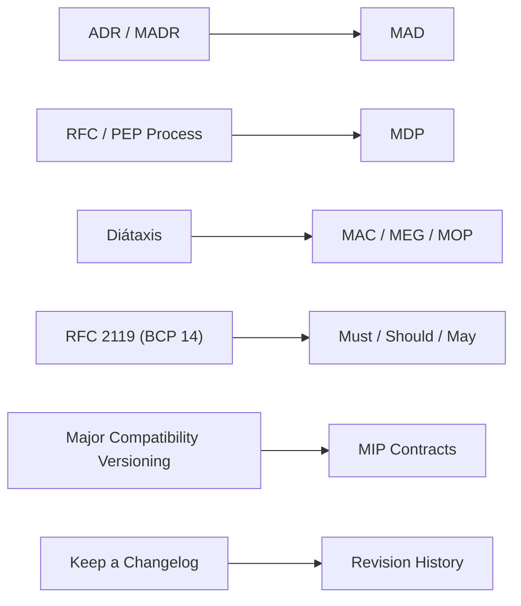

<!--
File: docs/engineering/documentation/mdg-001-documentation-authority-guide/10-standards-mapping.md
Document: MDG-001
Status: Active
-->

# 10 — Standards Mapping

---

# Purpose

Mosaic uses its own document names. It does not use its own ideas.

Every Mosaic document type is a branded profile of an established open standard. The prefix is a naming convention; the discipline beneath it is borrowed, deliberately, from practice that has already survived long-term use across the industry.

This chapter records those relationships explicitly.

The principle is simple:

> **Brand on the surface, open standards underneath.**

A contributor who already understands Architecture Decision Records, RFC process documents, Diátaxis, RFC 2119 or Keep a Changelog should be able to work within Mosaic documentation immediately, and should be able to recognise exactly which convention each Mosaic construct profiles.

---

# Why Profiles Rather Than Invention

Adopting established standards provides four benefits.

- **Familiarity.** New contributors recognise the shape of the documentation before learning its content.
- **Longevity.** Conventions that have outlived multiple technology cycles are more likely to outlive Mosaic implementations.
- **Tooling.** Established conventions attract established tooling and validation.
- **Honesty.** Naming the source prevents Mosaic from quietly reinventing a solved problem under a new prefix.

Branding remains valuable because it establishes a coherent identity across a documentation library spanning architecture, engineering, operations and design. The branding is therefore a surface, not a substitute.

---

# Mapping Overview

---

# MAD Profiles Architecture Decision Records

Mosaic Architecture Decisions are Architecture Decision Records, in the Markdown Architectural Decision Record tradition.

| Concern | Established Practice | Mosaic Profile |
|---------|----------------------|----------------|
| Record identity | Sequentially numbered decision record | `MAD-NNN` within a slugged folder |
| Structure | Context, Decision, Consequences | Context, Decision, Alternatives Considered, Consequences, Implementation Implications |
| Immutability | Records are not rewritten after acceptance | MAD documents remain immutable after acceptance |
| Change handling | A new record supersedes an older one | A new MAD supersedes; the original moves to `Status: Superseded` |

The Mosaic profile adds explicit alternatives and implementation implications because Mosaic decisions frequently constrain both Platform and Module authors.

---

# MDP Profiles RFC And PEP Process Documents

Mosaic Design Proposals are process documents in the tradition of the IETF Request for Comments series and the Python Enhancement Proposal process.

| Concern | Established Practice | Mosaic Profile |
|---------|----------------------|----------------|
| Purpose | Propose a change and invite discussion before adoption | Identical |
| Identity | Sequential proposal number | `MDP-NNN` |
| Lifecycle | Draft, accepted, rejected, withdrawn, deferred | Status values Draft, Review, Deferred, Accepted, Rejected, Withdrawn |
| Authority | A proposal is not authoritative until accepted | An MDP is non-authoritative until it resolves into a MAD and Canon updates |
| Preservation | Rejected and withdrawn proposals remain published | Identical |

The lifecycle vocabulary is defined within [03 — Status And Versioning](03-versioning.md).

---

# MAC, MEG And MOP Profile Diátaxis Modes

The Diátaxis framework identifies four documentation modes distinguished by the reader need they serve.

Mosaic separates document types along the same axis, and the correspondence is close enough to be stated directly.

| Diátaxis Mode | Reader Need | Mosaic Document Type |
|---------------|-------------|----------------------|
| Explanation | Understanding | MAC — what Mosaic is and why it is shaped that way |
| How-to Guide | A task completed | MEG — how engineers realise the Canon |
| Reference | A fact confirmed | MIP — machine-readable contracts, and Glossary chapters throughout |
| Tutorial | Guided learning | Not currently a Mosaic document type |

Operations Playbooks occupy a deliberate hybrid position. A MOP is predominantly how-to, structured as procedure, and consulted under time pressure in the manner of reference material.

| Document Type | Primary Mode | Secondary Mode |
|---------------|--------------|----------------|
| MAC | Explanation | — |
| MEG | How-to | Explanation |
| MOP | How-to | Reference |

The absence of a tutorial type is intentional. Mosaic documentation currently serves practitioners rather than newcomers learning the platform for the first time. Should that need emerge, it should be met by a new document type rather than by diluting an existing one.

Diátaxis explains why [02 — Document Types](02-document-types.md) forbids a MAC from containing implementation guidance and forbids a MEG from redefining architecture. Those prohibitions are not stylistic preferences. Mixing modes serves neither reader.

---

# Normative Language Profiles RFC 2119

Mosaic normative language is RFC 2119 as clarified by RFC 8174, together forming BCP 14.

| Mosaic Term | RFC 2119 Equivalent | Meaning |
|-------------|---------------------|---------|
| Must | MUST, REQUIRED, SHALL | Absolute requirement |
| Must Not | MUST NOT, SHALL NOT | Absolute prohibition |
| Should | SHOULD, RECOMMENDED | Strong recommendation; exceptions require justification |
| Should Not | SHOULD NOT, NOT RECOMMENDED | Strong recommendation against |
| May | MAY, OPTIONAL | Genuinely optional |

Mosaic differs from RFC 2119 in one respect only.

RFC 8174 restricts normative meaning to uppercase usage. Mosaic documentation is prose intended to be read continuously, and full uppercase disrupts that reading. Mosaic therefore uses ordinary capitalisation while retaining RFC 2119 semantics, and relies upon [04 — Writing Standards](04-writing-standards.md) to ensure these terms appear only where normative intent exists.

Authors should treat this as a formatting deviation rather than a semantic one. Where a Mosaic document states that something must occur, it carries precisely the weight RFC 2119 assigns to MUST.

---

# MIP Contracts Profile Major Compatibility Versioning

Integration Protocol contracts use major compatibility versioning.

This is Semantic Versioning reduced to the component that describes interoperability.

| Concern | Semantic Versioning | Mosaic Profile |
|---------|---------------------|----------------|
| Breaking change | MAJOR increment | Contract major version increment |
| Backward-compatible addition | MINOR increment | Recorded within revision history; no version change |
| Correction with no behavioural change | PATCH increment | Recorded within revision history; no version change |
| Subject of the version | Released software artefact | The contract, not the document |

Mosaic omits minor and patch components because a contract consumer only ever needs to answer one question: whether an implementation remains compatible. Minor and patch numbers answer questions about release provenance that Git history already answers more accurately.

The full rules are defined within [03 — Status And Versioning](03-versioning.md).

---

# Revision History Profiles Keep A Changelog

Where a document maintains a revision history, it follows the Keep a Changelog convention.

| Concern | Keep a Changelog | Mosaic Profile |
|---------|------------------|----------------|
| Audience | Humans rather than machines | Identical |
| Grouping | Entries grouped by release | Entries grouped by effective date |
| Categories | Added, Changed, Deprecated, Removed, Fixed, Security | Added, Changed, Deprecated, Removed |
| Ordering | Most recent first | Identical |
| Prohibition | Changelogs are not commit log dumps | Identical |

Mosaic omits Fixed and Security because documentation corrections belong to Git history and security-relevant change belongs within the specification text rather than within a changelog entry.

A revision history records Status transitions and, for MIP documents, the introduction of a new contract version.

---

# Standards Not Adopted

Recording what Mosaic deliberately does not adopt is as useful as recording what it does.

| Standard | Position |
|----------|----------|
| Semantic Versioning applied to documents | Not adopted. Prose has no releases. Contracts carry a major version only. |
| Diátaxis tutorial mode | Not currently adopted. No Mosaic document type serves guided learning. |
| RFC 2119 uppercase convention | Adopted semantically; not adopted typographically. |
| RFC-style immutable publication | Not adopted. Mosaic specifications are revised in place, with history preserved by Git. |

Where a future need arises, the appropriate response is to adopt the established standard and record the profile here rather than to invent a Mosaic-specific alternative.

---

# Applying This Chapter

When creating a new document type, authors should:

1. identify the established standard that already addresses the need;
2. document the profile within this chapter;
3. adopt the standard vocabulary wherever the Mosaic surface does not require otherwise;
4. record every deliberate deviation and its justification.

A Mosaic prefix should always name something recognisable underneath.

Supporting sources for each standard referenced within this chapter are listed within [References](references.md).
