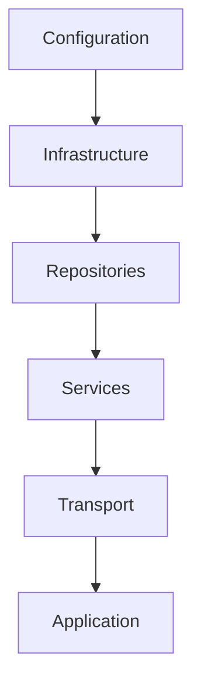
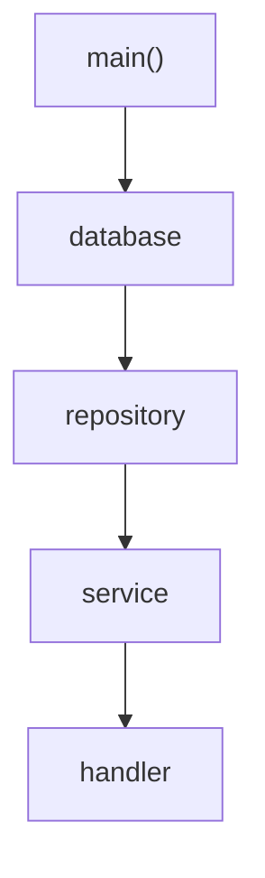
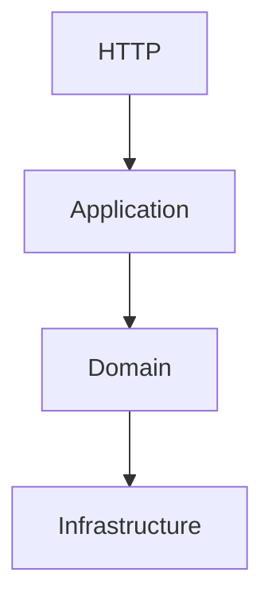
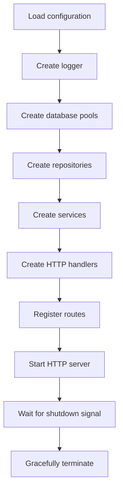
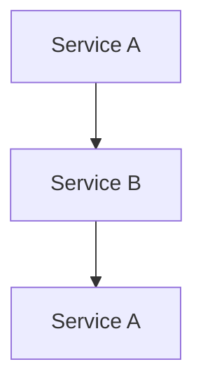
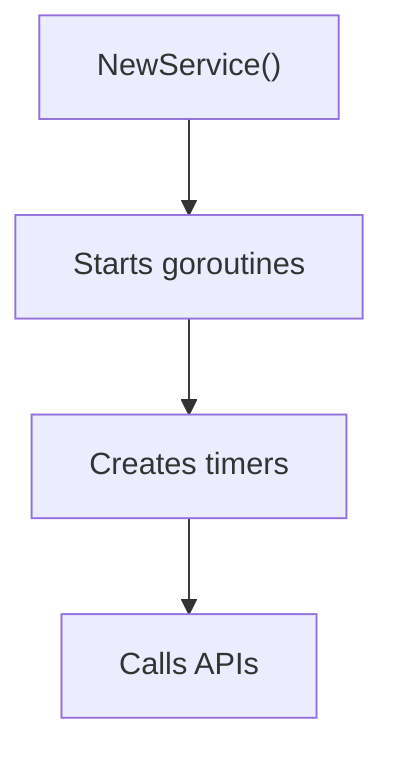

<!--
File: docs/engineering/guides/meg-001-go-engineering-standards/05-dependency-management.md
Document: MEG-001
Status: Draft
Version: 0.4
-->

# Dependency Management

> *Dependencies should be visible, intentional and easy to reason about. If an engineer cannot understand how an application is assembled by reading `main.go`, the architecture is hiding too much.*

---

# Purpose

Every application is a graph of dependencies.

Databases depend on configuration.

Repositories depend on databases.

Services depend on repositories.

Handlers depend on services.

Understanding how those dependencies are created is fundamental to understanding the application itself.

This document defines how dependencies should be managed throughout the Mosaic ecosystem.

---

# Philosophy

Within Mosaic:

> **Dependencies should be constructed explicitly and passed deliberately.**

Nothing should appear "by magic".

An engineer reading the application's entry point should be able to understand exactly:

- what is created
- in what order
- why it exists
- who owns it
- where it is passed

The application's construction should be obvious.

---

# Dependency Graph

Every Mosaic application follows the same construction flow.



Dependencies should always move in one direction.

Construction begins with foundational components and progresses towards the application's external interfaces.

---

# Composition Root

Every executable application MUST have a single composition root.

Typically this is:

```

cmd/server/main.go
```

or

```

cmd/worker/main.go
```

The composition root is responsible for:

- loading configuration
- creating infrastructure
- constructing dependencies
- wiring services together
- starting the application
- graceful shutdown

It should **not** contain business logic.

---

# Constructor Injection

Dependencies MUST be supplied through constructors.

Example:

```go
repo := metadata.NewRepository(db)

service := metadata.NewService(repo)

handler := http.NewMetadataHandler(service)
```

Dependencies are visible.

Ownership is obvious.

Testing becomes straightforward.

---

# Avoid Global State

Global mutable state SHOULD NOT exist.

Poor:

```go
var Database *sql.DB
```

Every package can now modify shared state.

Dependencies become hidden.

Testing becomes difficult.

Preferred:

```go
func NewRepository(db *sql.DB) *Repository
```

The dependency is explicit.

Every caller understands what the repository requires.

---

# Avoid Service Locators

The following pattern is prohibited.

```go
service := container.Resolve("metadata")
```

Or:

```go
app.Services.Metadata()
```

These approaches hide dependencies behind runtime lookups.

Instead, dependencies should be supplied directly.

Reading a constructor should reveal every dependency required for that component.

Hidden dependencies make software harder to understand and significantly more difficult to test.

---

# Dependency Injection Containers

Mosaic intentionally does **not** use dependency injection containers.

Examples include:

- Spring
- Guice
- Autofac
- Uber Dig
- Facebook Inject

These frameworks solve problems that Go intentionally avoids through explicit construction.

Reflection-based dependency injection introduces:

- hidden behaviour
- runtime failures
- more difficult debugging
- increased cognitive load

Go applications are typically small enough that manual construction remains the simpler solution.

This is the approach encouraged throughout the Go ecosystem. ([go.dev](https://go.dev/doc/effective_go?v=1))

---

# Constructor Design

Constructors SHOULD:

- validate required dependencies
- initialise internal state
- return fully usable objects

Constructors SHOULD NOT:

- start goroutines
- perform network requests
- open database transactions
- execute business logic
- perform long-running work

Construction should be inexpensive.

Application behaviour begins after construction completes.

---

# Required Dependencies

Required dependencies MUST be constructor parameters.

Example:

```go
func NewService(
    repo Repository,
    publisher events.Publisher,
    logger *slog.Logger,
) *Service
```

If the service cannot function without a dependency, that dependency should not be optional.

---

# Optional Dependencies

Optional behaviour should be configured explicitly.

Preferred:

```go
service := NewService(repo)

service.EnableMetrics(metrics)
```

Or through functional options where the configuration surface becomes sufficiently large.

Later chapters discuss when functional options are appropriate.

---

# Ownership

The creator of an object owns its lifecycle.

Example:



The handler should not close the database.

The repository should not stop the HTTP server.

Ownership always remains with the component that created the dependency.

---

# Lifecycle Management

Long-lived dependencies should be created once.

Examples include:

- database pools
- HTTP clients
- loggers
- event buses
- schedulers

Repeated construction increases resource usage unnecessarily.

Where a dependency is intended to be shared, share the instance rather than recreating it.

---

# Interfaces As Dependencies

Depend on behaviour.

Not implementation.

Preferred:

```go
type Repository interface {
    Find(ctx context.Context, id string) (*Media, error)
}
```

The service depends upon behaviour.

Not a concrete database implementation.

However, interfaces should only be introduced when multiple consumers genuinely benefit.

Do not create interfaces "just in case."

The Go community commonly summarises this principle as:

> **Accept interfaces. Return concrete types.**

Future chapters explore this principle in detail.

---

# Testing

Explicit dependency construction makes testing straightforward.

Example:

```go
repo := NewFakeRepository()

service := NewService(repo)
```

No framework.

No runtime configuration.

No reflection.

Tests remain fast and deterministic.

---

# Dependency Direction

Dependencies should always point towards stable abstractions.



Infrastructure must never depend on transport.

Repositories must never import HTTP packages.

Domain services must never know whether requests originated from:

- HTTP
- CLI
- WebSocket
- Scheduler
- Worker

Business logic should remain transport agnostic.

---

# Example Composition Root

A typical Mosaic service should resemble:



An engineer unfamiliar with the project should understand the application's entire construction by reading this file.

---

# Anti-Patterns

The following practices SHOULD NOT be used.

## Hidden Singletons

```

database.Get()
```

---

## Service Locator

```

container.Resolve(...)
```

---

## Runtime Dependency Discovery

```

reflect.New(...)
```

---

## Circular Construction



---

## Constructors With Side Effects



Construction should never unexpectedly begin application behaviour.

---

# Summary

Dependency management within Mosaic is intentionally simple.

- Construct explicitly.
- Inject directly.
- Avoid global state.
- Avoid runtime magic.
- Keep ownership obvious.
- Make application startup readable.

If an engineer can understand an application's dependency graph by reading `main.go`, the architecture is probably moving in the right direction.
