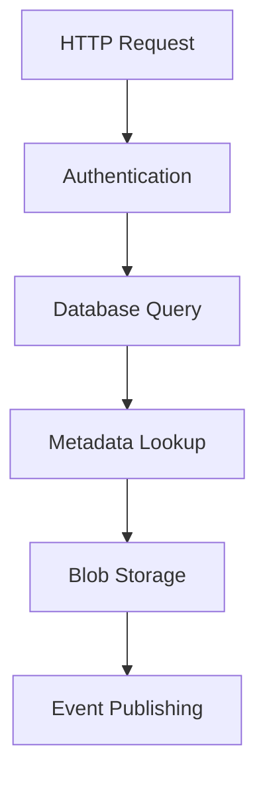
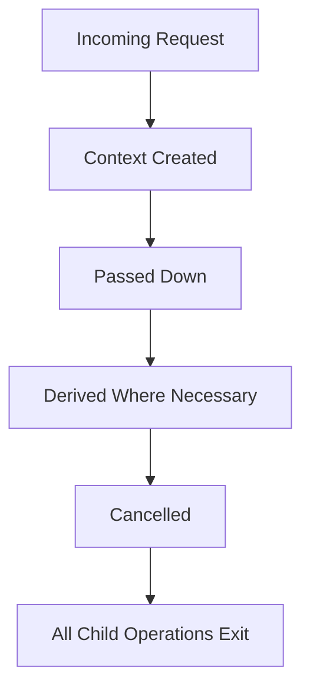
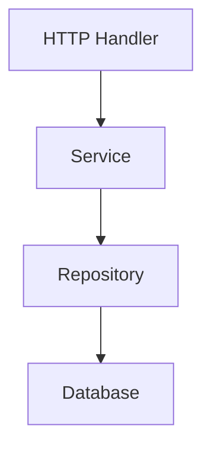
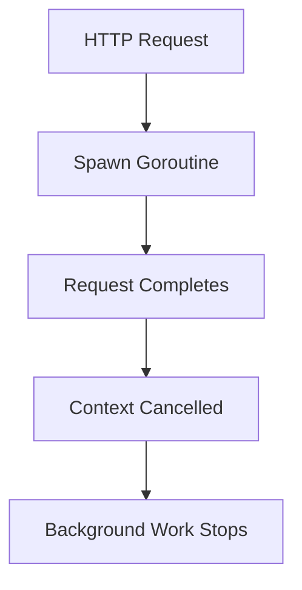
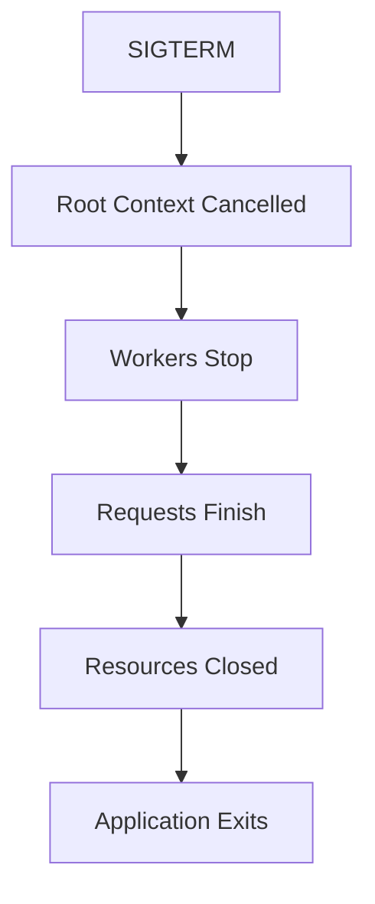

<!--
File: docs/engineering/guides/meg-001-go-engineering-standards/09-context-and-cancellation.md
Document: MEG-001
Status: Draft
-->

# Context and Cancellation

> *A context represents the lifetime of work. It is not a bag of dependencies, a configuration object or a convenient place to hide state.*

---

# Purpose

`context.Context` is one of the most important types in Go.

It allows unrelated parts of an application to agree on one thing:

> **When should this work stop?**

Within Mosaic, every request, background task and long-running operation must have a clearly defined lifetime.

Context provides the mechanism by which that lifetime is communicated.

---

# Philosophy

Within Mosaic:

> **Context owns cancellation. It owns nothing else.**

Context exists to communicate:

- cancellation
- deadlines
- timeouts
- request-scoped values

It does **not** exist to transport dependencies through an application.

---

# Why Context Exists

Modern applications perform many concurrent operations.

Consider an HTTP request.



If the client disconnects halfway through, every remaining operation should stop.

Without context:

- goroutines continue running
- database queries continue executing
- HTTP calls continue waiting
- resources remain allocated

With context:

One cancellation propagates throughout the entire operation.

This is precisely the design intent of Go's `context` package.  [Go](https://go.dev/blog/context)

---

# Context Lifecycle

Every request begins with a root context.



Contexts form a tree.

Cancelling a parent automatically cancels every child.

Child contexts must never outlive their parent unless this behaviour is explicitly required.

---

# Context Is Always The First Parameter

Every function requiring a context MUST accept it as its first parameter.

Example:

```go
func (s *Service) FindMedia(
    ctx context.Context,
    id string,
) (*Media, error)
```

Never:

```go
func (s *Service) FindMedia(
    id string,
    ctx context.Context,
)
```

The ordering should remain consistent throughout the entire codebase.

This is an established Go convention.  [Go Packages](https://pkg.go.dev/context)

---

# Never Store Context In Structs

The following is prohibited.

```go
type Service struct {
    ctx context.Context
}
```

Contexts are request-scoped.

Services are application-scoped.

Mixing the two creates subtle lifecycle bugs.

Instead:

```go
func (s *Service) Process(
    ctx context.Context,
)
```

Every operation receives its own context.

The service remains stateless.

The Go package documentation explicitly advises against storing contexts in structs.  [Go Packages](https://pkg.go.dev/context)

---

# Never Pass nil

A context must always be supplied.

Poor:

```go
Process(nil)
```

Preferred:

```go
Process(context.Background())
```

or

```go
Process(context.TODO())
```

Nil contexts create unnecessary defensive programming.

---

# Create Context At Boundaries

Contexts should be created only at application boundaries.

Examples include:

- HTTP handlers
- CLI commands
- Workers
- Schedulers
- Application startup

Business logic should receive contexts.

It should rarely create them.

Example:



The handler creates the context.

Everything else propagates it.

---

# Always Propagate Context

Every function receiving a context SHOULD pass it to downstream operations.

Example:

```go
media, err := repo.Find(ctx, id)
```

Not:

```go
media, err := repo.Find(context.Background(), id)
```

Replacing a caller's context breaks cancellation propagation.

Never discard an existing context without a compelling architectural reason.

---

# Derive Context Sparingly

Child contexts should only be created when introducing:

- a timeout
- a deadline
- manual cancellation
- request-scoped values

Example:

```go
ctx, cancel := context.WithTimeout(
    ctx,
    5*time.Second,
)
defer cancel()
```

Creating unnecessary context hierarchies makes cancellation harder to understand.

---

# Always Call Cancel

Whenever `WithCancel`, `WithTimeout` or `WithDeadline` is used, the returned cancel function MUST be called.

Example:

```go
ctx, cancel := context.WithTimeout(
    ctx,
    time.Second,
)
defer cancel()
```

Calling `cancel` releases resources associated with the derived context, even if the timeout never expires. Failing to do so may leak timers and child contexts.  [Go Packages](https://pkg.go.dev/context)

---

# Respect Cancellation

Long-running operations SHOULD regularly check whether cancellation has been requested.

Example:

```go
select {

case <-ctx.Done():
    return ctx.Err()

default:
}
```

Cancellation should terminate work as quickly as practical.

Ignoring cancellation wastes resources.

---

# Context Values

`context.WithValue` exists for request-scoped metadata.

Examples include:

- request IDs
- correlation IDs
- trace IDs
- authenticated principals

It SHOULD NOT be used for:

- configuration
- services
- repositories
- loggers
- feature flags
- optional parameters

Context values communicate request metadata.

Not dependencies.

---

# Background Context

`context.Background()` represents the root of a context tree.

It SHOULD only appear in:

- `main()`
- tests
- application startup
- root workers

Business logic should almost never construct a background context.

Receiving a context is almost always preferable.

---

# TODO Context

`context.TODO()` indicates:

> "A context should exist here, but the correct one has not yet been determined."

It is acceptable during development.

It SHOULD NOT remain in production code indefinitely.

---

# Timeouts

Timeouts belong at system boundaries.

Examples include:

- HTTP clients
- database queries
- external APIs
- object storage
- message brokers

Business logic generally should not impose arbitrary timeouts.

The caller owns the operation's lifetime.

---

# Background Work

One of the most common mistakes is using a request context for background processing.

Poor:



If work must continue after the request ends, a new context with an appropriate lifetime should be created deliberately.

This decision should be rare and well documented.

---

# Graceful Shutdown

Application shutdown should propagate through context.

Typical flow:



Every long-running component should honour context cancellation.

This enables predictable shutdown behaviour across the entire platform.  [Go](https://go.dev/doc/database/cancel-operations)

---

# Anti-Patterns

The following practices are prohibited.

## Storing Context In Structs

```go
type Repository struct {
    ctx context.Context
}
```

---

## Passing nil

```go
Process(nil)
```

---

## Background Context Creation Deep In Business Logic

```go
context.Background()
```

inside services or repositories.

---

## Context As Dependency Injection

```go
ctx.Value("database")
```

---

## Ignoring ctx.Done()

Long-running operations that never respond to cancellation.

---

## Forgetting cancel()

```go
ctx, cancel := context.WithTimeout(...)

// Missing:

cancel()
```

---

# Mosaic Guidelines

Within Mosaic:

- Context MUST be the first parameter.
- Context MUST NOT be stored in structs.
- Context MUST always be propagated.
- Business logic SHOULD NOT create root contexts.
- `cancel()` MUST always be called.
- Context values MUST only contain request-scoped metadata.
- Long-running operations MUST respect cancellation.
- Background work MUST define its own lifetime explicitly.

---

# Summary

Context is not merely another function parameter.

It defines the lifetime of work.

Every operation within Mosaic should be able to answer:

- Who owns this context?
- When will it be cancelled?
- What happens when cancellation occurs?
- Are downstream operations respecting it?

If those questions have clear answers, the application will naturally become more responsive, more efficient and easier to shut down safely.
