<!--
File: docs/engineering/guides/meg-001-go-engineering-standards/13-design-patterns.md
Document: MEG-001
Status: Draft
-->

# Design Patterns

> *Design patterns are proven solutions to recurring problems. They are not architectural goals. Good engineers recognise patterns naturally rather than forcing them into every design.*

---

# Purpose

Software engineering frequently encounters similar architectural problems.

Go provides a small but powerful set of language features that allow these problems to be solved without many of the patterns traditionally found in object-oriented languages.

This document defines the preferred design patterns for the Mosaic ecosystem.

It also explains when they should be used and, equally importantly, when they should not.

---

# Philosophy

Within Mosaic:

> **Choose the simplest pattern that completely solves the problem.**

Patterns exist to reduce complexity.

If introducing a pattern increases complexity without providing measurable value, the pattern should not be used.

Patterns should emerge naturally from architectural requirements.

Not from habit.

---

# Pattern Selection

Before introducing any design pattern, engineers SHOULD ask:

- What problem does this solve?
- Is there a simpler solution?
- Does Go already solve this naturally?
- Will another engineer immediately recognise the pattern?
- Does the pattern improve maintainability?

If these questions cannot be answered clearly, the pattern should probably not be introduced.

---

# Preferred Patterns

The following patterns are considered first-class architectural patterns within Mosaic.

---

# Constructor Pattern

## Purpose

Construct fully initialised objects with explicit dependencies.

Example:

```go
repo := metadata.NewRepository(db)

service := metadata.NewService(repo)

handler := http.NewHandler(service)
```

### Benefits

- Explicit dependencies
- Easy testing
- Predictable lifecycle
- No hidden initialisation

This is the default construction pattern throughout Mosaic.

---

# Composition Pattern

## Purpose

Combine small components into larger behaviour.

Example:

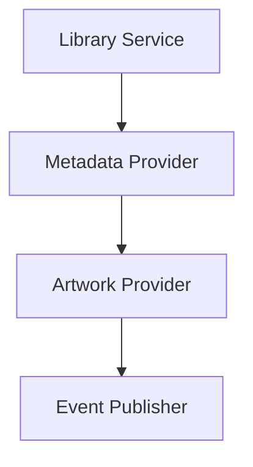

Composition is the primary architectural mechanism within Mosaic.

Inheritance is never required.

---

# Repository Pattern

## Purpose

Separate domain logic from persistence.

Example:

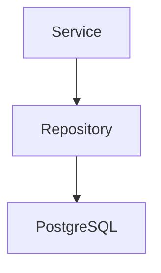

Repositories own persistence.

Services own business logic.

Repositories MUST NOT contain business rules.

---

# Adapter Pattern

## Purpose

Translate one interface into another.

Typical Mosaic examples include:

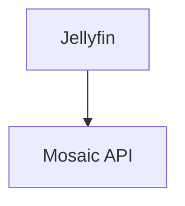

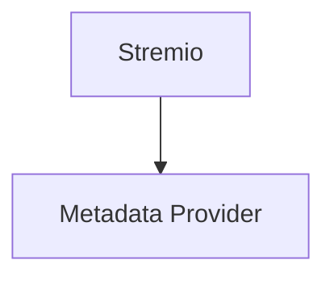

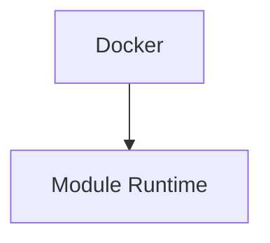

Adapters isolate external systems from internal architecture.

Business logic should never depend directly upon third-party APIs.

---

# Strategy Pattern

## Purpose

Allow behaviour to vary without modifying callers.

Example:

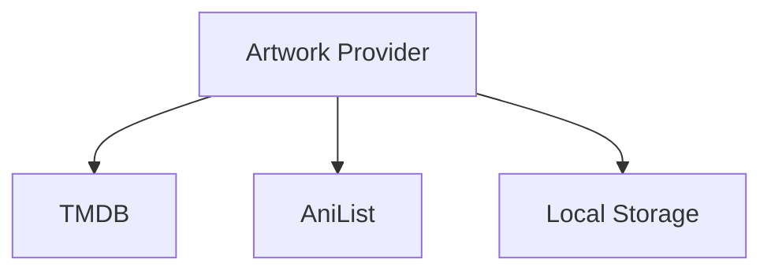

Each implementation satisfies the same behaviour.

The caller remains unchanged.

In Go, strategies naturally emerge through interfaces rather than inheritance.

---

# Functional Options

## Purpose

Configure objects with many optional parameters.

Example:

```go
server := NewServer(

    WithLogger(logger),

    WithMetrics(metrics),

    WithTLS(config),
)
```

Functional options SHOULD be used when:

- optional configuration grows
- constructors become difficult to read
- configuration remains immutable after creation

They SHOULD NOT replace required constructor parameters.

Required dependencies belong in constructors.

---

# Middleware Pattern

## Purpose

Wrap behaviour without modifying implementations.

Example:

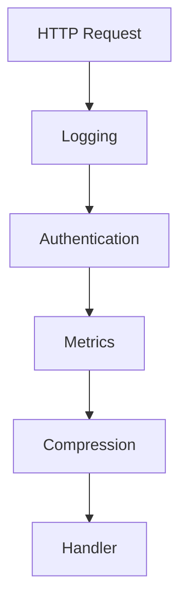

Middleware composes behaviour cleanly.

It should remain focused.

Each middleware should own one responsibility.

---

# Worker Pool Pattern

## Purpose

Process bounded concurrent work.

Example:

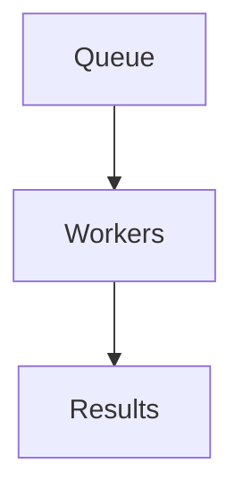

Worker pools prevent unbounded goroutine creation.

They provide predictable throughput and resource usage.

This is the preferred concurrency model for repeated background work.

---

# Pipeline Pattern

## Purpose

Break processing into sequential stages.

Example:

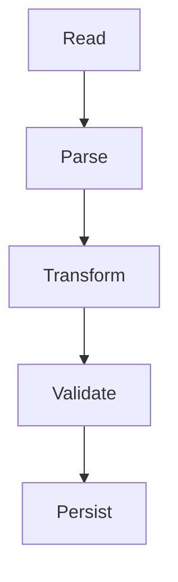

Each stage owns one responsibility.

Pipelines improve readability and testability.

They also allow individual stages to become concurrent where appropriate.

---

# Event-Driven Pattern

## Purpose

Decouple producers from consumers.

Example:

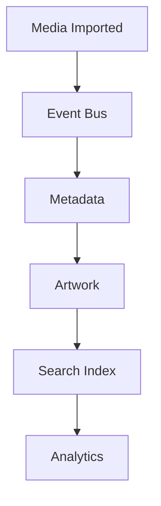

Events communicate facts.

They do not request actions.

This distinction is fundamental to Mosaic's architecture.

Future specifications define the event model in detail.

---

# State Machine Pattern

## Purpose

Represent finite business processes explicitly.

Example:

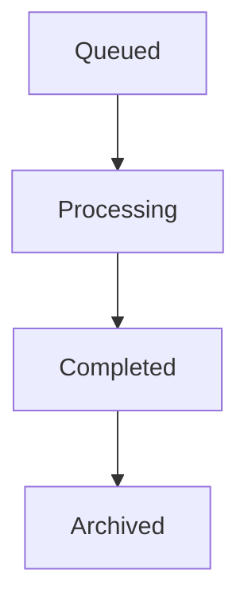

Avoid scattered boolean flags.

State should always be explicit.

---

# Stale-While-Revalidate

## Purpose

Improve responsiveness by serving cached data while refreshing asynchronously.

Example:

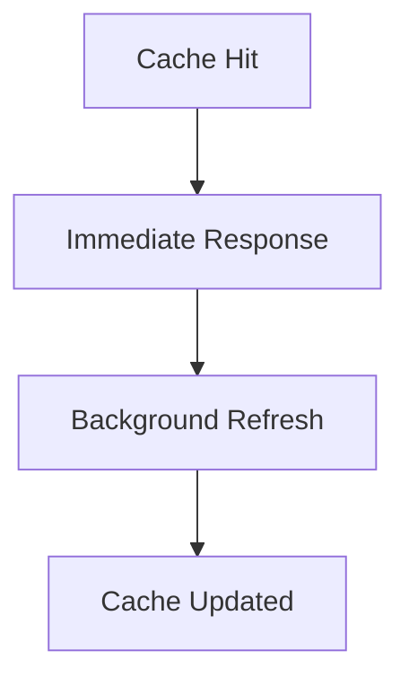

This pattern is heavily used throughout Mosaic for metadata and artwork.

It significantly improves perceived performance while maintaining freshness.

---

# Retry Pattern

## Purpose

Recover from transient failures.

Retries SHOULD only be used for operations that are:

- idempotent
- transient
- expected to succeed later

Retries SHOULD always use:

- exponential backoff
- maximum retry count
- cancellation support

Infinite retries are prohibited.

---

# Circuit Breaker

## Purpose

Prevent cascading failures.

Typical use cases include:

- external APIs
- remote storage
- metadata providers
- authentication providers

Circuit breakers improve resilience.

They should be implemented at infrastructure boundaries.

---

# Patterns To Use Sparingly

The following patterns have legitimate uses but should remain uncommon.

## Decorator

Generally replaced by middleware.

---

## Builder

Usually unnecessary.

Struct literals or constructors are clearer.

---

## Factory

Simple constructors are almost always sufficient.

Large factory hierarchies indicate over-engineering.

---

## Singleton

Application-scoped dependencies should instead be owned by the composition root.

Global singletons are prohibited.

---

# Patterns To Avoid

The following patterns SHOULD NOT appear within Mosaic.

---

## Abstract Factory

Go's explicit constructors make this unnecessary.

---

## Service Locator

Hidden dependencies reduce readability.

---

## God Object

Large components owning unrelated responsibilities.

---

## Base Classes

Go has no inheritance.

Do not simulate it.

---

## Generic Manager

Packages named:

```

Manager
```

```

Processor
```

```

Coordinator
```

without clearly defined responsibilities.

---

## Reflection-Based Frameworks

Reflection should not become the primary mechanism for application architecture.

Explicit code is easier to understand.

---

# Pattern Evaluation

Every pattern should justify itself.

Ask:

- Does this reduce complexity?
- Does this improve readability?
- Does this reduce coupling?
- Is this idiomatic Go?
- Will future contributors recognise it?

If the answer is "no", another approach should be preferred.

---

# Mosaic Pattern Hierarchy

Patterns are preferred in roughly the following order.

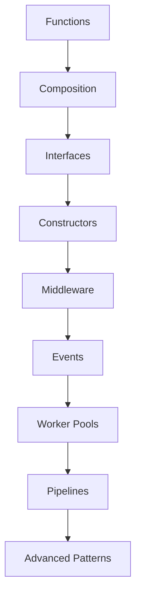

Always begin with the simplest possible solution.

Introduce more sophisticated patterns only when genuine architectural requirements emerge.

---

# Summary

Design patterns are tools.

Not objectives.

Within Mosaic:

- Composition is preferred.
- Constructors build systems.
- Interfaces define behaviour.
- Events decouple components.
- Middleware composes behaviour.
- Worker pools manage concurrency.
- Pipelines organise processing.
- Simplicity remains the overriding principle.

The best pattern is the one that disappears into the architecture.

It should make the software feel obvious rather than impressive.
