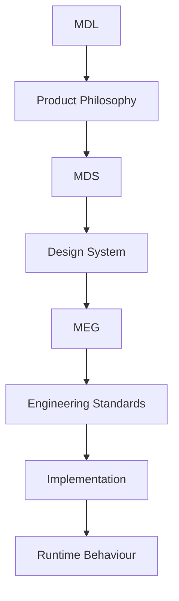
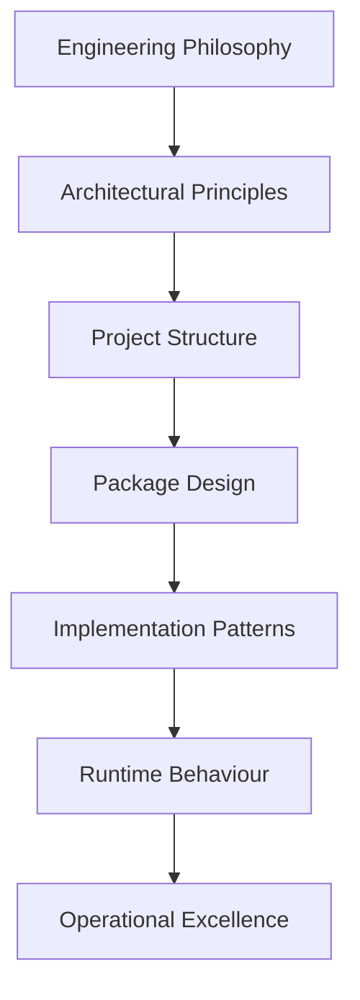

<!--
File: docs/engineering/guides/meg-001-go-engineering-standards/index.md
Document: MEG-001
Status: Draft
-->

# MEG-001 — Go Engineering Standards

> *Good Go code is not measured by cleverness. It is measured by how quickly another engineer can understand, trust and safely change it.*

---

# Purpose

The Mosaic Engineering Guidelines (MEG) establish the engineering standards for every Go codebase within the Mosaic ecosystem.

Where the Mosaic Design Language (MDL) defines how the platform thinks, and the Mosaic Design Specifications (MDS) define how the platform presents itself, the MEG defines how Mosaic software is engineered.

It provides a single source of truth for:

- Architectural decisions
- Engineering philosophy
- Code organisation
- Design patterns
- Package structure
- Concurrency
- Error handling
- Testing
- Performance
- Code quality
- Long-term maintainability

Unlike many language style guides, MEG-001 is **not** a collection of syntax rules.

It defines the engineering philosophy through which every future Mosaic service, application and SDK should be implemented.

---

# Relationship to Mosaic Architecture



Engineering standards are the bridge between architecture and implementation.

Every line of Go code written for Mosaic should be explainable by this specification.

---

# Scope

This specification defines:

- Engineering philosophy
- Idiomatic Go practices
- Project structure
- Package boundaries
- Dependency management
- Abstraction strategy
- Interface design
- Composition
- Error handling
- Concurrency
- Testing philosophy
- Performance principles
- Design patterns
- Anti-patterns
- Code review standards
- Contributor expectations

This specification intentionally does **not** define:

- Product architecture
- Business logic
- API contracts
- Database schemas
- User interface design
- Design system implementation

Those are defined by the MDL, MDS and future architecture specifications.

---

# Guiding Question

MEG-001 exists to answer one question.

> **How should Go software be engineered within the Mosaic ecosystem?**

---

# Engineering Statement

Within Mosaic:

> **Code exists to communicate intent before it executes behaviour.**

Readable software is maintainable software.

Simple software is reliable software.

Architecture should make the correct implementation the easiest implementation.

---

# Engineering Hierarchy

The Mosaic Engineering Standards intentionally separate engineering concerns into conceptual layers.



Each layer has exactly one responsibility.

Future chapters define every layer in detail.

---

# Expected Outcome

After reading MEG-001 contributors should understand:

- how Mosaic Go projects are organised
- why Go differs from object-oriented languages
- when abstraction is appropriate
- how packages should evolve
- how concurrency should be applied
- how engineering decisions are evaluated
- how code reviews are performed
- how future engineering standards should evolve

without discussing specific business features or product implementations.

---

# Repository Structure

```

engineering/

└── meg/

    └── meg-001-go-engineering-standards/

        index.md

        00-document-control.md

        01-engineering-philosophy.md

        02-thinking-in-go.md

        03-project-structure.md

        04-package-design.md

        05-dependency-management.md

        06-interfaces-and-abstraction.md

        07-composition-and-polymorphism.md

        08-error-handling.md

        09-context-and-cancellation.md

        10-concurrency.md

        11-testing.md

        12-performance.md

        13-design-patterns.md

        14-anti-patterns.md

        15-code-review-standards.md

        16-boy-scout-rule.md

        17-adrs.md

        18-contributor-guidance.md

        references.md

        glossary.md
```

---

# Dependencies

Required reading:

- [MDL-001 — Mosaic Design Language Vision](../../../design/language/mdl-001-vision/index.md)
- [MDL-002 — Principles](../../../design/language/mdl-002-principles/index.md)
- [MDL-003 — Mental Model](../../../design/language/mdl-003-mental-model/index.md)
- [MDL-004 — Interaction Model](../../../design/language/mdl-004-interaction-model/index.md)
- [MDL-005 — Composition Model](../../../design/language/mdl-005-composition-model/index.md)

Recommended references:

- Effective Go
- Go Code Review Comments
- Go Style Guide

---

# Design Goals

The standards defined by MEG-001 are intended to produce software that is:

- Idiomatic
- Predictable
- Maintainable
- Observable
- Testable
- Performant
- Evolvable
- Easy to review
- Easy to refactor

Optimisation should never come at the expense of clarity without measurable justification.
