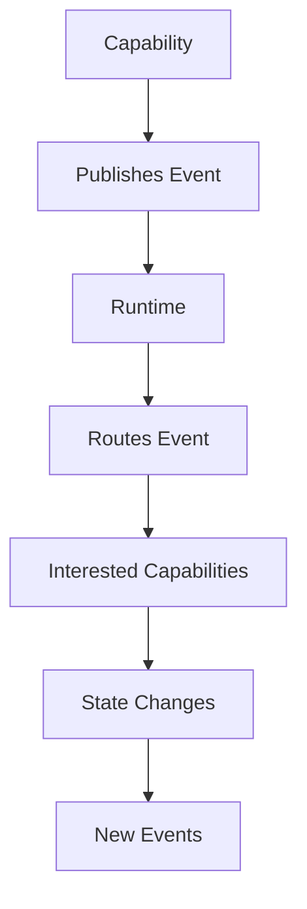
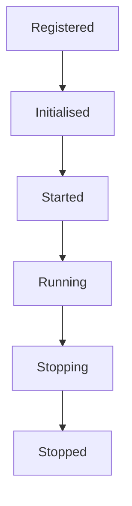

<!--
File: docs/engineering/guides/meg-002-event-driven-runtime/01-runtime-philosophy.md
Document: MEG-002
Status: Draft
-->

# Runtime Philosophy

> *The runtime exists to orchestrate capabilities, not control them.*

---

# Purpose

The Mosaic Runtime is fundamentally different from a traditional monolithic application. Rather than a collection of tightly coupled services calling one another directly, the runtime consists of autonomous capabilities that collaborate through events: each capability owns its own behaviour, and the runtime owns coordination. Understanding this distinction is essential to understanding every architectural decision made throughout the Mosaic platform.

---

# Philosophy

Within Mosaic:

> **The runtime coordinates work. Capabilities own behaviour.**

The runtime should never become a place where business logic accumulates. Instead, it provides the infrastructure that allows independently developed capabilities to cooperate safely and predictably.

---

# Runtime Responsibilities

The runtime owns the platform-wide concerns that every capability would otherwise have to solve for itself. These include:

- Event delivery
- Capability discovery
- Lifecycle management
- Scheduling
- Background execution
- Health monitoring
- Observability
- Graceful shutdown
- Resource ownership

The runtime intentionally does **not** own:

- Media management
- Metadata
- Playback
- Authentication
- Search
- Library management

These responsibilities belong to capabilities. The boundary matters because every capability depends upon the runtime, so anything the runtime absorbs becomes a dependency shared by the entire platform.

---

# Capabilities

A capability represents a self-contained piece of business functionality, such as Metadata, Playback, Library, Search, Notifications or Recommendations. A capability should:

- own its own behaviour
- own its own state
- publish events
- subscribe to relevant events

A capability should **never** become responsible for orchestrating the wider platform, because a capability that orchestrates must know which other capabilities exist — precisely the coupling the runtime exists to remove.

---

# Runtime Model

The runtime intentionally separates coordination from execution.

Notice that capabilities never communicate directly. The runtime becomes the coordination layer, which means a capability's only structural relationship is with the runtime rather than with its peers.

---

# The Runtime Is Not The Business

One of the easiest mistakes to make when building event-driven systems is gradually moving business logic into the event bus, and within Mosaic this is prohibited. The runtime should answer questions such as:

- Where should this event go?
- Who is subscribed?
- Is the runtime healthy?
- Can this work be retried?

The runtime should never answer questions such as:

- Is this movie watched?
- Should metadata be refreshed?
- Does this user have permission?

Those belong to capabilities. The distinction is the one drawn above: the first set can be answered without knowing what any capability does, whereas the second set cannot.

---

# Publish Facts

Capabilities publish facts, not commands. A fact names something that has already happened — `media.imported`, `playback.started`, `metadata.updated` — whereas a command such as `RefreshMetadata` or `UpdateArtwork` instructs another capability what to do. Facts therefore encourage loose coupling, because the publisher makes no assumption about who acts upon them, while commands create dependency, because the publisher must assume that a particular recipient exists and behaves in a particular way.

---

# Autonomous Capabilities

Capabilities should remain autonomous. A capability should never need to know:

- who consumes its events
- how many consumers exist
- whether consumers exist
- what consumers do

Publishing an event should feel like writing to a public noticeboard: the publisher posts the fact, and other capabilities decide whether they care.

---

# The Runtime Owns Time

Business capabilities should not concern themselves with:

- scheduling
- retry timing
- delayed execution
- backoff
- worker allocation

Instead a capability publishes an event and the runtime takes over, scheduling the work and delivering the event when it is due. Time is a runtime concern; business behaviour is not.

---

# The Runtime Owns Reliability

Failures are inevitable, so the runtime is responsible for ensuring they do not compromise the platform. This includes:

- retries
- dead-letter handling
- backpressure
- cancellation
- graceful shutdown

Reliability is therefore a platform responsibility, which leaves business capabilities free to focus solely on business behaviour.

---

# Eventual Consistency

The Mosaic Runtime embraces eventual consistency. Immediately after Capability A publishes an event, Capability B, Capability C and Capability D each receive it and progress independently, and the platform eventually converges upon a consistent state. Immediate synchronisation is intentionally avoided unless correctness requires it. This aligns with common event-driven architecture principles, where autonomous components converge through asynchronous communication rather than synchronous orchestration. ([martinfowler.com](https://martinfowler.com/articles/201701-event-driven.html))

---

# Progressive Capability

One of the defining characteristics of the runtime is progressive capability. Installing a module should not require modifying existing capabilities: the module subscribes to events the existing runtime already publishes, and the platform gains new behaviour without any existing capability changing. The runtime simply gains another participant, which allows the platform to evolve organically.

---

# Runtime Boundaries

The runtime deliberately exposes a small surface area. Capabilities should depend upon event publication, event subscription, scheduling and lifecycle notifications, and nothing more. Reducing the runtime API encourages long-term stability, because a smaller surface is a smaller contract to hold steady as the runtime evolves.

---

# Runtime Does Not Own State

The runtime coordinates state changes; it does not own business state. When the runtime carries a `media.imported` event to the Metadata capability, that capability writes to its own Metadata Database, so the runtime transports the event without inspecting or modifying metadata. This distinction is critical, because a runtime that read business state would have to understand it, and understanding business state is how business logic accumulates in the coordination layer.

---

# Runtime Lifecycle

Every runtime component follows the same lifecycle.

Capabilities should respond to lifecycle transitions, but they should never attempt to control them, because lifecycle ownership belongs to the runtime along with the rest of coordination.

---

# The Runtime Is Replaceable

Business capabilities should depend upon runtime contracts, not runtime implementations. This allows testing, simulation and future runtime evolution without requiring changes to business behaviour, which is why capabilities should view the runtime as infrastructure.

---

# Mosaic Principles

Within Mosaic:

- Capabilities own behaviour.
- The runtime owns coordination.
- Events communicate facts.
- Capabilities remain autonomous.
- The runtime owns time.
- The runtime owns reliability.
- Business state never belongs to the runtime.
- Modules integrate through events rather than direct dependencies.

These principles define the architectural identity of the Mosaic platform, and every future runtime decision should reinforce them.

---

# Summary

The Mosaic Runtime exists to enable cooperation without coupling. It coordinates, it schedules, it observes and it delivers, but it never becomes the business itself. When responsibilities remain clearly separated, new capabilities can be introduced without modifying existing ones, and that is the defining property of an extensible platform.
