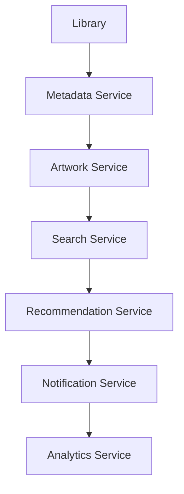
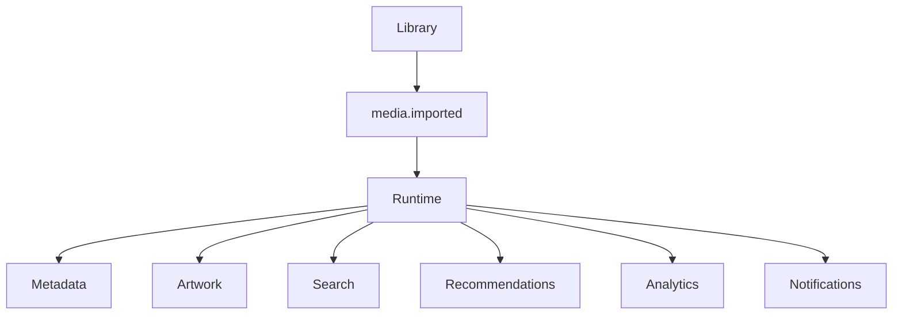
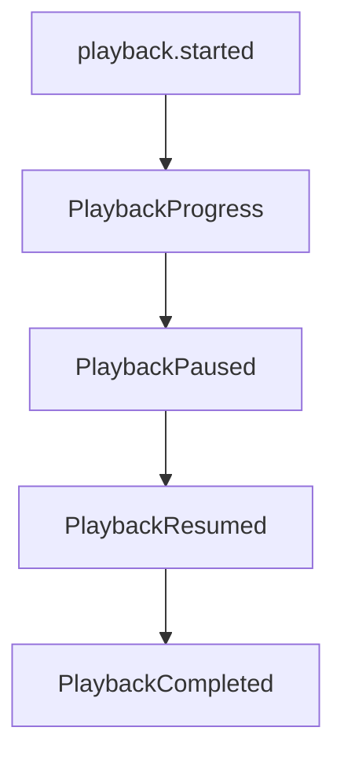
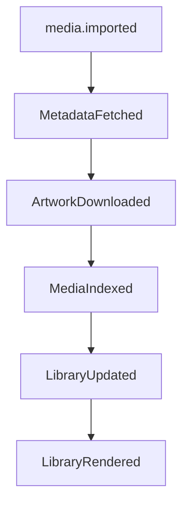

<!--
File: docs/engineering/guides/meg-002-event-driven-runtime/02-why-events.md
Document: MEG-002
Status: Draft
-->

# Why Events?

> *Events are not an implementation detail. They are the language through which capabilities communicate.*

---

# Purpose

Every architectural decision carries trade-offs. The Mosaic Runtime intentionally adopts an event-driven architecture because it aligns with the platform's foundational design goals:

- Extensibility
- Loose coupling
- Independent capabilities
- Background processing
- Progressive enhancement

This document explains **why** events are the primary communication mechanism within the Mosaic platform, focusing on architectural reasoning rather than implementation details.

---

# The Problem

Traditional applications often communicate through direct service calls, and each component consequently becomes aware of every other component: Library calls Metadata, which calls Artwork, which calls Notifications, which calls Analytics. As functionality grows:

- dependencies multiply
- coupling increases
- testing becomes harder
- introducing new behaviour becomes increasingly expensive

The architecture gradually evolves into a dependency graph rather than a platform, and at that point the cost of adding a capability is set by how many existing components have to be edited to accommodate it.

---

# Direct Communication

Consider a seemingly simple operation: media is imported. A traditional implementation might become:

The Library capability now knows about six unrelated systems, which means every future capability requires modifying Library. This violates the Open/Closed Principle.

---

# Event Communication

The same behaviour expressed with events inverts the direction of knowledge. Library announces a fact and the runtime distributes it:

Library publishes one fact and everything else becomes someone else's responsibility, so Library never changes as the platform grows.

---

# Events Describe Facts

Within Mosaic, events describe something that **has already happened**. Examples include `media.imported`, `playback.started`, `UserAuthenticated` and `LibraryScanned`. These are historical facts, and because they have already occurred they cannot be rejected.

---

# Events Are Not Commands

Commands tell another component what to do — `GenerateArtwork`, `RefreshMetadata`, `IndexSearch`. These tightly couple two capabilities, because the sender now assumes:

- another capability exists
- it performs a particular behaviour
- it should perform it immediately

This is not how Mosaic capabilities communicate, because each of those assumptions reintroduces exactly the direct coupling that events exist to remove.

---

# Facts Enable Growth

Publishing facts means future capabilities require no modifications to existing systems. Imagine adding AI Recommendations: no existing capability changes, because the AI Recommendation Module simply subscribes to `media.imported` and the runtime already understands how to deliver events. This property allows Mosaic to grow indefinitely without creating dependency explosions.

---

# Capabilities Should Not Know Each Other

One of the primary goals of Mosaic is capability independence. A capability should therefore never ask:

- Who needs this information?
- How many subscribers exist?
- What happens next?

Instead it should simply announce:

> "This happened."

Everything afterwards belongs to the runtime. Which capabilities react, and how many of them exist, is no longer the publisher's concern.

---

# Event Flow

Every event follows the same conceptual flow. Business behaviour changes state, the state change is published as an event, the runtime delivers that event to interested subscribers, each subscriber performs independent behaviour, and that behaviour may in turn produce further events. Notice that no capability explicitly invokes another capability; the runtime coordinates everything, which is what keeps the publisher independent of whatever happens downstream.

---

# Loose Coupling

Loose coupling produces numerous architectural benefits. Because a publisher holds no reference to its subscribers, capabilities can:

- evolve independently
- be developed independently
- be tested independently
- be replaced independently
- be disabled independently

This dramatically reduces long-term maintenance costs. Loose coupling is one of the defining characteristics of event-driven architectures because publishers and subscribers evolve independently. ([martinfowler.com](https://martinfowler.com/articles/201701-event-driven.html))

---

# Module Independence

Modules should integrate naturally. Without events, a module has to modify the platform, add service calls and then deploy the result, which means the platform must change before the module can. With events the same integration becomes a subscription: install the module, subscribe, receive events, and the platform is expanded. The existing runtime remains unchanged throughout, and that is one of the strongest arguments for an event-driven platform.

---

# Failure Isolation

Suppose Artwork Generation fails. With direct calls Library calls Artwork, the failure propagates back to the caller and the import fails with it, so a fault in a secondary capability destroys the primary operation. With events the failure stays where it happened: Library publishes `media.imported`, Artwork receives it and fails, and Artwork retries later. The import succeeds and Artwork eventually catches up, so independent failures remain isolated.

---

# Asynchronous Behaviour

Many operations should not delay user interaction. Examples include:

- metadata refresh
- artwork generation
- recommendation updates
- search indexing
- analytics
- cache warming

These naturally become background subscribers, which leaves the initiating capability responsive.

---

# Progressive Capability

The runtime encourages capabilities to appear gradually. A platform might begin with Library and Metadata alone, later gain Recommendations, and later still gain Collections, Machine Learning and Statistics. No earlier capability requires modification at any step, because each new participant subscribes to facts that are already being published. Growth therefore becomes additive rather than invasive.

---

# Observable Behaviour

Events naturally produce observable systems, because every important state transition becomes visible. A single playback session, for example, leaves a complete trail behind it.

Operations become traceable and failures become diagnosable, so observability emerges naturally from the architecture rather than being added to it.

---

# Event Chains

Complex workflows emerge from simple event chains.

Each capability owns one transition and no capability owns the entire workflow, which keeps responsibilities small.

---

# The Runtime Is A Coordinator

The runtime intentionally behaves like infrastructure: it routes, it schedules, it retries and it observes, but it never becomes another business capability. This distinction keeps business logic separate from orchestration.

---

# When Not To Use Events

Not every interaction should become an event. Events should not replace:

- immediate validation
- synchronous queries
- request/response APIs
- simple in-process function calls

If one capability requires an immediate answer from another, a direct abstraction is usually more appropriate. Events communicate facts; they do not replace every form of communication.

---

# Mosaic Guidelines

Within Mosaic:

- Events communicate facts.
- Capabilities should publish events after state changes.
- Capabilities should remain unaware of subscribers.
- Modules should integrate through events.
- Direct capability dependencies should be minimised.
- Background work should originate from events where practical.
- The runtime should coordinate rather than orchestrate business behaviour.

---

# Summary

Events are not simply another messaging mechanism; within Mosaic they are the language of the runtime, and they allow independently developed capabilities to cooperate without depending upon one another. That single architectural decision enables:

- module-first development
- progressive capability
- background processing
- resilience
- scalability
- long-term maintainability

Everything else defined within MEG-002 builds upon this principle.
