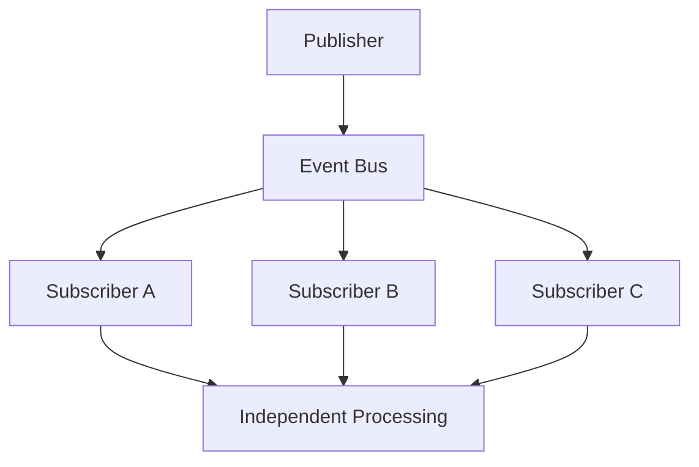
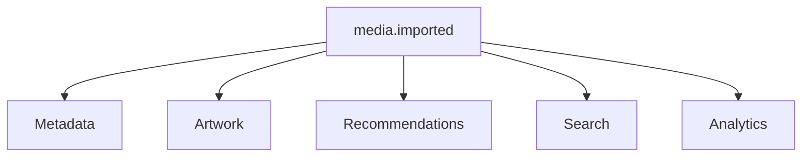
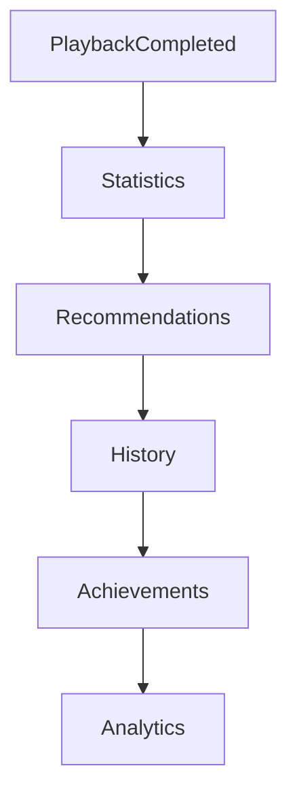
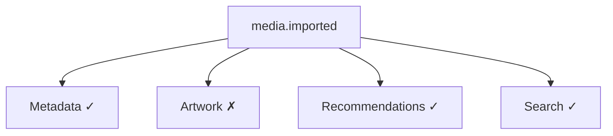

<!--
File: docs/engineering/guides/meg-002-event-driven-runtime/07-event-bus.md
Document: MEG-002
Status: Draft
-->

# Event Bus

> *The Event Bus transports facts. It never interprets them.*

---

# Purpose

The Event Bus is the central coordination mechanism of the Mosaic Runtime, responsible for delivering events between capabilities while remaining completely unaware of business behaviour. It is **not** a workflow engine, **not** an orchestration engine and **not** a rules engine. Its only responsibility is to reliably transport immutable business facts from publishers to interested subscribers.

---

# Philosophy

Within Mosaic:

> **The Event Bus owns delivery. Capabilities own meaning.**

The Event Bus should never understand media, playback, metadata, users or modules, because those are business concepts owned by the capabilities that publish them. It understands only:

- events
- subscribers
- delivery
- retries
- acknowledgements
- lifecycle
- visibility metadata
- version metadata

This separation is fundamental to maintaining loose coupling, and it is what allows the platform to grow without introducing direct dependencies between capabilities.

---

# Responsibilities

The Event Bus owns the following responsibilities, every one of which concerns transport rather than meaning.

- Event publication
- Subscriber discovery
- Event routing
- Delivery guarantees
- Retry scheduling
- Dead-letter routing
- Delivery metrics
- Backpressure
- Runtime observability

The Event Bus intentionally does **not** own:

- business validation
- event payload semantics
- Module event definitions
- business workflows
- business state
- business decisions

Each of those is a business concern, so admitting any one of them would make the Event Bus a participant in behaviour it exists only to carry.

---

# Runtime Model

Every event follows the same runtime path, and the shape of that path is what keeps publishers and subscribers apart.

Publishers never communicate directly with subscribers, because every interaction occurs through the Event Bus.

---

# Publish

Publishing an event means:

> **This business fact has occurred.**

The publisher does not ask who receives it, how many subscribers exist, whether anybody processed it, or what happens next. Publishing should therefore be fire-and-forget from the publisher's perspective, because once the Event Bus has accepted the event, responsibility transfers to the runtime.

---

# Subscription

Capabilities subscribe to events, not to publishers. Playback subscribes to `media.imported`, and the Library capability remains unaware that Playback exists, which means adding another subscriber never requires modifying the publisher.

---

# Routing

The Event Bus routes events by matching the Event Name against its Registered Subscribers and performing Delivery to each of them. No routing logic should exist inside business capabilities: capabilities express interest, and the runtime performs routing.

Routing should respect event visibility, so Public Module events and Platform events may be subscribed to by other Modules, whereas Private Module events should remain within the owning Module boundary.

---

# Delivery Model

The Event Bus delivers events independently, so a single `media.imported` event reaches Metadata, Artwork, Recommendations, Search and Analytics without any of them being aware of the others.

Each subscriber receives the event independently, and failure in one subscriber must not prevent delivery to others. Subscriber isolation is one of the key properties of resilient event-driven systems.

---

# Delivery Guarantees

Within Mosaic, the Event Bus provides:

> **At-Least-Once Delivery**

Every published event is delivered one or more times, so subscribers must be idempotent. Exactly-once delivery is intentionally avoided because it introduces substantial complexity and often relies on infrastructure-specific guarantees, whereas at-least-once delivery with idempotent consumers is the more common architectural choice for distributed event-driven systems. ([microservices.io](https://microservices.io/post/microservices/patterns/2020/10/16/idempotent-consumer.html))

Future chapters define idempotency requirements.

---

# Fan-Out

One event may have many subscribers.

The Event Bus performs the fan-out automatically, so publishers remain unchanged regardless of subscriber count.

---

# No Subscriber Ordering

Subscribers must be considered independent, and the runtime makes **no guarantee** that Metadata and Artwork will execute before Recommendations. Where ordering is required it should emerge naturally through additional events, never through subscriber registration order.

---

# Runtime Registration

Capabilities register subscriptions during startup, so the path from Runtime to Capability runs through Register Subscription before that capability becomes Ready. Subscriptions should remain static throughout the application's lifetime unless explicitly designed otherwise.

---

# Dynamic Modules

Modules register subscriptions exactly like Platform capabilities: once a Module is loaded it registers its events and begins receiving them. The Event Bus makes no distinction between Platform capabilities, first-party modules and third-party modules, so every capability participates equally.

---

# Delivery Independence

Suppose one subscriber fails.

The failure affects only Artwork, so the other subscribers continue normally and retry belongs to Artwork rather than to the publisher.

---

# Event Acknowledgement

A subscriber will receive an event, process it and acknowledge it, and only after that acknowledgement is the event considered successfully processed for that subscriber. Unacknowledged events become eligible for retry.

---

# Event Filtering

Subscribers receive only events they have explicitly subscribed to. It is poor practice for a subscriber to receive everything and filter internally; the preferred arrangement is for the runtime to deliver relevant events, so that the runtime performs routing while subscribers process business logic.

---

# Backpressure

The Event Bus is responsible for protecting the runtime during overload, and possible strategies include:

- bounded queues
- worker pools
- rate limiting
- deferred retries

Unbounded queues are prohibited, because the runtime must remain stable under sustained load. Future chapters discuss backpressure in detail.

---

# Event Persistence

The Event Bus may persist events before delivery, which enables replay, diagnostics, recovery and auditing. Whether persistence is enabled is a runtime concern, so business capabilities should remain unaware of it.

---

# Event Replay

Replay follows the same delivery path as live events, so Historical Events travel through the Event Bus to Subscribers exactly as live events do. Subscribers should not need separate replay implementations, and processing historical events should be indistinguishable from processing live events wherever practical.

---

# Runtime Observability

Every significant Event Bus action should produce telemetry, examples of which include:

- published events
- delivery latency
- retry count
- subscriber failures
- queue depth
- dead-letter events

The Event Bus should be one of the most observable components within the platform, because if events cannot be observed, debugging distributed behaviour becomes significantly harder.

---

# Event Bus Boundaries

The Event Bus should remain intentionally small, exposing behaviour such as:

- Publish
- Subscribe
- Register
- Shutdown

It should not expose business concepts, which is what allows the runtime API to remain stable even as capabilities evolve.

---

# Anti-Patterns

The following practices are prohibited.

## Business Logic Inside The Event Bus

Branching on a business fact — if PlaybackCompleted, then Update Statistics — makes the transport a participant in the behaviour it carries. The Event Bus should never understand business events.

---

## Subscriber Discovery By Publishers

A Publisher that will Find Subscriber and then Call Subscriber has rebuilt exactly the direct dependency the Event Bus exists to remove. Publishers should never know subscribers exist.

---

## Shared Subscriber State

Subscribers communicating through shared mutable memory rather than events.

---

## Runtime Orchestration

The Event Bus deciding which business operation should execute next. Business workflows emerge from events, not from runtime decisions.

---

## Synchronous Delivery Requirements

Publishers waiting for every subscriber before continuing. The runtime should remain asynchronous wherever practical.

---

# Mosaic Guidelines

Within Mosaic:

- The Event Bus must remain business agnostic.
- Publishers must publish facts only.
- Subscribers must register explicitly.
- Subscribers must remain independent.
- Delivery must be at-least-once.
- Subscriber failures must not affect other subscribers.
- Runtime routing must remain transparent to publishers.
- The Event Bus must remain observable.
- Modules must integrate through the same Event Bus as Platform capabilities.

---

# Summary

The Event Bus is the nervous system of the Mosaic Runtime: it transports information, coordinates delivery and observes execution, but it never owns business behaviour. Maintaining that separation allows the platform to grow from a handful of capabilities to hundreds without introducing direct dependencies between them, which is why the Event Bus remains one of the smallest yet most important components within the entire Mosaic architecture.
