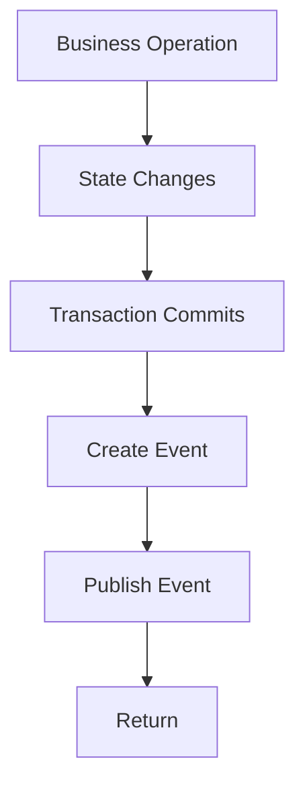
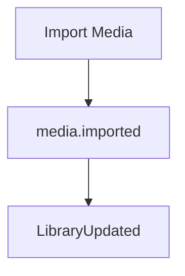

<!--
File: docs/engineering/guides/meg-002-event-driven-runtime/08-publishers.md
Document: MEG-002
Status: Draft
-->

# Publishers

> *A publisher records that something happened. It never decides who should care.*

---

# Purpose

Publishers are responsible for introducing events into the Mosaic Runtime, and they represent the boundary between business behaviour and runtime coordination. A publisher owns one responsibility:

> **Publish immutable business facts after successful state transitions.**

Everything that follows belongs to the runtime. This document defines the responsibilities, behaviour and constraints governing every event publisher within the Mosaic ecosystem.

---

# Philosophy

Within Mosaic:

> **Publishers announce facts. They never orchestrate workflows.**

Publishing an event should be the final step of completing business behaviour, so the publisher should never invoke subscribers, coordinate workflows, wait for processing or understand downstream behaviour. Those responsibilities belong to the runtime.

---

# Publisher Responsibilities

Every publisher is responsible for:

- detecting completed business state changes
- constructing valid events
- publishing events
- preserving event integrity

A publisher is **not** responsible for:

- delivery
- retries
- scheduling
- subscriber discovery
- ordering
- observability

Those concerns belong entirely to the Event Bus, which is what keeps a publisher a unit of business behaviour rather than a unit of infrastructure.

---

# Publishing Lifecycle

Every event follows the same publishing lifecycle, and its ordering is what makes a published fact trustworthy.

Publishing should occur only after the business operation has completed successfully.

---

# Publish After Success

Events must represent reality. The correct sequence therefore persists metadata, commits, and only then publishes MetadataImported, whereas the incorrect sequence publishes MetadataImported first, attempts to persist afterwards, and meets failure once the fact has already been announced. The runtime must never observe events describing work that never actually happened.

---

# One Publisher

Every event must have exactly one publisher, so `playback.started` belongs to the Playback Capability and to nothing else. Other capabilities may observe that fact, but none should publish it, because only Playback owns it and ownership must remain unambiguous.

---

# Publisher Ownership

A capability owns the events describing the state it owns, so Library publishes `media.imported`, Metadata publishes MetadataFetched and Playback publishes PlaybackCompleted. Ownership should never cross bounded contexts, and if multiple capabilities publish the same event, architectural ownership has become unclear.

---

# Publishing Is Fire-And-Forget

Once an event has been accepted by the Event Bus the publisher's responsibility ends, so the publisher must not wait for subscribers, retry delivery, inspect acknowledgements or coordinate processing. Library publishes and continues, and the runtime becomes responsible for reliable delivery.

---

# Publish Facts

Publishers communicate what happened, never what should happen. `media.imported` is therefore a good event and GenerateArtwork is a poor one, because subscribers decide what actions, if any, should follow.

---

# Publisher Independence

Publishers must remain completely unaware of:

- subscriber count
- subscriber identity
- subscriber implementation
- subscriber success
- subscriber failure

A capability should function correctly even if no subscribers exist, and that is the defining property of loose coupling.

---

# Constructing Events

Publishers construct complete events, which includes runtime metadata, business payload, identifiers and timestamps. Incomplete events should never enter the runtime, so validation belongs at publication time.

---

# Publishing Transactions

Publishing should occur only after business state becomes durable, so the recommended sequence runs the business logic, persists state, commits, and publishes the event last. This avoids publishing events describing rolled-back work. In distributed systems this concern is often addressed using the Transactional Outbox pattern, which records events atomically alongside business state before asynchronous publication. ([microservices.io](https://microservices.io/patterns/data/transactional-outbox.html))

---

# Multiple Events

A single operation may publish multiple events.

Each event should represent a distinct business fact, so unrelated concepts should not be combined into one large event.

---

# Event Timing

Publishers determine **when** a fact becomes true, but they do not determine when subscribers execute, when retries occur or when work completes. The runtime controls execution timing, whereas publishers control business truth.

---

# Avoid Conditional Publishing

Making publication conditional — publishing a search event only if search is enabled — ties a business fact to platform configuration. It is better to publish `media.imported` unconditionally and let the runtime deliver it wherever a search subscriber exists. Capabilities should publish business facts regardless of platform configuration, and subscribers determine relevance.

---

# Idempotent Publication

Publishers should avoid accidentally publishing duplicate events. If duplicate publication does occur, subscriber idempotency should ensure correctness, but publisher correctness remains preferable because duplicate events should represent exceptional rather than normal behaviour.

---

# Publisher Failure

Publishing itself may fail, whether because the runtime is unavailable, event validation fails or persistence fails. Publishers should treat publication failure as a business failure unless the runtime explicitly guarantees deferred publication, and silent event loss is prohibited.

---

# Event Ordering

Publishers should publish events in the order business facts occur, so `playback.started` should precede PlaybackCompleted rather than following it. The runtime does not infer chronology; publishers establish it.

---

# Domain Boundaries

Publishers must never publish events belonging to another capability, so Metadata publishing PlaybackCompleted is wrong: only Playback owns playback. Capabilities should never invent facts outside their own domain.

---

# Publisher Simplicity

Publishing code should remain simple — update state, create the event, publish it — because complex business logic should already have completed. If publishing requires extensive decision making, that logic probably belongs elsewhere.

---

# Anti-Patterns

The following practices are prohibited.

## Waiting For Subscribers

A publisher that publishes, then waits, then continues has turned publication into orchestration.

---

## Publishing Before Commit

Publishing facts before durable state exists.

---

## Publishing Commands

Publishing RefreshMetadata as though it were an event. Publish facts instead.

---

## Subscriber Discovery

Publishers attempting to locate subscribers.

---

## Business Logic During Publication

Publication should not become another application layer, because business decisions belong before publication.

---

## Publishing Another Capability's Events

Every capability owns its own business facts, and ownership should never overlap.

---

# Mosaic Guidelines

Within Mosaic:

- Publishers must publish facts only.
- Publishers must publish after successful state transitions.
- Every event must have one canonical publisher.
- Publishers must remain unaware of subscribers.
- Publishers must not coordinate workflows.
- Events must be validated before publication.
- Business ownership must determine publisher ownership.
- Publication should remain deterministic and simple.

---

# Summary

Publishers are intentionally uncomplicated, performing one task exceptionally well:

> **Convert completed business state into immutable events.**

By remaining unaware of downstream behaviour, publishers allow the Mosaic Runtime to grow indefinitely without increasing coupling between capabilities, and that simplicity is one of the key architectural properties that enables Mosaic's module-first platform.
