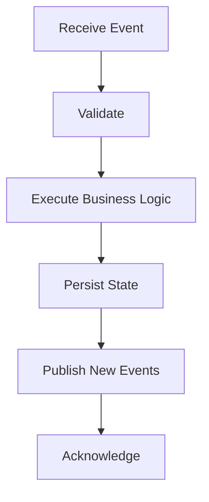
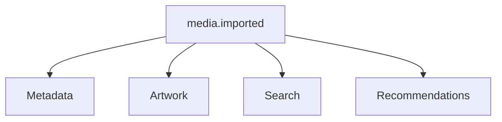
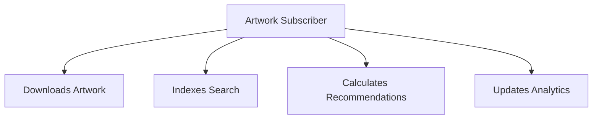
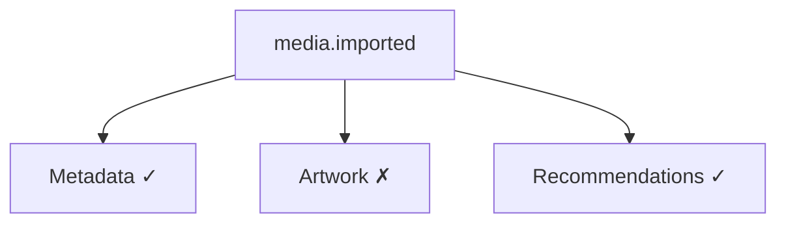
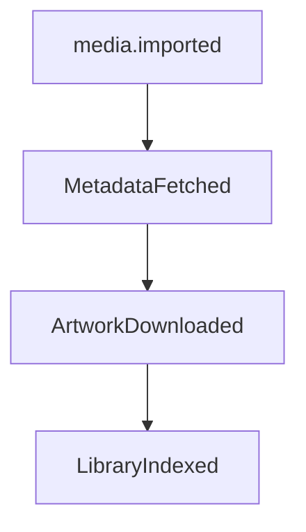

<!--
File: docs/engineering/guides/meg-002-event-driven-runtime/09-subscribers.md
Document: MEG-002
Status: Draft
-->

# Subscribers

> *Subscribers react to facts. They never influence whether those facts occurred.*

---

# Purpose

Subscribers are responsible for reacting to events published within the Mosaic Runtime, and they represent autonomous capabilities that observe business facts and perform additional work where appropriate. Unlike publishers, subscribers have no ownership over the event itself, because their responsibility begins only after the event has been published. This document defines the behaviour, responsibilities and architectural constraints governing event subscribers.

---

# Philosophy

Within Mosaic:

> **Subscribers react independently to immutable business facts.**

A subscriber should answer one question, and nothing more:

> **"Given this fact, is there work my capability should perform?"**

Subscribers should never become orchestrators. They should simply react.

---

# Subscriber Responsibilities

Subscribers are responsible for:

- receiving events
- validating event compatibility
- performing business behaviour
- publishing new facts
- acknowledging successful processing

Subscribers are **not** responsible for:

- event routing
- retry scheduling
- subscriber discovery
- event persistence
- delivery guarantees

Those responsibilities belong to the runtime, which is what allows a subscriber to remain a unit of business behaviour rather than a unit of infrastructure.

---

# Subscription Model

Subscribers explicitly declare interest: Playback subscribes to `media.imported`, and the runtime records that relationship. Publishers remain unaware, because a publisher that had to know its subscribers would acquire exactly the coupling the event model exists to remove.

---

# Processing Lifecycle

Every subscriber follows the same lifecycle, and it remains consistent regardless of capability.

---

# Validate First

Before processing an event, every subscriber should validate:

- supported version
- required payload fields
- mandatory identifiers
- business preconditions

Invalid events should fail immediately, because a subscriber that executes partial business logic against an invalid contract leaves state that no later validation can recognise as incomplete.

---

# Process Independently

Subscribers should process events independently. A single `media.imported` event may be observed by Metadata, Artwork, Search and Recommendations at once, and each of those subscribers owns its own behaviour.

No subscriber should depend upon another subscriber completing first, because such a dependency reintroduces ordering into a model whose delivery guarantees do not provide it.

---

# Publish New Facts

Subscribers frequently become publishers: the Metadata Subscriber reacts to `media.imported`, performs work, and publishes `MetadataFetched` as a new business fact. The chain then continues, which creates naturally evolving workflows without central orchestration.

---

# One Responsibility

Each subscriber should own one business concern. An Artwork Subscriber that downloads artwork is well scoped, whereas one that also indexes search, calculates recommendations and updates analytics has absorbed four concerns that belong to four capabilities.

Subscribers should remain cohesive.

---

# Idempotency

Subscribers must be idempotent, which means that receiving the same event multiple times must produce the same final state. If `media.imported` is received twice and metadata already exists, no duplicate state should result. At-least-once delivery makes idempotent subscribers a fundamental architectural requirement rather than an optimisation, and the Idempotent Consumer pattern is widely recommended for this reason. ([microservices.io](https://microservices.io/post/microservices/patterns/2020/10/16/idempotent-consumer.html))

Future chapters define idempotency in detail.

---

# Failure Isolation

Subscriber failure must remain isolated, so a single `media.imported` event that Metadata and Recommendations process successfully must still be processed by them when Artwork fails.

Artwork failure must never prevent Recommendations from processing, because the runtime manages retries independently and the failed subscriber will be retried without the successful ones being repeated on its behalf.

---

# Timeouts

Subscribers should honour context cancellation, so long-running work must terminate when:

- cancellation requested
- runtime shutting down
- timeout exceeded

Subscribers should never ignore runtime lifecycle. Work that outlives the runtime that started it cannot report its outcome to anything.

---

# Retry Behaviour

Subscribers should assume events may be retried, so business behaviour must tolerate:

- duplicate delivery
- delayed delivery
- replay

A subscriber should therefore never assume that it will Receive Once. It should assume instead that it will Receive One Or More Times.

---

# Side Effects

Subscribers frequently perform side effects, examples of which include:

- downloading artwork
- writing databases
- updating caches
- sending notifications

Side effects should occur only after successful validation, and subscribers should avoid partially completed work wherever practical, because a side effect that has already escaped the subscriber cannot be withdrawn by a later failure.

---

# Ordering Assumptions

Subscribers must not assume that `playback.started` always arrives before `PlaybackCompleted` in chronological order. Network delays, retries, replay and independent processing may all affect delivery order, so subscribers should validate current business state rather than relying solely on event order.

---

# Business Ownership

Subscribers may observe many domains, but they should only modify their own. Recommendations may react to `PlaybackCompleted` and update recommendation state, and it should **not** modify playback history, because every capability owns its own data.

---

# Stateless Processing

Subscribers should remain stateless wherever practical, which means state belongs in databases, caches and repositories rather than in subscriber instances. Stateless subscribers are:

- easier to test
- easier to restart
- easier to scale

---

# Slow Subscribers

Slow subscribers should not delay the runtime, and possible approaches include:

- worker pools
- bounded queues
- background execution

The runtime should remain responsive even when individual capabilities perform expensive work.

---

# Event Chaining

Subscribers naturally create event chains, in which each subscriber owns one transition and no subscriber owns the complete workflow.

---

# Logging

Subscribers should log:

- processing failures
- unexpected states
- validation failures

Subscribers should not log:

- successful processing of every routine event

Routine success belongs in metrics, whereas failures belong in logs.

---

# Metrics

Every subscriber should expose:

- processing count
- failure count
- retry count
- processing latency

Subscriber metrics provide operational visibility into runtime behaviour.

---

# Replay

Subscribers should process replayed events identically to live events, so replay should require no code changes. Business behaviour should remain deterministic, which means historical replay should reproduce historical outcomes.

---

# Dead-Letter Events

Subscribers should eventually give up, because a subscriber that retries indefinitely converts a permanent failure into permanent load. Permanent failures should therefore result in the event being dead-lettered once retries are exhausted, at which point it awaits operator investigation.

Future chapters define retry policies.

---

# Anti-Patterns

The following practices are prohibited.

## Calling Other Subscribers

A Metadata subscriber calling Artwork directly restores the coupling that publishing removed. Publish an event instead.

---

## Shared Subscriber State

Subscribers coordinating through mutable shared memory.

---

## Ignoring Duplicates

Assuming every event is delivered exactly once.

---

## Long Blocking Operations

Subscribers preventing the runtime from progressing.

---

## Business Logic Inside Retry

Retry logic belongs to the runtime, whereas business logic belongs to subscribers.

---

## Assuming Subscriber Order

Subscribers should never rely on registration order.

---

# Mosaic Guidelines

Within Mosaic:

- Subscribers must remain autonomous.
- Subscribers must validate events before processing.
- Subscribers must be idempotent.
- Subscribers must honour cancellation.
- Subscribers must publish new facts where appropriate.
- Subscribers must own only their own business state.
- Subscribers must tolerate duplicate and delayed delivery.
- Subscribers should remain stateless.
- Subscribers should expose operational metrics.

---

# Summary

Subscribers transform facts into further business behaviour while remaining independent, deterministic and unaware of one another. That independence is what allows the Mosaic Runtime to evolve organically: new capabilities simply subscribe to existing facts, and existing capabilities remain unchanged. That property is one of the defining characteristics of a truly extensible platform.
