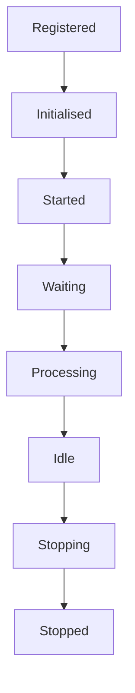
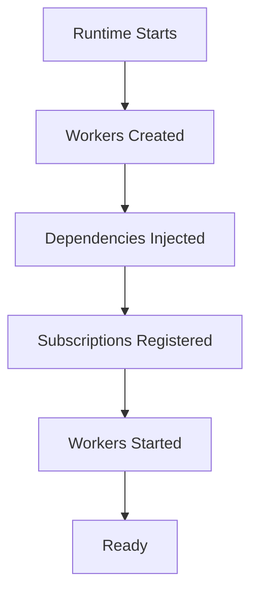
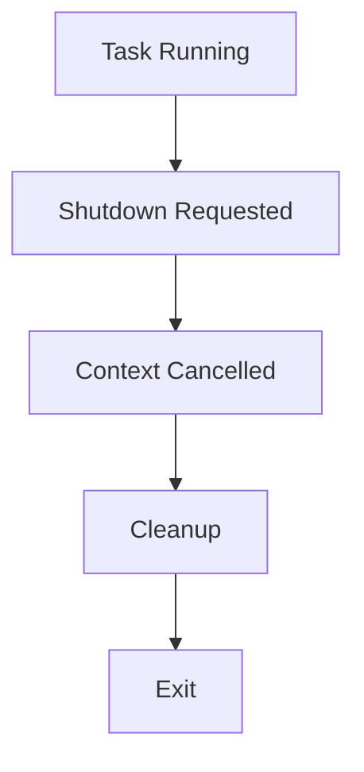
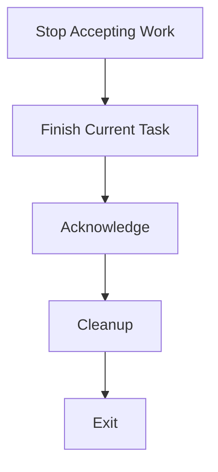
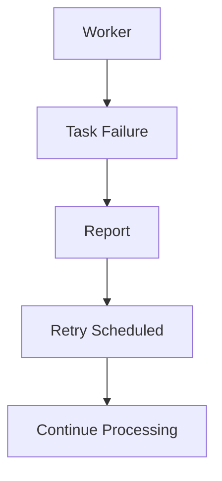

<!--
File: docs/engineering/guides/meg-002-event-driven-runtime/10-worker-lifecycle.md
Document: MEG-002
Status: Draft
-->

# Worker Lifecycle

> *Workers execute work. The runtime owns their lifecycle.*

---

# Purpose

Workers perform the asynchronous processing that powers the Mosaic Runtime, and every background task, scheduled operation and event subscriber ultimately executes within one or more workers. Workers are intentionally simple: they do not own business behaviour, but instead provide an execution environment in which business behaviour can safely run. This document defines how workers are created, managed and terminated throughout the Mosaic Runtime.

---

# Philosophy

Within Mosaic:

> **Workers execute work. They never own it.**

Business capabilities decide **what** should happen, whereas the runtime decides **where**, **when** and **how** that work executes. Separating execution from behaviour allows the runtime to evolve independently of business capabilities.

---

# Worker Responsibilities

Workers are responsible for:

- executing tasks
- respecting cancellation
- acknowledging completion
- reporting failures
- exposing health
- shutting down gracefully

Workers are **not** responsible for:

- scheduling work
- discovering work
- retry strategy
- orchestration
- business workflows

Those responsibilities belong elsewhere within the runtime, which is what keeps a worker replaceable: nothing that decides anything is stored inside it.

---

# Worker Lifecycle States

Every worker follows the same lifecycle, and the runtime manages every transition within it.



Workers should never manage themselves.

---

# Startup

During runtime initialisation, workers are created, dependencies are injected and subscriptions are registered before any worker is started.



Workers should be fully initialised before accepting work, because a worker that begins processing while partially configured will fail against a task the runtime has already treated as delivered.

---

# Idle State

Workers spend most of their lifetime waiting: a worker waits, a task arrives, the worker processes it and the worker returns to waiting. Idle workers should therefore consume minimal resources, which means busy waiting is prohibited and workers should block efficiently until work becomes available.

---

# Task Acquisition

Workers receive work from the runtime through a queue rather than polling business capabilities directly. The runtime owns work distribution, which keeps execution infrastructure independent from business behaviour.

---

# One Task At A Time

Unless explicitly designed otherwise, a worker receives a task, processes it, completes it and only then takes the next task. Parallelism is achieved by increasing worker count, not by increasing complexity inside individual workers.

---

# Cancellation

Every worker must honour context cancellation, so a running task whose shutdown is requested has its context cancelled, performs cleanup and exits.



Workers should terminate promptly, which means long-running operations should periodically check:

```go
ctx.Done()
```

Ignoring cancellation is prohibited.

---

# Graceful Shutdown

Shutdown should always be graceful, so a stopping worker stops accepting work, finishes its current task, acknowledges it and performs cleanup before exiting.



Workers should never abandon partially completed business operations unless immediate termination is unavoidable, because graceful shutdown improves consistency and reduces unnecessary retries.

---

# Worker Ownership

Every worker has exactly one owner. Typically the runtime owns the worker pool and the worker pool owns the worker, which gives ownership answers to:

- Who started this worker?
- Who stops it?
- Who monitors it?
- Who replaces it?

Workers should never exist without a clearly defined owner, because each of those four questions would otherwise have no addressee at the moment it is asked.

---

# Worker Identity

Every worker should have a unique runtime identifier, such as Metadata Worker #3. Worker identity improves observability, diagnostics, tracing and metrics, because it gives every report a subject rather than an anonymous origin. Business capabilities should remain unaware of worker identity, which belongs to runtime infrastructure rather than to business behaviour.

---

# Failure Handling

Worker failure should affect only the current task: the worker reports the failure, a retry is scheduled, and the worker continues processing.



The runtime should recover automatically wherever possible, so a single task failure should not terminate the worker.

---

# Panic Recovery

Workers should recover from unexpected panics, and recovery should:

- log diagnostic information
- mark the task as failed
- clean up resources
- continue serving future work

The runtime should remain resilient to isolated programming errors. Panic recovery therefore belongs at execution boundaries rather than within business logic, where it would begin absorbing failures the capability was meant to handle itself.

---

# Long Running Tasks

Some tasks naturally require extended execution, examples of which include library scanning, metadata synchronisation, artwork generation and cache rebuilding. These tasks should expose progress, honour cancellation and checkpoint where practical, so that workers remain observable throughout execution rather than only at its conclusion.

---

# Concurrency

Worker concurrency should be controlled by the runtime, which draws work from a queue into a managed worker pool and collects results from the workers within it. Capabilities should never create arbitrary worker pools independently, because runtime-managed execution is what keeps concurrency predictable.

---

# Resource Ownership

Workers may temporarily own resources such as database transactions, file handles and network connections. Workers must release every acquired resource before completing, because resource ownership ends with task completion and a worker that outlives its task would otherwise carry the resource into the next one.

---

# Worker Health

Every worker should expose runtime health, examples of which include:

- current state
- active task
- processing duration
- restart count
- failure count

Health information enables operators to diagnose runtime behaviour quickly.

---

# Worker Pools

Workers should execute within managed pools, the benefits of which include bounded concurrency, predictable resource usage, simplified scheduling and easier monitoring. Worker pools are discussed further in future runtime specifications.

---

# Scaling

Scaling should occur by increasing workers, not by making workers more complex. Many simple workers processing one task each are preferred to a single worker performing complex internal scheduling, because simple workers are easier to understand and easier to replace.

---

# Task Completion

Every completed task ends in one of four states:

- Completed
- Failed
- Cancelled
- Dead Letter

No task should disappear silently, so every outcome should be observable.

---

# Restart Behaviour

Workers should be restartable without affecting business correctness, because business state belongs elsewhere, events are immutable and subscribers are idempotent. Restarting a worker should therefore simply continue processing available work, and that property significantly improves operational resilience.

---

# Worker Metrics

Worker metrics provide insight into runtime capacity and bottlenecks, so the set exposed should cover the time spent waiting for work as well as the work itself. Every worker should expose:

- tasks processed
- task duration
- queue wait time
- failures
- retries
- cancellations
- utilisation

---

# Anti-Patterns

The following practices are prohibited.

## Self-Managing Workers

Workers creating or destroying other workers. Every worker has exactly one owner.

---

## Hidden Goroutines

Workers spawning unmanaged background goroutines.

---

## Ignoring Cancellation

Workers continuing indefinitely after shutdown begins.

---

## Infinite Loops Without Blocking

Workers consuming CPU while waiting for work.

---

## Business Scheduling

Workers deciding when future work should execute. Scheduling belongs to the runtime.

---

## Permanent Mutable State

Workers retaining business state between tasks. Business state belongs to capabilities.

---

# Mosaic Guidelines

Within Mosaic:

- Workers must remain execution infrastructure.
- Workers must honour cancellation.
- Workers must release acquired resources.
- Workers should process one task at a time.
- Worker pools should be runtime managed.
- Workers must expose health and metrics.
- Workers must recover gracefully from unexpected failures.
- Workers must remain stateless wherever practical.
- Every worker must have a clearly defined owner.

---

# Summary

Workers are the execution engine of the Mosaic Runtime, providing a predictable, observable and resilient environment in which business behaviour executes. By separating execution from business logic, the runtime gains the freedom to scale independently, recover automatically, evolve scheduling strategies, improve observability and optimise resource usage. Business capabilities remain focused on business behaviour and the runtime remains focused on execution. That separation is one of the key architectural principles underpinning the Mosaic platform.
