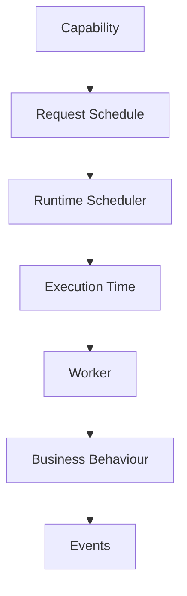
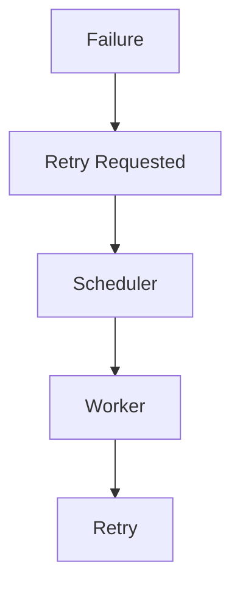
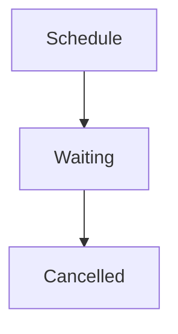

<!--
File: docs/engineering/guides/meg-002-event-driven-runtime/11-scheduling.md
Document: MEG-002
Status: Draft
-->

# Scheduling

> *Time is a runtime concern. Business capabilities should describe what must happen, never when it should happen.*

---

# Purpose

Not all work should execute immediately. Some work should occur:

- after a delay
- at a specific time
- periodically
- after a timeout
- once another condition has been satisfied

Within Mosaic these concerns belong to the runtime scheduler, which means business capabilities should never implement their own scheduling logic. Instead, they describe work, and the runtime determines when that work should execute.

---

# Philosophy

Within Mosaic:

> **Capabilities own intent. The runtime owns time.**

Time is infrastructure, so business logic should remain completely unaware of:

- timers
- cron expressions
- polling loops
- scheduling algorithms
- worker allocation

This separation allows scheduling behaviour to evolve independently of business behaviour.

---

# Why Scheduling Exists

Many runtime operations are naturally delayed. Examples include:

- Metadata refresh
- Cache invalidation
- Periodic library scanning
- Module health checks
- Retry backoff
- Cleanup tasks
- Token expiration
- Scheduled notifications

These operations share one common characteristic: they depend upon **time**, not user interaction.

---

# Runtime Model

Every scheduled task follows the same lifecycle, in which a capability requests a schedule and the runtime carries that request through to execution and onward into events.



Notice that the capability never manages the timer itself.

---

# Scheduling Responsibilities

Responsibility divides along a single line: the scheduler owns the mechanics of time, whereas the capability owns everything that decides what the time is for. The runtime scheduler owns:

- delayed execution
- recurring execution
- retry scheduling
- timeout scheduling
- worker allocation
- schedule persistence
- cancellation
- observability

It intentionally does **not** own:

- business decisions
- task implementation
- workflow orchestration

A scheduler that took on any of those would couple timing to behaviour, and the separation this chapter exists to establish would be lost.

---

# Business Responsibilities

Capabilities may request scheduling, but they should never implement scheduling. A Metadata Capability that issues a Request Refresh In 24 Hours is doing the former, whereas a poor implementation that performs Sleep 24 Hours and only then a Refresh has taken ownership of time itself. Business logic should remain independent of time.

---

# One-Time Scheduling

One-time tasks execute once. Refresh Metadata Tomorrow, Expire Invitation in 24 Hours and Retry Download in 30 Seconds are all examples of the same shape, because each names a single future moment rather than a repeating one. Once complete, the schedule is removed.

---

# Recurring Scheduling

Recurring tasks execute repeatedly — a Library Scan Every 6 Hours, a Health Check Every Minute, a Metrics Snapshot Every 30 Seconds — and unlike one-time tasks they are not removed by their own completion. Recurring schedules remain active until explicitly cancelled.

---

# Delayed Execution

Some work should intentionally occur later. When PlaybackStopped is published, for example, the runtime can Schedule History Sync to run 30 Seconds Later rather than immediately. Delaying work can reduce unnecessary processing, batch operations and improve responsiveness, and the runtime owns these decisions.

---

# Retry Scheduling

Retries are simply scheduled work: a failure produces a retry request, the scheduler holds that request until it becomes due, and a worker performs the retry.



Subscribers should never implement retry loops, because retries belong to the runtime. Future chapters define retry policies.

---

# Cron Jobs

Traditional cron jobs are discouraged. The poor pattern has Cron Poll Database in order to Look For Work on a fixed interval, whereas the preferred pattern lets an Event drive a Schedule which the runtime then goes on to Execute. The runtime should react to business events rather than continually polling for changes, although periodic schedules remain appropriate for genuine maintenance work.

---

# Schedule Ownership

Every scheduled task has exactly one owner: the Metadata Capability owns the Metadata Refresh Schedule, and only the owning capability should create or cancel it. The runtime executes schedules, but it does not define them.

---

# Schedule Identity

Every scheduled task should have a unique identifier, because identity is what enables:

- cancellation
- diagnostics
- metrics
- replay
- observability

The scheduler should therefore treat schedules as first-class runtime objects rather than as anonymous timers.

---

# Persistence

Long-running schedules should survive runtime restarts. Examples include:

- recurring scans
- subscription renewals
- maintenance tasks

Ephemeral schedules may remain in memory, whereas persistent schedules should be restored during startup. The runtime owns persistence, so capabilities remain unaware of it.

---

# Cancellation

Schedules should be cancellable, and cancellation follows a typical lifecycle of its own.



Cancellation should release resources, prevent future execution and remain observable. It should never silently disappear.

---

# Scheduling Events

The scheduler should publish runtime events as schedules move through their lifecycle, including `TaskScheduled`, `TaskExecuted`, `TaskCancelled` and `TaskExpired`. These are **runtime events** rather than business events, which means they improve observability without coupling business capabilities to scheduler internals.

---

# Scheduling Precision

Not every scheduled task requires millisecond precision. Playback synchronisation and session expiration are high precision work, whereas metadata refresh, library scan and cleanup are low precision and tolerate drift. The scheduler should optimise for correctness rather than unnecessary precision.

---

# Resource Management

Scheduling should remain bounded, because every scheduled task consumes runtime resources. The runtime should therefore avoid:

- unlimited pending schedules
- duplicate recurring schedules
- abandoned timers

Ownership must remain explicit.

---

# Restart Behaviour

Following a restart, the runtime restores its persistent schedules and resumes execution, which means business capabilities should not need to recreate long-lived schedules manually.

---

# Observability

The scheduler should expose:

- active schedules
- completed schedules
- cancelled schedules
- execution latency
- queue depth
- missed executions

Work that has not happened yet is invisible unless the scheduler reports it, so scheduling should remain one of the most observable runtime components.

---

# Scaling

Scheduling decisions should remain centralised while execution remains distributed: the scheduler decides **when**, workers decide **where**, and capabilities decide **what**. This separation keeps responsibilities clear.

---

# Anti-Patterns

The following practices are prohibited.

## Sleeping Inside Business Logic

```go
time.Sleep(...)
```

Business capabilities should never delay themselves.

---

## Infinite Polling

```go
for {
    check()
    sleep()
}
```

Polling should be replaced with events wherever practical.

---

## Self-Scheduling Capabilities

Capabilities creating their own timer infrastructure. Scheduling belongs to the runtime.

---

## Hidden Timers

Background timers started automatically during object construction. All scheduling should remain explicit.

---

## Duplicate Schedules

Multiple recurring schedules performing identical work. The runtime should detect and prevent unnecessary duplication.

---

## Scheduling Business Decisions

The scheduler should never determine whether Metadata Refresh ought to happen at all; it simply executes requested work, because business decisions belong to capabilities.

---

# Mosaic Guidelines

Within Mosaic:

- The runtime must own scheduling.
- Business capabilities must remain time agnostic.
- Retries must be scheduled by the runtime.
- Persistent schedules should survive restarts.
- Schedules must be observable.
- Schedules must be cancellable.
- Polling should be replaced with events wherever practical.
- Workers must execute scheduled work.
- The scheduler must remain business agnostic.

---

# Summary

Scheduling is infrastructure, and it allows capabilities to express **intent** without becoming responsible for **time**. By separating scheduling from business behaviour, the Mosaic Runtime gains:

- deterministic execution
- simplified capabilities
- improved observability
- graceful recovery
- scalable worker allocation

Time becomes another service provided by the platform, so capabilities remain focused entirely on business behaviour.
