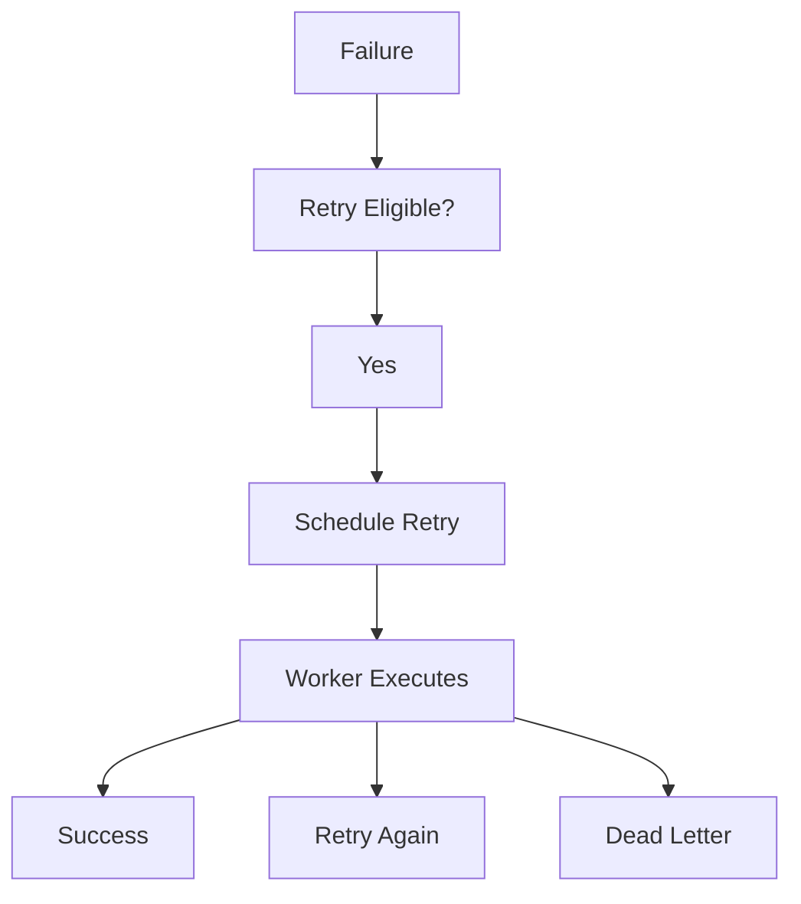
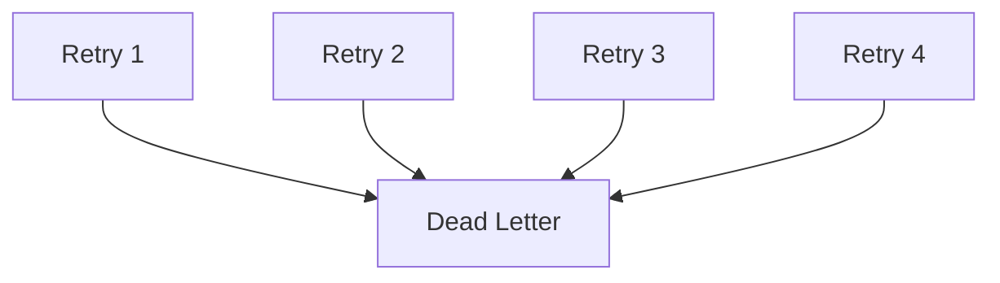

<!--
File: docs/engineering/guides/meg-002-event-driven-runtime/13-retry-strategy.md
Document: MEG-002
Status: Draft
-->

# Retry Strategy

> *Retries exist to recover from transient failures. They should never become an infinite substitute for fixing permanent ones.*

---

# Purpose

Failure is an expected characteristic of distributed systems: networks fail, services become temporarily unavailable, databases restart and modules crash. The purpose of the Mosaic Runtime is therefore not to eliminate failure but to recover from transient failure safely while exposing permanent failure clearly. This document defines how retries are performed throughout the Mosaic Runtime.

---

# Philosophy

Within Mosaic:

> **Retry infrastructure belongs to the runtime. Recovery belongs to the capability.**

Business capabilities should never implement retry loops. Instead they should:

- return failures
- remain idempotent
- allow the runtime to decide when, whether and how work should be retried.

Retry then remains something the runtime can count, bound and observe, none of which is possible when a capability retries inside itself.

---

# Why Retries Exist

Consider a MetadataDownloaded event whose subscriber attempts to Store Metadata and finds the Database Connection Lost. The business operation has not failed permanently, because the database was only temporarily unavailable, so retrying later is entirely reasonable.

Now consider a `media.imported` event carrying an Invalid Media Identifier. Retrying will never succeed, because the failure is permanent. Understanding this distinction is fundamental.

---

# Failure Categories

Failures fall into two categories: transient failures, which the runtime should retry, and permanent failures, which should simply fail. The runtime should never blindly retry every failure.

---

# Transient Failures

Transient failures are expected to recover naturally. Examples include:

- temporary network failure
- service unavailable
- database restart
- timeout
- rate limiting
- temporary file lock

Retries are appropriate here, because the condition causing the failure is expected to clear without intervention.

---

# Permanent Failures

Permanent failures cannot succeed through repetition. Examples include:

- invalid payload
- unsupported event version
- missing required fields
- business validation failure
- corrupted data

Retries should not occur. These failures should be surfaced immediately, because repetition only delays the moment somebody learns that the failure needs fixing.

---

# Retry Lifecycle

Every retry follows the same lifecycle, in which a failure is tested for retry eligibility, an eligible retry is scheduled, and a worker executing that retry may succeed, retry again or exhaust the strategy and reach the dead letter.



Retry is therefore another form of scheduled work rather than a special execution path.

---

# Runtime Ownership

The runtime owns:

- retry scheduling
- retry timing
- retry counting
- retry cancellation
- retry observability

Capabilities own:

- determining whether the operation succeeded
- returning meaningful failures
- remaining idempotent

Responsibilities remain clearly separated, which is what allows retry behaviour to change without business code changing with it.

---

# Exponential Backoff

Retries should use exponential backoff, doubling the interval between attempts — for example 1 second, then 2 seconds, 4 seconds, 8 seconds and 16 seconds. Backoff reduces cascading failures, unnecessary load and resource contention, whereas immediate retries often amplify outages. Exponential backoff with optional jitter is widely recommended to avoid synchronized retry storms. ([aws.amazon.com](https://aws.amazon.com/builders-library/timeouts-retries-and-backoff-with-jitter/))

---

# Jitter

Retry timing should include random jitter. Without jitter, 10,000 retries scheduled together all fire exactly 30 seconds later and arrive as 10,000 more requests at the same instant; with jitter the same 10,000 retries are distributed across time. This significantly reduces retry storms.

---

# Maximum Retries

Retries must be bounded, so that a sequence of attempts eventually stops rather than continuing indefinitely.



Infinite retries are prohibited, and every retry strategy must eventually terminate.

---

# Retry Budget

The runtime should maintain retry budgets, because budgets prevent one failing capability from consuming disproportionate runtime resources. Examples include maximum retries, maximum retry duration and maximum concurrent retries. Resource usage should remain predictable.

---

# Retry Delay Ownership

Capabilities should never decide retry timing. Sleeping inside business logic is poor practice:

```go
time.Sleep(30 * time.Second)
```

Better, the capability returns an error and the runtime schedules the retry. Time remains a runtime concern, and business logic remains pure.

---

# Idempotency Requirement

Retries assume idempotent subscribers. Without idempotency a retry produces duplicate business state, whereas with idempotency the same retry arrives at the correct final state. Retry safety therefore depends entirely upon the previous chapter.

---

# Retry Classification

Errors should communicate retry intent, classifying a failure conceptually as either Retryable or Permanent. The runtime should not inspect error messages, so capabilities should classify failures explicitly. Future runtime APIs should expose this distinction clearly.

---

# Retry Observability

Every retry should produce telemetry. Examples include:

- retry count
- retry latency
- retry success
- retry exhaustion
- retry cancellation

Operators should be able to understand why retries occurred, how frequently, and whether they succeeded, because retries should never become invisible.

---

# Retry Cancellation

Retries should respect runtime shutdown, so a retry that is still scheduled when shutdown is requested is cancelled rather than executed. The runtime should never execute retries after shutdown begins unless explicitly configured to resume them after restart.

---

# Retry Persistence

Pending retries should survive runtime restarts, which means a retry scheduled before the runtime stops is resumed once the runtime starts again. Retry scheduling should be durable wherever business correctness depends upon eventual completion.

---

# Dead Letter Transition

Retries eventually terminate: once retries are exhausted the work passes to the dead letter and becomes the subject of operator investigation. Retries are intended to recover temporary failures, not to conceal permanent ones.

---

# Immediate Retry

Immediate retry should be rare. Appropriate examples include optimistic locking conflicts and short-lived resource contention, and even then retry count should remain bounded.

---

# Retry Transparency

Business capabilities should not know the current retry number, the retry delay or the retry scheduling algorithm. They simply process events, whereas the runtime manages delivery behaviour.

---

# Retry Independence

Each subscriber owns its own retry lifecycle. A single `media.imported` event may leave metadata retrying while artwork and search have already succeeded, so subscriber retries should never block unrelated capabilities and failure isolation remains intact.

---

# Retry Metrics

The runtime should expose:

- retries scheduled
- retries completed
- retries cancelled
- retries exhausted
- average retry latency
- retry queue depth

Retry metrics provide early warning of degrading platform health.

---

# Anti-Patterns

The following practices are prohibited.

## Infinite Retry Loops

Retrying forever, with no condition under which the strategy terminates.

---

## Sleeping Inside Subscribers

Blocking a subscriber to create a delay the runtime should have owned.

```go
time.Sleep(...)
```

---

## Retrying Validation Failures

Invalid business input should fail immediately.

---

## Subscriber-Owned Retry Logic

Retry belongs to runtime infrastructure.

---

## Retrying Without Idempotency

Duplicate execution must always be safe.

---

## Retry Storms

Large numbers of simultaneous retries without backoff, jitter or budgets.

---

# Mosaic Guidelines

Within Mosaic:

- Retries must remain runtime responsibilities.
- Retries must use exponential backoff.
- Retries should include jitter.
- Retries must remain bounded.
- Subscribers must remain idempotent.
- Retry scheduling should survive restart where required.
- Retry behaviour must remain observable.
- Permanent failures must not be retried.
- Retry exhaustion must transition to dead-letter handling.

---

# Relationship to the Runtime

Retry is simply another form of scheduling. The runtime already owns time, workers and execution, so retry naturally becomes another scheduled execution. This keeps business capabilities free from infrastructure concerns while allowing the runtime to evolve retry strategies without modifying business code.

---

# Summary

Retries should recover temporary failure, and they should never disguise permanent failure. Within Mosaic, retries are:

- runtime managed
- bounded
- observable
- idempotent
- deterministic

When combined with idempotent subscribers and immutable events, retries become a routine operational mechanism rather than a source of architectural complexity.
