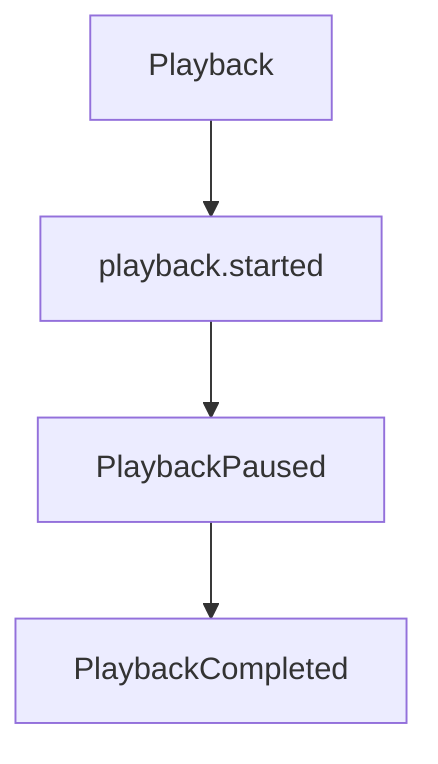
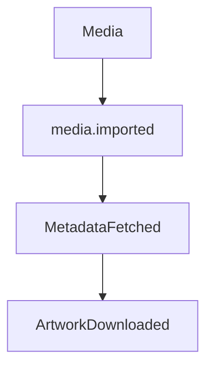

<!--
File: docs/engineering/guides/meg-002-event-driven-runtime/14-event-ordering.md
Document: MEG-002
Status: Draft
-->

# Event Ordering

> *Correct systems do not depend upon perfect ordering. They depend upon correct business state.*

---

# Purpose

Distributed systems naturally introduce uncertainty, and events may be delayed, duplicated, replayed, processed concurrently or delivered out of chronological order. The Mosaic Runtime intentionally avoids guaranteeing global event ordering because doing so significantly reduces scalability and increases coupling. Instead, capabilities are engineered to converge upon correct business state regardless of delivery order wherever practical. This document defines the ordering guarantees provided by the Mosaic Runtime and the responsibilities of capabilities consuming events.

---

# Philosophy

Within Mosaic:

> **Ordering is a business concern, not a transport guarantee.**

The runtime transports events, whereas business capabilities determine whether order is significant. When ordering is required, it should be modelled explicitly rather than assumed implicitly.

---

# Why Ordering Is Difficult

Consider two events, `playback.started` followed by PlaybackCompleted. Business chronology is obvious, but runtime chronology is not: a temporary network delay may deliver PlaybackCompleted before `playback.started`. Both events are valid and only their arrival differs, so subscribers must distinguish between event occurrence and event delivery, which are different concepts.

---

# Occurrence vs Delivery

Every event has two timelines: a business timeline on which it occurred, and a runtime timeline on which it was delivered. The runtime preserves occurrence metadata but does not guarantee delivery order, so subscribers should reason about business time rather than arrival time.

---

# Runtime Guarantees

The Mosaic Runtime guarantees:

- every accepted event will eventually be delivered (subject to retry policy)
- every event preserves its metadata
- every event preserves its occurrence timestamp

The runtime does **not** guarantee:

- global ordering
- subscriber ordering
- cross-capability ordering
- simultaneous delivery

These guarantees intentionally remain minimal, because guaranteeing more would reintroduce the coupling the runtime exists to avoid.

---

# Ordering Domains

Ordering is meaningful only within a bounded business context. Within Playback, for example, ordering matters.

Between PlaybackCompleted and MetadataFetched, however, there is usually no meaningful ordering relationship. Capabilities should therefore define ordering only where the business genuinely requires it.

---

# Global Ordering

Global ordering is prohibited. Passing every event through a single global queue served by one worker would produce it, and while that approach is simple it limits throughput, increases latency, couples unrelated capabilities and reduces resilience. The runtime intentionally avoids this architecture, because independent work should remain independent.

---

# Per-Entity Ordering

Where ordering is required, it should generally be scoped to a business entity.

Ordering exists here because all of these events concern the same media item, which provides deterministic behaviour without requiring global coordination.

---

# Subscriber Expectations

Subscribers must assume duplicate delivery, delayed delivery and reordered delivery, and they should not assume that what they receive arrives in chronological order. Instead they should validate current business state before performing work.

---

# State Validation

Suppose PlaybackCompleted arrives first. The subscriber should ask what the current playback state is, rather than whether `playback.started` arrived, because business state is authoritative and event order is only informative.

---

# Sequence Numbers

Some event families benefit from sequence numbers, which number the events of a single entity — sequence 1, sequence 2, sequence 3 — so that subscribers can detect missing events, duplicates and stale events. They should be introduced only where ordering genuinely matters, and most events do not require them.

---

# Version vs Sequence

Do not confuse version with sequence. Version identifies the schema, whereas sequence identifies business chronology, so they solve entirely different problems.

---

# Concurrent Events

Independent capabilities may legitimately publish events simultaneously. A `media.imported` event may lead to MetadataFetched and then ArtworkDownloaded in one workflow while separately leading to SearchIndexed in another, and neither workflow depends upon the other. The runtime should allow maximum concurrency, because artificial ordering reduces scalability.

---

# Ordering Through Events

When business ordering genuinely exists, model it explicitly: MetadataFetched leads to ArtworkRequested, which in turn leads to ArtworkDownloaded. Each event naturally establishes the next business step, so ordering emerges through business facts rather than runtime configuration.

---

# Replay Ordering

Replay should preserve original occurrence order where practical. Subscribers must nevertheless remain resilient to duplicate processing and partial replay, because replay correctness should never depend solely upon transport order. Business state remains authoritative.

---

# Event Timestamps

Subscribers should use Occurred At when chronological reasoning is required, and should not use Received At. Delivery time reflects runtime behaviour, whereas occurrence time reflects business reality.

---

# Missing Events

Subscribers should tolerate missing events gracefully. Where PlaybackCompleted arrives and `playback.started` is missing, possible responses include:

- query current state
- ignore stale event
- log diagnostic information
- request reconciliation

Subscribers should never enter undefined behaviour because one expected event failed to arrive.

---

# Stale Events

Events may become stale. MetadataFetched may arrive several hours after MetadataCorrected has already been applied, and receiving the older event later should not overwrite newer business state. Subscribers should therefore compare timestamps, versions and current state before applying changes.

---

# Causal Ordering

Where business causality matters, subscribers should use Correlation ID and Causation ID rather than delivery order, because these identifiers describe business relationships and transport order does not.

---

# Runtime Behaviour

The runtime intentionally avoids reordering events and delivers them as they become available, leaving capabilities to determine whether ordering is relevant. This keeps the runtime simple, scalable and transport agnostic, with business semantics remaining outside runtime infrastructure.

---

# Anti-Patterns

The following practices are prohibited.

## Assuming FIFO Globally

Expecting that Event A and Event B are always delivered in order.

---

## Subscriber Registration Order

Assuming subscriber execution order has business meaning.

---

## Delivery Time As Business Time

Using Received At instead of Occurred At.

---

## Blocking Unrelated Work

Preventing independent capabilities from progressing while waiting for ordered processing.

---

## Runtime-Owned Business Ordering

The runtime should never determine that Playback precedes Metadata, which in turn precedes Search. Business ordering belongs to capabilities.

---

# Mosaic Guidelines

Within Mosaic:

- Global ordering must not be assumed.
- Subscribers must tolerate out-of-order delivery.
- Business state must remain authoritative.
- Ordering should be scoped to business entities where required.
- Sequence numbers should only be introduced when justified.
- Event timestamps should represent business occurrence.
- Correlation and causation should express business relationships.
- Runtime delivery must remain independent of business semantics.

---

# Relationship to the Runtime

Relaxing ordering guarantees is one of the key architectural decisions enabling Mosaic's scalability. Because the runtime does not attempt to globally sequence every event:

- worker pools remain highly parallel
- modules remain independent
- failures remain isolated
- throughput scales naturally
- capabilities evolve independently

Where ordering matters, business capabilities model it explicitly, and where it does not, the runtime remains free to optimise for concurrency.

---

# Summary

Perfect ordering is an attractive illusion, and in distributed systems it often comes at the expense of scalability, resilience and simplicity. Within Mosaic the runtime delivers immutable business facts, and capabilities determine how those facts should influence business state. By treating ordering as a business concern rather than a runtime guarantee, the platform remains both highly concurrent and architecturally simple.
