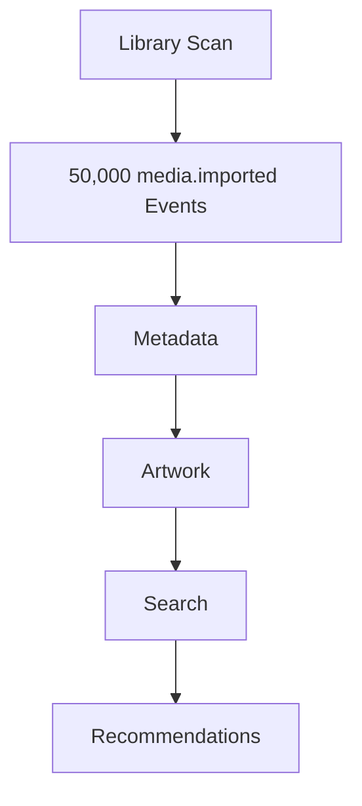
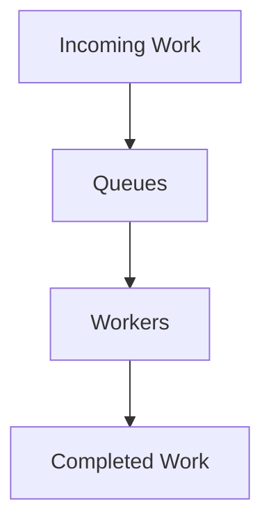
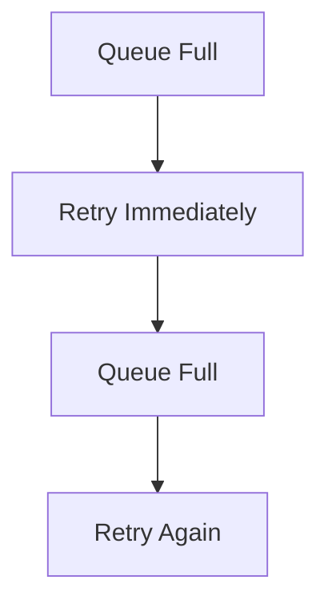
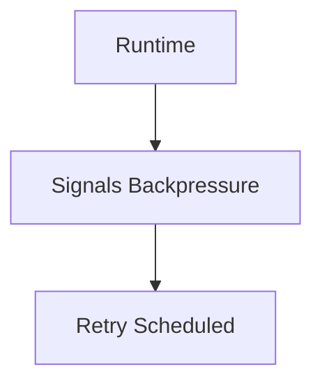
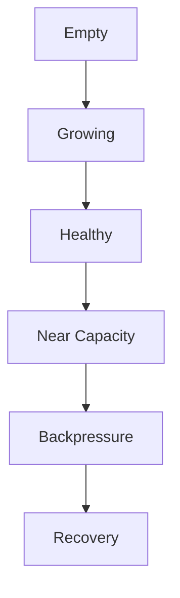
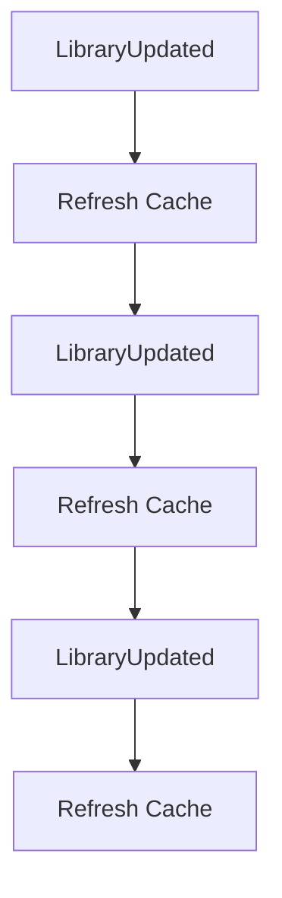
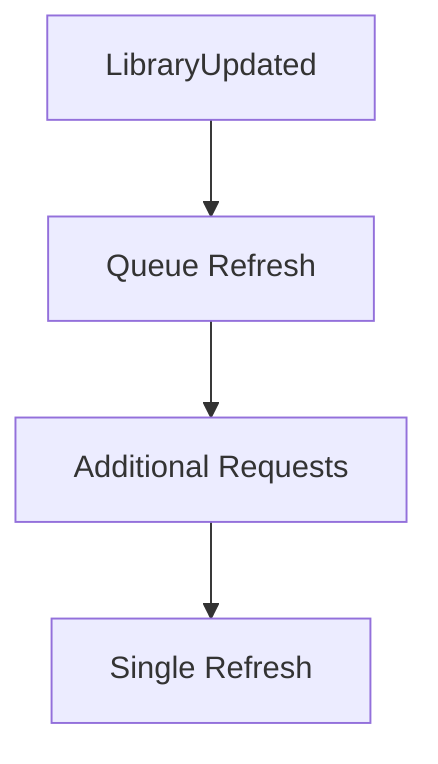
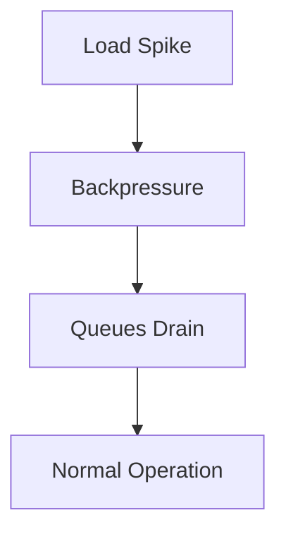

<!--
File: docs/engineering/guides/meg-002-event-driven-runtime/15-backpressure.md
Document: MEG-002
Status: Draft
-->

# Backpressure

> *A healthy runtime knows when to slow down. An unhealthy runtime tries to do everything at once.*

---

# Purpose

The Mosaic Runtime is designed to operate continuously under varying workloads, and during normal operation events flow smoothly through the platform. Temporary spikes are nevertheless inevitable. Examples include:

- importing a large media library
- installing a new module
- rebuilding metadata
- replaying historical events
- recovering after downtime

Without backpressure, these bursts can overwhelm workers, databases, storage, external APIs, memory and CPU. This document defines how the Mosaic Runtime controls workload to maintain predictable behaviour under load.

---

# Philosophy

Within Mosaic:

> **The runtime should slow work down before it breaks.**

Throughput is desirable, but stability is mandatory. When resources become constrained, the runtime should reduce intake rather than consume unlimited memory or spawn unlimited work.

---

# What Is Backpressure?

Backpressure is the mechanism through which the runtime communicates:

> **"I cannot safely accept more work right now."**

Rather than continuing to accept events indefinitely, the runtime intentionally limits throughput to protect overall system health. Backpressure is a fundamental concept in reactive systems because it allows producers and consumers to operate at sustainable rates instead of overwhelming one another. ([reactivemanifesto.org](https://www.reactivemanifesto.org/))

---

# Why Backpressure Matters

Consider a single library scan and the work it sets in motion:

If every event immediately creates work, memory usage grows, queues expand indefinitely, workers become saturated and external providers become rate limited. Eventually the runtime becomes unstable, and backpressure exists to prevent that.

---

# Runtime Model

The runtime continuously balances the work arriving against the capacity available to complete it:

If workers cannot keep pace, queues grow, and eventually the runtime begins applying backpressure.

---

# Backpressure Principles

The runtime should always prefer slow processing and a stable runtime over unlimited throughput and resource exhaustion, because graceful degradation is always preferable to catastrophic failure.

---

# Bounded Queues

Every runtime queue must have a maximum size, and reaching that maximum capacity is what causes the queue to apply backpressure. Unbounded queues are prohibited, because unlimited buffering simply converts CPU pressure into memory pressure and eventually the runtime still fails.

---

# Queue Ownership

Each capability owns its own work queue, so the runtime maintains a Metadata Queue, an Artwork Queue, a Search Queue and a Recommendation Queue. Independent queues prevent slow capabilities from blocking unrelated work, which is how failure isolation remains intact.

---

# Worker Saturation

Suppose every worker serving Metadata is already busy. New work should queue, and if the queue becomes full backpressure should be applied. Workers should never grow without limit.

---

# Resource Protection

Backpressure protects:

- CPU
- memory
- database pools
- blob storage
- network connections
- external APIs

Protecting infrastructure is one of the runtime's primary responsibilities, and business capabilities should remain unaware that it is happening.

---

# Producer Behaviour

Publishers should never attempt to bypass runtime backpressure. The poor pattern retries immediately against a queue that is already full, so the retry finds the queue full again and retries again:

This amplifies overload. Instead, the runtime signals backpressure and schedules the retry itself:

The runtime controls recovery.

---

# Queue Growth

Queue depth should remain observable, because the runtime should begin protecting itself before queues become completely full rather than afterwards. A queue therefore moves through a typical lifecycle:

---

# Priority

Not all work is equally important. High priority work includes:

- Playback
- Authentication
- User interaction

Lower priority work includes:

- Metadata refresh
- Recommendation generation
- Analytics

The scheduler may prioritise critical work during sustained load, because business correctness should always take precedence over convenience.

---

# Load Shedding

Some work may be safely discarded, including duplicate refresh requests, repeated health checks and obsolete cache refreshes. Other work must never be discarded, including playback progress, authentication events and library imports. The runtime should understand this distinction.

---

# Coalescing

Repeated equivalent work should be combined where practical. Handled poorly, each LibraryUpdated event triggers a cache refresh of its own:

Handled better, the first event queues a refresh and the additional requests collapse into a single refresh:

The runtime should avoid redundant work whenever correctness permits.

---

# Rate Limiting

External systems frequently impose rate limits, including TMDB, AniList, Docker APIs and remote storage. Backpressure should naturally integrate with rate limiting, so that rather than failing continuously the runtime reduces throughput to sustainable levels.

---

# Module Isolation

Modules should never be capable of overwhelming the runtime. Suppose a third-party module produces millions of events; the runtime should:

- isolate the module
- apply backpressure
- preserve platform functionality

Platform stability always takes precedence over module throughput.

---

# Recovery

Backpressure should be temporary, applied while a load spike passes and released once the queues have drained:

Recovery should occur automatically, and manual intervention should rarely be required.

---

# Metrics

The runtime should expose:

- queue depth
- worker utilisation
- rejected work
- deferred work
- queue wait time
- average processing latency

These metrics provide early warning of runtime stress, and operators should identify overload before users experience degraded behaviour.

---

# Adaptive Scaling

Where supported, the runtime may increase worker capacity during sustained load. Scaling should nevertheless remain bounded, because unlimited worker creation simply moves the bottleneck elsewhere. Scaling should complement backpressure, not replace it.

---

# Circuit Breakers

Backpressure integrates naturally with circuit breakers. Suppose TMDB is offline: instead of issuing a retry, and another retry, and another retry after that, the runtime should open the circuit, reduce requests and recover gradually. This protects both the runtime and external dependencies.

---

# Replay

Replay should respect normal backpressure. Historical replay should never bypass queues, workers, rate limits or resource limits, because replay should appear identical to live processing from the runtime's perspective.

---

# Anti-Patterns

The following practices are prohibited.

## Unlimited Queues

Appending forever to a queue that has no bound.

---

## Unlimited Workers

Creating a worker whenever the queue is full, and repeating that forever.

---

## Busy Waiting

Workers repeatedly polling empty queues.

---

## Ignoring Resource Limits

Continuing to accept work after resource exhaustion.

---

## Module Starvation

Allowing one module to consume all runtime capacity.

---

## Immediate Retry During Overload

Retries should reduce pressure, not increase it.

---

# Mosaic Guidelines

Within Mosaic:

- Every queue must be bounded.
- Every worker pool must be bounded.
- The runtime must apply backpressure before resource exhaustion.
- Queue depth must remain observable.
- Modules must be isolated from one another.
- Recovery should occur automatically.
- Replay must respect runtime limits.
- High-priority work should remain responsive during overload.
- Stability must always take precedence over throughput.

---

# Relationship to the Runtime

Backpressure is the mechanism that keeps the Mosaic Runtime stable under unpredictable workloads. Combined with:

- worker pools
- scheduling
- retries
- idempotency
- event isolation

it allows the platform to remain responsive even during significant operational stress. Rather than treating overload as an exceptional condition, the runtime treats it as an expected characteristic of a long-running system, and that philosophy produces a platform that fails gracefully rather than catastrophically.

---

# Summary

The purpose of backpressure is not to process more work; it is to process work sustainably. Within Mosaic, backpressure ensures:

- predictable resource usage
- resilient modules
- protected infrastructure
- graceful degradation
- operational stability

The runtime should always prefer temporary slowdown over permanent failure, and that single principle keeps the platform healthy as it grows from a handful of capabilities to hundreds of independently developed modules.
