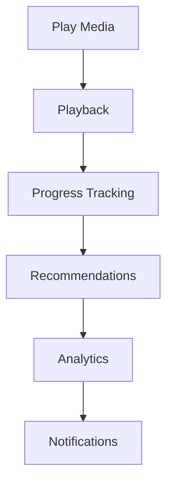
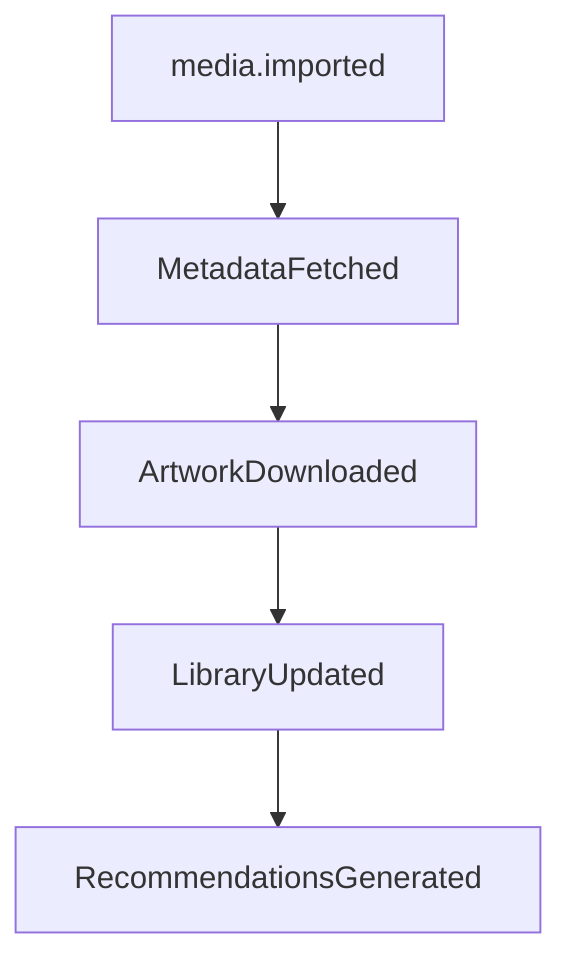
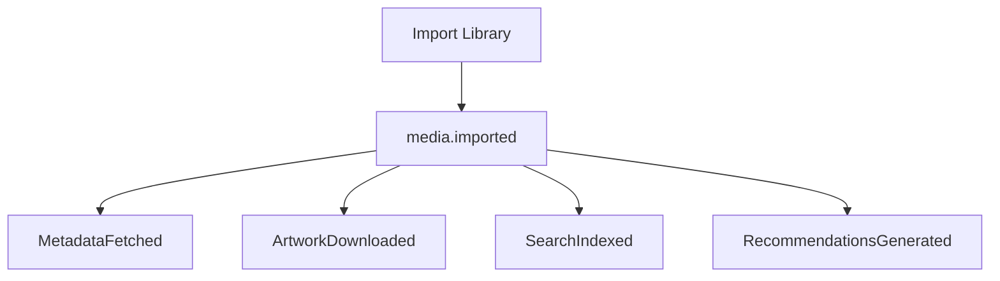
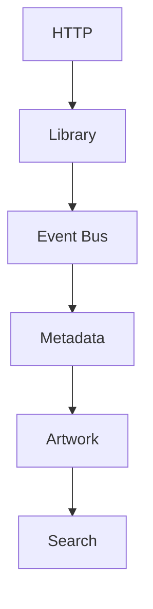
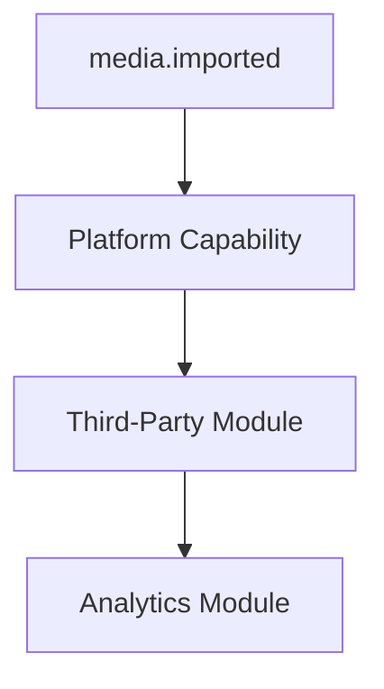
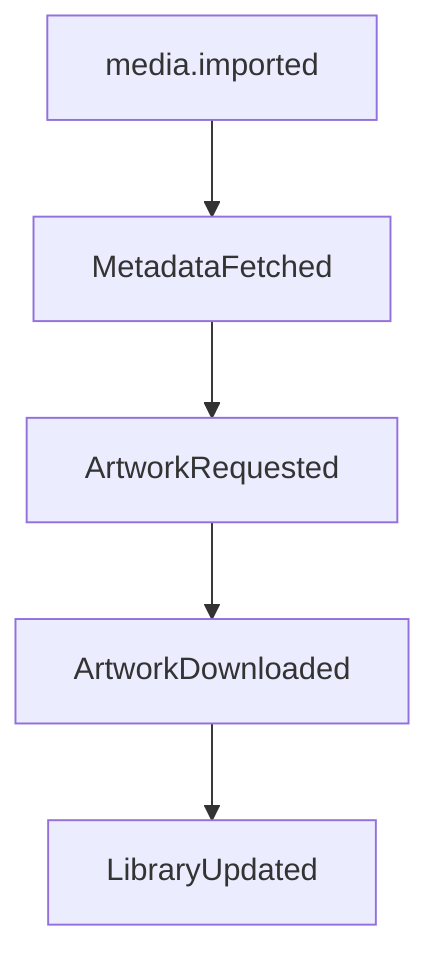

<!--
File: docs/engineering/guides/meg-002-event-driven-runtime/16-correlation-and-observability.md
Document: MEG-002
Status: Draft
-->

# Correlation and Observability

> *A distributed system cannot be understood by reading code alone. It must explain itself while it is running.*

---

# Purpose

As the Mosaic Runtime grows, individual business operations will span multiple capabilities, workers and modules. No single component observes the whole of such an operation, so the runtime can only be understood from what it reports while it runs. Consider a simple user action and the work it sets in motion:

By the time the operation completes, dozens of events may have been published, and without observability understanding what actually happened becomes extremely difficult. This document defines how the Mosaic Runtime provides complete visibility into distributed execution.

---

# Philosophy

Within Mosaic:

> **Every significant runtime action should be traceable from beginning to end.**

The runtime should never become a black box. Instrumentation added after an event has been processed cannot explain what that event did, so the answers must already be present in what the runtime emits while it works. Operators should be able to answer the following questions without modifying production code:

- What happened?
- Why did it happen?
- What caused it?
- What failed?
- How long did it take?
- Which capability was responsible?

---

# Observability Pillars

The Mosaic Runtime adopts the three pillars of observability: Logs, Metrics and Traces. Each provides different information, and together they explain runtime behaviour. Modern observability platforms, including OpenTelemetry, are built around these three signal types. ([opentelemetry.io](https://opentelemetry.io/docs/concepts/observability-primer/))

---

# Correlation

Correlation links related work together. Without it the runtime sees only individual events, each valid in isolation and none of them evidence of the operation that produced them. Suppose a user imports media:

Although many capabilities participate, they all belong to one business operation, and correlation is what allows the runtime to reconstruct that workflow.

---

# Correlation ID

Every workflow begins with a Correlation ID. An HTTP Request arrives, a Correlation ID is created for it, and every event raised while serving that request carries the same Correlation ID. The Correlation ID therefore remains constant throughout the lifetime of the workflow, and it identifies:

> **One business operation.**

Not one event.

---

# Causation ID

Correlation explains what belongs together, whereas causation explains what directly caused this event. In the chain that runs from `media.imported` to `MetadataFetched` to `ArtworkDownloaded`, each event identifies its immediate parent, so `ArtworkDownloaded` carries a Causation ID naming `MetadataFetched`. Together the two identifiers describe different structures: correlation creates workflows, whereas causation creates dependency graphs.

---

# Event Graph

Combining Correlation and Causation naturally produces an event graph, because correlation supplies the workflow the events belong to and causation supplies each event's immediate parent within it. A single import therefore expands into a structure rather than a sequence:

This graph allows operators to understand exactly how work propagated through the runtime.

---

# Distributed Tracing

Every event should participate in distributed tracing. Correlation and causation establish which events belong to a workflow and what caused each of them, but neither says where the time went, and tracing answers questions such as:

- Which capability was slow?
- Which worker executed the task?
- Which dependency failed?
- Where was latency introduced?

To answer them, tracing should span HTTP, Workers, the Event Bus, Modules and External APIs. OpenTelemetry provides a vendor-neutral standard for propagating tracing context across distributed systems. ([opentelemetry.io](https://opentelemetry.io/docs/concepts/signals/traces/))

---

# Trace Context

The runtime should automatically propagate trace context across every hop a workflow takes:

Business capabilities should not manually manage trace propagation, because the runtime owns tracing infrastructure.

---

# Structured Logging

Every runtime component should emit structured logs. Because an entry carries the Correlation ID and Causation ID, it can be placed within the workflow it came from rather than read in isolation. A log entry carries, for example:

- Timestamp
- Level
- Correlation ID
- Causation ID
- Capability
- Worker
- Event
- Message

Logs should be machine-readable rather than free-form text, because structured logging enables reliable filtering, aggregation and analysis.

---

# Logging Philosophy

Logs should explain unexpected behaviour, failures, lifecycle transitions and operational decisions. Logs should **not** describe routine successful execution. A poor log records `Processed Event` 10,000 times, whereas a good one records `Retry exhausted. Moving event to dead letter queue.` Routine behaviour belongs in metrics, and unexpected behaviour belongs in logs.

---

# Metrics

Metrics describe system health. They are the right home for the routine behaviour that logs deliberately omit, because a count carries the shape of ordinary work at a fraction of the volume that recording each occurrence would cost. Every capability should expose:

- events processed
- processing latency
- failures
- retries
- queue depth
- throughput

Metrics answer:

> **How healthy is the platform?**

They do not explain individual requests, which is why traces and logs exist alongside them.

---

# Traces

Traces explain one workflow, metrics explain all workflows and logs explain exceptional workflows, so each serves a different purpose: metrics describe platform health, traces describe a single workflow, and logs describe unexpected behaviour. Together they form complete observability.

---

# Runtime Events

The runtime itself should publish operational events. Its own behaviour is as much a subject of observation as the work it carries, so lifecycle transitions and operational decisions are recorded rather than left implicit. Examples include:

- WorkerStarted
- WorkerStopped
- RetryScheduled
- RetryExhausted
- BackpressureApplied
- ModuleLoaded

These are runtime events rather than business events, because they describe platform behaviour.

---

# Capability Visibility

Observability applies to capabilities as much as to individual events, because an operator reconstructing a workflow also needs the condition of the components that handled it. Every capability should expose:

- health
- version
- subscriptions
- queue depth
- worker utilisation
- processing latency

Capabilities should become observable without requiring custom instrumentation, because instrumentation belongs to the runtime rather than to business logic.

---

# Health

Health should answer:

> **Can this capability currently perform work?**

A healthy capability reports `Ready`, a degraded capability reports something such as `External API unavailable`, and an unhealthy capability reports something such as `Database disconnected`. Health should therefore represent operational readiness rather than merely process existence.

---

# Correlation Across Modules

Third-party modules participate exactly like Platform capabilities, so a single event can pass through Platform and module code without leaving the workflow:

Every event shares the same Correlation ID, and the runtime should make module boundaries invisible during tracing.

---

# Failure Investigation

Suppose artwork generation fails. Operators should be able to answer the following without enabling additional debugging:

- Which media?
- Which worker?
- Which module?
- Which retry?
- Which API?
- Which event?
- Which workflow?

Observability should already contain the answer.

---

# Event Timeline

A single Correlation ID should naturally produce a timeline, because every event raised while serving the request carries that same identifier. Ordering those events by timestamp gives:

Reading the timeline should explain the entire workflow, and no additional context should be required.

---

# Runtime Instrumentation

Instrumentation belongs to the runtime, which means capabilities should not manually propagate trace IDs, generate correlation IDs, publish metrics or manage log formats. Business logic should remain unaware of operational infrastructure wherever practical.

---

# Privacy

Observability must respect privacy. The identifiers that make a workflow reconstructable also make everything recorded against that workflow easy to retrieve, so what logs and traces carry must be chosen deliberately. Logs and traces should not contain:

- passwords
- access tokens
- API keys
- encryption secrets
- personally identifiable information unless explicitly required

Correlation should identify workflows, not expose sensitive data.

---

# Anti-Patterns

The following practices are prohibited.

## Plain Text Logs

A log line reading `Something happened...` without structured metadata. Such a line cannot be reliably filtered, aggregated or analysed.

---

## Missing Correlation IDs

Events that cannot be connected to their originating workflow, which leaves the runtime unable to reconstruct that workflow at all.

---

## Manual Trace Propagation

Business capabilities managing tracing state directly, when tracing infrastructure is owned by the runtime.

---

## Logging Successful Every Operation

Generating excessive log volume for normal behaviour, when routine behaviour belongs in metrics rather than logs.

---

## Metrics Without Context

Counters that cannot be attributed to capabilities or event types, and which therefore cannot answer how healthy the platform is.

---

## Runtime Blindness

Components executing work without exposing health, metrics or traces. Such components turn the runtime into a black box.

---

# Mosaic Guidelines

Within Mosaic:

- Every workflow must have a Correlation ID.
- Every event should include a Causation ID.
- Structured logging must be used throughout the runtime.
- Metrics should describe platform health.
- Traces should describe workflow execution.
- Runtime instrumentation should be automatic.
- Modules must participate in runtime observability.
- Sensitive information must not appear in logs or traces.
- Every significant runtime action should be observable.

---

# Relationship to the Runtime

Observability is not an operational feature added after development; it is part of the runtime architecture. By making events, workers, scheduling, retries, queues and modules fully observable, the Mosaic Runtime becomes significantly easier to operate, debug, optimise and extend. Observability therefore enables confidence as much as it enables diagnostics.

---

# Summary

An event-driven platform cannot rely upon stack traces and debugger sessions alone, because its behaviour emerges from many independent capabilities working together. The purpose of observability is therefore simple:

> **Make the invisible visible.**

Every event, every worker, every retry, every module and every workflow: the runtime should always be able to explain itself.
