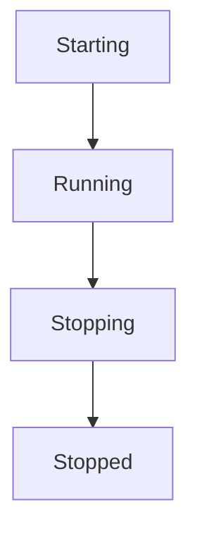
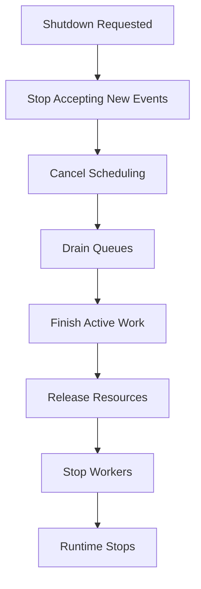
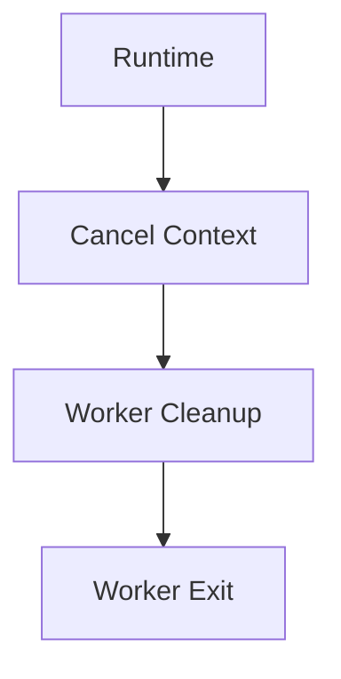
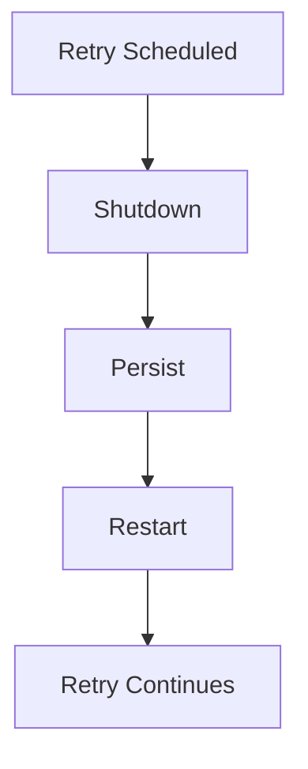
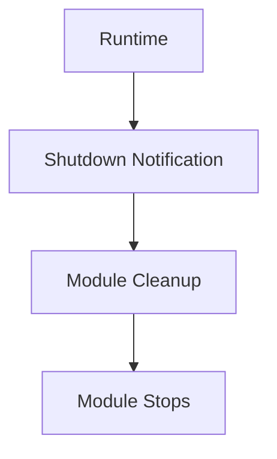
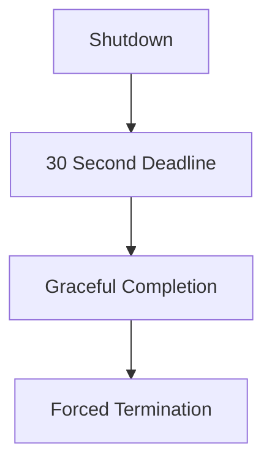
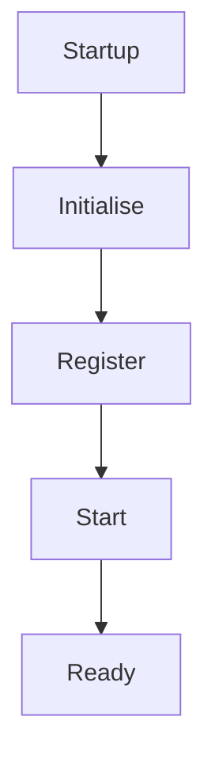
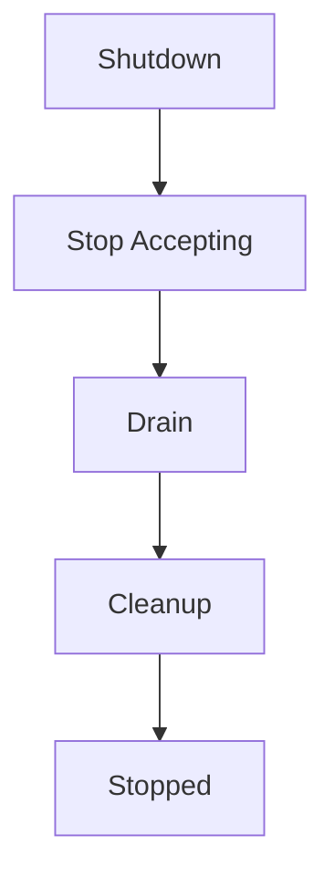
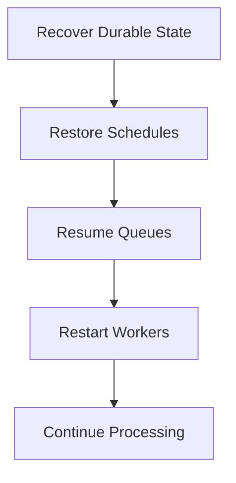

<!--
File: docs/engineering/guides/meg-002-event-driven-runtime/17-runtime-shutdown.md
Document: MEG-002
Status: Draft
-->

# Runtime Shutdown

> *Stopping a distributed system is as important as starting one. Shutdown is not the absence of work. It is the controlled completion of work.*

---

# Purpose

Every long-running system must eventually stop, and within the Mosaic Runtime shutdown is treated as a first-class architectural concern rather than as the interruption of one. Shutdown may occur because of:

- deployment
- upgrades
- maintenance
- scaling
- configuration changes
- operating system signals
- unexpected failures

That list spans routine operations and unexpected failure alike, which is precisely why stopping the platform should never lose events, corrupt state, abandon work or leave resources allocated. This document defines how the Mosaic Runtime performs graceful shutdown.

---

# Philosophy

Within Mosaic:

> **The runtime should stop accepting new work before stopping existing work.**

Graceful shutdown is the process of allowing in-flight operations to complete while preventing additional work from entering the system. The objective is deterministic behaviour, not immediate termination.

---

# Shutdown Principles

Every shutdown should satisfy the following principles.

- No new work accepted.
- Existing work allowed to finish where practical.
- Context cancellation propagated.
- Resources released.
- Runtime state remains consistent.
- Shutdown remains observable.

Every component participates, and no component should define its own shutdown semantics.

---

# Runtime Lifecycle

The runtime follows a predictable lifecycle.



Only the runtime transitions between lifecycle states. Capabilities react to transitions; they do not control them.

---

# Shutdown Sequence

Graceful shutdown follows the same sequence every time.



The order is deliberate, and changing it risks inconsistent behaviour.

---

# Initiating Shutdown

Shutdown begins when the runtime receives a termination request. Examples include:

- SIGTERM
- SIGINT
- administrator request
- orchestrator termination
- controlled restart

The runtime immediately transitions into Stopping, and no additional work should be accepted after this point.

---

# Stop Accepting New Work

The first responsibility of shutdown is preventing new work. Examples include:

- HTTP listeners stop accepting requests
- event publishers reject new publications
- schedulers stop creating future work
- module loading stops

Existing work continues, but new work does not begin.

---

# Scheduler Behaviour

During shutdown the scheduler should stop scheduling, cancel future timers and persist outstanding schedules. Recurring schedules should not continue creating work once shutdown begins, whereas long-lived schedules may be restored after restart, which is why persistence forms part of shutdown rather than being left to chance.

---

# Queue Draining

Existing queues should drain naturally, with workers continuing to process available tasks until either the queues empty or the cancellation deadline is reached. Queue draining reduces unnecessary retries after restart, because work that completes before the process stops does not need attempting again afterwards.

---

# Worker Shutdown

Workers receive cancellation through context rather than through direct termination, which gives each worker an opportunity to leave its work in a defined state.



On cancellation, workers should:

- finish current work where practical
- acknowledge completed work
- release resources
- terminate promptly

Workers should never ignore cancellation indefinitely, because graceful shutdown is bounded by a deadline that such a worker would exhaust.

---

# Active Tasks

Long-running tasks should periodically check:

```go
ctx.Done()
```

If cancellation occurs they should clean up, return a meaningful status and avoid partial state where practical. Business correctness should always take precedence over speed of shutdown.

---

# Event Delivery

Events already accepted by the Event Bus should continue through the delivery pipeline where practical, and the runtime should avoid abandoning accepted events. Where completion is impossible the work should remain durable and processing should resume after restart, so that shutdown never silently loses accepted work.

---

# Retry Queue

Pending retries should be persisted, so that a retry scheduled before shutdown is written to durable storage and continues once the runtime restarts.



Retries should survive controlled restarts, because business correctness depends upon eventual execution.

---

# Module Shutdown

Modules participate in runtime shutdown exactly like Platform capabilities, and they follow the same lifecycle.



Modules should never require special shutdown handling, because the runtime should treat all capabilities equally.

---

# Resource Cleanup

Every runtime component is responsible for releasing owned resources. Examples include:

- database connections
- file handles
- network sockets
- timers
- worker pools
- subscriptions

Ownership determines cleanup responsibility, so resources should never be released by unrelated components.

---

# Timeouts

Graceful shutdown should remain bounded, because draining that waits indefinitely cannot be distinguished from draining that has stalled.



The runtime should not wait indefinitely, because eventually the platform must terminate. The timeout should be configurable.

---

# Forced Shutdown

If graceful shutdown exceeds its deadline, the timeout triggers forced termination. Forced shutdown is a last resort because it may interrupt work, require retries and delay eventual consistency, so the runtime should make every reasonable attempt to avoid this outcome.

---

# Observability

Shutdown should be fully observable. Useful events include:

- RuntimeStopping
- QueueDrained
- WorkerStopped
- ModuleStopped
- RuntimeStopped

From these, operators should understand how long shutdown required, whether work completed, whether work was abandoned and whether retries were persisted. Shutdown should never appear mysterious.

---

# Health During Shutdown

During graceful shutdown, health should report Not Ready before Stopped, which allows load balancers, orchestrators and service discovery to stop routing new work before termination. The runtime remains alive throughout; it simply stops accepting additional work.

---

# Startup Symmetry

Startup and shutdown should mirror one another. Startup initialises, registers and starts each component until the runtime is ready.



Shutdown reverses that progression, closing admission before draining and cleaning up.



Symmetrical lifecycle management simplifies reasoning about the runtime.

---

# Crash Recovery

Unexpected crashes differ from graceful shutdown, so recovery cannot assume that any shutdown sequence ran at all. After restart the runtime recovers through a defined sequence.



Business correctness should therefore depend upon durability rather than upon graceful shutdown always succeeding.

---

# Testing Shutdown

Graceful shutdown should be tested. Examples include:

- worker cancellation
- queue draining
- retry persistence
- module cleanup
- scheduler shutdown

Shutdown is part of normal runtime behaviour, so it deserves the same engineering attention as startup.

---

# Anti-Patterns

The following practices are prohibited.

## Immediate Process Exit

Calling:

```go
os.Exit()
```

without cleanup. Nothing drains, and nothing releases what it holds.

---

## Ignoring Cancellation

Workers continuing indefinitely after shutdown begins, when such a worker is precisely what exhausts the graceful deadline.

---

## Accepting New Work During Shutdown

Continuing to accept events once shutdown has begun, when preventing new work is the first responsibility of shutdown.

---

## Resource Leaks

Failing to close:

- database pools
- timers
- subscriptions
- workers

---

## Silent Shutdown

Stopping without exposing runtime events or metrics, which leaves operators unable to establish whether work completed or was abandoned.

---

## Capability-Owned Shutdown

Business capabilities deciding when the runtime should terminate, when lifecycle belongs to the runtime.

---

# Mosaic Guidelines

Within Mosaic:

- Shutdown must be graceful.
- New work must stop before existing work.
- Workers must honour cancellation.
- Queues should drain where practical.
- Pending retries should survive restart.
- Resource ownership must determine cleanup.
- Shutdown should remain observable.
- Graceful shutdown should remain bounded by timeout.
- Capabilities must react to runtime lifecycle rather than define it.

---

# Relationship to the Runtime

Graceful shutdown completes the runtime lifecycle defined throughout MEG-002. Combined with worker ownership, scheduling, retries, idempotency and observability, shutdown becomes a predictable operational process rather than an emergency procedure. That consistency is what allows the Mosaic Runtime to deploy, scale, recover and evolve safely without compromising business correctness.

---

# Summary

Stopping a platform should be as carefully engineered as starting it. Within Mosaic, graceful shutdown ensures:

- accepted work completes
- future work pauses
- resources are released
- state remains consistent
- recovery remains possible

A runtime that cannot stop predictably cannot be considered production ready. Graceful shutdown is therefore not merely an operational concern; it is a fundamental architectural property of the Mosaic Runtime.
