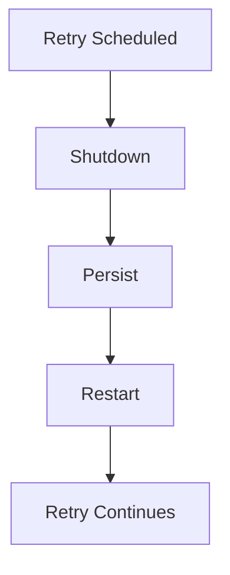
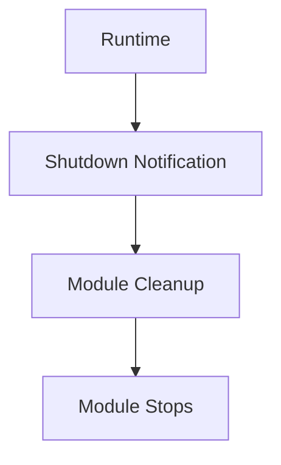

<!--
File: docs/engineering/guides/meg-002-event-driven-runtime/17-runtime-shutdown.md
Document: MEG-002
Status: Draft
-->

# Event Durability During Shutdown

> *Stopping a distributed system is as important as starting one. Shutdown is not the absence of work. It is the controlled completion of work.*

---

# Purpose

The shutdown sequence itself — its stages, their order, the per-service obligations, the deadline and the forced-termination fallback — is defined by [MEG-005 — Runtime Architecture](../meg-005-runtime-architecture/11-shutdown.md). This chapter does not restate that procedure. It covers only what shutdown means for events: which accepted work must survive the process ending, and what a capability must do to ensure it does.

The distinction matters because event delivery is the one thing shutdown can silently break without failing. A Runtime that drains cleanly, releases every resource and exits with a zero status has still lost data if an accepted event was never delivered and never persisted. Durability is therefore an event concern rather than a lifecycle one, and it belongs here.

---

# Queue Draining

Existing queues should drain naturally during the drain stages, with workers continuing to process available tasks until either the queues empty or the shutdown budget is reached. Draining is worth the time it costs because work completed before the process stops does not need attempting again afterwards, so every task that finishes during the drain is one fewer retry competing for capacity at startup. A Runtime that skips draining does not avoid the work; it defers it into its own recovery.

---

# Event Delivery

Events already accepted by the Event Bus should continue through the delivery pipeline where practical, and the runtime should avoid abandoning accepted events. Acceptance is the commitment point: once the Event Bus has taken an event, a subscriber is entitled to receive it regardless of what happens to the process afterwards.

Where completion within the shutdown budget is impossible, the work should remain durable and processing should resume after restart. Shutdown may therefore delay delivery, but it must never be the reason delivery does not happen at all.

---

# Retry Queue

Pending retries should be persisted, so that a retry scheduled before shutdown is written to durable storage and continues once the runtime restarts.

Retries should survive controlled restarts, because business correctness depends upon eventual execution and a retry discarded at shutdown is indistinguishable to the business from an operation that never happened. The retry policy governing those attempts is defined in [13 — Retry Strategy](13-retry-strategy.md); this chapter adds only the requirement that a pending retry outlives the process that scheduled it.

---

# Module Shutdown

Modules participate in runtime shutdown exactly like Platform capabilities, and they follow the same lifecycle.

Modules should never require special shutdown handling, because the runtime treats all capabilities equally. A Module that needed bespoke treatment at shutdown would be a Module the Runtime could not stop predictably, which is precisely the dependency the capability model exists to avoid.

---

# Observability

The shutdown Runtime Events emitted by the Runtime are listed in [MEG-005 chapter 11](../meg-005-runtime-architecture/11-shutdown.md). Two further events describe event-specific progress:

- QueueDrained
- ModuleStopped

Together with the Runtime's own events these let an operator distinguish a shutdown that completed its delivery obligations from one that merely finished on time. Correlation of these events follows [16 — Correlation And Observability](16-correlation-and-observability.md).

---

# Testing

Event durability across shutdown should be tested explicitly, because it is exercised only when the process stops and will otherwise go unverified until an incident. Typical tests cover:

- retry persistence
- module cleanup

Both verify the same property from different ends: that work accepted before shutdown is still present after restart.

---

# Mosaic Guidelines

Within Mosaic:

- Accepted events must not be abandoned by shutdown.
- Pending retries should survive restart.
- Queues should drain where practical.
- Modules must not require special shutdown handling.

---

# Relationship to the Runtime

Durability across shutdown is what makes the guarantees stated elsewhere in MEG-002 hold at the process boundary. Idempotency, described in [12 — Idempotency](12-idempotency.md), assumes an event may be delivered again after a restart; retry strategy assumes a scheduled attempt is still there to make. Both depend on shutdown persisting what it could not complete, which is why this chapter exists separately from the lifecycle procedure that surrounds it.

---

# Summary

Shutdown is a lifecycle concern owned by [MEG-005](../meg-005-runtime-architecture/11-shutdown.md). What it means for events is owned here, and reduces to one obligation:

> **Work the Event Bus has accepted survives the process that accepted it.**

A runtime that stops cleanly but loses accepted events has not shut down gracefully. It has simply failed quietly.
