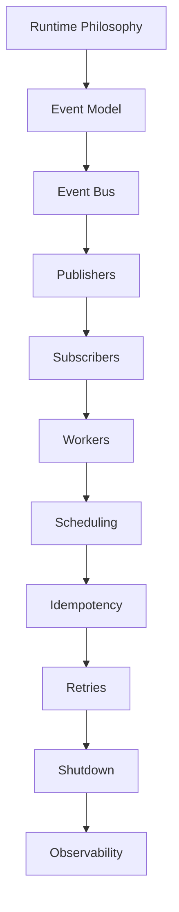

<!--
File: docs/engineering/guides/meg-002-event-driven-runtime/19-contributor-guidance.md
Document: MEG-002
Status: Draft
-->

# Contributor Guidance

> *The runtime belongs to the platform. Every contribution should strengthen its predictability, resilience and simplicity.*

---

# Purpose

The Mosaic Runtime is shared infrastructure, and every capability, module and application depends upon it behaving consistently. Unlike ordinary business code, a runtime change is not contained by the capability that made it: anything the runtime absorbs becomes a dependency shared by the entire ecosystem. This document therefore provides practical guidance for engineers contributing to the Event-Driven Runtime, explaining how contributors should apply the architectural principles established throughout MEG-002.

---

# Philosophy

Within Mosaic:

> **Protect the runtime before extending it.**

Extending the runtime is legitimate work, but the properties listed below are the ones every capability and module already relies upon without restating them in its own code. Losing one of them is therefore not a local regression. New functionality should never compromise:

- determinism
- observability
- resilience
- compatibility
- simplicity

The runtime should evolve carefully whereas capabilities should evolve rapidly, because a capability that turns out to be wrong can be changed by the team that owns it, while a runtime that turns out to be wrong must be changed underneath everyone.

---

# Before Modifying The Runtime

Runtime behaviour is interdependent: retries are scheduled work, scheduling is executed by workers, workers are stopped by shutdown, and every one of those transitions is expected to be observable. A change made without seeing those connections tends to correct one behaviour and quietly contradict another, so every contributor should first understand:

- the runtime philosophy
- existing event contracts
- lifecycle semantics
- worker ownership
- retry behaviour
- scheduling model
- observability expectations

Runtime changes should therefore never begin with implementation. They should begin with understanding, because the cost of learning the model afterwards is paid by every capability that has already built upon it.

---

# Before Introducing A New Event

Events are the platform's public vocabulary, and a capability that subscribes to one is depending upon its name, its ownership and its meaning remaining stable. Before adding one, ask:

- Does this describe a completed business fact?
- Does an equivalent event already exist?
- Which capability owns this event?
- Does this event belong in the business domain or the runtime?

Duplicate events should be avoided and business language should remain consistent, because two names for one fact eventually acquire two sets of subscribers, and ownership of the underlying business state then becomes ambiguous.

---

# Before Creating A Runtime Event

Runtime events describe platform behaviour, and examples include `WorkerStarted`, `RetryScheduled` and `BackpressureApplied`. Business events describe domain behaviour instead, and examples include `playback.started` and `media.imported`. Contributors should distinguish clearly between these two categories, because runtime events belong to infrastructure while business events belong to capabilities, and an event filed on the wrong side of that line places platform internals inside a business contract.

---

# Before Adding A Subscriber

A subscriber is a standing commitment: once registered, it will be delivered every matching event, retried on failure and replayed during recovery. Before adding one, ask:

- Does this capability genuinely need the event?
- Can it remain independent?
- Is the subscriber idempotent?
- Does it own the resulting business state?

Subscribers should remain autonomous, because a subscriber that depends upon another subscriber completing first reintroduces an ordering the delivery model does not provide.

---

# Before Publishing An Event

A published event is a statement that something has already happened, and the runtime cannot withdraw it once the Event Bus has accepted it. Confirm therefore that:

- Business state has committed.
- Payload is complete.
- Metadata is correct.
- Event ownership is clear.
- Event naming follows MEG-002.
- The event represents a completed fact.

Events should never describe work that might happen, only work that has happened, because subscribers act upon facts immediately and a fact that later fails to become durable has already produced consequences elsewhere in the platform.

---

# Before Introducing Scheduling

Time belongs to the runtime, which owns delayed execution, recurring execution, persistence and cancellation on behalf of every capability. Before introducing scheduling, ask:

- Is this genuinely a scheduling concern?
- Does business logic own time?
- Should the runtime schedule this instead?

Business capabilities should request scheduling and they should never implement it, because a timer held inside business logic cannot be cancelled during shutdown, restored after restart, or observed by an operator asking what work is still pending.

---

# Before Adding Retry Logic

Retry logic belongs to the runtime, which is what allows retries to be counted, bounded, backed off, jittered and eventually dead-lettered. Contributors should not implement:

```go
for {

    err := process()

    if err == nil {
        break
    }

    time.Sleep(...)
}
```

Instead, return the failure and allow the runtime to determine retry behaviour. A loop such as the one above is invisible to retry metrics and unbounded by any retry budget, so a failure that never clears becomes indistinguishable from work still in progress.

---

# Before Creating A Worker

Workers are execution infrastructure rather than business behaviour, and every one of them consumes runtime capacity for as long as it exists. Before creating one, ask:

- Can an existing worker pool execute this work?
- Does this require a new execution model?
- Who owns this worker?
- How does it stop?
- How is it observed?

Workers should never exist without explicit ownership, because the last three questions have no addressee at the moment they are asked, and an unowned worker is precisely the component that will still be running when the runtime is trying to stop.

---

# Before Changing Runtime Behaviour

Some parts of the runtime are relied upon by every capability simultaneously, which means a change to them is a change to assumptions nobody restated in their own code. The following changes should therefore require architectural review.

- delivery guarantees
- lifecycle semantics
- retry strategy
- scheduling model
- shutdown behaviour
- event contracts
- runtime APIs

These changes affect every capability, so they should never be introduced casually.

---

# Before Merging

Every runtime contribution should satisfy the following checklist. Each group corresponds to a property earlier chapters establish, and the checklist exists so that those properties are verified deliberately rather than assumed.

## Runtime Behaviour

- Event flow remains deterministic.
- Runtime remains business agnostic.
- Worker ownership remains clear.
- Scheduling remains centralised.

---

## Events

- Events describe facts.
- Event ownership is correct.
- Event naming follows MEG-002.
- Payloads remain immutable.

---

## Reliability

- Subscribers remain idempotent.
- Retries remain runtime managed.
- Shutdown remains graceful.
- Failure isolation remains intact.

---

## Observability

- Logs remain structured.
- Metrics updated where appropriate.
- Correlation preserved.
- Tracing unaffected.

---

## Documentation

- MEG updated if required.
- ADR created where appropriate.
- Event documentation updated.
- Examples remain correct.

Architecture documentation should evolve alongside runtime behaviour, because a runtime whose documented behaviour has drifted from its actual behaviour offers contributors no reliable model to reason from.

---

# Module Compatibility

Contributors should assume that third-party modules already exist. Modules participate in the runtime exactly as Platform capabilities do, which means they subscribe to the same events, honour the same lifecycle and depend upon the same guarantees. Runtime changes should therefore minimise:

- breaking changes
- behavioural surprises
- migration effort

The runtime is a platform contract, not merely an internal implementation, and a module author has no way to discover that the contract has moved other than by their module failing.

---

# Runtime APIs

The runtime deliberately exposes a small surface area: capabilities depend upon event publication, event subscription, scheduling and lifecycle notifications, and nothing more. Reducing the runtime API encourages long-term stability, because a smaller surface is a smaller contract to hold steady as the runtime evolves. Public runtime APIs should remain:

- minimal
- explicit
- stable
- discoverable

Every exported runtime API becomes part of the long-term platform surface, so expanding APIs is easy and removing them is not: withdrawing one requires every capability and every module already depending upon it to change first.

---

# Runtime Simplicity

When multiple implementations are possible, contributors should prefer the implementation that:

- introduces fewer concepts
- exposes fewer APIs
- requires less documentation
- remains easier to explain

Complexity should always justify itself, because every concept the runtime introduces must then be understood by every contributor who touches it afterwards. The simpler of two implementations that both satisfy the requirement is therefore the better contribution, even when it is the less interesting one.

---

# Review Mindset

Runtime reviews should focus upon determinism, compatibility, ownership, resilience, observability and architectural consistency. These are the properties the wider platform assumes without verifying, which is why review is where they are checked. Performance should never come at the expense of runtime correctness.

---

# Runtime Testing

Failure is an expected characteristic of distributed systems rather than an exceptional one. The runtime is therefore defined as much by how it fails as by how it succeeds, so contributors should validate:

- duplicate delivery
- retries
- shutdown
- replay
- worker cancellation
- scheduling
- event ordering
- module compatibility

The runtime should be tested under failure as thoroughly as under success, because at-least-once delivery, retry and replay mean that duplicate and delayed delivery are normal operating conditions rather than exceptional ones.

---

# Learning The Runtime

New contributors should study MEG-002 in the following order, which moves from the model to the mechanisms that implement it.



Understanding the philosophy first makes implementation significantly easier to reason about, because most runtime mechanisms are consequences of the same separation between coordination and behaviour.

---

# Engineering Culture

Contributing to shared infrastructure is as much a matter of restraint as of addition. Complexity accumulates on its own, whereas simplification is always somebody's deliberate decision. Runtime contributors should therefore strive to:

- simplify existing behaviour
- improve documentation
- reduce coupling
- preserve compatibility
- question unnecessary complexity
- document architectural reasoning

The runtime should become simpler over time, not more complicated.

---

# Contributor Checklist

Each item below corresponds to a property established by an earlier chapter of MEG-002, restated here in the form a reviewer can check. Together they describe the state the runtime should be in when the contribution lands. Before requesting review, confirm:

- [ ] The runtime remains business agnostic.
- [ ] Event contracts remain stable.
- [ ] Subscribers remain idempotent.
- [ ] Retry behaviour remains runtime owned.
- [ ] Scheduling remains centralised.
- [ ] Worker ownership is explicit.
- [ ] Shutdown remains graceful.
- [ ] Observability remains complete.
- [ ] Documentation has been updated.
- [ ] The runtime is simpler or clearer than before.

---

# Relationship to MEG-002

This document explains how contributors should apply the architectural principles established throughout the Event-Driven Runtime specification. The previous chapters define:

> **How the runtime behaves.**

This chapter defines:

> **How engineers should evolve it.**

Protecting architectural consistency is a shared responsibility, because the runtime has no single owner who can preserve it on everyone else's behalf.

---

# Summary

The Event-Driven Runtime is one of the most stable components within the Mosaic platform: every capability depends upon it and every module trusts it. Every contributor therefore shares responsibility for preserving its:

- simplicity
- predictability
- resilience
- compatibility
- observability

The best runtime contribution is often not the one that adds the most functionality. It is the one that allows the platform to continue evolving without increasing architectural complexity.
